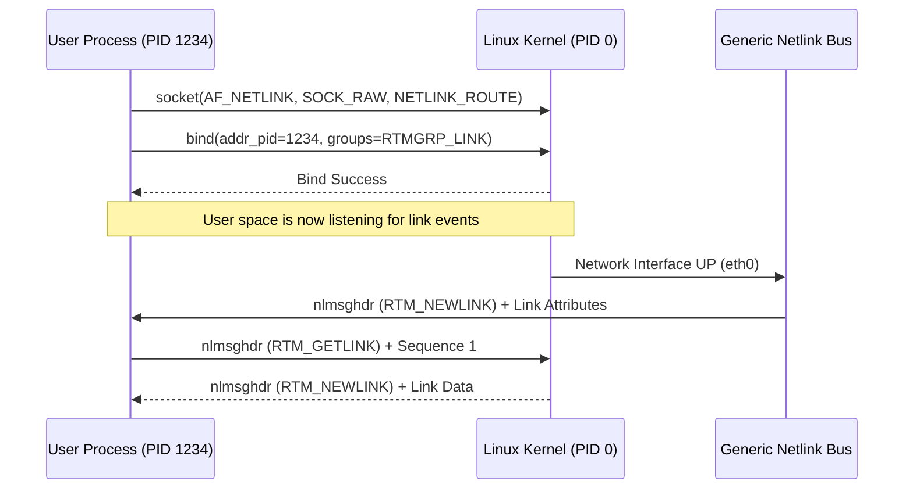

For a long time, the only way to talk to the Linux kernel from user space was via system calls or the clunky ioctl interface. System calls are rigid and require modifying the syscall table for every new feature. Ioctl is even worse. It is a synchronous, blocking nightmare that lacks a standardized message format. Then came Netlink. It is a socket-based communication protocol that treats the kernel like just another node on a network. If you have ever used the iproute2 suite or wondered how Docker sets up container networking without rebooting the world, you are looking at Netlink in action.

At its core, Netlink uses the AF_NETLINK address family. It borrows the BSD socket API, meaning you use socket, bind, sendmsg, and recvmsg to talk to the kernel. This is a massive win for systems engineers because it allows for asynchronous communication. The kernel can send a notification to a user-space daemon about a new network interface appearing or a route disappearing without the daemon having to poll. This event-driven nature is what makes modern Linux networking stacks so responsive. Unlike a standard UDP socket, Netlink does not use an actual network device. It is a pure software bus. The addressing is based on a process ID (PID), where a PID of zero always represents the kernel.

Every Netlink message starts with a standard header called nlmsghdr. This header is the glue that makes the protocol work. It contains a length field to handle batching, a type field to identify what the message is about, and flags to control behavior like NLM_F_REQUEST or NLM_F_ACK. There is also a sequence number and a port ID. The sequence number is critical for matching requests to responses in an asynchronous environment. If you send a burst of requests to change routing tables, the sequence number lets you track which ones succeeded and which ones failed when the kernel sends back asynchronous ACKs. The flags are where it gets powerful. You can use NLM_F_DUMP to tell the kernel to send you the entire state of a specific subsystem, like every IP address currently assigned to the machine, which the kernel delivers in a series of multi-part messages terminated by an NLMSG_DONE type.

Beyond the header, Netlink uses a Type-Length-Value (TLV) format for data, known as Netlink Attributes or nlattr. This is a genius move for forward compatibility. The kernel can add new attributes to a message, and older user-space tools that do not recognize those attributes will simply skip them. Each attribute has a small 4-byte header containing the length and the type, followed by the payload. Payloads can even be nested attributes, creating a tree structure. This flexibility is why Netlink replaced the old /proc and /sys files for complex configuration. It handles structured data far better than a flat text file.

Netlink is not a single bus but a collection of protocols. You have NETLINK_ROUTE for networking, NETLINK_KOBJECT_UEVENT for hardware hotplugging, and NETLINK_AUDIT for security logs. Because creating a new protocol ID in the kernel requires a constant definition in the headers, the community eventually hit a ceiling. This led to the creation of Generic Netlink (Genl). Generic Netlink acts as a multiplexer. It provides a single Netlink protocol ID that serves as a bus for many dynamic sub-protocols. It introduces a controller that user space can query to find the family ID of a specific service, like Taskstats or WireGuard. This removed the need to constantly patch the kernel just to add a new communication channel.

One of the most impressive parts of the implementation is the multicast group support. A user-space process can join a multicast group to receive specific classes of events. For instance, a routing daemon might only care about RTMGRP_IPV4_ROUTE events. When a route changes, the kernel looks at the interested listeners for that group and clones the message to their socket buffers. This is handled deep in the netlink_broadcast function in the kernel source. It ensures that the kernel is not blocked by a slow user-space reader. If the user-space socket buffer fills up, the kernel simply drops the message and sets an ENOBUFS error, signaling to the application that it has missed events and needs to re-sync its state.

Memory management in Netlink is also highly optimized. The kernel uses socket buffers (sk_buff) to transport messages. When a user process sends a message, the kernel copies the data from user space into an skb. However, when the kernel sends data to user space, it tries to be as efficient as possible with allocation. If you are doing a massive dump of the routing table, the kernel does not allocate one giant buffer. It fills the socket's receive queue page by page, allowing the user process to drain the queue while the kernel is still producing data. This streaming approach is why you can query millions of routes on a high-end router without blowing up the kernel's memory.

Netlink remains the backbone of Linux system administration because it successfully bridged the gap between the simplicity of sockets and the complexity of kernel internals. It provides a reliable, version-agnostic way to manage everything from firewall rules in nftables to the configuration of virtual swtiches in Open vSwitch. While it might look intimidating with its macros and TLV structures, it is the only reason our modern networking tools are not stuck in the synchronous stone age of ioctls.
