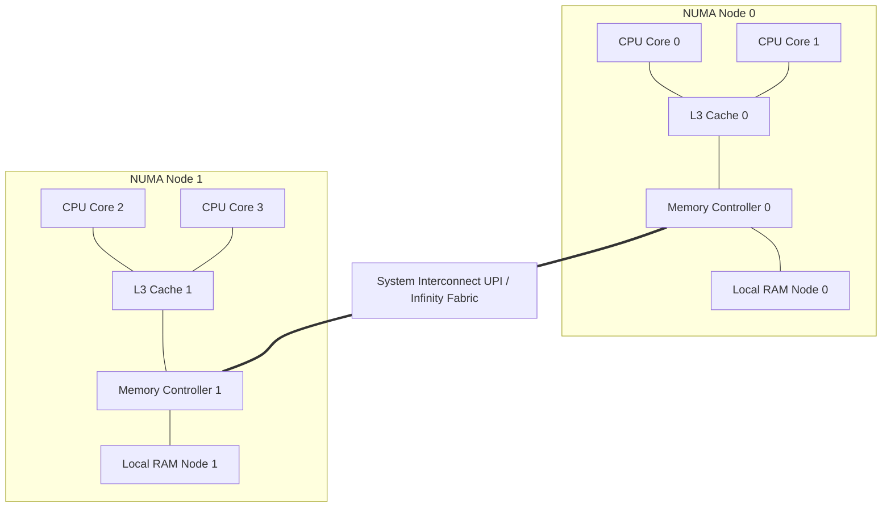
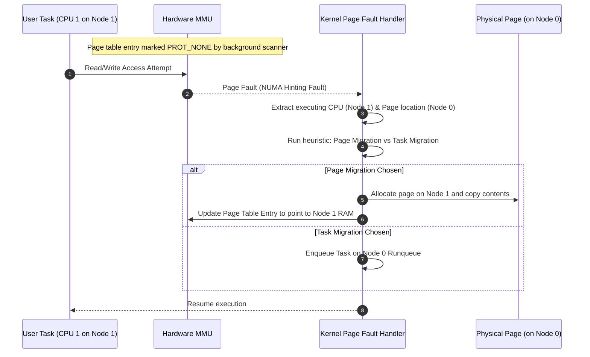

When we write user-space code, we usually treat system memory as a single, flat pool of bytes. We write code under the assumption that accessing memory at address zero takes the exact same amount of time as accessing memory at address 100 gigabytes. On simple single-socket systems, this Symmetric Multiprocessing (SMP) assumption holds up reasonably well. The moment we scale our workloads to multi-socket servers, or even modern multi-die chiplet processors, this illusion of uniform memory access collapses. 

Modern system architecture is built on Non-Uniform Memory Access, or NUMA. In a NUMA system, physical memory is physically segmented and wired directly to specific CPU sockets or processor dies. A CPU accessing memory wired directly to its own die gets local access performance. A CPU accessing memory wired to a different socket must route its request over an interconnect, such as Intel Ultra Path Interconnect (UPI) or AMD Infinity Fabric. This remote access incurs a latency penalty, known as the NUMA factor. When concurrent software fails to account for this architecture, local cache lines get invalidated, interconnects get saturated with cross-die traffic, and execution performance tanks.

To manage this physical separation, the Linux kernel abstracts physical memory into a hierarchy of nodes, zones, and pages. At the top of this hierarchy is the NUMA node, represented in the kernel by the `struct pglist_data` structure, which is typed as `pg_data_t`. This structure is defined in `include/linux/mmzone.h` and acts as the root object for all memory allocations originating on a given physical node.

Each `pg_data_t` contains the state required to manage that node's physical memory. This includes the node's memory zones, such as ZONE_DMA, ZONE_DMA32, and ZONE_NORMAL. It also tracks the active list of physical page frames allocated to the node and hosts the node's local page reclamation daemon, known as `kswapd`. When a CPU executing on Node 0 requests memory, the page allocator tries to satisfy the allocation locally. It does this by inspecting the `node_zonelists` array inside the local node's `pg_data_t` structure. This array defines a fallback sequence. If the local node's zones are exhausted and cannot satisfy the allocation above their low watermark, the allocator walks down this list to find available pages on neighboring nodes. This fallback avoids an out-of-memory error but leaves the application with remote, high-latency memory allocations.

User-space applications can override this default allocation behavior through system calls. The `set_mempolicy` system call changes the allocation policy for the calling thread, while the `mbind` system call sets a policy for a specific virtual address range. The kernel supports several policies. 

With MPOL_DEFAULT, the kernel allocates memory on the same node as the CPU executing the allocation call. Under MPOL_BIND, the kernel restricts page allocations strictly to a defined set of NUMA nodes, failing the allocation if those nodes run out of memory. If we use MPOL_INTERLEAVE, the kernel distributes page allocations in a round-robin cycle across a set of specified nodes. This is particularly useful for large shared memory pools where multiple threads on different sockets will access the data. Finally, MPOL_PREFERRED establishes a preferred node for allocations but allows fallback to other nodes if memory is constrained.

The operating system scheduler must also cooperate with this physical topology. The Linux scheduler represents the hardware using a tree structure of scheduling domains, encapsulated in `struct sched_domain`. Each scheduling domain represents a collection of CPUs that share cache, memory bandwidth, or physical package boundaries. 

The lowest level of this hierarchy represents hyperthreads sharing a physical core. The next level up represents cores sharing a last-level cache. Sockets and NUMA nodes represent the highest levels of the scheduling domain tree. The scheduler uses these domains to balance workload queues. When a CPU core becomes idle, it attempts to pull tasks from other cores. To maintain cache and memory affinity, the scheduler starts this search at the lowest domain level. It only climbs to higher domains if lower domains are perfectly balanced. Crossing a NUMA boundary to steal a task is the scheduler's absolute last resort. Doing so pulls a running thread away from its already allocated, node-local memory, degrading performance across the interconnect.

To address situations where threads and their memory do drift apart, the kernel includes an automated optimization framework known as AutoNUMA. This framework periodically balances thread location and memory allocation in the background.

AutoNUMA operates using a passive scanning mechanism. A background kernel thread periodically walks the page tables of active processes. It does not unmap the pages or evict them. Instead, it alters the page table entries by clearing the present bit or marking them with PROT_NONE permissions, while preserving the underlying physical mapping information. This configuration is known as a NUMA hint.

When the user application attempts to access one of these marked pages, the CPU's hardware Memory Management Unit (MMU) fails to translate the address and raises a page fault. The kernel intercepts this trap. Recognizing the fault as a NUMA hinting fault rather than a genuine missing page, the kernel jumps to its tracking logic in `mm/memory.c`. It records the ID of the CPU that triggered the fault and checks the physical node where the page is currently allocated. 

From there, the kernel applies a heuristic to decide whether to move the page to the thread or the thread to the page. If the kernel decides to migrate the page, it invokes the migration engine in `mm/migrate.c`. This engine isolates the page from the active least-recently-used (LRU) list, allocates a new page frame on the target node, and copies the data across the interconnect. It then updates the reverse mappings of all page tables pointing to that page, updating them to reference the new physical location on the local node. The kernel limits the global rate of these page migrations to prevent copying overhead from saturating the interconnect.

If the kernel decides that migrating the thread is more efficient, it triggers a task migration. The scheduler moves the thread to a runqueue on a CPU located on the target node where the page already resides. This is common when a single thread is accessing a massive memory structure that cannot be easily copied or is shared by other threads on that target node.

For many standard workloads, AutoNUMA does an excellent job of keeping threads and memory aligned. For high-performance databases like PostgreSQL or MySQL, and low-latency in-memory databases like Redis, this automated balancing can introduce major performance issues. The cost of frequent page table scans and the latency spikes caused by hinting faults can outweigh the benefits of localized memory. During high-throughput database operations, page table scanning can trigger soft lockups or erratic latency swings.

To prevent these issues, systems engineers often turn off automatic NUMA balancing entirely by setting `/proc/sys/kernel/numa_balancing` to zero. They then manage memory and CPU affinity manually using tools like `numactl`. This allows them to bind a database process to a specific socket and restrict its allocations to that socket's local RAM. 

We must also watch out for zone reclaim mode, controlled by `/proc/sys/vm/zone_reclaim_mode`. When enabled, this setting instructs the kernel to aggressively reclaim local page cache pages before falling back to allocating memory on a remote NUMA node. While this keeps memory access local to the CPU, it can cause severe write stalls as the kernel aggressively flushes file pages to disk to free up local memory, even when gigabytes of RAM are sitting free on an adjacent socket. Disabling zone reclaim mode ensures that the kernel falls back to remote allocations smoothly when local nodes are under high memory pressure, avoiding unexpected I/O blockages.
