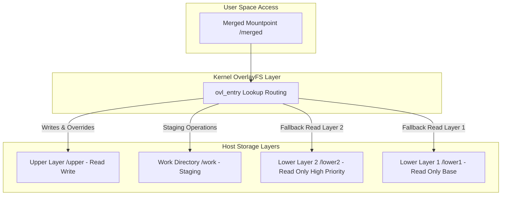
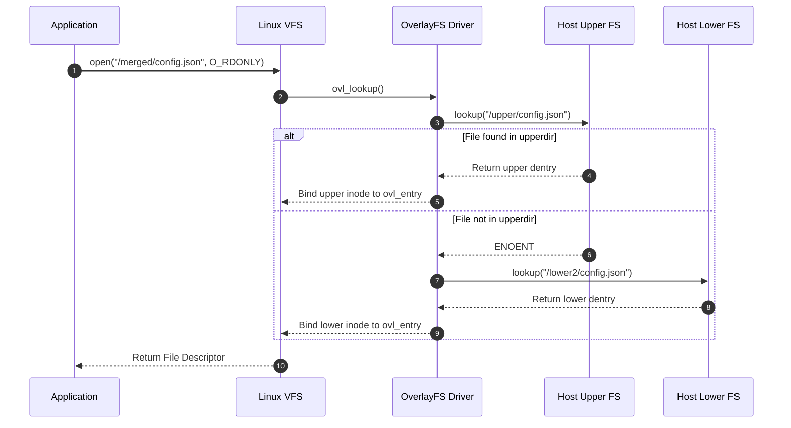
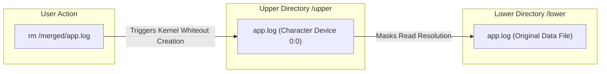

Container runtimes achieve near-instantaneous startup times and minimal storage overhead by avoiding full disk image duplication. Instead of allocating isolated block devices for every container instance, runtimes rely on union mount filesystems to stack read-only image layers under a single read-write layer. While early container implementations used AUFS or DeviceMapper, the Linux kernel native OverlayFS driver has become the standard storage driver for container engines like Docker, containerd, and Podman.

Understanding OverlayFS requires looking past the container abstraction directly into the Linux Virtual File System layer. OverlayFS is not a traditional block-based file system like ext4 or xfs, nor is it a distributed network filesystem. It is a pseudo-filesystem that combines multiple existing directories on a host system into a unified namespace, presenting a single merged directory tree to user space.

### The Four-Directory Model

At the core of an OverlayFS mount are four distinct directory paths specified during the kernel mount syscall. Understanding these four roles is essential before tracing file operations:

1. lowerdir: A sequence of one or more read-only directories separated by colons. In container terms, these correspond to the immutable layers of a container image.

2. upperdir: A single read-write directory. Any modifications, new file creations, or metadata updates originating from within the container context are written here.

3. workdir: An empty directory on the same filesystem mount as the upperdir. The kernel uses this directory as an internal staging ground to guarantee atomic operations during file modifications and copy-up procedures.

4. mergedir: The target mount point where the unified view of all lower and upper directories is exposed to user space processes.



The syntax for mounting an OverlayFS construct directly via the Linux CLI illustrates this topology:

```bash
mount -t overlay overlay \
  -o lowerdir=/var/lib/containers/layer2:/var/lib/containers/layer1,upperdir=/var/lib/containers/upper,workdir=/var/lib/containers/work \
  /var/lib/containers/merged
```

When multiple lower directories are provided, the kernel searches them left to right. The leftmost directory takes precedence over the directories to its right when path collisions occur.

### Lookup Routing and Inode Management

When a process issues an `open()` or `stat()` system call against a path inside the merged mount point, the kernel routes the Virtual File System lookup through the OverlayFS module functions defined in `fs/overlayfs/namei.c`.

Unlike traditional filesystems where an inode maps directly to on-disk inode blocks, an OverlayFS inode (`struct ovl_inode`) acts as a wrapper around the underlying host filesystems' inodes. The internal kernel metadata structure maintains pointers to both the upper inode and an array of lower inodes for any given path.



When resolving a file path, the kernel checks the upper directory first. If the file exists in the upper directory, OverlayFS immediately binds the file descriptor to the upper file object. The lower layers are never queried for that path, effectively allowing upper layer files to shadow identical paths in lower layers.

If the path is absent in the upper directory, OverlayFS scans the lower directories in left-to-right priority order. Once a match is found, the lookup stops and a lower dentry reference is attached to the internal OverlayFS entry.

### Copy-on-Write (CoW) Mechanism

Read operations incur virtually zero overhead when accessing lower layers because the VFS directly delegates file read operations to the underlying host filesystem driver (such as ext4 or xfs). However, the moment a process attempts to open a lower-layer file with write permissions (`O_WRONLY` or `O_RDWR`), or attempts to modify metadata via `chmod` or `chown`, OverlayFS triggers a Copy-on-Write operation known internally as `ovl_copy_up`.

Modifying a read-only lower file involves several discrete steps within the kernel to preserve crash consistency:

1. Allocation in Workdir: The kernel creates a temporary file inside the `workdir`. The filename inside `workdir` is a unique index generated by the kernel to avoid collision.

2. Payload Replication: The entire contents of the target file are copied from the lower layer into the temporary file in `workdir` using internal kernel file copy routines.

3. Extended Attribute Replication: Metadata, file permissions, ownership timestamps, and extended attributes (xattrs) are copied from the lower file to the staging file.

4. Atomic Rename: The kernel executes an atomic rename operation, moving the fully prepared file from `workdir` to its final path inside `upperdir`.

5. Inode Redirection: OverlayFS updates its internal `ovl_entry` struct to point to the newly created upper inode. Subsequent read and write calls on that file descriptor are routed directly to the file in `upperdir`.

Because the operation uses an atomic rename step via the filesystem staging ground in `workdir`, a host crash mid-write never leaves a corrupted, partially written file in `upperdir`. The process either succeeds entirely or leaves the file in its original state in the lower layer.

### Directory Merging and Whiteout Mechanics

Handling individual file updates is straightforward, but managing directory structures presents unique challenges. When a user executes `ls /merged/etc`, the kernel must return the union of all entries across both upper and lower layers.

When a directory is opened, OverlayFS reads the directory entries from all layers where that directory exists, constructs a merged in-memory list, and removes duplicates based on file names. To avoid repeating this expensive directory iteration on every access, OverlayFS caches directory merge results and uses extended attributes like `trusted.overlay.opaque` to optimize lookups.

This leads to an important edge case: How does OverlayFS handle the deletion of a file that exists in a read-only lower layer?

Because lower layers are strictly read-only, OverlayFS cannot physically erase the file from disk. To simulate file deletion, OverlayFS uses a concept called Whiteouts.

When a process issues an `unlink()` or `rmdir()` call on a lower-layer file within the merged mount point:

1. The kernel intercepts the syscall before it reaches the lower filesystem.
2. Instead of calling `unlink` on the lower file, OverlayFS creates a special character device in `upperdir` at the target path.
3. This character device is assigned major device number 0 and minor device number 0 (`0:0`).



During subsequent path lookups, when the OverlayFS driver encounters a character device with major and minor numbers set to 0, it interprets this as an explicit deletion marker. The driver immediately returns `ENOENT` (No such file or directory) to the calling process, effectively hiding the lower-layer file.

Similarly, if a directory in the lower layer is deleted and replaced with a new directory of the same name, OverlayFS creates the new directory in `upperdir` and sets the extended attribute `trusted.overlay.opaque` to `y`. This tells the lookup engine that it must stop searching lower layers for entries under this directory tree.

### Kernel Performance and System Boundaries

While OverlayFS is fast and light on memory, developers and platform engineers encounter specific real-world behaviors due to its translation layer:

1. POSIX Inode Non-Conformity: Prior to kernel version 4.13, copying up a file altered its `st_ino` (inode number) and `st_dev` (device identifier) upon modification. Applications relying on stable inode numbers for file tracking or lock management could fail. Modern kernels resolve this by assigning a persistent inode number using the `index=on` mount flag.

2. Copy-Up Latency Penalty: The initial write to a very large file residing in a lower layer incurs significant latency. If a process attempts to append a single byte to a 10 Gigabyte database file located in a lower layer, OverlayFS must copy all 10 Gigabytes to `upperdir` before the write operation returns. For write-heavy workloads, volumes or bind mounts bypassing OverlayFS are mandatory.

3. Page Cache Duplication: Before a lower file undergoes copy-up, read operations populate the Linux page cache using the lower filesystem's page entries. Once copied up, subsequent reads pull from a completely different file object in `upperdir`, leading to memory duplication in the Linux page cache until old lower pages are evicted.

By leveraging `lowerdir` stacking, `upperdir` modification layers, and atomic staging in `workdir`, OverlayFS provides the architectural foundation that enables fast, isolated container filesystems directly within the Linux kernel.