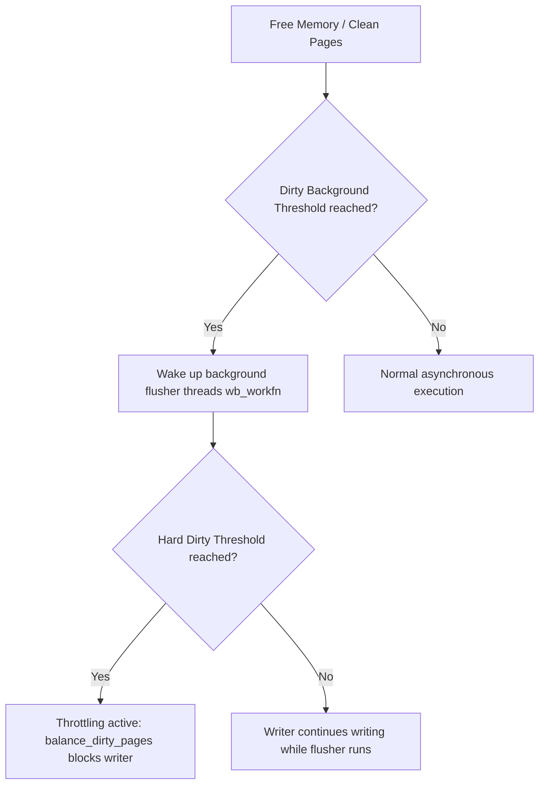
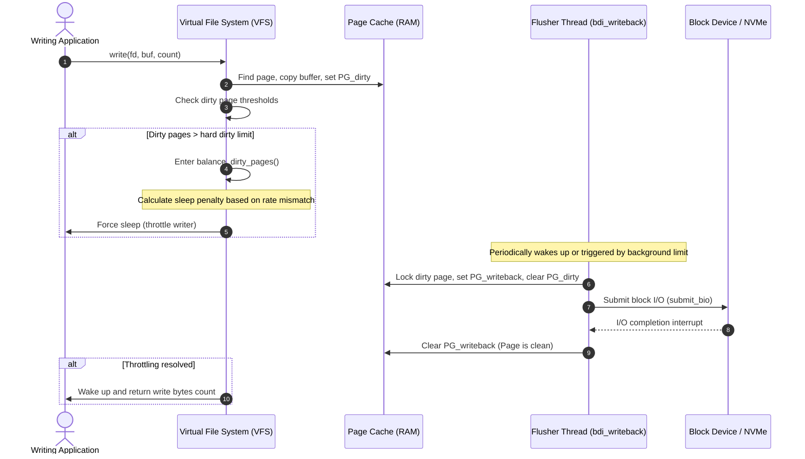

When an application issues a write system call, the Linux kernel does not immediately copy those bytes to your fast solid-state drive or NVMe controller. It executes a memory-to-memory copy, placing the data in physical RAM pages within the page cache and marking those pages as dirty. The system call returns success almost instantly. This illusion of speed is highly effective, but it creates a dangerous architectural challenge. Memory is finite, and if applications write faster than the underlying hardware can persist bytes to physical media, the kernel must step in to prevent total resource starvation. 

The mechanism that orchestrates this delicate balance is the page cache writeback engine. It is a highly optimized subsystem within the virtual memory manager designed to monitor dirty memory growth, coordinate background writeback threads, and aggressively throttle processes that threaten to overrun physical memory limits. Understanding this subsystem requires looking past high-level abstractions to analyze dirty limit thresholds, background flusher architecture, and the internal operations of the writeback throttling loop.

### The Memory Zones and Dirty Thresholds

The kernel relies on a pair of boundaries to determine when and how aggressively to write dirty pages back to physical disk. These thresholds are defined by system configurations exposed through the sysctl interface, namely the background and hard dirty limits. Understanding how these boundaries operate is crucial for anticipating how the system behaves under heavy write loads.

The first boundary is the background dirty threshold, managed via dirty_background_ratio or dirty_background_bytes. When the volume of dirty memory pages in the system crosses this value, the kernel wakes up background flusher threads. This threshold is entirely non-blocking. The writing process continues to write to memory at full speed, while the background threads attempt to drain the swamp by asynchronously writing pages to the block layer in parallel.

The second boundary is the hard dirty threshold, managed via dirty_ratio or dirty_bytes. This is the absolute limit of the kernel's tolerance. If an application continues to write at a speed that outpaces the background flusher threads, the total dirty memory will eventually breach this hard limit. At this exact moment, the kernel suspends asynchronous behavior. Any process attempting to dirty more pages is instantly forced into a blocking routine, halting its execution to allow the storage hardware to catch up. This transition protects the system from running out of free memory pages, which would otherwise trigger the out-of-memory killer.

### The Flusher Thread Architecture and Backing Device Info

Background writeback is not handled by a single, monolithic kernel thread. Instead, the kernel structures writeback operations per physical block device using the backing device info structure. Each physical device, such as a disk, partition, or virtual block device, possesses its own backing device info context, which contains a bdi_writeback structure. This structure manages the state of dirty pages specifically destined for that storage device.

The kernel routes writeback tasks through dedicated workqueues running worker functions named wb_workfn. These flusher threads wake up under three distinct scenarios. First, they wake up periodically based on the dirty_writeback_centisecs setting, which defaults to five seconds, scanning the page cache for expired dirty pages. A page is considered expired if it has remained dirty longer than dirty_expire_centisecs, which prevents written data from staying vulnerable in volatile memory indefinitely. Second, they wake up when the global dirty page count crosses the background threshold. Finally, they wake up if an explicit system call, such as sync or fsync, forces an immediate writeback of a file or filesystem.

Because writeback is handled on a per-device basis, a slow storage device will not block writes intended for a high-speed storage array. The flusher thread for a slow, saturated disk will run constantly, struggling to flush its specific bdi_writeback queue, while the flusher thread for a fast NVMe device remains idle, quickly processing and clearing dirty pages as they arrive. This isolation ensures IO scheduling sanity across diverse hardware configurations.

### The Throttling Loop: balance_dirty_pages

When the hard dirty limit is breached, the kernel forces the writing application to pay a direct latency penalty. The core function responsible for calculating and enforcing this penalty is balance_dirty_pages, located in the kernel's mm/page-writeback.c source file. This function acts as a feedback control loop, matching the application's write rate to the hardware's actual writeback capabilities.

Instead of blocking the writing thread indefinitely, balance_dirty_pages calculates a precise, variable sleep duration. The kernel continuously computes a rolling average of the writeback bandwidth for the targeted block device. It then evaluates the distance between the current dirty page count and the hard dirty limit. Using these metrics, the engine calculates a target bandwidth for the writing task.

If the system is only slightly over the hard threshold, the calculated sleep penalty is minor, perhaps only a few milliseconds. This introduces gentle backpressure, slowing the application down just enough to allow the flusher thread to recover ground. If the application continues to dump data into the page cache far faster than the storage device can accept it, the dirty page count climbs higher, causing the sleep calculation to scale up exponentially. The writing process will find itself repeatedly forced to sleep for tens or hundreds of milliseconds at a time inside the write loop, effectively locking the process execution until the physical hardware can drain the dirty page queue.

### Page State Transitions and the Filesystem Bridge

The physical transition of a page from dirty to clean requires precise synchronization with the filesystem and the block layer. Every page in the page cache is tracked by a page struct containing flag fields that represent its current status. When an application modifies a page, the write path marks the page with the PG_dirty flag. This flag indicates to the kernel that the memory contents are newer than the copy on disk.

When a flusher thread selects a dirty page for writeback, it must lock the page using lock_page to ensure no other thread can modify it during the write setup. Once locked, the flusher clears the PG_dirty flag and sets the PG_writeback flag. This state transition is critical. While PG_writeback is active, the page remains in memory, and applications can still read it. However, any process attempting to write to this page again will be blocked until the current writeback operation completes. This prevents write-after-write race conditions where the block layer could write a half-modified page to disk.

After setting the writeback flag, the flusher thread hands the page over to the filesystem's address space operations. Every filesystem implements its own writepage or writepages callback inside the address_space_operations struct. For example, ext4 or XFS will map the page logical offset to physical disk blocks, construct a bio structure containing the target sectors, and submit the request to the block layer using submit_bio. Once the disk controller completes the write operation, it issues a hardware interrupt. The interrupt handler propagates this completion back up to the page cache, which invokes end_page_writeback, clearing the PG_writeback flag and waking up any threads waiting for the page to become writable again.

### Tuning Writeback for Database Workloads

The default writeback parameters in Linux are designed for general desktop and light server workloads, prioritizing high throughput by allowing large dirty page volumes. On modern servers with hundreds of gigabytes of RAM, these default settings can be disastrous for systems running database engines like PostgreSQL, MySQL, or RocksDB. 

By default, dirty_ratio might be set to twenty percent of total memory. On a server with two hundred and fifty-six gigabytes of RAM, this means the page cache can accumulate over fifty gigabytes of dirty pages before any throttling occurs. When this massive pool finally triggers the writeback engine, the disk controller is suddenly flooded with a torrent of I/O. The flusher threads cannot keep up, the hard limit is crossed, and the application threads are abruptly forced into long, agonizing sleep states inside balance_dirty_pages. This creates the write stall cliff, where database transaction throughput drops to zero for several seconds or minutes while the system struggles to flush gigabytes of dirty memory.

To eliminate these latency spikes, systems engineers modify the dirty page configurations to use fixed byte thresholds rather than percentages of system memory. By configuring dirty_background_bytes to sixty-four megabytes and dirty_bytes to two hundred and fifty-six megabytes, the background flusher threads are forced to wake up and begin flushing almost immediately after a small amount of data is written. Because the hard threshold is also set to a modest size, the balance_dirty_pages control loop can apply gentle, early feedback to the writing application. This maintains a steady, predictable stream of writes to the disk, avoiding massive page accumulation and ensuring consistent, low-latency transaction performance.
