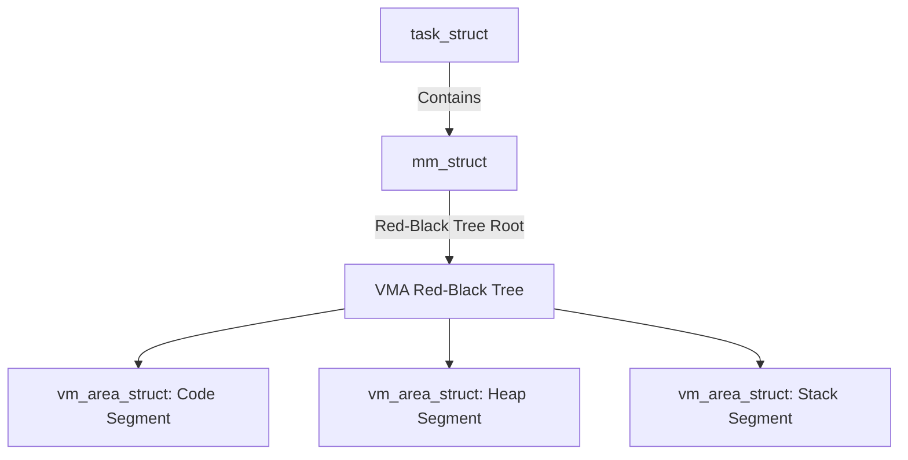
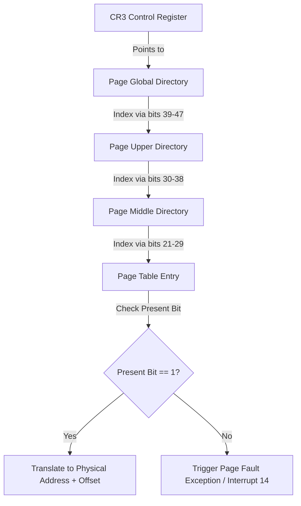
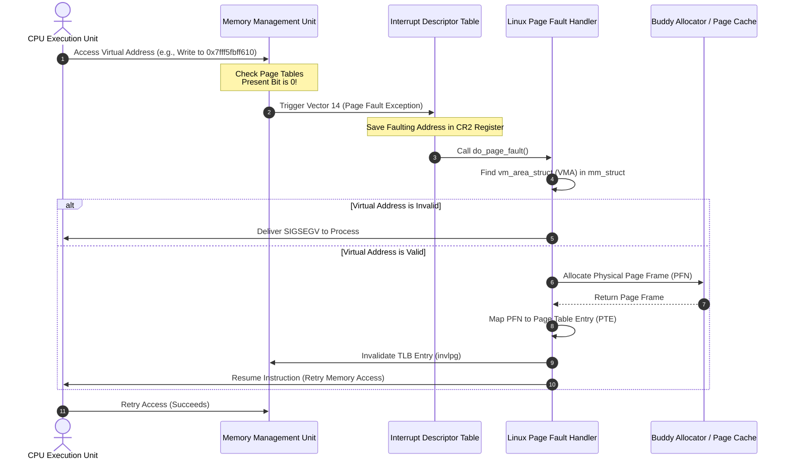

When you call malloc in C or allocate an object in a managed runtime, the operating system is playing a sophisticated trick. It hands your process a virtual memory address and pretends that memory is immediately ready for use. But if you were to inspect physical RAM at that moment, nothing would have changed. The kernel has not allocated a single byte of actual physical memory. This deferral is known as demand paging, a strategic game of chicken played between the operating system, the system hardware, and your application. The real work of memory allocation is delayed until the exact CPU cycle where your application attempts to read from or write to that virtual address. At that millisecond, the processor detects a missing mapping, raises a hardware exception, drops execution into the deep internals of the Linux kernel, and forces the operating system to map physical silicon to your virtual illusion before your program realizes anything happened.

### The Overcommit Illusion and Virtual Memory Areas

To understand why this trick is necessary, we must examine the memory layout of a Linux process. Every process in Linux is represented in the kernel by a structure called task_struct. Within this descriptor is a pointer to an mm_struct, which holds the primary memory descriptor of the process. The mm_struct maintains a record of virtual memory areas, represented by vm_area_struct instances. These structures define the virtual layout of a process, mapping contiguous ranges of virtual addresses to specific permissions and storage backings.

When a process requests memory using system calls such as brk or mmap, the Linux kernel does not update the physical page tables of the CPU. It merely registers a new vm_area_struct or expands an existing one within the process's red-black tree of memory mappings. This tree is optimized for rapid interval lookups. The kernel checks if the requested address space is available, updates the tree, and immediately returns success to the user space application. The actual page tables, which map virtual addresses to physical frame numbers, remain entirely empty for these newly allocated pages. The operating system has overcommitted its resources, gambling that applications will only access a fraction of their allocated space at any given moment.

### The Hardware Trigger and the Page Table Walk

When the application attempts to read or write to the virtual address, the illusion crumbles, and the hardware must step in. The CPU includes a dedicated hardware block called the Memory Management Unit, which is responsible for translating virtual addresses into physical addresses. On x86_64 architectures, this translation is handled by a multi-level page table walk, guided by control register CR3, which stores the physical address of the current process's Page Global Directory.

The MMU splits the virtual address into multiple segments to index into different layers of the page table hierarchy. It starts at the Page Global Directory, uses the next set of bits to find the Page Upper Directory, moves to the Page Middle Directory, and finally targets the Page Table Entry. Each entry in the bottom-level Page Table contains a physical address along with several flags. The most critical flag for our scenario is the Present bit. If the Present bit is set to zero, the MMU cannot complete the translation. It halts the execution of the active instruction and triggers a hardware exception known as a Page Fault, mapped to Interrupt Vector 14 on x86_64 processors. At the exact same moment, the CPU saves the faulting virtual address into the CR2 control register so the operating system knows exactly which address caused the failure.

### Inside the Kernel with do_page_fault

When Interrupt Vector 14 is triggered, the CPU context-switches to kernel space, saving user-space registers to the kernel stack. The low-level assembly entry point calls the primary C entry point for memory exception handling, known as do_page_fault. This function must determine whether the fault was caused by a benign demand-paging request, a write to a shared page, or an illegal memory access that requires terminating the process.

The handler begins by retrieving the faulting address from the CR2 register. It then acquires the read lock on the process's mmap_lock semaphore to protect the virtual memory structures from concurrent modification. With the lock held, the kernel searches the process's red-black tree of vm_area_structs to find a VMA that covers the faulting address. If no VMA is found, the access is illegal. The process has attempted to touch memory it has never allocated. The kernel releases the mmap_lock and sends a SIGSEGV signal to the process, resulting in a segmentation fault crash.

If a valid VMA is found, the kernel checks the permissions. It compares the type of operation that caused the fault, such as a write instruction, against the permissions allowed by the VMA. If the process attempted to write to a read-only memory area, the exception is treated as a protection violation. The kernel immediately aborts, releases the lock, and delivers a SIGSEGV signal.

### Resolving Anonymous Page Faults

Once the kernel verifies that the address is within a valid VMA and the access conforms to permissions, it initiates a resolution path. The exact path depends on whether the fault is anonymous, file-backed, or a copy-on-write operation.

Anonymous page faults occur when a process accesses newly allocated heap or stack space that has no file association. If the faulting operation was a read, the kernel optimizes resource usage by mapping the virtual address to a globally shared, read-only page filled with zeros, known as the zero page. This prevents the operating system from wasting real physical memory on reads of uninitialized space. If the process eventually writes to that address, a secondary fault is triggered, prompting the kernel to swap out the zero page for a real, private physical page.

For write faults, the kernel must allocate physical memory immediately. It calls down to the Buddy Allocator, the main physical memory management subsystem in Linux. The Buddy Allocator identifies a free page frame of physical memory, known as a Page Frame Number. The kernel zero-initializes this physical page to guarantee that data from previous processes does not leak into the current process. It then updates the Page Table Entry for the faulting virtual address, writing the physical Page Frame Number into the entry, setting the Present and Writable flags, and completing the mapping.

### Resolving File-Backed Page Faults

File-backed page faults occur when an application accesses memory that is mapped to a file, usually configured through an mmap call. When a fault occurs in a file-backed VMA, the target data might already reside in physical RAM within the kernel page cache, or it might still be sitting on persistent storage.

The page fault handler inspects the page cache. If the requested file block is already in the cache because of a previous read by another process, the kernel simply updates the process's page table entries to point to the existing physical page frames in the cache. This zero-copy approach makes memory-mapped file access exceptionally fast.

If the page cache does not contain the target block, the handler must perform disk I/O. It allocates a physical page frame from the Buddy Allocator and schedules a block read from the underlying file system. Because disk I/O is incredibly slow compared to memory operations, the kernel suspends the faulting thread, transitions its state to task-interruptible, and schedules other tasks to run. The storage controller reads the file data into the allocated physical page via Direct Memory Access. Once the transfer completes, the storage controller triggers a hardware interrupt. The kernel handles this interrupt, marks the page cache block as ready, wakes up the suspended thread, updates the page table entries with the physical page frame, and clears the thread for execution.

### Resolving Copy-On-Write Faults

Copy-on-write is the mechanism that allows the fork system call to execute almost instantly. When a process forks, copying all of its physical memory to the child process would be devastatingly slow. Instead, the Linux kernel copies only the page table structures from the parent to the child. Both processes end up pointing to the exact same physical pages in RAM. To prevent one process from corrupting the memory of the other, the kernel marks the Page Table Entries of both processes as read-only, even if the underlying VMAs are marked as writable.

When either the parent or the child attempts to write to a shared page, the MMU sees a write operation to a read-only page table entry and triggers a page fault. The handler inspects the corresponding VMA and notices a mismatch: the VMA allows writing, but the hardware page table entry does not. The kernel identifies this as a write to a shared copy-on-write page.

The handler resolves this by allocating a brand new, private physical page frame from the Buddy Allocator. It copies the entire contents of the original shared page into this new page frame. It then updates the faulting process's page table entry to point to this new, private physical page and sets the Writable flag. The other process continues to point to the original page. This lazy allocation model ensures that physical memory is only copied when a process actively attempts to modify shared space, keeping memory usage clean and fork operations extremely lightweight.

### TLB Synchronization and Instruction Resumption

After mapping the physical page frame, the kernel cannot simply return control to user space. Modern CPU cores contain a high-speed hardware cache called the Translation Lookaside Buffer, which caches recent virtual-to-physical address translations. If the TLB contains a stale, non-present entry for the faulting virtual address, the CPU might bypass the page tables and trigger a loop of endless page faults.

The kernel must clear this stale cache. It executes architecture-specific instructions to invalidate the local TLB entry for the modified virtual page, such as the invlpg instruction on x86_64. If the page table modifications occurred on one core but the process is executing across multiple cores, the kernel may initiate a TLB shootdown. This process sends inter-processor interrupts to all other active cores, forcing them to flush their local TLB entries before proceeding.

Once the TLBs are fully synchronized, the kernel releases the mmap_lock semaphore and restores the saved user registers from the stack. The CPU transitions back to user mode. The critical difference between a page fault exception and a standard system call is how the processor resumes execution. In a standard system call or hardware interrupt, the CPU returns to the instruction immediately following the one that triggered the event. In a page fault, the CPU returns to the exact same instruction that caused the fault. When the CPU attempts to re-execute the memory write or read, the MMU performs the translation walk once again. This time, it finds the Present bit set to one, translates the virtual address directly to physical RAM, and execution continues without the user space application ever realizing its illusion of memory was temporarily broken.
