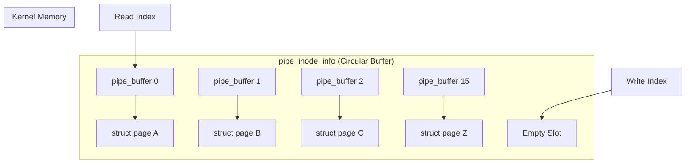
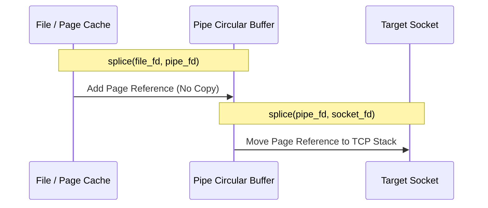

Every time you run a command like cat access.log | grep 404, you are relying on one of the oldest and most elegant abstractions in the Unix world. We often treat pipes as simple byte streams, but the reality inside the Linux kernel is far more sophisticated than a simple memory buffer. The modern implementation of pipes, which lives in its own tiny internal filesystem called pipefs, is built around a circular array of page references designed to minimize memory copies and maximize throughput. If you understand how these pages are managed, you can write code that moves gigabytes of data between processes without the CPU ever touching a single byte of the payload.

At the core of a pipe is the pipe_inode_info structure. This doesn't just point to a single block of memory. Instead, it maintains a circular buffer of pipe_buffer structures. By default, this buffer has 16 slots. Each slot points to a struct page, which is the kernel's fundamental unit of physical memory management. This design is a massive optimization over a simple byte array. By operating on whole pages, the kernel can perform operations like page stealing, where a page of data belonging to the page cache is simply remapped into the pipe's buffer instead of being copied.

When a process writes to a pipe, the kernel checks if the last used page in the buffer has enough space for the new data. If it does, and the page is private to the pipe, the kernel copies the data from userspace into that page. If the page is full or cannot be modified, the kernel allocates a new page and adds it to the next slot in the circular buffer. This is where the PIPE_BUF constant becomes critical. On Linux, writes up to 4096 bytes are guaranteed to be atomic. This is because a 4KB write fits within a single page, ensuring that the kernel can lock the pipe, fill the page, and unlock it without another process interleaving its data. Once you exceed 4KB, the kernel might need multiple pages, and atomicity goes out the window.

The real magic happens with the splice system call. Traditional data movement requires you to read from one file descriptor into a userspace buffer and then write that buffer to another file descriptor. This involves two context switches and two memory copies between kernel space and userspace. Splice bypasses this by moving references to the pages themselves. When you splice data from a file into a pipe, the kernel doesn't copy the file's data. It looks up the page in the file's page cache and inserts a reference to that same physical page into the pipe's circular buffer.

This is a true zero-copy operation. The data stays in the page cache, and the pipe just acts as a conduit for the memory pointers. The kernel uses flags like PIPE_BUF_FLAG_GIFT to manage ownership. If a page is gifted to the pipe, it means the pipe now has a claim on it. When the reader consumes the data, the kernel can even move the page directly into the reader's address space. This is complemented by vmsplice, which allows a userspace process to map its own memory into a pipe. By using vmsplice with the SPLICE_F_GIFT flag, you are telling the kernel that it can take ownership of your userspace pages and hand them off to another process or a socket. This is how high-performance proxies and load balancers achieve near-line-rate speeds with minimal CPU usage.

There is a catch to this efficiency. Because splice is moving page references, the data is shared. If you use vmsplice to put a buffer into a pipe and then immediately modify that buffer in your process before the reader has consumed it, the reader will see your modifications. You are essentially sharing memory through a pipe interface. This requires careful synchronization, usually by waiting for the pipe to be flushed or by using a pool of buffers that you rotate. 

The capacity of a pipe isn't fixed at 16 pages anymore either. Since Linux 2.6.35, you can use fcntl with F_SETPIPE_SZ to increase the buffer size up to the limit defined in /proc/sys/fs/pipe-max-size. Increasing the pipe capacity is often the first step in tuning high-throughput streaming applications because it allows for larger bursts of data to be buffered without blocking the writer, effectively smoothing out the performance of a pipeline. It is a simple tool, but when combined with the zero-copy mechanics of splice, it transforms the humble pipe into a powerful engine for high-performance systems programming.
