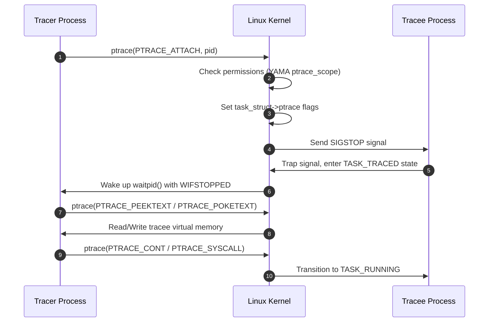
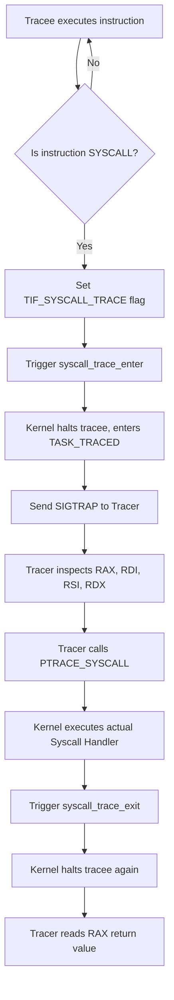
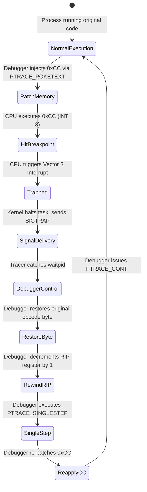

Debuggers like gdb and system call monitors like strace feel like magic when you first use them. They stop running processes mid-flight, inspect CPU registers, alter memory, and intercept low-level kernel calls. Behind every one of these tools sits a single system call provided by the Linux kernel: ptrace.

Despite being one of the oldest APIs in UNIX history, ptrace remains the foundational primitive for process tracing, runtime inspection, and sandboxing on Linux. Understanding how ptrace works under the hood requires looking at kernel task representations, x86_64 interrupt handling, virtual memory protections, and hardware registers.

When a process decides to trace another process, it initiates an attachment through ptrace. The process performing the inspection is the tracer, while the target process being inspected is the tracee. Attachment happens through two distinct paths. A parent process can fork a child, and the child calls ptrace with PTRACE_TRACEME before issuing an execve system call. Alternatively, an independent process can attach to an already running target by calling ptrace with PTRACE_ATTACH and providing the target process ID.

At the kernel level, calling PTRACE_ATTACH initiates permission checks governed by capability rules and YAMA Linux Security Module settings. If checks pass, the kernel updates the task_struct representation of the tracee. It sets the tracee's ptrace field, adds the tracee to the tracer's ptraced linked list, and sends a SIGSTOP signal to the tracee.

Signal handling changes fundamentally when a process is marked as traced. When the tracee receives SIGSTOP, it transitions its execution state to TASK_TRACED. Rather than terminating or invoking a standard signal handler, the tracee yields control back to the scheduler. The kernel notifies the tracer by waking up any pending waitpid system calls issued by the tracer. To the tracer, waitpid returns status information confirming that the tracee stopped due to a signal.

System call tracing is one of the most common applications of ptrace. Tools like strace monitor every system call made by a process without requiring recompilation or custom kernel modules. They accomplish this using the PTRACE_SYSCALL request.

When a tracer calls ptrace with PTRACE_SYSCALL, it tells the kernel to resume the tracee but pause execution twice for every system call: once immediately before the kernel executes the system call, and once immediately after the system call returns to user space.

When a CPU executes an x86_64 syscall instruction, the processor transitions from user mode to kernel mode via entry_SYSCALL_64. Early in this assembly path, the kernel checks the thread_info flags of the current task. If the TIF_SYSCALL_TRACE flag is set, the kernel branches into arch_syscall_trace_enter.

Inside arch_syscall_trace_enter, the kernel traps the process before processing the system call table lookup. It updates the task state to TASK_TRACED, sends a SIGTRAP signal to the tracee, and pauses execution. The tracer wakes up from waitpid and inspects the tracee's CPU registers using PTRACE_GETREGS or PTRACE_GETREGSET.

On x86_64 architectures, CPU registers hold specific roles during system calls. The register RAX stores the system call number. The registers RDI, RSI, RDX, R10, R8, and R9 hold the first six arguments passed to that system call. By issuing PTRACE_GETREGSET with NT_PRSTATUS, the tracer copies the user_regs_struct out of kernel memory into its own address space.

The tracer can do more than observe registers. It can overwrite them using PTRACE_SETREGSET. If a tracer changes RAX from 1 (sys_write) to -1 or an invalid system call number before letting the process continue, the kernel skips system call execution entirely and returns early. Security sandboxes and mock frameworks rely on this exact register manipulation mechanism to block or fake system calls.

Once the tracer finishes inspecting the system call entry, it issues another PTRACE_SYSCALL call. The kernel resumes the tracee, executes the requested kernel function, and lands in arch_syscall_trace_exit immediately before returning to user space. The tracee stops a second time, allowing the tracer to inspect RAX, which now holds the return value or error code of the completed system call.

Breakpoints operate differently than system call traps. Setting a breakpoint on arbitrary executable code requires altering the binary instructions running inside the tracee's virtual memory space.

When a debugger sets a software breakpoint at a target instruction address, it uses PTRACE_PEEKTEXT to read the original byte sitting at that memory location. It saves that byte internally. Next, the debugger uses PTRACE_POKETEXT to overwrite that single byte with the value 0xCC.

On x86_64 hardware, 0xCC is the opcode for the INT 3 instruction. INT 3 is a special single-byte interrupt instruction designed specifically for debuggers. Most x86 instructions span multiple bytes, but INT 3 requires only one byte. Using a single-byte instruction ensures that a breakpoint can be patched over any opcode without accidentally overlapping onto adjacent instruction boundaries.

When the tracee's CPU instruction pointer (RIP) reaches the patched address, the CPU executes 0xCC. This causes the processor to trigger an Interrupt Vector 3 exception. The Linux kernel catches this hardware exception in its do_int3 handler.

The kernel checks if the process is being traced. If it is, the kernel wraps the exception into a SIGTRAP signal and places the tracee into TASK_TRACED state. Crucially, when the CPU executes INT 3, it advances the RIP register by one byte. This means RIP points to the instruction directly after the 0xCC byte, not at 0xCC itself.

When the tracer receives the waitpid event indicating a SIGTRAP stop, it inspects RIP. To allow the tracee to execute the real instruction that was supposed to be there, the debugger must execute a multi-step sequence.

First, the tracer restores the original saved byte into tracee memory using PTRACE_POKETEXT. Second, because RIP was advanced by the CPU during the INT 3 execution, the tracer must rewind RIP back by one byte using PTRACE_SETREGS so that RIP points to the start of the original instruction.

Third, if the tracer simply resumed execution with PTRACE_CONT, the process would run the original instruction, but the breakpoint would no longer exist in memory. Future execution passes through that address would miss the breakpoint entirely. To solve this, the debugger uses PTRACE_SINGLESTEP.

PTRACE_SINGLESTEP configures the x86_64 CPU Trap Flag (TF) inside the EFLAGS register. When the Trap Flag is set, the CPU executes exactly one instruction and instantly generates a Vector 1 Debug Exception. The kernel catches this exception, stops the tracee again, and signals the tracer.

Upon catching the single-step completion, the debugger re-patches the 0xCC opcode back into the target memory address and turns off the Trap Flag. Finally, it issues PTRACE_CONT to let the tracee continue running at full speed until it hits the next breakpoint.

Writing to target process memory brings up an obvious question regarding memory permissions. Executable code segments in modern software binaries are mapped with read and execute permissions (PROT_READ | PROT_EXEC). They lack write permissions (PROT_WRITE) due to W^X (Write XOR Execute) security policies.

When a tracer calls PTRACE_POKETEXT on a read-only code page, the request does not trigger a segmentation fault. The Linux kernel bypasses standard MMU page tables using its internal access_process_vm function.

Inside access_process_vm, the kernel calls get_user_pages_remote with the FOLL_FORCE flag. This flag instructs the kernel page fault handler to ignore missing write permissions in the Virtual Memory Area (VMA) struct. The kernel maps the physical page backing the tracee's virtual address into kernel address space, writes the modified byte directly into the physical page frame, and marks the page dirty. Virtual memory protections remain unchanged for the process itself, but the tracer successfully mutates the underlying bytes.

Ptrace provides unmatched control, but it carries severe performance costs. Every ptrace event forces multiple context switches. When strace monitors a process making thousands of system calls per second, execution speed drops dramatically because each system call requires switching from tracee to kernel, kernel to tracer, tracer back to kernel, and kernel back to tracee.

Modern high-performance tools avoid ptrace where possible. Tracing tools like eBPF attach probes directly inside kernel functions without stepping out into user-space tracer processes. Debuggers like gdb continue using ptrace because precise control over thread execution, register states, and memory mutation outweighs raw execution performance during interactive debugging sessions.
