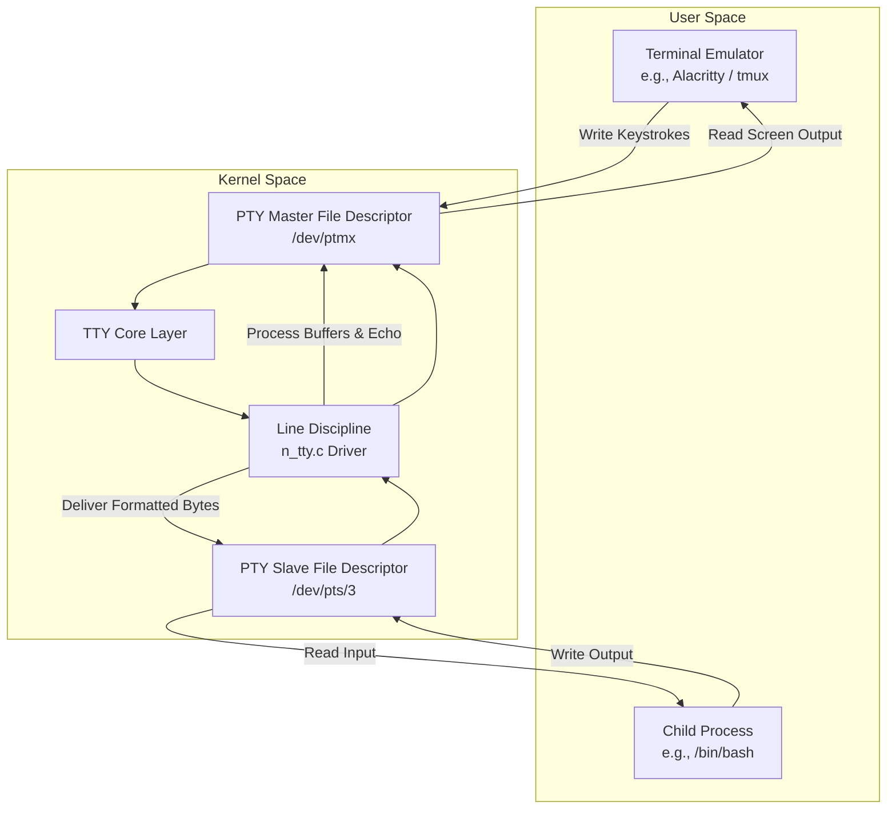
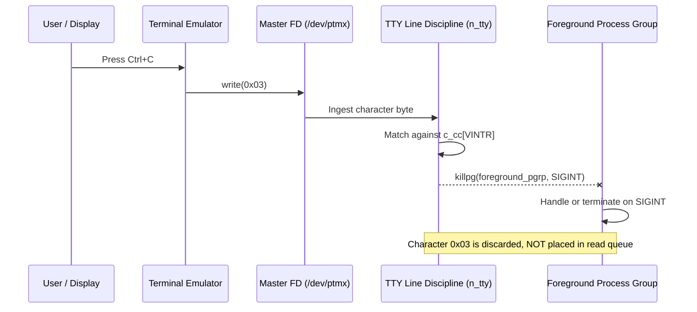

# Inside Linux Pseudo-Terminals: PTY Pairs, Line Disciplines, and Session Control

When you open a terminal window, launch tmux, or run an interactive shell inside a Docker container, you are interacting with one of the oldest abstractions in Unix. Terminal emulators like Alacritty, Ghostty, or iTerm2 do not talk directly to standard input and standard output streams of child processes like bash or zsh. Instead, they sit at the top of a kernel-managed subsystem called the TTY driver layer.

Understanding this subsystem requires unlearning the idea that a terminal is just a stream of bytes. Between your keyboard inputs and the shell reading from file descriptor zero, the Linux kernel performs string editing, echo buffering, signal generation, and process group arbitration.

### The Historic Abstraction and Modern PTY Architecture

In the early days of Unix, physical hardware terminals connected to computers through serial lines. Hardware UARTs converted physical electrical signals into bytes. The kernel needed a driver to handle raw serial data, assemble bytes into line buffers, handle backspaces, and signal process termination when a wire got disconnected.

Today hardware terminals are gone, but the kernel subsystem remains intact. Modern terminal applications use pseudo-terminals, or PTYs. A pseudo-terminal is a software device pair created by the kernel that emulates a physical terminal interface. The pair consists of two distinct file descriptors, the PTY master and the PTY slave.

The terminal emulator process holds the master file descriptor. The child shell process holds file descriptors zero, one, and two pointing to the slave device file located under `/dev/pts/`.

When you press a key on your keyboard, the graphical display server delivers a window event to the terminal emulator. The emulator converts that keypress into ANSI or UTF-8 byte sequences and writes those bytes directly into its PTY master file descriptor. The kernel receives these bytes and routes them through the TTY driver subsystem before putting them into the slave read buffer where bash is waiting on a `read()` system call.

### Opening PTY Pairs and the Multiplexer Device

When a terminal emulator launches, it calls `posix_openpt()` with flags like `O_RDWR` and `O_NOCTTY`. This opens the pseudo-terminal multiplexer clone device located at `/dev/ptmx`. The kernel allocates a new internal data structure, a `struct tty_struct`, assigned to a unique integer index under `/dev/pts/`.

To make the slave end accessible, the master process calls `grantpt()` and `unlockpt()`. These calls change permissions on the corresponding slave node, such as `/dev/pts/3`, and unlock access. The master process then queries the path using `ptsname()` and forks a child process.

Before the child process calls `execve()` to launch the shell, it calls `setsid()` to start a new session, sets the controlling terminal using `ioctl(fd, TIOCSCTTY, 0)`, and duplicates the slave file descriptor across its standard input, standard output, and standard error using `dup2()`.

At this point, the child process has completely detached from its parent process group and attached its file descriptors zero, one, and two to the pseudo-terminal slave. Anything written by the child process to standard output flows directly into the slave end of the kernel PTY driver.

### Inside the TTY Line Discipline

Between the master and slave ends sits the line discipline module. In Linux, line disciplines implement the protocol layer of the TTY driver. While specialized line disciplines exist for things like PPP network interface encapsulation or Bluetooth audio streaming, standard terminal operation uses the default line discipline driver implemented in `drivers/tty/n_tty.c`.

The line discipline operates in two primary modes: canonical mode and non-canonical mode.

In canonical mode, input bytes written by the master are buffered in the kernel until a newline character is encountered. While bytes sit in this line buffer, the line discipline handles backspacing, line erasure, and word deletion directly inside the kernel without notifying the reading application. If you type a mistake and hit backspace while running a program that expects canonical input, bash does not process that backspace. The `n_tty` driver intercepts the ASCII backspace character 0x08 or erase character 0x7F, updates its internal ring buffer, and writes an erase sequence back to the master descriptor so the display updates.

Non-canonical mode disables this line buffering mechanism. Applications like vim, htop, or readline-enabled shells place the terminal into non-canonical mode using `tcsetattr()` with the `ICANON` flag cleared. In this mode, characters written to the master descriptor pass through to the slave read queue immediately, byte by byte, allowing interactive applications to react to individual keypresses.

The line discipline also handles local echo. When `ECHO` is enabled in termios flags, every byte passed into the master side from the terminal emulator is automatically duplicated by `n_tty` and written back out to the master side so the terminal emulator can draw the typed character on screen.

### Terminal Signals and Session Management

The line discipline is responsible for transforming raw byte patterns into kernel signals delivered to process groups.

When you hit Ctrl+C in a terminal, the terminal emulator writes byte `0x03` into the master descriptor. When the line discipline processes this byte, it checks its internal character control table `c_cc[VINTR]`. Finding a match, `n_tty` does not pass byte `0x03` to the slave read buffer. Instead, it identifies the foreground process group associated with the session and dispatches a `SIGINT` signal to every process inside that group.

Similarly, Ctrl+Z maps to `c_cc[VSUSP]`, sending `SIGTSTP` to suspend the foreground process group, while Ctrl+\ maps to `c_cc[VQUIT]`, generating `SIGQUIT` with a core dump.

Kernel session management relies heavily on the concept of controlling terminals. A single POSIX session can have at most one controlling terminal. Within that session, processes are partitioned into process groups. Only one process group at a time can be the foreground process group on a given controlling terminal.

When a background process attempts to read from its controlling terminal, the TTY driver intercepts the `read()` system call. Because the reading process group ID does not match the foreground process group ID recorded on the `struct tty_struct`, the driver sends `SIGTTIN` to the background process group, suspending it until the user brings it to the foreground with `fg`. If a background process tries to write to the terminal and the `TOSTOP` flag is set in termios, the driver sends `SIGTTOU`.

### Window Resizing and Master Disconnection

Terminal applications need to know when the window geometry changes. When a user drags the corner of a terminal emulator window, the application detects the OS window resize event, calculates the new grid dimensions in rows and columns, and executes an ioctl call:

`ioctl(master_fd, TIOCSWINSZ, &winsize);`

The kernel updates the `struct winsize` structure embedded inside the TTY object and immediately sends a `SIGWINCH` signal to the foreground process group of the terminal. Applications like vim catch `SIGWINCH`, execute `ioctl(slave_fd, TIOCGWINSZ, &winsize)` to read the updated rows and columns count, and redraw their layout accordingly.

When you close a terminal window, the terminal emulator process closes the PTY master file descriptor. The kernel TTY driver detects that all file descriptors referencing the master side of the pseudo-terminal device have dropped to zero. It responds by generating a `SIGHUP` signal and delivering it to the session leader process, which is usually the shell.

When the session leader receives `SIGHUP`, it passes the signal to all job process groups it created and exits. If processes in those groups were stopped, the kernel sends `SIGCONT` followed immediately by `SIGHUP` so they can clean up and exit rather than lingering indefinitely as orphaned background tasks.

### Tracing a PTY Transaction in Kernel Memory

To see how data flows through the kernel subsystems during a real interaction, trace what happens when you type `ls` and hit enter.

First, the terminal emulator calls `write()` on its master file descriptor with the bytes `l`, `s`, and `\n`.

The VFS layer maps the write operation on the `/dev/ptmx` file descriptor to the `pty_write()` function in `drivers/tty/pty.c`.

`pty_write()` retrieves the associated `struct tty_struct` representing the slave device and passes the buffer into `tty_insert_flip_string()`.

The kernel flip buffer is a specialized two-stage ring buffer designed to safely pass bytes from driver interrupt handlers or master writes into the line discipline without holding lock contention across user execution context boundaries.

Next, the kernel schedules a workqueue task that executes `flush_to_ldisc()`. This task takes the bytes from the flip buffer and feeds them directly into `n_tty_receive_buf2()` in `drivers/tty/n_tty.c`.

If canonical mode is active, `n_tty` evaluates each byte. For `l` and `s`, it places the characters into its 4096-byte read buffer, updates its cursor index, and because `ECHO` is set, calls `tty_driver_pwrite()` to mirror those same characters back into the master ring buffer so the terminal emulator can display them.

When `\n` arrives, `n_tty` marks the line as complete, increments the internal line count variable `read_cnt`, and wakes up any process currently sleeping on `tty_read()`.

The child shell process, which was suspended in `sys_read()`, wakes up inside `n_tty_read()`. The driver copies the buffered line into the user-space buffer provided by bash and returns the byte count. Bash parses the string, forks a child process to run `ls`, and the cycle repeats.

Understanding this architecture explains why modern terminal tools behave the way they do. Behind every command-line prompt lies a sophisticated set of state machines, ring buffers, and signals maintaining an abstraction created decades ago for physical teletype machines.
