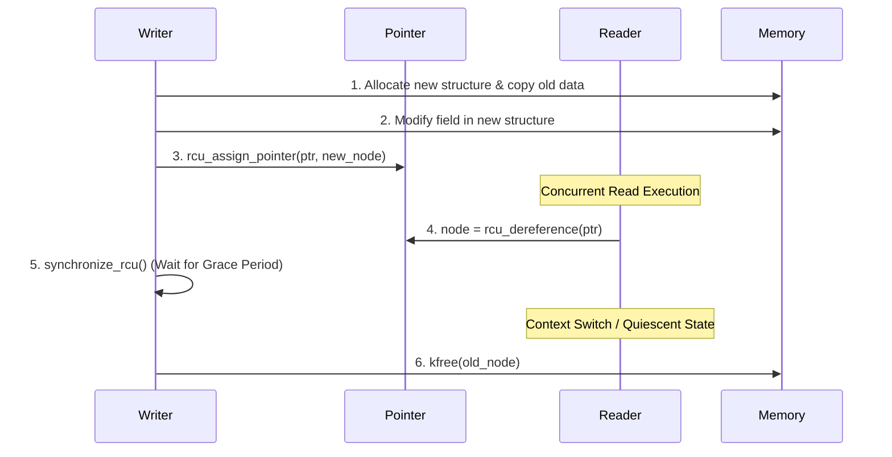

# Inside Linux RCU: Grace Periods, Quiescent States, and Lockless Read-Side Primitives

Shared-memory concurrency in OS kernels traditionally relies on spinlocks or read-write locks. Read-write locks look great on paper because they allow multiple readers to access data concurrently while reserving exclusive access for writers. In practice, on modern multi-core SMP systems, standard read-write locks degrade under high reader contention. Every time a reader acquires a read lock, it executes an atomic operation like a fetch-and-add or atomic compare-and-swap to increment a shared reader counter. This atomic write forces every other CPU core holding the cache line to invalidate its local L1/L2 cache copy. The cache line bounces across the interconnect, turning what should be a parallel read operation into a serialized memory bus bottleneck.

Linux solved this scalability bottleneck with Read-Copy-Update, commonly known as RCU. Instead of requiring readers to acquire locks or mutate shared state, RCU lets readers access shared memory completely lock-free. Readers don't execute atomic instructions, don't issue bus locks, and don't mutate memory. Writers bear all synchronization costs. When a writer wants to modify an RCU-protected data structure, it creates a copy of the structure, mutates the copy, and atomically updates a global pointer to publish the new version. Existing readers continue accessing the old structure safely, while new readers pick up the updated structure immediately. The core engineering challenge shifts from locking data structures to determining when the old structure is no longer referenced by any reader so its memory can be safely freed.



## Pointer Publication and Read-Side Barriers

In a non-preemptible Linux kernel configuration, `rcu_read_lock()` and `rcu_read_unlock()` cost zero CPU cycles at runtime. `rcu_read_lock()` expands to a compiler barrier, `barrier()`, which instructs the C compiler not to reorder memory accesses across the critical section boundaries. No atomic instructions or memory writes occur. A reader simply marks the entry and exit of a critical section locally within the C compilation unit.

Memory ordering still matters when publishing new data structures. Modern CPUs reorder speculative memory reads and out-of-order writes. If a CPU core writes the fields of a newly allocated struct and updates the pointer without proper memory barriers, another CPU reading that pointer might observe the updated pointer address before the field writes hit L1 cache. The reader would dereference a pointer pointing to uninitialized garbage.

To prevent this, RCU uses `rcu_assign_pointer()` for publishing data and `rcu_dereference()` for consuming data. `rcu_assign_pointer()` executes a release memory barrier (`smp_store_release()`) right before updating the pointer. This barrier guarantees that all store instructions initializing the memory object complete and flush to cache prior to making the pointer address visible to other CPU cores. On x86 architectures, hardware memory models guarantee store-store ordering naturally, making `rcu_assign_pointer()` a simple pointer write with a compiler barrier. On weakly ordered architectures like ARM64, `rcu_assign_pointer()` emits a store-release instruction (`STLR`).

On the consuming side, `rcu_dereference()` issues an acquire barrier or data-dependency barrier. On most hardware architectures, data dependencies enforce ordering automatically. If CPU A reads pointer P, and then reads field P->value, the hardware naturally orders the reads because CPU A cannot compute the target address of P->value until it resolves the address value held in P. Alpha processors were a rare exception that required explicit hardware read memory barriers. Modern C compilers treat `rcu_dereference()` as a directive to preserve dependency chains, preventing optimizer passes from reordering reads derived from the pointer.

## Quiescent States and Grace Period Mechanics

The central mechanism enabling RCU memory reclamation is the concept of a Quiescent State and a Grace Period. A Quiescent State is a condition in which a given CPU core is guaranteed not to be inside an RCU read-side critical section. In a traditional non-preemptible kernel, RCU read-side critical sections run with kernel preemption disabled. A CPU core cannot execute a context switch, enter the idle loop, or transition back to user space while holding an RCU read lock. Therefore, any context switch, idle loop entry, or user-space execution on a given CPU represents a verified Quiescent State for that CPU.

A Grace Period is defined as the time interval during which every CPU core in the system passes through at least one Quiescent State. When a writer replaces an old pointer with a new pointer, some readers may still be actively traversing the old structure. The writer cannot reclaim or free the old memory immediately. Instead, the writer waits for a full Grace Period to elapse.

```mermaid
gantt
    title RCU Grace Period Timeline across CPUs
    dateFormat  s
    axisFormat %S
    section CPU 0 (Writer)
    Assign New Pointer     :a1, 0, 1s
    synchronize_rcu()      :a2, 1s, 4s
    Free Old Node          :a3, 5s, 6s
    section CPU 1 (Reader A)
    rcu_read_lock()        :b1, 0, 2s
    Quiescent State (CSwitch) :b2, 2s, 3s
    section CPU 2 (Reader B)
    rcu_read_lock()        :c1, 0.5s, 3.5s
    Quiescent State (Idle) :c2, 4s, 5s
```

Because RCU read-side critical sections cannot cross a Quiescent State on a non-preemptible kernel, any reader that started executing before the writer updated the pointer must finish its critical section before its host CPU undergoes a context switch. Any reader that starts execution after the pointer update will observe the new pointer instead of the old one. Once every CPU core in the kernel has undergone at least one Quiescent State after the update, no references to the old memory structure can possibly exist anywhere in the system. The Grace Period completes, and the writer frees the memory safely.

## Hierarchical Tree RCU Architecture

Tracking Quiescent States across thousands of CPU cores in modern enterprise servers would cause catastrophic lock contention if managed via a single global bitmask. Linux solves this scaling challenge using Tree RCU, which organizes CPUs into a hierarchical tree of synchronization nodes represented by `rcu_node` structures.

```
                  +-----------------------+
                  |    rcu_state (Root)   |
                  |  rcu_node (Level 0)   |
                  +-----------+-----------+
                              |
               +--------------+--------------+
               |                             |
     +---------v---------+         +---------v---------+
     | rcu_node (Level 1)|         | rcu_node (Level 1)|
     |  CPUs 0-15 Mask   |         |  CPUs 16-31 Mask  |
     +---------+---------+---------+---------+---------+
               |                             |
       +-------+-------+             +-------+-------+
       |               |             |               |
   +---v---+       +---v---+     +---v---+       +---v---+
   | CPU 0 |  ...  | CPU 15|     | CPU 16|  ...  | CPU 31|
   +-------+       +-------+     +-------+       +-------+
```

Each leaf `rcu_node` tracks a cluster of up to 64 CPUs using bitmasks. Each per-CPU data structure, `rcu_data`, tracks quiescent states locally on its assigned CPU. When a new Grace Period begins, the RCU core engine initializes the bitmask in each `rcu_node`, setting bits for all active online CPUs in that leaf's group.

When CPU 0 records a quiescent state during a schedule event, it locks its local leaf `rcu_node` and clears its corresponding bit in the node's bitmask. If other CPUs assigned to that same leaf node have not yet hit a quiescent state, CPU 0 releases the leaf lock and returns to work immediately. Lock contention stays confined within small local CPU groups.

When the final remaining CPU in a leaf group records its quiescent state, it clears the last bit in the leaf node's bitmask. Recognizing that its group is fully quiet, that CPU propagates the signal up the hierarchy by locking the parent `rcu_node` and clearing the leaf node's bit in the parent mask. This fan-in cascade continues up the tree until the root `rcu_node` has all bits cleared. The CPU that clears the final bit on the root node officially completes the global Grace Period and advances the RCU state machine.

## Deferring Memory Reclamation with Call RCU

Writers choose between two reclamation execution models depending on latency demands: synchronous wait using `synchronize_rcu()` or asynchronous callback registration using `call_rcu()`.

Using `synchronize_rcu()` blocks the writer thread completely. The writer registers a waiter on an internal completion queue and puts its task into a sleeping state (`TASK_UNINTERRUPTIBLE`). The current thread sits idle while the Tree RCU state machine waits for all CPUs to hit quiescent states. Once the Grace Period completes, the RCU kernel thread wakes up the sleeping writer, which then proceeds to call `kfree()`. This approach is clean and simple, but sleeping waiting for context switches across all cores can take several milliseconds. Synchronous reclamation is unacceptable in high-throughput network routing paths or file system lookup updates.

Asynchronous deferred reclamation via `call_rcu()` eliminates writer blocking. Instead of sleeping, the writer allocates an `rcu_head` memory structure, which is typically embedded directly inside the custom data object itself to avoid dynamic allocations.

```c
struct network_route {
    struct in_addr dest_ip;
    struct net_device *dev;
    struct rcu_head rcu;
};

void remove_route(struct network_route *rt)
{
    rcu_assign_pointer(global_route_ptr, NULL);
    call_rcu(&rt->rcu, free_route_callback);
}
```

The `call_rcu()` function appends the `rcu_head` struct along with a function pointer callback (`free_route_callback`) to a per-CPU callback queue inside `rcu_data`. The writer function returns immediately without blocking.

Per-CPU softirq handlers (`RCU_SOFTIRQ`) and dedicated kernel threads (`rcu_kthread`) monitor these local callback queues. Callbacks are segmented into distinct lists based on grace period generation numbers: callbacks waiting for the current grace period, callbacks waiting for the next grace period, and callbacks whose grace period has already passed. Once the Tree RCU state machine signals that the target grace period is complete, the kernel processes the completed callback segment in batches, executing `free_route_callback` to release memory without ever stalling the updating thread.

## Preemptible RCU and Expedited Grace Periods

Real-time and desktop Linux kernels configured with full preemption (`CONFIG_PREEMPT_RCU`) change the rules of quiescent state tracking. In a preemptible kernel, a process running inside an `rcu_read_lock()` critical section can be preempted by a higher-priority task. A CPU context switch on a preemptible kernel no longer guarantees that the thread exiting the CPU has finished its RCU read operations.

Preemptible RCU replaces simple context switch tracking with task-level tracking. Every task struct in Linux contains an `rcu_read_lock_nesting` counter and an `rcu_read_unlock_special` bitmask. When `rcu_read_lock()` executes on a preemptible kernel, it increments `current->rcu_read_lock_nesting`.

If a task gets preempted while inside an RCU critical section, the scheduler detects that `rcu_read_lock_nesting` is greater than zero. The scheduler hooks into the task and inserts it into a blocked tasks list (`blkd_tasks`) managed by the leaf `rcu_node` corresponding to the CPU where the task was running. The leaf node cannot mark itself quiet for the active Grace Period until all tasks linked in its `blkd_tasks` list either unblock, complete their critical sections, and call `rcu_read_unlock()`. When the preempted task eventually runs again and decrements its nesting count back to zero, it notices the special flag set by the scheduler and removes itself from the leaf's `blkd_tasks` list, unlocking the stalled Grace Period state machine.

Standard Grace Periods trade writer latency for minimal reader overhead, often taking tens of milliseconds under heavy workloads. Some system calls, such as unregistering a network interface or tearing down a security policy, cannot afford multi-millisecond stalls during system configuration changes. Linux provides `synchronize_rcu_expedited()` to force rapid Grace Period completion.

Instead of waiting passively for CPUs to hit quiescent states during routine scheduling, `synchronize_rcu_expedited()` sends Inter-Processor Interrupts (IPIs) to every online CPU core currently running in non-quiescent states. The IPI interrupts active execution on remote cores immediately. The IPI handler checks whether the CPU is currently inside an RCU read-side critical section. If it is not, the handler records a quiescent state right inside the interrupt context and returns. If the target CPU is inside an RCU read section, the handler sets a flag directing `rcu_read_unlock()` on that core to report a quiescent state the microsecond its critical section ends. Expedited grace periods reduce writer delay from milliseconds down to microseconds, but pay a heavy price in CPU cross-call overhead and system jitter across all cores.
