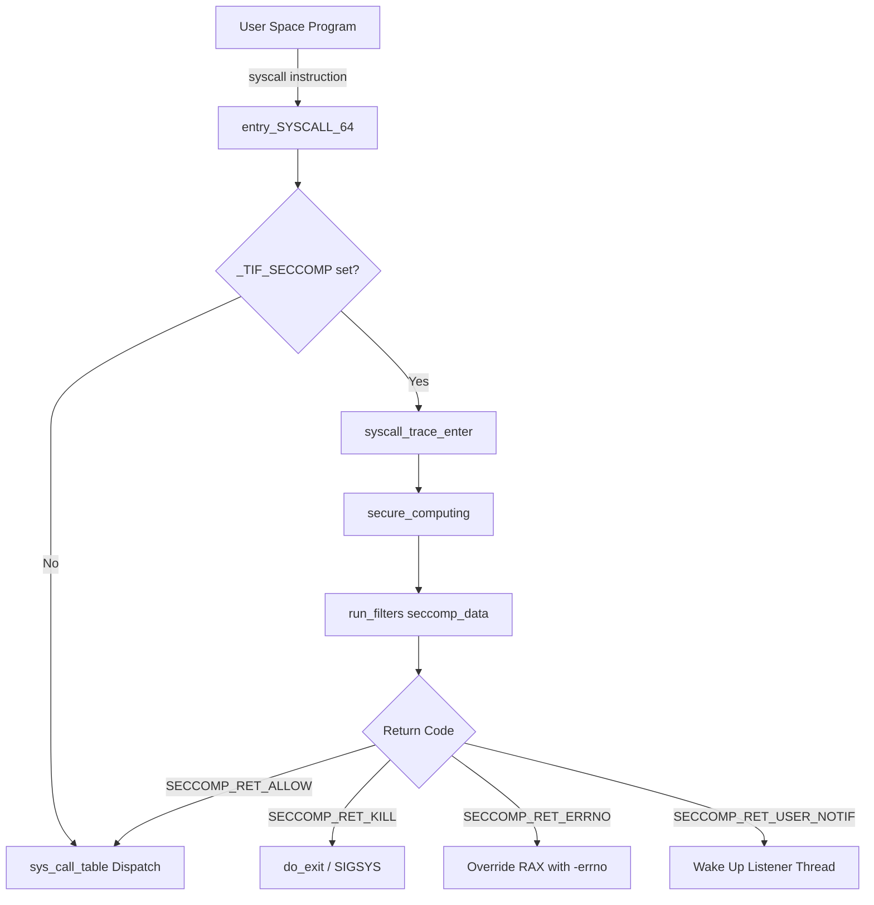
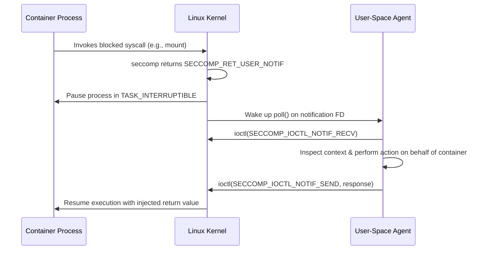

When a containerized process or browser renderer process tries to execute a system call, kernel execution speed is only half the battle. Preventing an exploited process from invoking syscalls like execveat, keyctl, or ptrace is what keeps host infrastructure alive. Linux handles this through seccomp, short for secure computing mode. While seccomp started in kernel 2.6.12 as a binary toggle that only allowed read, write, exit, and sigreturn, it evolved in Linux 3.5 into seccomp-bpf. This modern variant allows user space to attach custom packet filters directly to the system call dispatch path.

Under the hood, seccomp does not use modern eBPF helpers or maps. It executes Classic BPF (cBPF) bytecode directly against a synthetic memory buffer populated on every syscall entry. Understanding this mechanism requires tracing the path from the CPU instruction down to the kernel execution loop, analyzing how filter chains evaluate return codes, and observing how user-space notification targets allow unprivileged containers to emulate restricted syscalls safely.

### The Syscall Boundary and Hook Placement

When a process executes the syscall assembly instruction on x86_64, the CPU transitions from Ring 3 to Ring 0 via the LSTAR Model Specific Register, jumping directly to entry_SYSCALL_64. Before the kernel dispatches execution to the function pointers in sys_call_table, it runs syscall entry tracing.

If a process has seccomp enabled, the thread flag _TIF_SECCOMP is set in its thread_info structure. When syscall_trace_enter() detects this flag, it calls secure_computing().



The placement of secure_computing() at this precise boundary is critical. It executes after arguments have been copied into kernel registers but before any state changes occur in the kernel subsystem. If the filter denies the request, execution halts immediately without touching file systems, memory mappings, or process namespaces.

### The Synthetic Inspection Frame: struct seccomp_data

Seccomp filters do not inspect arbitrary pointers or kernel memory structures. Instead, when secure_computing() triggers, the kernel constructs a stack-allocated frame of type struct seccomp_data. This structure represents the entire universe of information visible to a seccomp filter.

```
+-------------------------------------------------------------------+
| struct seccomp_data                                               |
+-------------------------------------------------------------------+
| offset 0x00 | int nr                (Syscall Number)              |
| offset 0x04 | __u32 arch            (AUDIT_ARCH_* Constant)       |
| offset 0x08 | __u64 instruction_ptr (Program Counter at syscall)  |
| offset 0x10 | __u64 args[0]         (1st Argument Register)       |
| offset 0x18 | __u64 args[1]         (2nd Argument Register)       |
| offset 0x20 | __u64 args[2]         (3rd Argument Register)       |
| offset 0x28 | __u64 args[3]         (4th Argument Register)       |
| offset 0x30 | __u64 args[4]         (5th Argument Register)       |
| offset 0x38 | __u64 args[5]         (6th Argument Register)       |
+-------------------------------------------------------------------+
```

The architecture field arch is mandatory to validate in every filter. On x86_64 systems, a process can make system calls using x86_64 ABI or the x32 ABI mode, which shares syscall numbers with different parameter conventions. A filter that checks nr == 59 assuming sys_execve on x86_64 will fail to catch x32 variants unless the arch value matches AUDIT_ARCH_X86_64 explicitly.

The args array contains the raw 64-bit values present in registers at the moment of the system call (rdi, rsi, rdx, r10, r8, r9). Seccomp cannot dereference pointers stored in these arguments. If args[0] contains a memory pointer to a path string like /etc/shadow, seccomp only sees the numerical memory address, not the string content. This is a deliberate design choice to prevent Time-of-Check to Time-of-Use (TOCTOU) race conditions, where a malicious user-space thread modifies the string buffer after seccomp checks it but before the kernel reads it.

### Classic BPF Mechanics in Seccomp

While Linux tracing infrastructure moved to eBPF with 11 64-bit registers and kernel maps, seccomp intentionally remains built on Classic BPF (cBPF). Classic BPF uses a 32-bit accumulator register A, an index register X, and an array of 32-bit words acting as implicit memory.

The kernel retains cBPF for seccomp because cBPF filters are strictly deterministic and provably finite. They contain no loops, no backward jumps, and no dynamic memory accesses. When a process loads a cBPF filter via prctl(PR_SET_SECCOMP, SECCOMP_MODE_FILTER, ...) or seccomp(SECCOMP_SET_MODE_FILTER, ...), the kernel compiles or validates the filter into an array of struct sock_filter instructions.

```c
struct sock_filter {
    __u16 code; /* Instruction opcode */
    __u8  jt;   /* Jump true offset */
    __u8  jf;   /* Jump false offset */
    __u32 k;    /* Generic multi-use field */
};
```

Execution operates on instructions like load accumulator (BPF_LD), compare and jump (BPF_JMP), and return (BPF_RET).

To illustrate how cBPF evaluates syscalls, consider a minimal filter that inspects the syscall architecture and allows read (syscall 0), write (syscall 1), and exit_group (syscall 231), while terminating the process for any other call.

```
Instruction 0: BPF_LD  | BPF_W | BPF_ABS , offset 4  (Load arch into A)
Instruction 1: BPF_JMP | BPF_JEQ | BPF_K   , AUDIT_ARCH_X86_64, jt=0, jf=5
Instruction 2: BPF_LD  | BPF_W | BPF_ABS , offset 0  (Load syscall nr into A)
Instruction 3: BPF_JMP | BPF_JEQ | BPF_K   , 0 (read), jt=3, jf=0
Instruction 4: BPF_JMP | BPF_JEQ | BPF_K   , 1 (write), jt=2, jf=0
Instruction 5: BPF_JMP | BPF_JEQ | BPF_K   , 231 (exit_group), jt=1, jf=0
Instruction 6: BPF_RET | BPF_K             , SECCOMP_RET_KILL_PROCESS
Instruction 7: BPF_RET | BPF_K             , SECCOMP_RET_ALLOW
```

The accumulator loads data directly from offsets within struct seccomp_data. Jump instructions evaluate equality against immediate constants k. If true, the program counter jumps relative to the jt offset. If false, it advances by jf.

Modern Linux kernels JIT-compile these cBPF instruction arrays into native x86_64 machine code during attachment, eliminating interpreter overhead completely on hot system call execution paths.

### Filter Hierarchies and Return Code Priority

Processes inherit seccomp filter chains across fork(), vfork(), and execve(). To prevent an unprivileged user process from executing a setuid binary with a custom seccomp filter that blocks authorization checks, Linux enforces a rule: a process must either possess the CAP_SYS_ADMIN capability in its user namespace or set the no_new_privs bit via prctl(PR_SET_NO_NEW_PRIVS, 1, 0, 0, 0) before attaching seccomp filters.

When multiple filters are attached to a thread, they form a single-linked list hanging off current->seccomp.filter. On system call entry, the kernel does not stop at the first filter. It executes every filter in the chain, from newest to oldest.

```mermaid
flowchart LR
    A[Syscall Entry] --> F1[Filter 3: Child Filter]
    F1 -->|Evaluates| R1[Returns RET_ALLOW]
    R1 --> F2[Filter 2: Container Runtime Filter]
    F2 -->|Evaluates| R2[Returns RET_ERRNO]
    R2 --> F3[Filter 1: Systemd Filter]
    F3 -->|Evaluates| R3[Returns RET_LOG]
    R3 --> Pre[Precedence Engine]
    Pre -->|Highest Priority Action Takes Effect| Exec[Return RET_ERRNO to caller]
```



Each filter returns a 32-bit value split into two sections: a 16-bit high-order action mask (SECCOMP_RET_ACTION_FULL) and a 16-bit low-order data value. Because all filters run, the kernel collects all return values and picks the result with the highest precedence.

The action precedence order, from highest priority to lowest priority, dictates how the kernel handles conflict:

1. SECCOMP_RET_KILL_PROCESS: Instantly terminates the entire process group without delivering a signal.
2. SECCOMP_RET_KILL_THREAD: Terminates the calling thread immediately.
3. SECCOMP_RET_TRAP: Forces the kernel to send a SIGSYS signal to the task, passing a siginfo_t struct containing the architecture, syscall number, and instruction pointer.
4. SECCOMP_RET_ERRNO: Skips system call execution entirely and places the filter-provided value directly into the return register (rax on x86_64), returning a fake error code like EPERM or ENOSYS to user space.
5. SECCOMP_RET_USER_NOTIF: Suspends the thread and sends a message to an external monitoring daemon over an explicit file descriptor.
6. SECCOMP_RET_TRACE: Notifies a ptrace tracer. If no tracer is present, overrides execution and returns ENOSYS.
7. SECCOMP_RET_LOG: Logs the system call payload to the audit log and proceeds with execution.
8. SECCOMP_RET_ALLOW: Permits execution to proceed to sys_call_table.

If Filter 3 allows a syscall, but Filter 2 returns SECCOMP_RET_ERRNO, the final action executed by the kernel is SECCOMP_RET_ERRNO. The restriction always wins.

### Modern State Machines: SECCOMP_RET_USER_NOTIF

The addition of SECCOMP_RET_USER_NOTIF turned seccomp from a static blocklist engine into a dynamic user-space system call virtualization interface. Container runtimes use this mechanism to grant unprivileged containers access to actions that typically require privileged capabilities, such as creating loop devices or mounting specific virtual filesystems.

When a filter evaluates to SECCOMP_RET_USER_NOTIF, the kernel halts thread execution and puts the task into an interruptible sleep state (TASK_INTERRUPTIBLE). It pushes a notification payload to a special seccomp notification file descriptor created when the filter was installed.

```c
struct seccomp_notif {
    __u64 id;          /* Cookie identifying this specific syscall instance */
    __u32 pid;         /* Process ID of the target process */
    __u32 flags;       /* Flags */
    struct seccomp_data data; /* Copy of the syscall context frame */
};
```

A supervisor process (such as conmon or an agent daemon) reads this structure using an ioctl(fd, SECCOMP_IOCTL_NOTIF_RECV, &notif) call on the seccomp descriptor.



The supervisor inspects the system call and arguments inside notif.data. It can read or write memory in the target process using /proc/<pid>/mem or system calls like process_vm_readv and process_vm_writev. Once the supervisor handles the operation, it constructs a response payload of type struct seccomp_notif_resp.

```c
struct seccomp_notif_resp {
    __u64 id;     /* Must match notification cookie */
    __s64 val;    /* Return value to inject into process RAX register */
    __s32 error;  /* Negative error code if failing (e.g. -EPERM) */
    __u32 flags;  /* Response flags, such as SECCOMP_USER_NOTIF_FLAG_CONTINUE */
};
```

The agent submits this payload via ioctl(fd, SECCOMP_IOCTL_NOTIF_SEND, &resp). The kernel verifies the unique 64-bit target identifier (id) to ensure the target process hasn't exited or been recycled, copies val or error into the process stack state, and wakes the container thread. If SECCOMP_USER_NOTIF_FLAG_CONTINUE is set in the response flags, the kernel ignores any injected error or return value and proceeds with normal system call execution in the kernel pipeline.

This mechanism allows non-privileged micro-VMs and container runtimes to safely intercept, filter, and emulate system calls in user space with minimal kernel overhead.

By combining cBPF bytecode validation, deterministic execution frames, strict priority rules, and async user-space notification channels, seccomp-bpf provides the fundamental isolation boundary powering modern Linux container runtimes and high-security application sandboxes.
