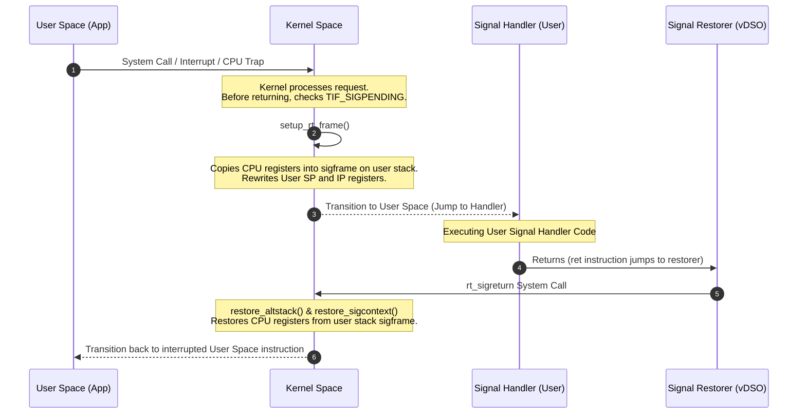

Signals are the oldest form of inter-process communication in Unix-like systems. Most developers know them as raw numbers like SIGKILL or SIGSEGV, or perhaps they have registered a basic signal handler in C or Go to handle graceful shutdown on SIGTERM. Underneath that simple interface lies an incredibly complex state machine. Delivering a signal requires the Linux kernel to hijack a running user thread, rewrite its stack in place, swap CPU registers, execute user-space code, and then repair the stack via a specialized system call to resume execution as if nothing happened.

### The Registration of Handlers

When an application wants to customize how it responds to a signal, it invokes the sigaction system call. On modern 64-bit Linux architectures, this translates to the rt_sigaction system call. The kernel receives this system call and modifies the task_struct of the calling process. Specifically, the sighand pointer inside the task_struct points to a structure containing an array of k_sigaction structures, one for each possible signal. 

This registration stores the address of the user-space signal handler, a bitmask of signals to block while this handler is running, and flags that control execution behavior. Two flags are particularly critical for understanding how the stack behaves. SA_ONSTACK tells the kernel to execute the handler on an alternate stack, which is vital for recovering from stack overflows. SA_SIGINFO instructs the kernel to pass detailed metadata about the signal, such as the sending process ID and faulting memory addresses, into the handler.

### Signal Generation and the Pending Queue

Signals can be generated by hardware events, like a CPU exception for an invalid memory access leading to SIGSEGV, or by software actions, like a kill system call. When a signal is generated, the kernel does not run the handler immediately. Instead, it places the signal in a queue. There are two distinct queues in the kernel. The shared queue contains signals targeted at the entire process group, while the private queue contains signals targeted at a specific thread.

Once a signal is queued, the kernel sets a bit in the pending signal bitmask of the target thread or process and marks the thread with the TIF_SIGPENDING thread info flag. This flag is the trigger that the kernel checks later during execution boundaries. The signal remains in this pending state until the target thread is ready to receive it.

### The Kernel to User Transition

The kernel does not actively interrupt a running CPU thread to deliver a signal. Instead, signal delivery is passive and occurs when a thread is about to transition from kernel-space back to user-space. This transition occurs on three main occasions: when returning from a system call, when returning from a hardware interrupt, or when the scheduler resumes a thread.

During this transition, the kernel exit paths execute a check on the current thread's TIF_SIGPENDING flag. If the flag is set, the kernel diverts from its normal return path and invokes the dequeue_signal function. This function pulls the signal from the pending queue and clears the corresponding bit in the pending mask. If the process has registered a custom handler, the kernel begins the complex task of preparing the user-space stack for handler execution.

### Constructing the Stack Frame

The kernel faces an architectural problem here. The thread was running arbitrary user-space code when it was interrupted. Its CPU registers are filled with the state of that code. The kernel cannot execute the signal handler immediately because doing so would destroy the active register values of the interrupted program. The kernel also cannot store this saved state on the kernel-space stack, because kernel-space stacks must remain clean, small, and isolated from user-space execution.

To solve this, the kernel writes the saved register state directly onto the user thread's own stack. It builds a specialized structure called an rt_sigframe. This frame is placed at the current stack pointer location, adjusted downwards to align with the CPU architecture requirements.

The rt_sigframe contains several distinct blocks. It starts with a siginfo structure which holds detailed telemetry about the signal source. Next is a ucontext structure containing a sigcontext structure. The sigcontext structure is where the kernel copies the exact state of all CPU registers at the moment the thread was interrupted, including the instruction pointer, stack pointer, and general-purpose registers. It also allocates space to save the floating-point and vector registers, which are saved using instructions like fxsave or xsave.

Finally, the rt_sigframe contains a small sequence of assembly code, or a pointer to it, known as the signal restorer. This restorer is responsible for making the rt_sigreturn system call once the handler finishes executing.

### The Execution Jump

Once the rt_sigframe is completely built on the user stack, the kernel modifies the CPU register state stored in its task_struct for the current transition. It overrides the saved Instruction Pointer register to point to the user-space signal handler function. It overrides the saved Stack Pointer register to point to the base of the newly created rt_sigframe. 

Next, the kernel sets the return address register to point to the signal restorer code. In modern Linux implementations, this restorer code resides in the vDSO, a small shared library that the kernel maps into the address space of every process. By setting the return register to the vDSO restorer, the kernel ensures that when the signal handler reaches its final return instruction, control will jump directly to the restorer.

With these registers altered, the kernel completes its transition back to user space. The CPU switches execution privilege levels, reads the modified registers, and immediately begins executing the signal handler. The application process is completely unaware that its stack was rewritten while it was running in kernel-space.

### Returning with rt_sigreturn

When the signal handler completes, it executes a standard ret instruction. Because the return address was set to the vDSO restorer, the CPU jumps to this restorer stub. The restorer stub executes the rt_sigreturn system call. This is a highly specialized system call that does not perform typical business logic. Instead, its sole purpose is to reverse the stack setup.

Upon entering the rt_sigreturn handler inside the kernel, the kernel reads the rt_sigframe from the current user-space stack pointer. It validates the saved context to make sure the process has not tampered with the saved register state, which could lead to security exploits or kernel instability. If the validation passes, the kernel copies the saved register values from the rt_sigframe back into the CPU registers of the thread, including the original stack pointer and instruction pointer. 

Finally, the kernel removes the rt_sigframe from the user stack. When the rt_sigreturn system call completes and transitions back to user space, the thread resumes executing the exact instruction it was processing before the signal arrived, with all of its register states preserved.

### Handling Stack Overflows with Sigaltstack

A major problem occurs when a program runs out of stack space. In languages like C, C++, or C#, a stack overflow occurs when recursive functions or large local variables exhaust the pre-allocated stack limit. This triggers a page fault because the thread tries to write past the guard page of the stack. Since the stack is exhausted, the kernel tries to deliver a SIGSEGV signal to the process.

If the process has a standard signal handler, the kernel will attempt to write the rt_sigframe onto the thread's stack. However, because the stack is already full, this write operation triggers another page fault. Because this fault occurs during signal delivery on an already exhausted stack, the kernel cannot recover. It elevates the condition to a double fault and immediately terminates the process with a hard crash, preventing any diagnostic code or crash reporters from running.

To handle this scenario safely, Linux provides the sigaltstack system call. This allows developers to allocate a dedicated area of memory, usually via mmap or malloc, to act as an alternate signal stack. The application registers this memory area with the kernel. 

When registering a signal handler using sigaction, if the developer sets the SA_ONSTACK flag, the kernel modifies its frame setup logic. Instead of building the rt_sigframe at the current stack pointer address, the kernel checks if the thread has an alternate stack configured. If it does, and the current stack pointer is not already within the alternate stack boundaries, the kernel switches the stack pointer to the alternate stack before copying the register state and constructing the rt_sigframe. This allows crash-reporting libraries to catch stack overflows and generate diagnostic reports safely.

### The Concurrency Trap of Async-Signal Safety

The mechanics of signal delivery introduce a major concurrency challenge. Because a signal can be delivered at any arbitrary instruction boundary, a signal handler can interrupt a thread while it is in the middle of executing thread-unsafe code. 

If a thread is executing malloc, it acquires an internal heap lock. If a signal arrives while that lock is held, and the signal handler itself attempts to call malloc, the handler will block forever waiting for the heap lock. The interrupted thread cannot release the lock because its execution is suspended until the signal handler returns, resulting in an unrecoverable deadlock.

This behavior is why only a tiny subset of system calls and C library functions are classified as async-signal-safe. Functions like printf, malloc, and most standard I/O operations are unsafe to use inside a signal handler. A safe signal handler should perform the absolute minimum amount of work, such as setting an atomic flag or writing a single byte to a self-pipe, before returning to let the main program handle the event asynchronously.
