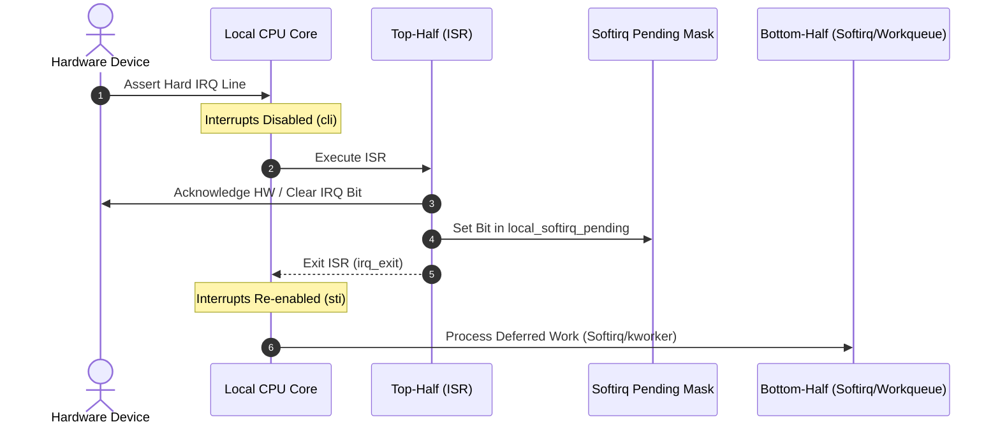
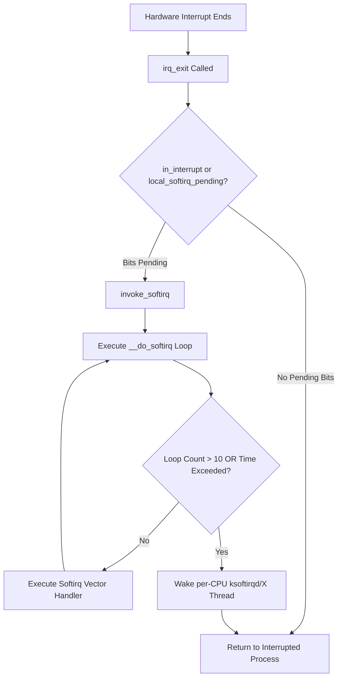
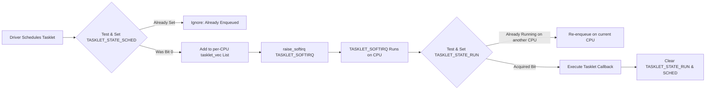
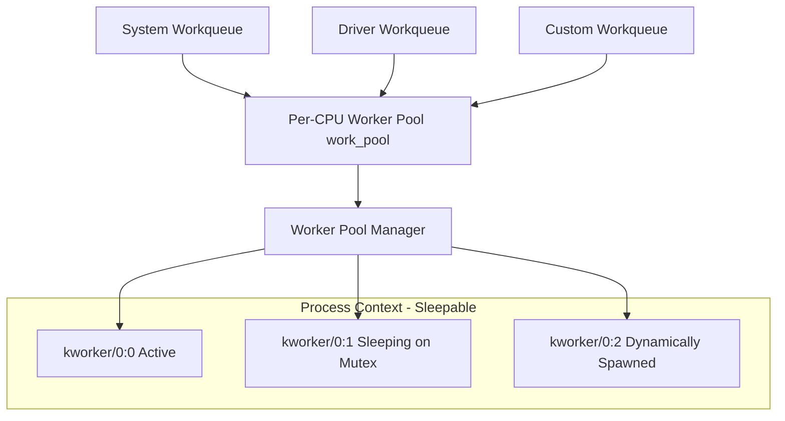
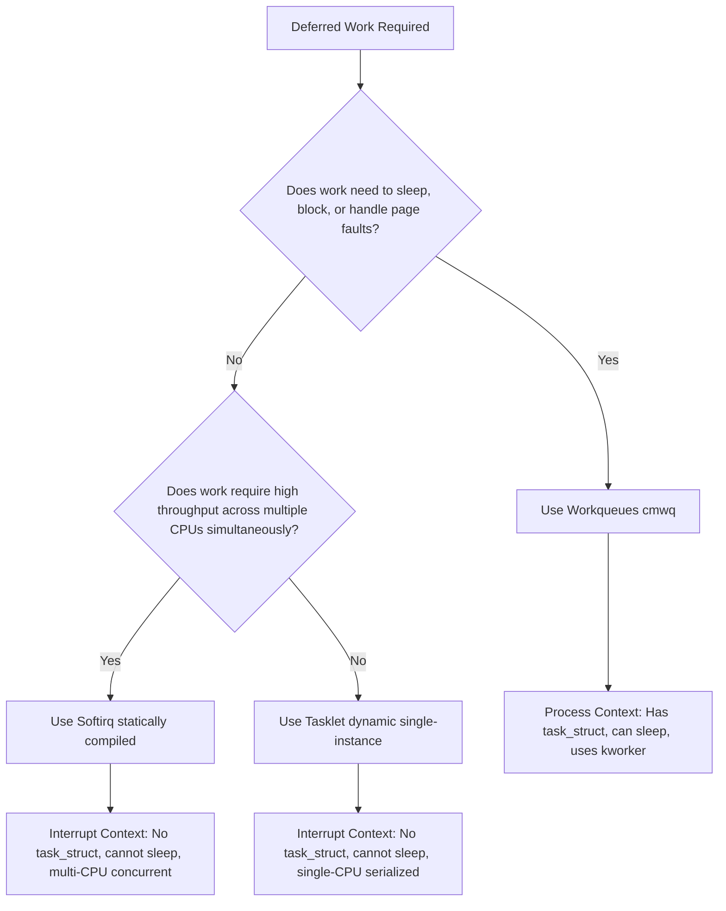

When a network interface card receives an Ethernet frame, a disk controller finishes a DMA transfer, or a timer chip fires, the CPU drops whatever it is doing to handle a hardware interrupt. The CPU saves context, looks up the Interrupt Descriptor Table, and jumps to the registered Interrupt Service Routine. During this hardware top-half execution, local interrupts on the processing CPU core are disabled using the assembly cli instruction or equivalent architecture flags.

This creates a brutal engineering constraint. If the top-half routine takes too long parsing packet headers, allocating buffers, or interacting with hardware buses, the system stops responding. Timer interrupts get missed, audio streams stutter, and other CPU cores spin waiting on hardware synchronization. To keep latency down, the Linux kernel mandates that top-half routines do the bare minimum work required to acknowledge the hardware, clear the hardware interrupt bit, grab volatile registers, and defer the real heavy lifting to a bottom half.

The split between top halves and bottom halves isn't just a conceptual guideline. It is enforced by kernel execution contexts. Top halves run in strict hardware interrupt context where sleeping is impossible, process context does not exist, and execution times are measured in nanoseconds. Bottom halves process the payload asynchronously, but how and when they run depends on which of the kernel's three bottom-half mechanisms you choose: softirqs, tasklets, or workqueues.

Softirqs represent the fastest, most primitive bottom-half execution mechanism in the Linux kernel. They are fixed at compile time into an array of ten statically defined vectors within the kernel image. You cannot dynamically load or register a new softirq type at runtime. The ten vectors handle core kernel subsystems requiring minimal latency, such as NET_RX_SOFTIRQ and NET_TX_SOFTIRQ for network processing, BLOCK_SOFTIRQ for block device I/O, TIMER_SOFTIRQ and HRTIMER_SOFTIRQ for high-resolution timers, SCHED_SOFTIRQ for load balancing, and RCU_SOFTIRQ for Read-Copy-Update garbage collection.

Each softirq vector is represented by a softirq_action structure containing an action function pointer. When a top-half ISR wants to schedule a softirq, it calls raise_softirq(), which updates a bitmask named local_softirq_pending() on the executing CPU core. Because each CPU core maintains its own independent pending bitmask, softirqs require zero atomic lock contention across cores when raised.

The execution environment of a softirq is unforgiving. Softirqs execute in interrupt context, meaning the current task pointer points to whatever user process or kernel thread happened to be running on that CPU when the interrupt hit. Softirqs cannot sleep, cannot wait on blocking mutexes, cannot take page faults, and cannot allocate memory using allocation flags like GFP_KERNEL that might trigger sleep. If a softirq function attempts to sleep, the kernel panics instantly because there is no task context to yield or reschedule.

The kernel executes pending softirqs at specific synchronization points, most commonly inside irq_exit() when a hardware interrupt handler finishes. However, softirqs introduce a dangerous design challenge known as softirq starvation. If high-rate hardware interrupts like a 100Gbps network stream constantly re-raise NET_RX_SOFTIRQ inside __do_softirq(), the CPU could spend its entire life inside softirq processing, starving user processes completely.

To prevent infinite softirq loops from bricking the machine, __do_softirq() runs for a maximum of 10 iterations or 2 milliseconds. If pending softirqs remain after this budget is exhausted, the kernel offloads the remaining softirq processing to a per-CPU kernel thread named ksoftirqd/X, where X is the CPU core index. Because ksoftirqd is a standard kernel thread governed by the CFS scheduler, the operating system can preempt it and grant CPU time back to userspace workloads.

Softirqs are fast because they are fully reentrant across multiple CPU cores. If four network packets hit four separate NIC queues across four CPU cores simultaneously, the exact same net_rx_action() softirq handler runs on all four cores at the exact same moment. This scale requires meticulous lockless synchronization within the softirq handler to prevent data races on shared driver state.

Writing reentrant softirqs is notoriously difficult and error-prone for driver developers. Tasklets were created to solve this complexity by providing a dynamic, lock-free abstraction on top of softirqs that guarantees single-instance execution concurrency. Tasklets are implemented using two softirq vectors: HI_SOFTIRQ for high-priority tasklets and TASKLET_SOFTIRQ for standard priority tasklets.

A tasklet is represented by the tasklet_struct structure, which tracks a function pointer, arbitrary data, a state bitmask, and a reference count. The state bitmask contains two critical flags: TASKLET_STATE_SCHED to indicate the tasklet has been scheduled for execution, and TASKLET_STATE_RUN to indicate the tasklet is currently executing on a CPU core.

When a driver calls tasklet_schedule(), the kernel uses atomic bit operations to test and set the TASKLET_STATE_SCHED flag. If the bit was already set, the tasklet is already pending in the pipeline, so the call exits immediately to avoid duplicate queuing. If the bit was clear, the kernel attaches the tasklet to the local CPU's private tasklet_vec linked list and raises TASKLET_SOFTIRQ.

When the softirq executes tasklet_action(), it iterates through the local CPU's tasklet list. Before invoking the callback, it attempts to set the TASKLET_STATE_RUN bit atomically using tasklet_trylock(). If another CPU core is currently executing that identical tasklet instance, tasklet_trylock() fails. The local CPU then leaves the tasklet in the list and re-raises TASKLET_SOFTIRQ so it can be retried later.

This state machine guarantees that a given tasklet instance never runs concurrently on two separate CPU cores. Different tasklets can run simultaneously on different cores, but individual tasklet instances are entirely serialized without requiring driver developers to write manual spinlocks. Despite this safety, tasklets still run in softirq context, meaning they share the same critical constraint: they cannot sleep or block.

When deferred kernel work needs to sleep, perform disk I/O, interact with USB hardware, or acquire blocking mutexes, softirqs and tasklets cannot be used. The kernel needs process context, complete with a valid task_struct, signal masks, and scheduling integration. Workqueues provide this process-context deferral engine.

Workqueues organize work by embedding a work_struct containing a function pointer into driver state. When a driver calls queue_work(), the kernel enqueues the work struct onto a workqueue, where dedicated kernel threads named kworker dequeue and execute the function callbacks.

Prior to kernel 2.6.36, traditional workqueues suffered from a severe scalability limitation. Drivers had to choose between single-threaded workqueues, which serialized all work across the system through a single kworker thread, or multithreaded workqueues, which created one kworker thread per CPU core for every single workqueue instance. As Linux added subsystem drivers and server CPU core counts surged, systems choked on tens of thousands of idle kworker threads, wasting memory and thrashing thread caches.

To fix this, Tejun Heo designed Concurrency-Managed Workqueues (cmwq). Under cmwq, the kernel decouples workqueues from execution threads. Drivers create abstraction workqueues, but execution is handled by shared, per-CPU worker pools.

The cmwq manager uses an auto-regulating concurrency algorithm. Each per-CPU worker pool attempts to keep exactly one worker thread actively executing on its assigned CPU core. When a kworker thread encounters a blocking operation, like acquiring a contention-heavy mutex or waiting on a page read, it informs the kernel scheduler via the wq_worker_sleeping() hook. The scheduler instantly wakes up an idle kworker thread from the shared pool or spawns a new one if the pool is empty.

Once the blocking thread finishes sleeping and resumes execution, the pool manager detects that multiple workers are active on the core and transitions excess threads back to sleep. This dynamic thread pool management keeps CPU core utilization optimal while permitting hundreds of concurrent sleeping operations without exploding thread count overhead.

Choosing the wrong bottom-half mechanism introduces performance degradation, kernel deadlocks, or lockup bugs. Understanding the exact architectural boundary between softirqs, tasklets, and workqueues is vital for systems engineering.

Softirqs deliver absolute minimum latency because they run immediately upon exiting hardware interrupts, but they require complex lockless designs because they execute concurrently across all CPU cores. They are strictly reserved for core kernel subsystems like networking and block I/O.

Tasklets offer a middle ground for device drivers needing interrupt-context speed without multi-core reentrancy headaches. However, tasklets are executed sequentially per instance, meaning a stalled tasklet callback on one core delays subsequent runs of that tasklet.

Workqueues trade a tiny bit of latency for total operational freedom. Because kworker threads run in process context, they can allocate huge memory chunks, block on locks, invoke file system writes, and sleep for arbitrary intervals. Modern kernel development leans heavily toward cmwq workqueues and eBPF programs, reserving softirqs and tasklets almost entirely for low-level networking, storage drivers, and core timing loops.
