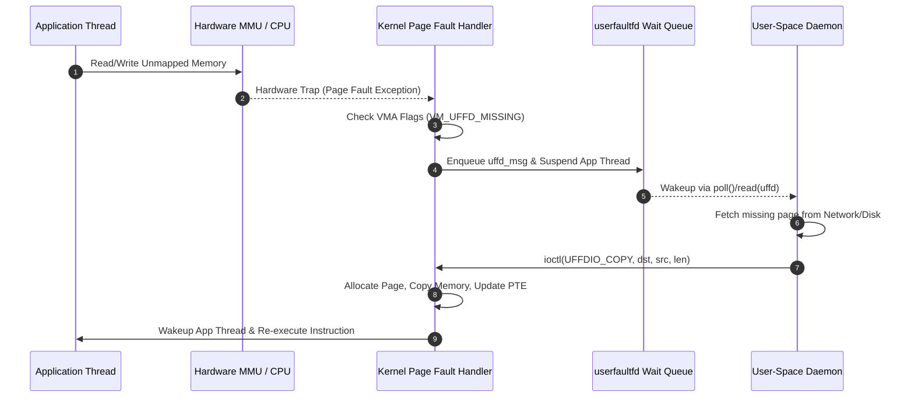

Virtual memory management in operating systems traditionally operated as a strict black box. When an application accessed an unmapped virtual address, the CPU triggered a page fault exception, handing control immediately to the kernel. The kernel then resolved the fault by pulling a page from disk, allocating a zeroed physical page from the buddy allocator, or terminating the process with a segmentation fault. Applications had no say in how page faults were trapped or serviced.

This rigid design broke down as hypervisors, container engines, and modern runtimes evolved. Live virtual machine migration requires transfer of running guest memory across physical hosts without stopping execution. User-space compaction garbage collectors need to track mutations to memory regions without incurring the massive overhead of mprotect syscalls. Checkpointing engines need to intercept memory writes at page granularity without hijacking kernel syscall tables.

The Linux kernel introduced userfaultfd to solve this problem. It allows user-space processes to register virtual memory ranges and intercept page faults directly. When a thread accesses a missing or write-protected page, the kernel suspends the thread, encapsulates the fault context into an event, and pushes it to a user-space file descriptor. A user-space daemon reads the event, supplies the page data, and instructs the kernel to resume the faulting thread.



The entire process hinges on explicit interactions between virtual memory areas, page table entries, and wait queues within the kernel. Understanding how these pieces interlock requires examining the kernel lifecycle from initialization to page table manipulation.

Registration begins with the userfaultfd system call, which constructs an anonymous inode and exposes it through a file descriptor. The calling daemon configures features using the UFFDIO_API ioctl, negotiating capabilities like write-protection tracking, minor faults for shared memory, and event notifications for process forks or unmaps.

Once negotiated, the daemon binds specific virtual memory addresses to the descriptor using the UFFDIO_REGISTER ioctl. The kernel receives a range of virtual addresses, locates the corresponding vm_area_struct structures in the process memory map, and updates their VM_UFFD_MISSING or VM_UFFD_WP flags. It allocates a userfaultfd_ctx context structure and attaches it directly to these VMAs.

```
+-------------------------------------------------------------------+
|                         mm_struct                                 |
+-------------------------------------------------------------------+
                                  |
                                  v
+-------------------------------------------------------------------+
|                      vm_area_struct (VMA)                         |
|  vm_start: 0x7f1000000000         vm_end: 0x7f1000010000         |
|  vm_flags: VM_READ | VM_WRITE | VM_UFFD_MISSING | VM_UFFD_WP      |
|  vm_userfaultfd_ctx -------------------------------+              |
+----------------------------------------------------+              |
                                                     |              |
                                                     v              |
+-----------------------------------------------------------------+ |
|                      userfaultfd_ctx                            | |
|  flags: UFFD_FEATURE_PAGEFAULT_FLAG_WP                          | |
|  fault_pending_wqh: wait_queue_head_t                           | |
|  fault_wqh: wait_queue_head_t <---------------------------------+ |
|  fd_wqh: wait_queue_head_t                                       |
+-----------------------------------------------------------------+
```

When an application thread touches an address inside a userfaultfd-registered VMA without an active physical page mapping, execution hits a wall. The CPU MMU fails to resolve the virtual-to-physical address translation and triggers an interrupt, invoking handle_mm_fault in the kernel.

Under standard execution, handle_mm_fault determines whether to fetch the page from swap, pull it from the page cache, or execute an anonymous allocation. But when the kernel detects the VM_UFFD_MISSING flag on the VMA, it branches into handle_userfault. At this moment, standard page fault resolution halts completely.

The kernel allocates a userfaultfd_wake_function wait entry on the faulting thread's kernel stack. It serializes the fault context into a uffd_msg structure, populating the event type, the exact faulting address, write flags, and thread identifier. The kernel pushes this message onto the userfaultfd_ctx pending queue and sets the faulting thread state to TASK_KILLABLE.

The faulting thread is now frozen. It consumes no CPU cycles, executes no instructions, and stays suspended inside the kernel fault handler until explicitly woken up. Meanwhile, the context wait queue signals readability on the userfaultfd file descriptor.

The monitoring daemon receives event notifications via standard epoll or poll loops on the descriptor. Calling read on the userfaultfd file descriptor drains the pending message queue, retrieving uffd_msg payloads.

```
+-----------------------------------------------------------------+
|                        uffd_msg Struct                          |
+-----------------------------------------------------------------+
|  event: UFFD_EVENT_PAGEFAULT                                    |
|  arg.pagefault.flags: UFFD_PAGEFAULT_FLAG_WRITE                 |
|  arg.pagefault.address: 0x7f1000004000                          |
|  arg.pagefault.feat.ptes: 0x0                                   |
+-----------------------------------------------------------------+
```

Having isolated the faulting address, the daemon must satisfy the request. It can construct memory contents on the fly, stream pages across a TCP socket, or read them from custom storage. Once the page content is staged in a separate user-space buffer, the daemon issues an ioctl call to populate the missing physical memory.

The system provides three core ioctls to resolve missing page faults. UFFDIO_COPY takes a destination address in the faulting memory region, a source address pointing to the daemon's staged data, and a byte length. The kernel allocates a physical page using alloc_page, copies memory from the daemon's source buffer into the allocated page, acquires the mmap lock for the target process, and updates the page table entry to point to this new page. It then clears the fault condition.

UFFDIO_ZEROPAGE allocates no new memory containing copied data. Instead, it directly maps the kernel's shared zero-page to the missing virtual address, marking the page table entry read-only with copy-on-write semantics. This is crucial for rapidly initializing sparse virtual address spaces.

UFFDIO_CONTINUE handles minor faults, primarily used with hugetlbfs or shared memory files. In these scenarios, the physical page already exists within the kernel page cache, but the process page table lacks a binding. UFFDIO_CONTINUE commands the kernel to establish the page table entry mapping to the existing page cache page without doing any memory allocations or data copies.

```
+-------------------------------------------------------------------+
|                     UFFDIO_COPY Execution                         |
+-------------------------------------------------------------------+

Daemon Buffer (Source)                Faulting VMA (Destination)
+-----------------------+             +-----------------------+
| Page Data (4096 bytes)|             | Address: 0x7f1000004  |
+-----------------------+             +-----------------------+
            |                                     ^
            | copy_from_user                      | PTE mapped
            v                                     |
+-------------------------------------------------------------+
|                  Allocated Kernel Page                      |
+-------------------------------------------------------------+
```

Once UFFDIO_COPY or UFFDIO_ZEROPAGE finishes populating the page table, the kernel locates the sleeping thread in the userfaultfd_ctx wait queue. It marks the thread as TASK_RUNNING and removes it from the wait queue. The kernel page fault handler returns, transitioning control back to user space. The CPU re-executes the exact instruction that triggered the fault, which now succeeds instantly since the MMU resolves the virtual address through the newly established page table entry.

Tracking memory modifications requires more than catching unmapped reads or writes. Applications like generational garbage collectors or live migration engines must track when existing pages are modified. Userfaultfd provides write-protection capabilities via UFFDIO_WRITEPROTECT.

The daemon issues UFFDIO_WRITEPROTECT on a range of mapped virtual addresses with the UFFDIO_WRITEPROTECT_MODE_WP flag. The kernel walks the page tables for that range and modifies the PTEs, clearing the write bit or setting special write-protect software bits. If a thread attempts to execute a write to a write-protected page, the hardware triggers a write fault.

The kernel traps this fault, identifies the VM_UFFD_WP flag, and queues a uffd_msg event with the UFFD_PAGEFAULT_FLAG_WRITE bit set. The faulting thread freezes. The daemon reads the event, copies the page for snapshotting or dirty tracking, and issues another UFFDIO_WRITEPROTECT call with the mode flag set to 0. This clears the write-protection on the PTE and unblocks the faulting thread.

This mechanism completely removes the need for expensive mprotect system calls. Traditional mprotect requires TLB invalidation flushes across all CPU cores for every call, tanking execution performance. Userfaultfd write-protection performs granular page table manipulation while keeping thread management contained within kernel wait queues.

```
+-------------------------------------------------------------------+
|                 Write-Protection State Machine                    |
+-------------------------------------------------------------------+

  Mapped Page (Read/Write)
             |
             | ioctl(UFFDIO_WRITEPROTECT, MODE_WP)
             v
  PTE Modified (Write-Protect Bit Set)
             |
             | Application Writes to Address
             v
  Hardware Trap -> handle_userfault()
             |
             | Enqueue uffd_msg (FLAG_WRITE) & Suspend Thread
             v
  Daemon Processes Fault Event
             |
             | ioctl(UFFDIO_WRITEPROTECT, MODE_CLEAR)
             v
  PTE Restored (Write Allowed) & Thread Woken Up
```

The architectural power of userfaultfd is best demonstrated in post-copy live virtual machine migration, used heavily in QEMU and modern cloud infrastructure. Traditional pre-copy migration copies all RAM pages across the network while the VM runs, repeatedly re-copying dirty pages until the delta is small enough to pause the VM and switch over. If a VM constantly dirties memory at high speeds, pre-copy migration fails to converge.

Post-copy migration flips this model completely. The VM state, CPU registers, and device contexts are saved, sent over the network, and started on the destination host immediately. The guest RAM on the destination host is registered with userfaultfd in missing mode.

As the guest VM executes on the destination host, it inevitably accesses memory pages that have not yet been transferred from the source host. The MMU traps these reads, and userfaultfd freezes the guest vCPU thread.

```
+-------------------------------------------------------------------+
|                Post-Copy Live VM Migration Architecture           |
+-------------------------------------------------------------------+

   Source Host                                  Destination Host
+----------------+                          +-----------------------+
| QEMU Instance  |                          | QEMU Instance         |
| Guest Memory   |                          | Guest Memory (Unmapped|
+----------------+                          +-----------------------+
       |                                                |
       | Network Stream                                 v
       | (Background Push)                     +--------------------+ 
       +-------------------------------------> | userfaultfd Daemon |
                                               +--------------------+
                                                        |
                                  Fetch Page on Fault   |
                                  <---------------------+ UFFDIO_COPY
```

The local QEMU daemon receives the fault event via the userfaultfd file descriptor, requests the specific page from the source host over a dedicated high-priority TCP connection, and injects the page into the faulting virtual address using UFFDIO_COPY. The vCPU thread unfreezes and resumes execution within milliseconds.

Simultaneously, a background thread streams remaining unmapped pages from the source host, filling memory sequentially with UFFDIO_COPY. If a vCPU touches a page before the background thread reaches it, the fault handler interrupts the sequence, prioritizes the missing page, resolves the fault, and continues background streaming. The virtual machine suffers minimal downtime, completely detached from the total size of its RAM allocation.

Userfaultfd changes page fault management from a static kernel implementation into a flexible user-space primitive. By decoupling page allocation and hardware trap management from standard kernel execution, it enables high-performance virtual machine orchestration, zero-copy paging engines, and real-time user-space memory tracking.
