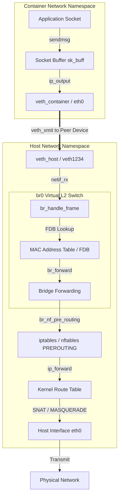
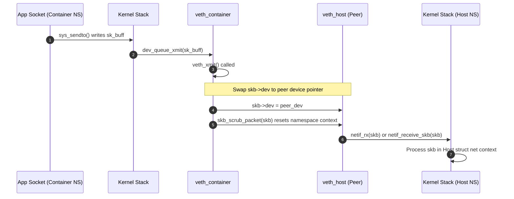
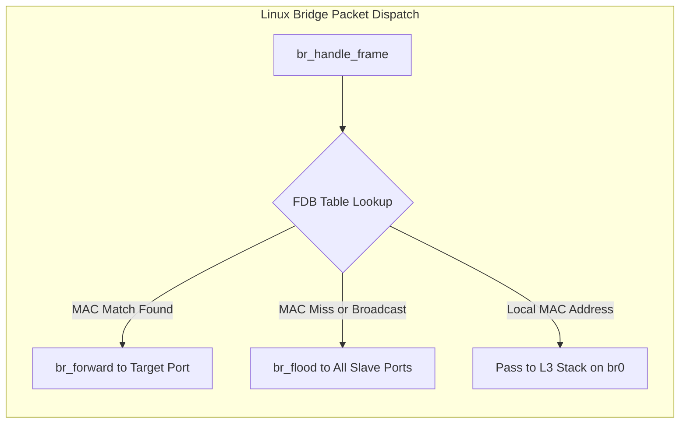

Isolating network stacks inside Linux without physical network interface cards requires a completely software-defined networking subsystem inside the kernel. Container engines and network virtualization platforms rely on a collection of kernel abstractions to route, switch, and filter packets between isolated processes and physical network interfaces. Understanding how these abstractions operate demands looking below user space utilities like `ip` or `brctl` directly into kernel memory allocation, function call graphs, and packet ring buffers.

Every packet in the Linux kernel is represented by a socket buffer structure named `sk_buff`. When network isolation enters the picture, the kernel must manipulate these `sk_buff` pointers as they travel across network namespace boundaries, traverse software L2 switches, and trigger netfilter hooks. We will examine the precise mechanisms that power virtual ethernet pairs, software bridges, network namespace socket lookups, and netfilter packet traversal.

### The Virtual Ethernet Driver Engine

A virtual ethernet device pair, or `veth` pair, functions as a bidirectional virtual wire operating at Layer 2. Creating a `veth` pair instantly allocates two linked network devices inside the kernel. Anything transmitted on one device is immediately received on its peer device.

At the driver level, `veth` does not manage DMA rings, physical hardware registers, or interrupt lines. Instead, it implements a minimal `net_device_ops` structure centered around its transmission entrypoint, `veth_xmit`. When an application inside a container sends data, the kernel networking stack routes the payload into a `sk_buff` and invokes `dev_queue_xmit` on the container-side virtual device.

Inside `veth_xmit`, the driver retrieves the pointer to the peer `net_device` from its private context structure (`struct veth_priv`). The driver then executes `skb_scrub_packet`. This critical step strips existing routing decision cache entries, secmark security contexts, and socket associations from the packet buffer. Without scrubbing, the packet would carry stale netfilter metadata and socket references from the originating namespace into the receiving namespace.

After scrubbing, `veth_xmit` reassigns the network device pointer inside the packet by updating `skb->dev` to point directly to the peer `net_device`. The driver then updates packet counters and enqueues the `sk_buff` into the receive path of the peer interface by calling `netif_rx` or `netif_receive_skb`. This operation effectively turns a transmission event on the source device directly into an ingress receive interrupt software vector (softirq) on the peer device.

### Network Namespaces and Socket Scope Isolation

Every system entity inside the Linux kernel that handles network state holds a pointer to a `struct net` instance. This includes socket structures, routing tables, network interface device lists, netfilter hook chains, neighbor tables, and sysctl configurations. The global system namespace is represented by `init_net`, while container processes exist within child `struct net` instances created via `unshare(CLONE_NEWNET)` or `clone(CLONE_NEWNET)`.

When `skb->dev` gets swapped inside `veth_xmit`, the packet's implicit network namespace changes instantly because every `net_device` holds a strict pointer (`dev_net(dev)`) to its owning `struct net`. When the softirq daemon processes the enqueued frame via `netif_receive_skb`, protocol handlers inspect the newly assigned `skb->dev` to determine which routing table and socket lookup hash table to query.

For IP transport protocols like TCP and UDP, the kernel executes socket lookups via `__inet_lookup_skb`. The lookup algorithm uses a 4-tuple hash combining source IP, source port, destination IP, and destination port. Crucially, the namespace pointer `struct net` is fed into the hash calculation and equality check. Even if two sockets in different container namespaces bind to `0.0.0.0:8080`, their containing `struct net` pointers differ. The kernel resolves socket matches unambiguously because namespace identity serves as a primary key component in the socket lookup table.

### Software Bridging Mechanics and L2 Forwarding

When multiple `veth` pairs connect multiple isolated namespaces, they need an L2 multiplexer to communicate. The Linux bridge module implements a virtual IEEE 802.1D standard ethernet bridge inside the kernel. A bridge device (`br0`) maintains a list of slave network interfaces registered as bridge ports.

When a `veth` host interface receives a packet from its container peer, `netif_receive_skb` processes the frame. During network interface initialization, bridge ports hook their rx handlers into the device structure by setting `dev->rx_handler = br_handle_frame`. When `netif_receive_skb` sees an active `rx_handler`, it diverts the packet execution flow straight into the bridge module before standard L3 IP processing can occur.

Inside `br_handle_frame`, the bridge updates its Forwarding Database (FDB). The bridge extracts the source MAC address from the ethernet header and inserts or updates an entry in an internal hash table mapping that MAC address to the ingress `net_bridge_port` pointer and a timestamp. This is classic MAC learning happening in software.

Next, the bridge determines where to send the packet by inspecting the destination MAC address. If the destination MAC is a multicast or broadcast address, or if no entry exists in the FDB hash table, the bridge floods the packet by calling `br_flood`. This duplicates and transmits the `sk_buff` across all active bridge slave ports except the ingress port. If a matching FDB entry is found, the bridge calls `br_forward`, which routes the `sk_buff` specifically to the target port's output queue via `dev_queue_xmit`.

If the destination MAC address matches the bridge interface's own MAC address, the packet is destined for the host machine itself. In this case, `br_handle_frame` clears the port association, sets `skb->dev` to the main bridge device `br0`, and returns `RX_HANDLER_PASS`. The main packet processing loop in `netif_receive_skb` then re-enters execution, passing the frame up into the host's L3 IPv4 or IPv6 protocol stack.

### Netfilter Traversal Across Bridged and Routed Paths

Netfilter hooks allow packet filtering, state tracking, and network address translation (NAT) inside the kernel. Netfilter executes at distinct evaluation points along the packet processing path. When software bridging interacts with netfilter, the execution flow depends heavily on whether the kernel module `br_netfilter` is loaded.

Without `br_netfilter`, bridged frames passing from one virtual port to another stay strictly within Layer 2. They pass through `ebtables` hooks but bypass `iptables` and `nftables` entirely. However, container orchestrators frequently load `br_netfilter` to enforce host-level firewall rules on bridged traffic.

When `br_netfilter` is active, it intercepts frames inside `br_handle_frame` and forces bridged L2 packets to pass through the IP-level `PREROUTING`, `FORWARD`, and `POSTROUTING` netfilter hooks. The kernel temporarily attaches fake routing entries to the `sk_buff` to allow `iptables` rules to inspect L3 and L4 headers before deciding whether to drop or forward the frame.

For container traffic accessing external networks, packets must undergo Routing and Network Address Translation (NAT). Tracing a container egress packet through this pipeline reveals the exact sequence of netfilter hooks:

The frame leaves the container through `veth_container`, entering host interface `veth_host`. The bridge rx handler `br_handle_frame` intercepts it. The destination MAC belongs to `br0` or an external gateway, so the frame enters the host Layer 3 stack.

The netfilter `NF_INET_PRE_ROUTING` hook fires. The `conntrack` system tracks the flow, and `iptables` or `nftables` PREROUTING chains execute. The kernel performs L3 route lookup (`ip_route_input_noref`). The route table indicates the destination IP is reachable via physical host interface `eth0`, marking the packet for forwarding.

The netfilter `NF_INET_FORWARD` hook fires. Rules evaluate whether traffic from the container subnet is permitted to transit to the host's external network. The netfilter `NF_INET_POST_ROUTING` hook fires. If a MASQUERADE or SNAT rule matches on `eth0`, the kernel replaces the container's private source IP address with the host's physical IP address. `conntrack` stores an entry mapping the mutated source port and IP so return packets can undergo inverse translation.

Finally, `dev_queue_xmit` pushes the translated frame down to the physical driver for interface `eth0`, which queues the packet into its hardware DMA ring buffer.

### Zero-Copy Packet Paths and Performance Bottlenecks

While software abstractions provide vast operational flexibility, they introduce measurable overhead compared to raw physical hardware execution. Every jump across a `veth` pair, bridge device, or netfilter chain adds CPU instruction cycles, memory pointer mutations, and cache line invalidations.

In a standard `veth` setup, memory allocations for `sk_buff` structures are recycled where possible, but context switches between softirq routines on different CPU cores can degrade cache locality. If the host stack is overwhelmed by packet processing, `netif_rx` drops frames when the CPU's per-core receive queue (`softnet_data->input_pkt_queue`) fills up.

To eliminate software bridge and netfilter overhead in high-throughput environments, modern architectures bypass the bridge layer entirely using eBPF and Express Data Path (XDP). By attaching an eBPF program directly to the driver receive queue of a `veth` device, developers can rewrite packet headers and execute redirect actions (`XDP_REDIRECT`) in a single step. This routes packets straight between container namespaces or physical interfaces without ever instantiating a bridge FDB lookup, allocating heavy netfilter tracking structures, or pushing packet buffers through the full L2/L3 kernel protocol stack.
