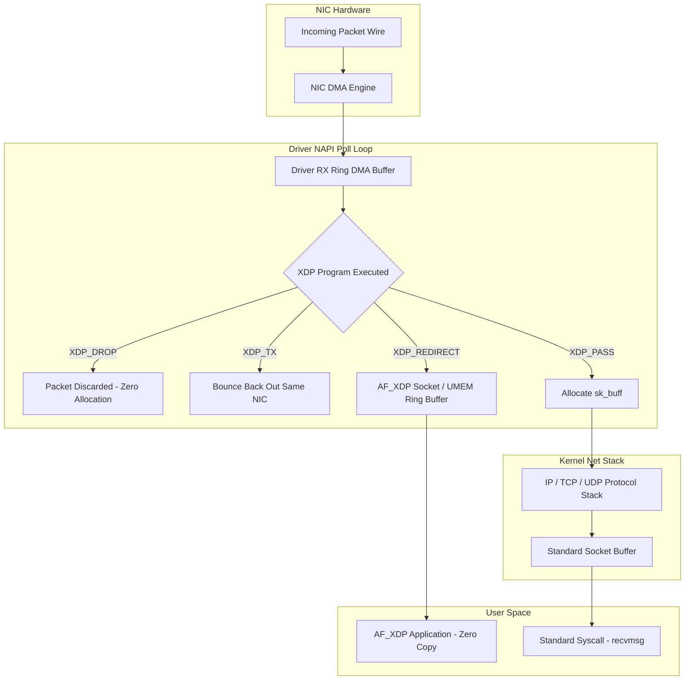
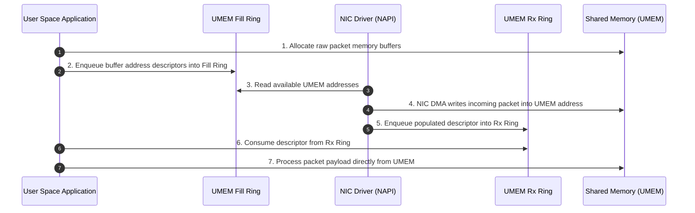

Traditional packet processing in Linux is exceptionally heavy. When a 100Gbps Ethernet card receives an incoming frame, the network interface card triggers a DMA write into host memory, raises an interrupt, and hands execution over to the kernel driver. The driver allocates a complex kernel data structure known as an sk_buff, fills out dozens of header metadata fields, and pushes it up through the NAPI polling loop into the core network stack. By the time that packet reaches a user space socket, it has crossed memory boundaries, triggered CPU cache thrashing, acquired spinlocks, and run through thousands of lines of IP protocol logic. At modern wire speeds of tens of millions of packets per second, the overhead of creating and tearing down sk_buff objects completely saturates CPU cores before your user application processes a single byte.

Data Plane Development Kit, or DPDK, attempted to fix this by bypassing the kernel completely. DPDK unbinds net devices from kernel drivers and hands full PCI access to a user space application running a poll-mode driver. While DPDK delivers extreme performance, it throws out every standard operating system tool. You lose iptables, nftables, standard socket APIs, container network isolation, and Linux kernel security primitives.

Linux eXpress Data Path, or XDP, solves this dilemma by enabling custom packet processing inside the Linux kernel driver path, right before the kernel allocates an sk_buff. Combined with AF_XDP sockets, XDP delivers zero-copy user space packet processing at DPDK speeds while maintaining full kernel interoperability.



To understand how XDP operates, we have to look closely at the driver level execution hook. Modern network drivers operate on RX ring buffers. The NIC writes DMA frames directly into pre-allocated physical memory chunks. In standard networking, the driver constructs an sk_buff structure, populates its pointer fields, and invokes netif_receive_skb.

With XDP enabled, the driver intercepts the frame long before sk_buff allocation. The driver wraps the raw DMA memory range in a lightweight xdp_buff structure and immediately invokes a pre-compiled eBPF program. The program runs directly in the NAPI context on the CPU core servicing the network interrupt. It receives direct memory pointers to the Ethernet packet header and packet end, letting it inspect headers or rewrite payloads in place within nanoseconds.

The verdict of an XDP eBPF program comes down to five precise kernel return codes. XDP_DROP immediately recycles the DMA buffer, dropping malicious traffic or SYN floods before allocating a single byte of kernel state. XDP_TX modifies the packet headers in place and instructs the driver DMA engine to push the packet back out the exact same interface it arrived on. XDP_PASS signals the driver that the eBPF program is done with its work and asks it to allocate an sk_buff, handing execution to the standard Linux TCP/IP stack. XDP_ABORTED indicates an internal eBPF error and drops the frame while firing a tracepoint. The fifth and most interesting return code is XDP_REDIRECT.

XDP_REDIRECT bypasses the local TCP/IP stack entirely and forwards the raw frame to another network interface, a veth pair inside a container namespace, or directly into a user space socket map called an XSKMAP. This map points to AF_XDP, the Address Family XDP socket interface.



AF_XDP relies on a unified memory area known as UMEM. UMEM is a continuous block of virtual memory allocated by a user space process using mmap, posix_memalign, or huge pages. The user application registers this memory range with the Linux kernel using the socket option setsockopt with SOL_XSK and XDP_UMEM_REG flags. UMEM is partitioned into fixed size frames, typically 2048 or 4096 bytes each.

Instead of copying packet bytes back and forth across kernel space and user space memory boundaries, AF_XDP transfers ownership of UMEM frame descriptors using four lock-free single-producer single-consumer ring buffers.

The four rings are divided into two distinct operating pairs. The RX side uses the Fill Ring and the RX Ring. The TX side uses the TX Ring and the Completion Ring.

The Fill Ring passes empty UMEM frame descriptors from user space down to the kernel driver. Before any traffic arrives, the user application writes the virtual memory offsets of empty UMEM frames into the Fill Ring. When the network card receives an incoming frame, the driver pops a UMEM frame descriptor off the Fill Ring and configures its DMA engine to write the payload directly into that UMEM memory region.

Once the DMA write completes, the driver populates a descriptor in the RX Ring. This descriptor contains the UMEM frame offset, the exact byte length of the received frame, and packet flags. The user application polls or receives a wakeup notification on the AF_XDP socket, reads the RX Ring descriptor, and instantly accesses the frame payload inside its own UMEM memory block without a single memcpy taking place.

The TX process works in reverse. When the user application wants to transmit a packet, it constructs the Ethernet frame directly inside an available UMEM frame. It enqueues a descriptor containing the memory offset and packet length onto the TX Ring and executes a sendto system call or uses kernel interrupt triggering. The driver reads the TX Ring, programs its NIC transmit DMA engine, and sends the frame out over the wire. When the transmission finishes, the driver enqueues the freed frame offset onto the Completion Ring. The user application reads the Completion Ring to reclaim ownership of the UMEM frame and re-use it for subsequent reads or writes.

```
       +-------------------------------------------------------+
       |               User Space Application                  |
       |                                                       |
       |  +-------------------------------------------------+  |
       |  |  Shared UMEM Memory Chunk (Hugepages / Mmap)   |  |
       |  |  [ Frame 0 ]  [ Frame 1 ]  [ Frame 2 ]  ...     |  |
       |  +-------------------------------------------------+  |
       +-------|-------------------|-------------------|-------+
               |                   |                   |
               v                   v                   ^
        +--------------+    +--------------+    +--------------+
        |  Fill Ring   |    |   RX Ring    |    | Completion R |
        | (User->Kern) |    | (Kern->User) |    | (Kern->User) |
        +--------------+    +--------------+    +--------------+
               |                   ^                   ^
               |                   |                   |
       +-------|-------------------|-------------------|-------+
       |       v                   |                   |       |
       |  +-------------------------------------------------+  |
       |  |  NIC Driver NAPI Context / DMA Engine           |  |
       |  +-------------------------------------------------+  |
       |               Kernel Space Interface                  |
       +-------------------------------------------------------+
```

The synchronization mechanics between the kernel driver thread and the user space application rely on lock-free single-producer single-consumer ring design patterns. Every ring descriptor consists of memory offset addresses and dynamic head and tail atomic pointers. The producer owns and writes to the tail pointer, while the consumer owns and reads from the head pointer. Memory barrier primitives ensure memory writes to the underlying ring arrays become visible before updating the head or tail offsets. This architecture completely removes spinlocks from the packet processing path.

Because the kernel driver and the user application share the same UMEM region, kernel page tables do not need to be modified on every frame. Pages are pinned in physical RAM when the socket is bound. This zero-copy mode requires driver-level native support for AF_XDP. Drivers like ixgbe, i40e, ice, and mlx5 implement native XDP hooks natively within their NAPI poll routine.

For drivers that lack native XDP support, the Linux kernel provides Generic XDP. Generic XDP executes eBPF programs higher up the stack, after the driver allocates an sk_buff. Generic XDP does not offer zero-copy benefits or the extreme throughput of native driver XDP, but it allows developers to test XDP logic on any network interface without driver modification.

Here is a look at how an eBPF program inspects packet headers and redirects traffic to an AF_XDP socket map in C:

```c
#include <linux/bpf.h>
#include <bpf/bpf_helpers.h>
#include <linux/if_ether.h>
#include <linux/ip.h>

struct {
    __uint(type, BPF_MAP_TYPE_XSKMAP);
    __uint(max_entries, 64);
    __type(key, int);
    __type(value, int);
} xsks_map SEC(".maps");

SEC("xdp")
int xdp_sock_prog(struct xdp_buff *ctx) {
    void *data = (void *)(long)ctx->data;
    void *data_end = (void *)(long)ctx->data_end;

    struct ethhdr *eth = data;
    if ((void *)(eth + 1) > data_end) {
        return XDP_PASS;
    }

    if (eth->h_proto == __builtin_bswap16(ETH_P_IP)) {
        struct iphdr *iph = (void *)(eth + 1);
        if ((void *)(iph + 1) > data_end) {
            return XDP_PASS;
        }

        if (iph->protocol == IPPROTO_UDP) {
            return bpf_redirect_map(&xsks_map, ctx->rxq->queue_index, XDP_PASS);
        }
    }

    return XDP_PASS;
}

char _license[] SEC("license") = "GPL";
```

Notice the pointer arithmetic safety check in the code snippet. The eBPF kernel verifier strictly demands that every access to raw packet memory must be bounded by checking data + sizeof(header) <= data_end. If you attempt to dereference IP or UDP fields without performing this pointer boundary validation, the kernel verifier rejects the eBPF program instantly during load time.

XDP and AF_XDP alter high-throughput Linux network engineering. By shifting packet filtering down to the driver level and removing sk_buff overhead, system engineers can handle tens of millions of packets per second per CPU core. When combined with AF_XDP UMEM zero-copy rings, user applications process network traffic directly out of RAM at hardware speeds while keeping standard kernel routing and control plane features within reach.
