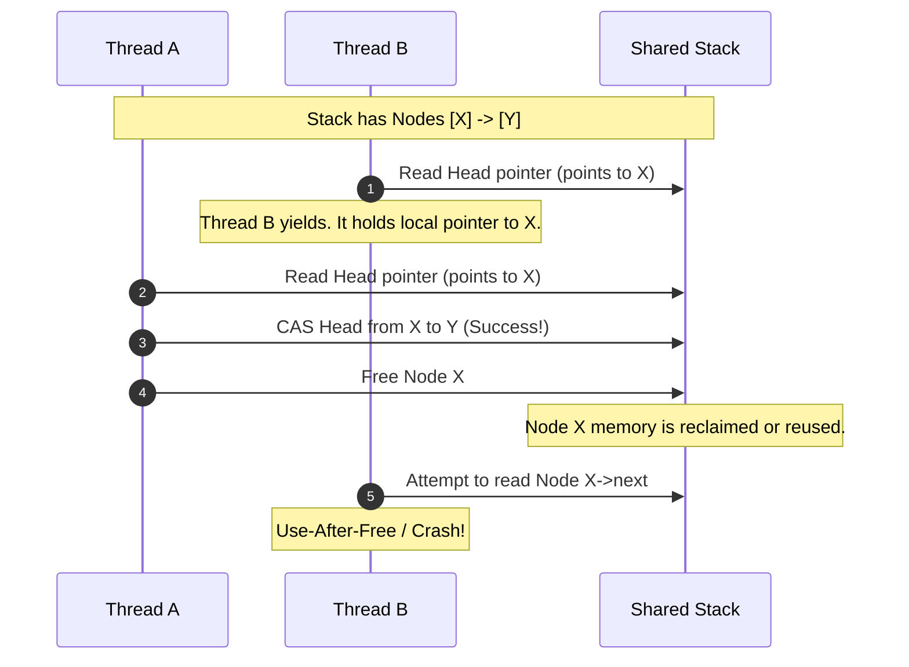
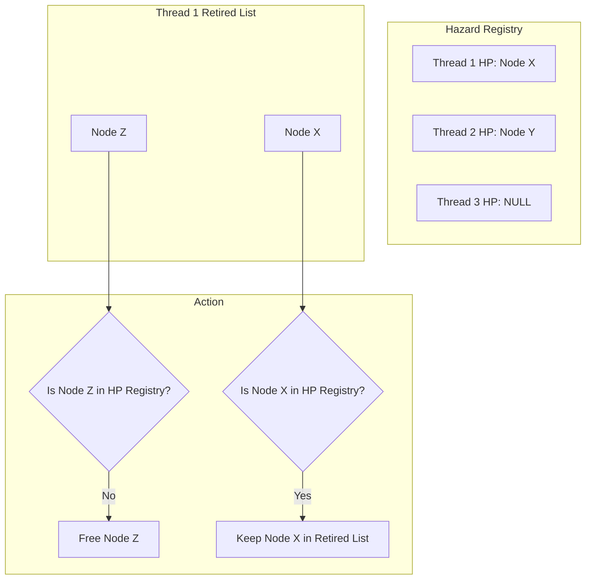
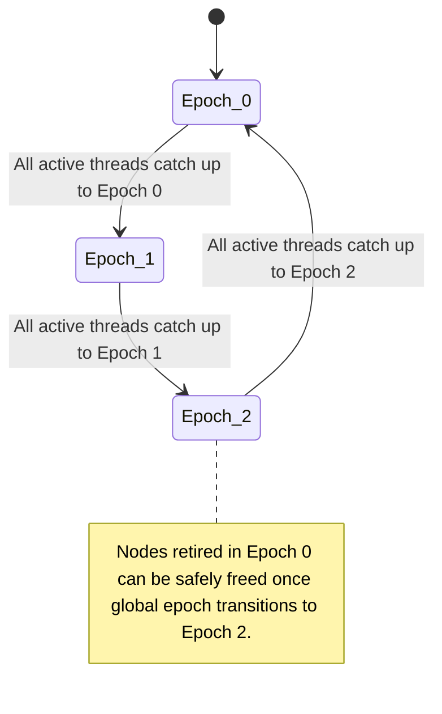

Writing concurrent, lock-free code is notoriously difficult. If you have ever tried to implement a lock-free queue or stack using atomic compare-and-swap primitives, you quickly run into a silent, catastrophic bug. You can perform thread-safe atomic updates on a pointer, but safely freeing the memory of a node that you just unlinked from your list is an entirely different challenge. If Thread A unlinks a node while Thread B is still reading its payload, freeing that memory immediately triggers a use-after-free vulnerability or a segmentation fault. If you do not free it, you have a memory leak.

This is the core challenge of concurrent safe memory reclamation. In a managed environment like the Go or .NET runtime, the garbage collector acts as a heavy-handed shield, tracing the entire heap to clean up unreferenced memory. But in performance-critical systems, wait-free algorithms, or runtimes where you cannot afford the pause times of a tracing garbage collector, you need a deterministic, lock-free reclamation scheme. Two primary methodologies dominate this space, Hazard Pointers and Epoch-Based Reclamation.

### The Memory Reclamation Trap

To understand why memory reclamation in lock-free code is a nightmare, consider a simple lock-free stack. When a thread pops an item, it reads the head pointer, finds the next node, and attempts to execute a compare-and-swap to point the head to the next node. If the swap succeeds, the popped node is unlinked. In a single-threaded world, you would call free or delete immediately. In a multi-threaded world, another thread might have read that same head pointer just a microsecond earlier. That second thread is about to read the node's internal value or try its own compare-and-swap. If you free that memory, the second thread accesses garbage data or dereferences a wild pointer.

This is often paired with the classic ABA problem. If the unlinked node is immediately freed and then reallocated at the exact same memory address, a concurrent thread might assume the stack structure has not changed because the pointer address matches, corrupting the entire structure. 



### Hazard Pointers: Fine-Grained, Pessimistic Tracking

Hazard Pointers solve this by forcing reading threads to advertise their intent. This technique assigns a small set of global pointers, called hazard pointers, to each participating thread. Before a thread dereferences any shared pointer, it writes the address of the target node to its assigned hazard pointer. Once written, the thread must verify that the node is still active in the data structure. If the node is still active, the hazard pointer acts as a visible shield.

When a writing thread unlinks a node from the shared structure, it does not free the node immediately. It places the node into a thread-private retired list. Periodically, the thread scans its retired list and compares each node address against the global array of active hazard pointers. If a retired node address matches any active hazard pointer, it must remain in the retired list. If no thread is currently shielding that node, the writer can safely reclaim the memory.



To make this work safely, you cannot simply write to the hazard pointer and immediately read the data. There is a memory ordering trap here. The writing of the hazard pointer must be globally visible before you verify that the node has not been unlinked. This requires a full memory barrier or sequentially consistent ordering on modern CPUs. 

```cpp
void* read_hazard_pointer(void* volatile& shared_ptr, void*& hazard_slot) {
    void* ptr = shared_ptr;
    while (true) {
        hazard_slot = ptr;
        // A full memory barrier is mandatory here to prevent CPU reordering
        std::atomic_thread_fence(std::memory_order_seq_cst);
        void* double_check = shared_ptr;
        if (ptr == double_check) {
            break;
        }
        ptr = double_check;
    }
    return ptr;
}
```

On x86, this fence translates to an expensive lock-prefixed instruction or an mfence instruction. On ARM, it requires a full data memory barrier. This barrier is executed on every single read path, which severely dampens read throughput in read-heavy lock-free systems.

### Epoch-Based Reclamation: Coarse-Grained, Optimistic Tracking

If hazard pointers are too slow due to frequent memory barriers on the read path, Epoch-Based Reclamation, or EBR, offers a high-performance alternative. EBR shifts the cost from a fine-grained, per-node tracking mechanism to a coarse-grained, global epoch tracking mechanism.

In EBR, the lifetime of the application is divided into logical eras or epochs. The system tracks a single global epoch counter, which typically advances from zero to one to two, and then wraps back to zero. Each thread also maintains its own local epoch state. A thread can be in an inactive state, or it can enter an active state by copying the current global epoch into its local state.

When a thread wants to read or traverse a lock-free structure, it marks itself as active in the current epoch. It can then traverse any number of nodes without writing a single hazard pointer or executing a single read-side memory barrier. It only needs to ensure that it does not yield or block while active.

When a writer unlinks a node, it places the node into a retirement queue tied to the current global epoch. The writer then attempts to advance the global epoch. The global epoch can only advance if all active threads have caught up to the current epoch.



Suppose the global epoch is zero. Thread A becomes active, reading the global epoch as zero. It begins traversing a linked list. Thread B unlinks Node X. Since the current epoch is zero, Thread B retires Node X into the retirement queue for Epoch 0.

To reclaim memory, Thread B checks the local epochs of all active threads. If some threads are still active in Epoch 0, the global epoch cannot advance, and Node X remains in the queue. Once all threads have either become inactive or updated their local epochs to Epoch 1, the global epoch advances to Epoch 1. At this stage, new threads entering the active state will read Epoch 1. They cannot possibly reach Node X because it was already unlinked before they entered Epoch 1.

When the global epoch advances to Epoch 2, we are absolutely certain that every single thread active in Epoch 0 has completed its operations. Any thread active now must be in Epoch 1 or Epoch 2. Therefore, any nodes retired in Epoch 0 can be safely freed. This three-generation retirement scheme provides a bulletproof guarantee with minimal overhead.

### Evaluating the Tradeoffs: Memory Footprint vs. CPU Cycles

Choosing between Hazard Pointers and EBR is a direct trade-off between performance and memory safety guarantees. 

EBR is fast. The read path only requires updating a local epoch variable and a single compiler barrier to prevent instruction reordering. There are no expensive hardware memory barriers on the read path. However, EBR has a critical vulnerability. It is cooperative. If a single thread enters an active epoch and then goes to sleep, encounters page faults, or gets descheduled by the operating system, the global epoch is blocked. It cannot advance. Meanwhile, other threads continue to run, unlinking nodes and piling them up in retirement queues. This can lead to unbounded memory growth, potentially triggering an Out-Of-Memory killer event if a single thread stalls.

Hazard pointers do not suffer from this progressive paralysis. If a thread stalls while holding a hazard pointer to Node X, only Node X is blocked from reclamation. Other threads can continue to unlink nodes, retire them, and free them, because the stalled thread only protects the specific nodes it has actively flagged. The memory footprint of a hazard-pointer-based system is strictly bounded by the number of active hazard pointers, which scales with the number of threads rather than time.

Before choosing an architecture, you must weigh these trade-offs. Hazard pointers excel in environments where you cannot trust threads to run without interruption, such as user-space applications with arbitrary thread scheduling. EBR is the ideal match for kernel development or managed runtimes where thread scheduling is tightly controlled and latency spikes must be kept to an absolute minimum.

### Advanced Reclamation: Quiescent State Reclamation (QSBR)

To push performance even further, systems engineers often look at Quiescent State-Based Reclamation, or QSBR. While EBR requires threads to explicitly mark when they enter and exit an active state, QSBR flips the model. It assumes threads are always active unless they pass through a quiescent state.

A quiescent state is an execution point where a thread holds no references to shared lock-free structures. This occurs during a context switch, a yield, or the start of a new loop iteration in an event loop. QSBR has even less overhead than EBR, as readers do not perform any work when accessing shared data. They only publish their quiescent states periodically. This makes QSBR the engine of choice for extremely high-throughput systems like the Userspace RCU library or certain custom database storage engines, though it requires rigorous discipline, as failing to declare a quiescent state will block memory reclamation forever.
