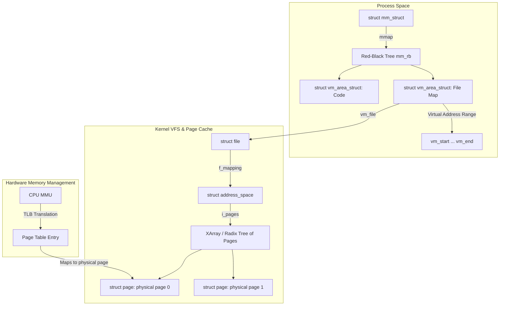

Traditional file I/O operations rely on an explicit handoff between user-space buffers and the kernel page cache. When you call standard read or write APIs, you force the operating system to perform context switches and initiate memory copies across the user-kernel boundary. The storage controller performs a direct memory access transfer into kernel space, and then the CPU must copy those bytes into your application buffer. For systems demanding high throughput, this double buffering is a massive tax on performance.

The memory map system call bypasses this boundary by mapping file contents directly into the virtual address space of a process. This lets you access disk files using raw pointer dereferences, treating files on disk as if they were giant arrays in RAM. This mechanism relies on close coordination between the operating system virtual memory subsystem, the hardware memory management unit, and the file system page cache.

To understand the low-level lifecycle, consider what occurs when a process invokes the mmap system call. The kernel first validates the requested mapping length and offsets, then searches the virtual address space of the process to find an available range of addresses that matches the request. Once a suitable range is found, the kernel allocates a new virtual memory area descriptor, represented by the vm_area_struct type. It inserts this descriptor into the process's memory map structure, linking it to both a doubly-linked list of VMAs and a red-black tree designed for fast lookups. The kernel also increments the reference count of the target file descriptor and associates the VMA with the file's address space. At this point, absolutely no file data has been loaded into RAM. The call returns successfully, handing back the starting virtual address.

When the application first attempts to read a byte from this returned address, the CPU's memory management unit attempts to translate the virtual address into a physical frame address. Because the page table entries for this new mapping are completely empty, the MMU fails the translation. This triggers a page fault exception, which is vector fourteen in x86-64 architectures. The CPU immediately switches to kernel mode, saves the instruction pointer, and writes the faulting virtual address into the control register two.

The kernel's low-level page fault handler takes control and identifies the faulting address. It executes a lookup in the red-black tree of the process's memory map to find the matching virtual memory area. Finding a file-backed mapping, it delegates the resolution to the specific page fault method of the file system, which is typically mapped to the filemap_fault function inside the kernel.

This function queries the page cache of the file, which is structured as an XArray. If another process has already read this section of the file, the page cache will already contain the physical page. The kernel can immediately map this physical page into the faulting process's page table. If the page cache suffers a miss, the kernel allocates a physical page, inserts it into the XArray, and dispatches a block I/O request to the underlying storage device. The faulting thread is placed in an uninterruptible sleep state until the storage controller completes the direct memory access transfer into that physical page. Once the disk transfer completes and the interrupt handler wakes the thread, the page table entry is finally populated with the physical page frame address and the proper access permissions.

For write operations, memory mapping behaves differently depending on whether the mapping was established with shared or private flags. If the mapping is shared, writes are directly visible to other processes mapping the same file. When a thread writes to a shared virtual address, the hardware MMU marks the page dirty in its page table entry. The operating system does not write this data to disk immediately. Instead, background flusher threads periodically scan the system's active page cache listings, identify dirty physical pages, and schedule writeback block operations to persist the changes. If the application requires guarantee of immediate persistence, it must call the msync system call, which forces a synchronous flush of the specified address range down to the storage controller.

Under private mappings, the kernel employs copy-on-write semantics. When a write occurs, the MMU detects that the page table entry is marked as read-only despite the VMA allowing write operations. This triggers a page fault. The handler realizes this is a private mapping, allocates a brand new physical page, copies the contents of the original page cache page into this new frame, and points the process's page table entry to the private copy with write permissions enabled. The write goes to this isolated copy, and the original file on disk remains unchanged.

Storage engines face a stark choice when deciding whether to utilize memory-mapped files. Proponents of memory mapping point out that it dramatically simplifies codebases by delegating caching, page evictions, and read-ahead operations to the operating system kernel. Systems like LMDB take advantage of this to deliver blistering read speeds with almost zero boilerplate. The process simply treats the database as a giant array of bytes on the heap. However, delegating this control comes with severe trade-offs that make many database architects recoil.

The first critical issue is the complete loss of eviction control. Since the operating system handles page reclaiming, it makes eviction decisions based on a generic page-replacement algorithm, usually a variant of Least Recently Used. The database has domain-specific knowledge of which pages are most valuable, such as index root nodes, but cannot easily signal this to the kernel page eviction daemon. A massive sequential table scan can easily sweep hot index pages out of physical memory, resulting in terrible performance.

The second issue is the cost of TLB shootdowns in highly concurrent environments. When the operating system needs to reclaim mapped pages or write back dirty pages, it must modify the page tables of the process. In a multi-threaded database, any change to the page table mappings requires invalidating the Translation Lookaside Buffers of every CPU core that might be caching those mappings. The kernel triggers this invalidation by sending Inter-Processor Interrupts to other cores, forcing them to halt execution and flush their TLBs. Under intensive write workloads, these TLB shootdowns introduce massive execution bubbles, causing scaling to drop off a cliff. This is why engines like Postgres build their own custom buffer pools in user space using standard file system APIs or direct I/O, sacrificing the elegance of zero-copy to maintain absolute control over memory topology.
