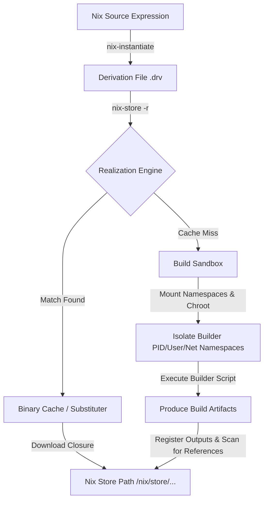

Most operating systems treat package management as an exercise in mutability. You run an installer, it unpacks files into shared directories like /usr/bin and /usr/lib, and you pray that the new dynamic library does not break three other applications that rely on an older version of the same dependency. We call this dependency hell. It is an architectural failure born from a mutable, global filesystem state. Nix solves this by completely tossing out the traditional file hierarchy standard. It treats packaging as a pure, mathematical function. Every package is an immutable value stored in an isolated, cryptographically hashed directory.

### The Hash Path Generation Pipeline

To understand the Nix store, we have to look at how it derives the unique paths inside /nix/store. Each path looks something like `/nix/store/s8vmxp68p6l37hw9v93df1vqyf61ky9a-openssl-1.1.1u`. This hash is not merely a hash of the package binaries. Instead, in the standard input-addressed model, it is a SHA-256 hash computed over the derivation's complete recipe. This recipe includes the source code, the compilation scripts, the environment variables, the compiler toolchain, and every single dependency. If you change a single compiler flag or modify a comment in a base utility, the hash of the recipe changes, cascading down to produce a totally separate store path.

Nix uses a custom base32 encoding to represent these hashes in the filesystem. The characters e, o, u, and z are deliberately excluded from this alphabet to avoid generating offensive words and to prevent transcription errors between similarly looking characters like 0 and o. The resulting 32-character string represents the precise configuration identity of that exact build. 



### Derivation Files and ATerm Serialization

The bridge between the elegant, functional Nix language and the raw filesystem is the derivation file. These are files ending in .drv that live inside the Nix store. When you run nix-instantiate on a Nix expression, the interpreter processes the high-level code and emits a low-level, language-independent serialization format based on ATerm. ATerm stands for Annotated Terms, which is a specification designed for representing trees of structured data.

This format is incredibly raw and simple. A typical .drv file contains a list of outputs, a list of input derivations, a list of raw input files, the target system platform, the builder executable path, the arguments to pass to the builder, and the exact list of environment variables. The file contains no high-level loops or conditional logic. It is a static, declarative definition of a single build step. We can look at a simplified representation of an ATerm derivation to understand how it maps inputs to outputs:

`Derive([("out","/nix/store/s8vmxp...-openssl-1.1.1u","","")], [("/nix/store/gl3shx...-glibc.drv",["out"])], [], "x86_64-linux", "/nix/store/6813pf...-bash/bin/bash", ["-e", "/nix/store/m6v81s...-builder.sh"], [("PATH","/nix/store/6813pf...-bash/bin"),("out","/nix/store/s8vmxp...-openssl-1.1.1u")])`

This string representation is entirely deterministic. Because it contains the hashes of input derivations, it constructs a directed acyclic graph of builds. If you request the realization of a derivation, Nix first recursively realizes all input derivations listed in the second list, ensuring every dependency is present in the store before the builder starts.

### Sandboxed Builds via Linux Namespaces

Once the derivation is generated, the Nix daemon must execute it. If a build script can read files from the host's /etc or hit the public internet during compilation, it is not reproducible. A build that succeeds on your machine might fail on mine because of a hidden system configuration. To prevent this, Nix executes the builder script inside an aggressive kernel sandbox.

When a build begins, the Nix daemon forks the builder process and invokes the `clone` system call with several namespace flags. It implements this isolation by leveraging user, pid, network, mount, and uts namespaces. Under the hood, this means the builder is given a completely fresh view of the system. 

```text
+-------------------------------------------------------------+
| Host System File System                                     |
|   /usr/bin, /lib, /etc, /var, /home, /sys, /proc            |
|                                                             |
|  +-------------------------------------------------------+  |
|  | Nix Build Sandbox (Isolated Mount Namespace & Chroot) |  |
|  |                                                       |  |
|  |   / (Sterile Root Directory)                          |  |
|  |   ├── tmp/                   <-- Writable Scratch     |  |
|  |   ├── proc/                  <-- Isolated view        |  |
|  |   └── nix/store/             <-- Read-only Bind Mount |  |
|  |       ├── ...-glibc-2.37     <-- Explicit Dependency  |  |
|  |       ├── ...-gcc-12.2.0     <-- Explicit Dependency  |  |
|  |       └── ...-openssl-out/   <-- Writable Build Target|  |
|  |                                                       |  |
|  +-------------------------------------------------------+  |
+-------------------------------------------------------------+
```

Using the mount namespace, the daemon pivots the root directory of the builder into a sterile filesystem layout. The only directories visible are a temporary scratch directory, an isolated virtual proc directory, and the read-only bind-mounted /nix/store. Filesystem components like /usr/bin, /lib, or /etc simply do not exist in the builder's universe. The network namespace is unrouted, meaning the builder cannot access the internet. This prevents the build from downloading dependencies silently. If a builder needs to fetch resources, it must use a special fixed-output derivation where the cryptographic hash of the resulting download is declared upfront. Nix allows network access only for these specific derivations, validating that the downloaded data matches the declared hash before registering it.

Furthermore, the user namespace maps the builder's process to a dedicated, throwaway build user. This strips the builder of root privileges, preventing any system-level mutations. Once the build completes, the temporary build directory is wiped, and the output path is mounted read-only inside the nix store. This absolute isolation guarantees that if the build succeeds on the build cluster, it will yield the exact same byte-for-byte binary on your local machine.

### Runtime Dependency Detection via Reference Scanning

When the builder completes its execution, its output is frozen in its designated path in the Nix store. But a major architectural problem remains. How does Nix know which of the build-time dependencies are actually required at runtime? If you compile a C program using GCC, you need GCC to compile it, but you do not need GCC to run it. However, you do need glibc. In traditional package management, package maintainers must write metadata files declaring these runtime dependencies. This process is highly prone to human error, leading to missing runtime libraries or bloated distribution sizes.

Nix solves this with a brute-force approach. Because every store path has a globally unique, cryptographically secure 32-character hash, the Nix daemon simply scans every byte of the generated output files for these hash strings. It looks for the hashes of all build-time inputs inside the compiled binaries, the shell scripts, and the libraries. If the hash of glibc is found in the elf headers of your compiled binary, Nix registers glibc as a runtime dependency. If the hash of GCC is nowhere to be found, GCC is discarded from the package's runtime closure.

This system is simple, reliable, and completely eliminates undeclared dependencies. A package cannot reference a dependency without referencing its unique path inside the binary. If it contains the path, the scanner catches it. If it does not contain the path, the application cannot locate the dependency anyway, so it cannot be a runtime dependency. This scan makes runtime closures perfectly minimal and completely automatic.

### Content-Addressed Nix and Cutting Off Rebuild Chains

In the traditional input-addressed model, if you modify a comment in a core package like glibc, its derivation hash changes. Consequently, the hash of every downstream package that depends on it also changes, triggering an absolute rebuild of the entire system. Even if the compiled glibc binary is byte-for-byte identical to the previous version, input-addressed Nix must rebuild everything because the build-time path names changed.

This is where content-addressed Nix changes the model. Instead of deriving the store path solely from the inputs, content-addressed Nix builds the package in a temporary sandbox directory first. Once the build completes, the daemon calculates the cryptographic hash of the actual files produced. It then moves the output to a store path derived from this output hash. 

If the resulting files are identical to an existing version, Nix simply discards the new build and symlinks or aliases the path. If you make a harmless comment change in a base library, the compiler produces the exact same assembly. Content-addressed Nix detects this identical output, uses the same store path, and immediately halts the cascading rebuild chain. This brings immense efficiency gains to large development pipelines and continuous integration systems by leveraging content-addressable storage ideas to optimize build execution graphs.
