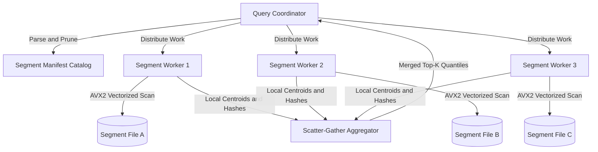
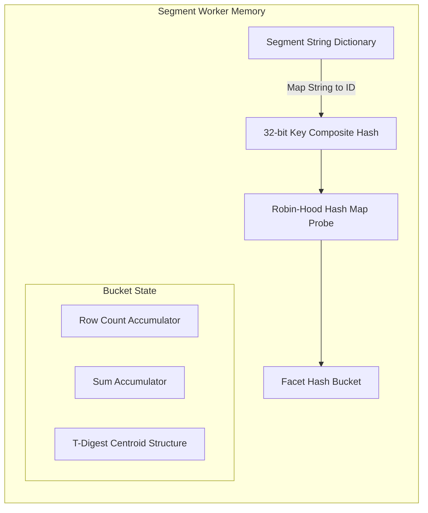

Executing high-concurrency telemetry queries across trillions of events in fractions of a second requires a fundamentally different query execution architecture than traditional transactional database systems. Languages like NRQL allow engineers to query raw transaction events, logs, and custom metrics with dynamic group-by operations across unindexed, arbitrary key-value metadata. When running a query requesting the ninety-ninth percentile of transaction durations grouped by microservice name, container ID, and deployment hash over the past six hours, the engine cannot rely on pre-computed B-Tree indexes or strict relational schemas. The storage layout, parallel query planner, dynamic hashing routines, and statistical approximation algorithms must cooperate to process terabytes of data within tight real-time constraints.

At the foundation of this speed is an architecture split into coordinator nodes, fan-out scatter-gather workers, and immutable columnar storage segments. Telemetry data arriving at the ingestion gateway is batched into immutable segment files. Each segment file covers a distinct slice of time and contains columnar blocks grouped by attribute keys. When a coordinator node receives an incoming query, it parses the statement into an abstract syntax tree and evaluates temporal filters against the global storage catalog. The catalog maintains index bounds for each segment file, allowing the coordinator to eliminate segments outside the target time window before distributing execution tasks across hundreds of parallel query workers.

Segment workers execute SIMD-vectorized scans directly against memory-mapped columnar data blocks. Standard row-oriented databases require materializing entire records into memory before evaluating conditions, causing severe CPU cache pollution and memory bandwidth saturation. The telemetry query engine reads only the specific physical byte streams required by the SELECT clause, WHERE predicates, and FACET attributes. Float arrays representing measurement metrics are scanned using 256-bit AVX2 vector instructions, applying filter conditions across eight 32-bit floating point numbers simultaneously in a single CPU cycle. If a row filter targets high cardinality string tags, the worker evaluates dictionary-encoded bit vectors to skip non-matching value blocks entirely without parsing raw strings.

Dynamic faceting presents a severe challenge because users frequently group data by keys that were created seconds prior without explicit index creation. In standard SQL engines, grouping operations rely on static type definitions and known table structures. In contrast, the telemetry execution engine constructs low-overhead hash maps on the fly inside worker threads during the segment scanning pass. To prevent memory allocation bottlenecks caused by heap allocations for arbitrary string keys, segment files store dictionary mappings that convert incoming key strings to compact 32-bit integer identifiers. Thread-local robin-hood hash maps use these 32-bit identifiers as key hashes, avoiding raw string copies during the inner execution loop.

Each dynamic hash table bucket maintains running metric aggregators alongside probabilistic sketch data structures. Computing exact mathematical percentiles over massive distributed streams requires storing every observed sample in memory and sorting the entire dataset prior to quantile extraction. Doing this across millions of dynamically grouped dynamic keys would consume gigabytes of memory per query worker and stall execution threads. The engine resolves this by embedding T-Digest sketch structures directly into each facet bucket.

The T-Digest algorithm estimates percentiles by grouping numeric values into a sequence of continuous centroids. Each centroid stores a mean value and an associated weight representing the count of data points assigned to that region. As the segment worker scans duration arrays, incoming scalar values are matched to nearby existing centroids. If adding a point to a centroid keeps its size below a strict mathematical threshold governed by a user-configured compression factor, the centroid absorbs the point by adjusting its mean and incrementing its weight. Near extreme boundaries like the p99 or p99.9 quantiles, the maximum allowed size of centroids shrinks dramatically, maintaining sub-percent error rates precisely where telemetry monitoring requires high accuracy.

Parallel reduction of sketch structures across worker nodes forms the final phase of query execution. Once segment workers complete scanning their assigned blocks, they emit their localized robin-hood hash tables and T-Digest centroid arrays to intermediate scatter-gather aggregation nodes. These aggregator nodes execute parallel merge passes. Merging two T-Digest sketches requires extracting centroids from all incoming worker streams, sorting them by mean value, and performing a single linear sweep to recombine adjacent clusters while respecting centroid size constraints. Because T-Digest state is associative and commutative, intermediate aggregators can merge thousands of partial worker results in parallel across a balanced reduction tree.

Handling dynamic top-K limits efficiently prevents network saturation when querying high-cardinality attributes like IP addresses or user IDs. A query demanding the top ten application endpoints sorted by total transaction count across billions of events cannot transmit millions of un-grouped hash buckets from workers to the root node. Workers enforce local min-heap bounds during segment scans, dropping low-frequency facet keys when local memory thresholds are reached. To guarantee mathematical accuracy for items near the cutoff boundary, workers compute error bounds for dropped keys, ensuring the intermediate scatter-gather nodes can accurately synthesize global top-K results without missing high-frequency heavy hitters.
