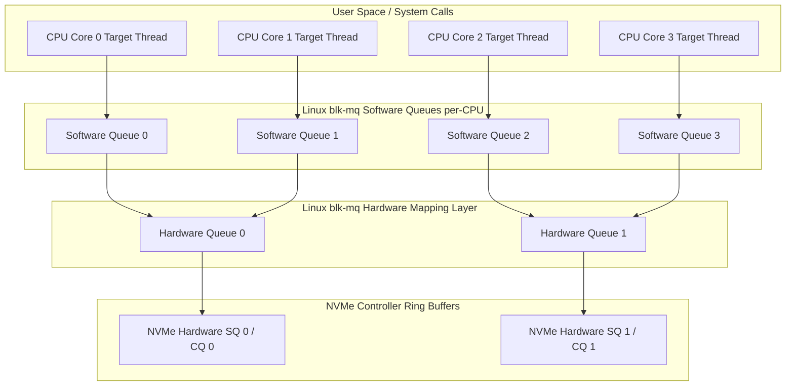

SATA and the AHCI interface were engineered in an era when storage meant spinning magnetic platters. AHCI gave us a single command queue capable of holding 32 requests, protected by a global host adapter lock. That design made total sense when seeking a read head across physical disks took ten milliseconds. Once non-volatile flash storage arrived, that software abstraction became a massive bottleneck. Solid state drives can execute thousands of operations concurrently across dozens of internal NAND channels, making serial hardware interfaces and coarse kernel locks unusable for high-throughput I/O.

NVM Express was designed ground-up to eliminate the CPU-to-storage synchronization bottleck. Instead of masking storage behind a legacy disk controller, NVMe attaches directly to the PCIe bus and exposes up to 64,000 queues, each capable of holding 64,000 commands. More importantly, the memory layout of these queues relies on circular ring buffers allocated directly inside host main memory (RAM), not on the SSD hardware itself. The host kernel writes commands into its own memory, pokes a register over PCIe to signal work, and lets the controller extract data asynchronously using Direct Memory Access. 

Understanding how NVMe transfers data requires looking past filesystem abstractions down to physical memory addresses, PCIe BAR mappings, scatter-gather DMA descriptor lists, and kernel multi-queue block layer scheduling.

### Circular Rings in Host Memory

An NVMe controller operates via pairs of queues: a Submission Queue where the host driver writes commands, and a Completion Queue where the controller posts execution status. Host memory houses these ring buffers. When a machine boots up and initializes the NVMe driver, the kernel allocates contiguous physical memory pages for these queues and writes their base physical memory addresses directly into the controller PCI BAR (Base Address Register) registers.

```mermaid
graph TD
    subgraph Host RAM
        SQ[Submission Queue Ring Buffer]
        CQ[Completion Queue Ring Buffer]
        DataBuf[Host Data Buffer]
        PRP[PRP List Page]
    end

    subgraph NVMe SSD Controller
        FetchEngine[Command Fetch Engine]
        ExecEngine[Flash Controller / NAND Interface]
        StatusEngine[Completion Engine]
        BAR[PCIe BAR Register Map]
    end

    SQ -- 1. Driver Writes 64B Command --> SQ
    Host RAM -- 2. PCIe MMIO Write Doorbell --> BAR
    BAR -- 3. Trigger DMA Read --> FetchEngine
    FetchEngine -- 4. Fetch Command via DMA --> SQ
    FetchEngine --> ExecEngine
    ExecEngine -- 5. DMA Read/Write Data Payload --> DataBuf
    ExecEngine --> StatusEngine
    StatusEngine -- 6. DMA Write 16B Status --> CQ
    StatusEngine -- 7. Fire MSI-X Interrupt --> Host RAM
```

Every Submission Queue entry is fixed at exactly 64 bytes. This fixed size allows the controller to index into the queue instantly using simple array arithmetic without needing variable-length descriptor parsing. A 64-byte command contains everything required to complete an I/O payload: an opcode like read or write, a command identifier, the target namespace ID, starting logical block addresses (LBA), count of blocks, and memory pointers indicating where host RAM buffer pages reside.

Completion Queue entries are fixed at 16 bytes. They contain the Command ID being completed, the current Submission Queue head pointer so the host driver knows which submission slots have been processed by hardware, a status field containing detailed execution flags, and a Phase Tag bit.

The Phase Tag bit is a slick solution to a common ring buffer synchronization problem. Because host RAM and PCIe devices communicate asynchronously without shared memory atomic primitives, the driver needs a way to distinguish between an old completion entry from a previous loop around the queue and a brand new completion entry written by hardware. When the queue initializes, the host clears all phase bits in the CQ memory buffer to zero. On the first pass through the ring, the controller sets the Phase bit to one on every entry it posts. When the controller wraps around to the beginning of the queue on the next pass, it flips its internal phase state and writes zeros instead. The driver simply compares the phase bit of its consumer head pointer against its own expected phase bit state. If they match, new data is ready. No expensive memory fences or cache invalidate instructions required.

### Doorbell Registers and PCIe Overhead

Writing a 64-byte command into host main memory does not inform the NVMe hardware card that work is waiting. CPUs operate on L1/L2/L3 cache hierarchies. The NVMe card sitting on the PCIe bus cannot passively watch CPU cache lines without flooding the bus with snooping traffic.

To alert hardware, the host driver writes to a Doorbell Register. Doorbell registers are physical MMIO (Memory-Mapped I/O) memory locations exposed by the NVMe card via its PCIe Base Address Registers. Each Submission Queue and Completion Queue pair gets its own dedicated 32-bit Doorbell Register mapped directly into kernel space.

When the driver formats one or more 64-byte commands in the host RAM ring buffer, it updates its internal software tail index. It then writes this new tail index value into the hardware Submission Queue Tail Doorbell register over PCIe. Writing to an MMIO address sends a PCIe TLP (Transaction Layer Packet) register write across the motherboard trace direct to the NVMe controller ASIC.

```
      HOST SYSTEM MEMORY (RAM)             NVME PCI-EXPRESS CONTROLLER
+-----------------------------------+    +------------------------------+
| Submission Queue 0 (Tail = 2)     |    | MMIO BAR Memory Layout       |
| [ Slot 0 ]: Command A             |    |                              |
| [ Slot 1 ]: Command B             |    | SQ 0 Tail Doorbell: [ 0x02 ] | <-- Driver MMIO Write
| [ Slot 2 ]: Command C (New)       |    | CQ 0 Head Doorbell: [ 0x00 ] |
| [ Slot 3 ]: Empty                 |    |                              |
+-----------------------------------+    | SQ 1 Tail Doorbell: [ 0x08 ] |
                                         | CQ 1 Head Doorbell: [ 0x04 ] |
                                         +------------------------------+
```

MMIO register writes over PCIe are relatively slow compared to host RAM access, taking anywhere from 100 to 300 nanoseconds depending on CPU socket topology and PCIe switch hops. Efficient NVMe drivers batch command additions. If an application submits sixteen I/O operations back-to-back, the driver fills sixteen contiguous slots in host RAM and fires off a single Doorbell register write updating the tail index by sixteen, reducing PCIe packet overhead by a factor of sixteen.

Upon receiving the doorbell register update, the controller notices that its internal hardware head pointer trails the new tail pointer value. The controller command fetch engine initiates a PCIe DMA Read request back into host RAM, pulls down the 64-byte commands from host memory into hardware registers, and begins processing the storage pipeline.

### Physical Region Pages and Scatter-Gather Lists

When an application issues a bulk read request, say 128 Kilobytes of data from a file, that memory buffer in user space is virtual. Underneath, Linux maps this buffer across non-contiguous 4KB physical memory pages scattered across RAM chips. NVMe controllers do not understand CPU virtual memory paging tables or MMU translations. They operate purely on raw physical memory addresses.

To perform zero-copy DMA transfers directly between SSD flash hardware and application memory, the host driver must convey a list of physical memory addresses inside the 64-byte command.

NVMe uses Physical Region Page (PRP) entries for this. A PRP entry is simply a 64-bit memory pointer targeting a physical memory page frame. Because the 64-byte NVMe command layout is extremely constrained, it contains only two PRP fields named PRP1 and PRP2.

If the data transfer fits within a single 4KB page, PRP1 holds the direct physical memory address of the target buffer, and PRP2 remains unused.

If the transfer spans exactly two pages, PRP1 points to the first physical memory page, and PRP2 points to the second physical memory page.

When the transfer spans more than two pages, PRP2 changes its semantic behavior completely. Instead of pointing to data, PRP2 points to a dedicated memory page inside host RAM known as a PRP List Page. This list page contains an array of 64-bit physical memory addresses pointing sequentially to all remaining data buffer pages.

```
NVMe Command (64 Bytes)
+-----------------------+
| Opcode: 0x02 (Read)   |
| LBA: 0x00A490         |
| Block Count: 8 (32KB) |
| PRP1 Pointer ----------> [ Host Physical Memory Page 0 (4KB Data) ]
| PRP2 Pointer --------+
+----------------------+ |
                         v
             PRP List Page in Host RAM
             +----------------------------------+
             | Entry 0: Physical Address Page 1 |
             | Entry 1: Physical Address Page 2 |
             | Entry 2: Physical Address Page 3 |
             | Entry 3: Physical Address Page 4 |
             | Entry 4: Physical Address Page 5 |
             | Entry 5: Physical Address Page 6 |
             | Entry 6: Physical Address Page 7 |
             +----------------------------------+
```

If an I/O payload requires a massive scatter list spanning hundreds of disjointed pages, the last entry in a PRP List Page can point directly to yet another PRP List Page, creating a chained linked list of physical pointer arrays. The controller DMA engine traverses these page lists over PCIe, executing high-speed hardware bus writes straight to host RAM without invoking the CPU MMU or copying memory buffers.

For enterprise environments using variable block sizes or arbitrary non-page-aligned buffers, NVMe also supports Scatter Gather Lists (SGLs). SGL descriptors explicitly state a physical address, a segment length, and an entry type flag, allowing complex heterogeneous scatter-gather memory layouts.

### Linux Kernel blk-mq Architecture

Hardware built to support 64,000 parallel queues is worthless if the operating system kernel relies on a single global lock to manage block I/O requests. Legacy Linux block storage used a single request queue per device, protected by a spinlock. When multi-core processors scaled up to dozens of CPU cores, contention on that single block layer spinlock completely pegged system performance.

To solve this, Linux introduced the blk-mq (Multi-Queue Block Layer) framework. The framework splits block request handling into two distinct hardware-aware queueing layers: Software Staging Queues and Hardware Dispatch Queues.



Software Staging Queues are allocated per-CPU core. When an application thread executing on CPU core 2 issues a write or read system call, the kernel allocates an I/O request structure and pushes it straight into CPU core 2's dedicated software queue. Because this queue belongs exclusively to core 2, lock contention is zero. Software queues handle I/O merging, bio splitting, and request reordering algorithms.

Hardware Dispatch Queues map directly to the actual NVMe hardware Submission Queues. The blk-mq subsystem maps per-CPU software queues onto these hardware queues using NUMA-aware affinity mappings. On a system with 64 CPU cores across two NUMA sockets and an NVMe SSD exposing 64 submission queues, each CPU core maps 1-to-1 to a dedicated hardware queue.

The execution flow remains lockless end-to-end. Core 2 creates the bio, transforms it into a request on Software Queue 2, flushes it to Hardware Queue 2, writes the 64-byte descriptor straight into NVMe Submission Queue 2 in host RAM, and rings NVMe Doorbell 2. No cross-core CPU locking occurs, no cache lines bounce between CPU sockets, and instruction throughput stays near wire speed.

### The Complete Read Execution Path

Tracing a read operation from application code down through kernel structures to physical NAND channels makes the complete hardware-software interface clear.

First, a user process calls `pread()` on a block device file descriptor. The kernel enters the VFS layer, checks the page cache, and assuming a cache miss, generates a `struct bio` containing physical page descriptors for the destination memory.

The kernel passes the `bio` down to `blk_mq_submit_bio()`. The thread identifies its current running CPU core ID and acquires a pointer to the per-CPU software queue. The `bio` transforms into a `struct request`.

The blk-mq driver drains the request into the mapped Hardware Queue. The NVMe driver layer `nvme_queue_rq()` intercepts the request and formats an internal 64-byte command structure.

The driver calculates the physical page addresses of the memory payload using kernel DMA helper primitives like `dma_map_sg()`. It populates command fields: opcode `0x02` for read, target namespace ID, starting LBA, and fills PRP1 and PRP2 entries.

The driver copies this 64-byte command into the target index of the Submission Queue host memory page buffer. It increments its local software queue tail index and writes this index into the PCIe Doorbell register mapped at MMIO offset `0x1000 + (Queue_ID * 8)`.

The write crosses the PCIe bus. The NVMe controller ASIC detects that Submission Queue Tail register does not match internal Head register. The controller issues a PCIe bus master DMA read, pulling the command bytes from host main memory into internal hardware queues.

The controller parses the command, translates LBAs to internal flash page geometry via its internal Flash Translation Layer (FTL), reads data off NAND flash chips, and places the retrieved bytes into internal hardware SRAM controller buffers.

The controller issues PCIe DMA writes, pushing the storage bytes directly across the PCIe bus straight into the host physical memory pages linked via the command's PRP entries.

Once data transfer completes, the controller formats a 16-byte Completion Queue Entry setting status flags to success, writing the matching Command ID, and setting the Phase Tag bit. It DMA-writes this 16-byte entry into the host RAM Completion Queue ring buffer.

The controller fires a PCIe MSI-X (Message Signaled Interrupt) targeting the specific CPU core assigned to that NVMe queue vector.

CPU receives the MSI-X interrupt and executes the NVMe driver interrupt service handler `nvme_irq()`. The handler inspects the Completion Queue ring buffer in host RAM, checks the Phase Tag bit, matches the Command ID to the pending `struct request`, and notifies blk-mq that the request completed successfully.

Finally, the driver updates its host Head pointer index, writes to the hardware Completion Queue Head Doorbell register over PCIe to signal hardware that ring buffer memory has been freed, and wakes the application thread waiting on `pread()`.

### Polling vs Interrupt-Driven I/O with io_uring

Traditional hardware notification relies on MSI-X interrupts. Interrupts work great for slow storage media, but when reading sub-microsecond enterprise NVMe storage or persistent memory devices, interrupt context switching adds massive latency overhead. Trapping into kernel interrupt handlers, saving CPU registers, executing context switches, and dispatching I/O completions can take several microseconds, often longer than the read time off NAND flash itself.

Modern high-performance storage stacks bypass interrupts completely using IOPOLL modes, particularly through `io_uring` running with `IORING_SETUP_SQPOLL` and `IORING_SETUP_IOPOLL` flags.

When polling is active, the application threads or kernel poller threads never go to sleep waiting for an interrupt. Instead, after writing commands to the NVMe Submission Queue and ringing the doorbell, the kernel enters a tight loop actively reading the host RAM Completion Queue memory addresses, checking for the Phase Tag bit to flip.

Because the Completion Queue resides inside host RAM, reading the CQ Head memory location executes at sub-nanosecond speeds out of CPU L3 cache without driving PCIe traffic or generating CPU interrupt interrupts. As soon as the NVMe hardware controller completes DMA memory transfers and writes the CQ entry into host RAM, the polling loop detects the Phase Tag change on the very next CPU clock cycle.

By dropping interrupt context switches and combining blk-mq multi-queue design with `io_uring` host-RAM queue polling, modern systems hit millions of I/O operations per second on a single NVMe device while cutting I/O latency down to raw physical limits.
