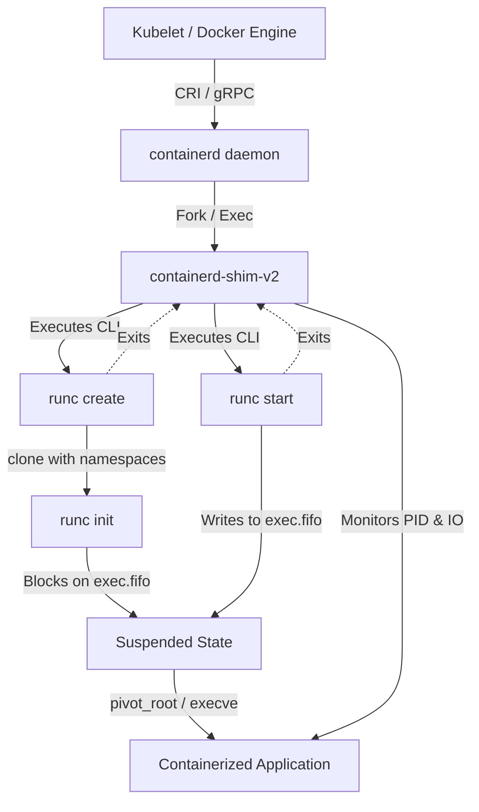
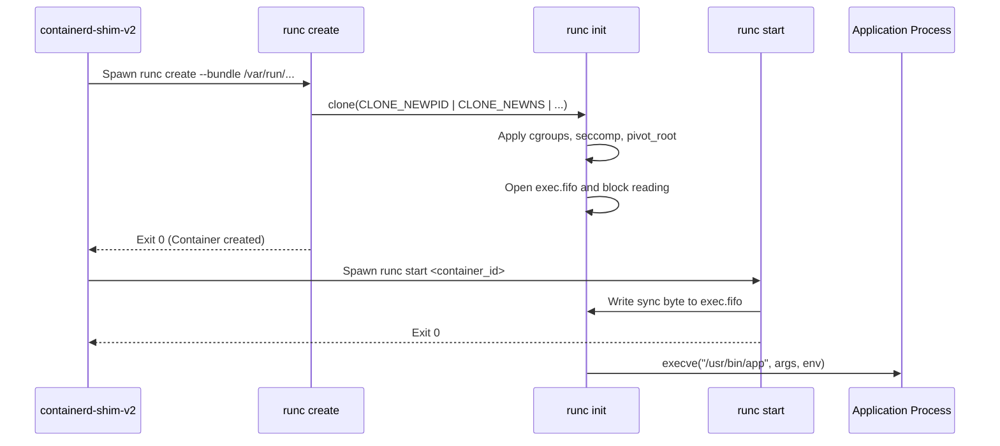

When people say Docker or Kubernetes runs a container, they usually gloss over the four separate processes involved in taking an OCI image spec and turning it into an isolated running process. You do not just call a single system binary that creates a container. The Docker daemon or Kubelet talks over gRPC to containerd. containerd does not run the container directly either. Instead, it delegates process execution to a tiny daemon called containerd-shim-v2, which in turn invokes runc.

Why does this elaborate chain of processes exist? If containerd managed container stdin, stdout, and exit codes directly as the parent process, restarting or crashing the containerd daemon would orphan or kill every running container on the host node. To prevent daemon restarts from taking down your workload, the management plane needs to decouple itself from the lifecycle of individual applications. That is where the shim pattern comes in.

## The Process Topology and Lifecycle

containerd is a long-running system daemon that exposes a gRPC interface for image pulling, snapshot management, and container execution state. When containerd receives a request to create a container, it unpacks the OCI rootfs onto a storage layer using OverlayFS and creates a bundle directory containing the rootfs along with a config.json OCI runtime spec.

Once the bundle directory exists, containerd forks and executes the containerd-shim-v2 process. The shim becomes the true parent process of the container payload. It outlives runc and stays alive for the entire lifespan of the containerized workload.

## The Fork and Exec Mechanics of runc

runc is a command-line tool designed to spawn and run containers according to the OCI specification. It is completely ephemeral. It starts, performs raw system calls to configure kernel isolation, and exits immediately after handoff.

When containerd-shim-v2 invokes runc create, runc does not execute the target application binary right away. Instead, it runs through a complex two-phase startup sequence using C language glue code and Go runtime bypass tricks.

Because Go runtime initializations launch multi-threaded goroutines automatically before the main function executes, creating Linux namespaces via unshare or clone syscalls inside raw Go code leads to broken kernel states. Linux namespaces like CLONE_NEWPID and CLONE_NEWNS must be configured on a single-threaded process before any additional threads clone off.

To bypass this Go runtime limitation, runc uses Cgo constructor attributes inside a C file called nsenter.c. When runc executes runc init, this C constructor code intercepts execution prior to the Go runtime initializing its thread pool.

## Handshake Synchronization via FIFO

The startup routine splits into two distinct execution steps: runc create followed by runc start. This separation allows container management engines to configure network interfaces, attach volume hooks, and setup cgroups before the container application code actually executes its first instruction.

During runc create, runc init clones itself into a child process using target clone flags like CLONE_NEWNS, CLONE_NEWPID, CLONE_NEWNET, CLONE_NEWIPC, and CLONE_NEWUTS. Inside this isolated child context, runc init performs specific startup setup.

1. It configures cgroup v2 paths and writes its own PID into the cgroups process tree.
2. It configures hostname, mounts, and mount namespaces using pivot_root.
3. It applies seccomp syscall filtering rules and drops capabilities down to the requested set.
4. It opens a named pipe called exec.fifo inside the container bundle directory and blocks on a read system call.

At this point, runc create exits back to containerd-shim-v2. The container process exists in the Linux process table, but its main thread is blocked waiting for data on exec.fifo.

When the caller decides the container is ready to run, containerd-shim-v2 executes runc start. runc start opens exec.fifo and writes a single byte into the pipe. The blocked runc init process wakes up, closes exec.fifo, and calls execve to overwrite its own memory image with the target container binary.

## Rootfs Isolation with pivot_root

To secure the filesystem layer, runc init relies on pivot_root rather than the older chroot mechanism. While chroot changes the root directory for file path resolution, an unprivileged user inside a chroot environment can break out using open directory file handles or recursive relative path traversal if permissions permit.

ptivot_root moves the entire root file system mount point of the caller process to a mount point underneath a new root directory, making the new root directory the mount point for the current process.

Before calling pivot_root, runc init turns all host mount points into private mounts by calling mount with MS_REC and MS_PRIVATE options. This guarantees that mount and unmount operations performed inside the container do not leak out to the host system namespace.

Next, it bind mounts the target container rootfs directory onto itself. It creates a temporary directory inside the rootfs, calls pivot_root to swap the host root and target rootfs, changes directory to the new root, unmounts the old root path recursively with umount2 using MNT_DETACH, and removes the temporary directory.

The result is that the old host filesystem path disappears entirely from the process mount table. The application cannot access anything outside its mounted rootfs tree even if it retains elevated process capabilities.

## Shim v2 Protocol and TTRPC

The shim acts as the daemonless process monitor holding all these pieces together. In earlier container runtime iterations, Docker used a separate helper process per container called docker-containerd-shim. Communication relied on standard gRPC over Unix sockets, which carried significant memory overhead due to HTTP/2 frame handling and protocol buffer size.

Modern container setups use the shim v2 protocol built on top of ttrpc, a lightweight protocol variant optimized for low memory usage in local IPC communication. ttrpc removes heavy HTTP/2 dependencies and uses raw length-prefixed frames over Unix domain sockets.

When containerd wants to manage a container, it communicates with containerd-shim-v2 using ttrpc services like TaskService. Through this interface, containerd issues commands like Create, Start, Delete, Psk, and Exec.

The shim holds open the file descriptors for the container stdin, stdout, and stderr streams. If containerd restarts, the shim keeps stdout and stderr buffered without dropping output logs. Once containerd comes back up, it reconnects to the shim ttrpc socket, queries the task status, and resumes consuming output streams without interrupting the application workload.

When the application process eventually terminates, the Linux kernel sends a SIGCHLD signal to its direct parent process, which is the shim. The shim captures the exit code, cleans up network interfaces and mount points, stores the exit status in memory, and notifies containerd over ttrpc.

This architecture guarantees zero downtime for workloads during control plane upgrades and provides clean separation between API management and raw kernel isolation.
