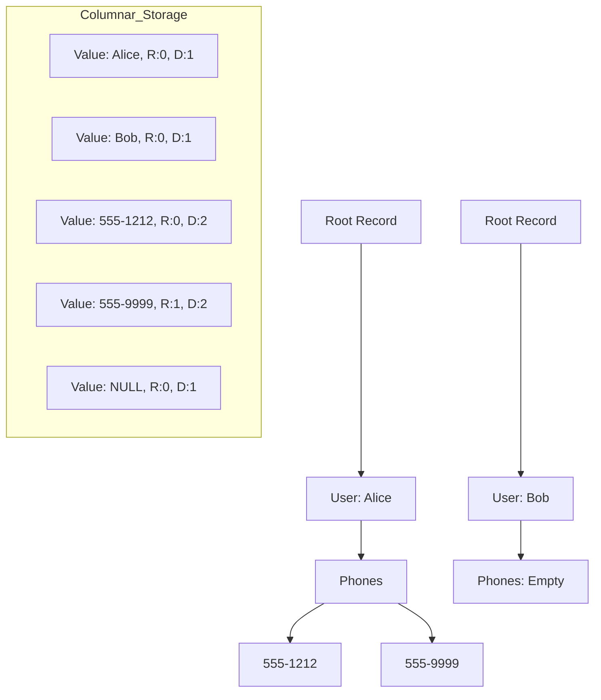

Most developers think columnar storage is just taking a spreadsheet and turning it ninety degrees. If you are dealing with flat rows, that logic holds up fine. You just store all the IDs together, then all the timestamps, and then all the prices. But the real world is messy and full of nested JSON, arrays of structs, and optional fields. The moment you try to store a list of addresses inside a user object in a columnar format, the simple one column per field approach breaks. You can't just store a flat list of addresses because you lose the record boundaries. You don't know where one user ends and the next begins. Google solved this problem in their 2010 Dremel paper, which became the foundation for Apache Parquet. They introduced two metadata values for every single cell: Repetition Levels and Definition Levels. These two numbers are the secret to shredding nested objects into columns and, more importantly, putting them back together without losing the structure.

Repetition levels tell us at what level in the nested path a value is repeating. Imagine you have a schema where a user has a list of phone numbers, and each phone number has a list of area codes. If you are looking at a specific area code value, the repetition level tells you if this is the start of a new user, a new phone number, or just another area code in the same list. A repetition level of zero always signals the start of a new top-level record. Anything higher tells the reader that we are still inside the same record but starting a new repeated field at a specific depth. This allows the scanner to reconstruct the arrays without needing to store delimiters or markers between every record. It is incredibly efficient because these levels are usually small integers that can be bit-packed or run-length encoded into almost nothing.

Definition levels handle the nightmare of nulls in nested structures. In a flat table, a null is just a missing value. In a nested world, a null can happen at any level. Maybe the user exists but has no phone numbers. Or maybe the phone number exists but the area code is null. The definition level tells us how many levels of the path are actually defined. If the path is User.Phone.AreaCode and the definition level is three, it means all three levels are present and the value is real. If the definition level is two, it means the User and Phone were defined, but the AreaCode was null. This is the only way to distinguish between an empty array and an array that contains a null value, which is a distinction that usually gets lost in naive implementations.

When Parquet writes these levels, it doesn't just dump them as raw integers. Since nested structures are often repetitive, the R and D levels are perfect candidates for Run-Length Encoding. If you have a list of a thousand items, the repetition level will be one for almost all of them, except for the very first one which will be zero. Storing that as a thousand integers is a waste of space. Instead, Parquet stores a single record saying the value one repeats 999 times. This metadata is stored right alongside the data pages in the column chunk. When you query the data, the execution engine uses these levels to skip over entire records or specific nested elements that don't match your filters. This is why Parquet is so fast for analytical queries even when the data is deeply nested. You don't have to parse a massive JSON blob just to find one field. You only read the columns you need and use the R/D levels to jump to the right offsets.

The assembly process is where the real magic happens. To reconstruct a record, the reader maintains a set of finite state machines, one for each column it is reading. As it pulls values from the columns, it looks at the R and D levels to decide whether to move to the next field, start a new list, or close out the current record. It is basically a streaming de-serializer that never has to see the whole record at once. This architecture is what allows systems like Spark and Presto to handle petabytes of data without running out of memory. They are just shuffling small windows of column values and using the Dremel levels as the assembly manual. If you ever find yourself designing a storage format, remember that the complexity isn't in the data, it's in the gaps between the data. The Dremel paper's genius was realizing that the gaps could be quantified and compressed just as easily as the values themselves.
