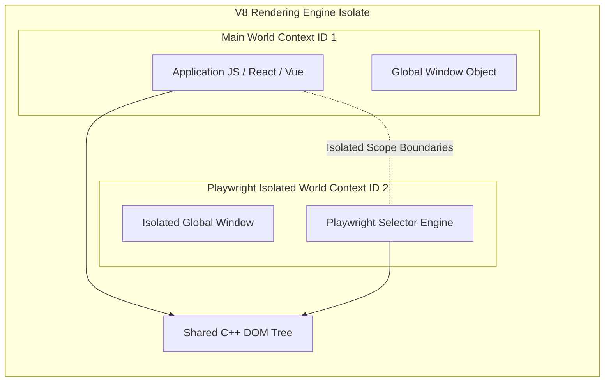

Browser automation spent almost two decades trapped in the architectural paradigms of Selenium and the HTTP WebDriver protocol. Every action, whether clicking a button or reading text, required an HTTP REST call over a local socket. The browser driver parsed the request, issued an internal OS or DOM event, and returned a JSON response. This request-response loop introduced significant network latency, but more importantly, it was completely out of sync with modern asynchronous browser architectures. Modern web applications render asynchronously, execute microtasks continuously, and mutate the DOM in response to background network events. Polling the DOM via stateless HTTP calls created flaky tests that failed whenever rendering cycles shifted by a few milliseconds.

Playwright took a fundamentally different route. Instead of sitting outside the browser and asking for updates, it hooks directly into the browser internal debugging channels. It leverages low-level event-driven protocols like Chrome DevTools Protocol, known as CDP, alongside custom patch bindings for Firefox and WebKit. Understanding how Playwright manages to run thousands of actions per minute with zero flakiness requires peeling back its IPC layers, socket multiplexing strategies, isolated execution contexts inside V8, and actionability state machines.

### Driver IPC Architecture and Protocol Translation

When you invoke Playwright in Python, C#, or Go, your language runtime does not speak directly to Chromium over a WebSocket socket. Instead, Playwright uses a driver architecture where language SDKs act as lightweight wrappers around a specialized Node.js driver binary. When you initialize the framework, the SDK spawns this background Node.js process using standard OS pipes for stdin and stdout.

Communication between your code and the Playwright driver process happens via JSON-RPC 2.0 messages over these standard input and output streams. The language client sends structured JSON commands representing high-level user actions, such as page navigations or click events, along with a monotonic request identifier. The Node.js driver acts as a central multiplexing server. It receives these JSON-RPC instructions and translates them into the native, low-level debugging protocol commands expected by the target browser engine.

```mermaid
graph TD
    ClientApp[Client SDK Python / C# / Go]
    DriverProcess[Playwright Node.js Driver Process]
    BrowserEngine[Chromium / Blink Engine]
    
    ClientApp -- Stdin / Stdout JSON-RPC 2.0 -- DriverProcess
    DriverProcess -- Single Pipe / WebSocket CDP -- BrowserEngine
    
    subgraph Browser Engine Target Routing
        BrowserEngine -- DevToolsSession Router -- TargetA[Page Target Session A]
        BrowserEngine -- DevToolsSession Router -- TargetB[Page Target Session B]
        BrowserEngine -- DevToolsSession Router -- TargetC[Worker Target Session C]
    end
```

This separation keeps language bindings thin and consistent across platforms. All the heavy lifting, including selector engine compilation, auto-waiting routines, frame management, and event listeners, lives inside the Node.js driver layer. This driver maintains persistent connections to the underlying browser processes.

### CDP Session Multiplexing over Single WebSocket Connections

Chromium DevTools Protocol operates as a bi-directional JSON messaging transport over a single WebSocket connection or standard OS pipe. CDP organizes browser functionality into logical domains like Page, DOM, Runtime, Network, and Emulation. In a complex test suite with multiple browser contexts, dozens of tabs, and embedded iframes, opening a separate WebSocket connection for every page or target would quickly exhaust system file descriptors and TCP stack resources.

Playwright solves this through CDP session multiplexing. When the Playwright driver launches Chromium, it establishes a single WebSocket connection to the browser process root debugging port. To command individual pages, frames, or service workers through this single pipe, Playwright relies on CDP target domain flattening.

When a new page opens, Playwright sends a `Target.attachToTarget` protocol request with the parameter `flatten: true`. Chromium attaches to the target frame or context and returns a unique, alphanumeric `sessionId`. From that moment onward, every protocol command sent by Playwright across the single WebSocket connection includes a `sessionId` field alongside the standard domain method and parameters.

Inside Chromium, the browser process runs a `DevToolsSession` router. When a JSON packet arrives over the root WebSocket, the router inspects the `sessionId` header. If present, it bypasses the root browser process debugging context and dispatches the payload directly to the target page, frame renderer, or dedicated worker thread. This multiplexing pattern allows thousands of concurrent operations across isolated browser contexts to flow over one bi-directional socket channel without head-of-line blocking or socket allocation overhead.

### V8 Execution Contexts and Isolated Worlds

Executing JavaScript inside an automated browser creates a fundamental conflict. Automation scripts need full access to the page DOM to query nodes, calculate layouts, and trigger events. However, if the automation framework injects its internal scripts, utility functions, or selector evaluation logic directly into the page's global `window` object, it creates script pollution. Application code could inspect, intercept, modify, or accidentally break the automation engine's internal helper functions. Conversely, application code that overrides built-in prototypes like `Array.prototype.push` or `Element.prototype.querySelectorAll` would corrupt the automation runtime.

Playwright avoids script collision by using V8 Execution Contexts and Isolated Worlds. Within a single rendering frame, Chrome's Blink engine can instantiate multiple execution contexts for the same underlying DOM structure. Each execution context receives its own isolated V8 global object, prototype chain, and memory heap, while sharing the underlying C++ DOM tree bindings.



When a web page loads, Blink creates context ID 1, known as the Main World. This is where user-land JavaScript, frameworks like React or Vue, and application global variables reside. When Playwright attaches to the page, it issues a CDP request to create a secondary, isolated execution context within the frame, known as the Utility World or Isolated World.

Playwright compiles its entire selector evaluation engine, actionability inspector, and DOM utility bundle, then injects it exclusively into this Isolated World. When you run a locator query like `page.locator('button.submit').click()`, Playwright sends a CDP `Runtime.callFunctionOn` command targeted specifically at the `contextId` belonging to its Isolated World.

Because the Isolated World shares access to the underlying DOM node pointers, Playwright can query elements, measure layout boxes, and register event dispatchers seamlessly. But because the V8 global context is strictly isolated, application scripts cannot see Playwright's injected utility objects on the window, and user-land prototype modifications cannot corrupt Playwright's internal engine evaluation loops.

### The Auto-Waiting Engine and Actionability State Machines

Legacy automation tools failed primarily because they were passive. They tried to execute an action immediately upon command, assuming the target element was fully interactive. Playwright treats DOM interaction as an asynchronous state machine. Before dispatching any user input event, such as a click, fill, or hover, Playwright executes a rigorous auto-waiting actionability pipeline inside the target frame's execution context.

The actionability pipeline evaluates a strict series of DOM and layout invariant checks before proceeding. First, it verifies attached state, ensuring the target element is connected to the DOM tree and not detached or running inside an orphaned document fragment. Next, it verifies visibility state. An element is considered visible only if it has non-zero bounding box dimensions, and its CSS properties do not set `display: none`, `visibility: hidden`, `opacity: 0`, or place it inside a clipped container.

After passing visibility, the actionability engine evaluates layout stability. It schedules consecutive `requestAnimationFrame` callbacks inside the browser context, monitoring the element's bounding client rectangle coordinates across animation frames. If the element is moving due to a CSS transition or dynamic layout reflow, the engine pauses and re-evaluates. The action checks proceed only after the bounding box coordinates remain completely static across consecutive animation frames.

```
+-----------------------------------------------------------------------+
|                      Actionability Check Engine                       |
+-----------------------------------------------------------------------+
                                    |
                                    v
+-----------------------------------------------------------------------+
| Attached Check: Verify DOM node is connected to active document tree  |
+-----------------------------------------------------------------------+
                                    |
                                    v
+-----------------------------------------------------------------------+
| Visibility Check: Bounding box > 0, display/visibility/opacity valid  |
+-----------------------------------------------------------------------+
                                    |
                                    v
+-----------------------------------------------------------------------+
| Stability Check: Bounding box static across requestAnimationFrame runs |
+-----------------------------------------------------------------------+
                                    |
                                    v
+-----------------------------------------------------------------------+
| Hit Test Check: document.elementFromPoint matches target or child     |
+-----------------------------------------------------------------------+
                                    |
                                    v
+-----------------------------------------------------------------------+
| Enabled Check: Ensure target node lacks disabled or aria-disabled     |
+-----------------------------------------------------------------------+
                                    |
                                    v
+-----------------------------------------------------------------------+
| Event Dispatch: Synthesize low-level OS/Blink Pointer & Mouse Events   |
+-----------------------------------------------------------------------+
```

Once the layout stabilizes, the engine performs a hit-test check. It calculates the hit-test coordinates at the center of the target element's bounding box and calls `document.elementFromPoint(x, y)` inside the browser context. This guarantees that the target element actually receives pointer events at those coordinates. If a sticky header, modal backdrop, or loading spinner covers the target element, the hit-test fails, and the actionability engine sleeps, waiting for DOM mutation observers to signal layout updates.

Finally, the engine checks enabled state, confirming that the element lacks the `disabled` attribute or `aria-disabled` flags. If all checks pass within the configured timeout window, Playwright issues low-level input events directly to the browser compositor.

Instead of dispatching synthetic, untrusted JavaScript custom events like `element.click()`, Playwright generates low-level, trusted input events through protocol interfaces like CDP's `Input.dispatchMouseEvent`. These events flow through Chromium's native event pipeline, triggering focus changes, hover states, hit testing, and layout recalculations exactly as if triggered by physical hardware input.

### Network Interception Mechanics at the Compositor Layer

Intercepting and modifying network traffic in Playwright does not rely on local proxy servers or DNS redirection hacks. Proxy-based approaches struggle with HTTP/3 QUIC connections, client certificate validation, and custom TLS cipher suites. Playwright implements network interception directly inside the browser kernel networking delegate via CDP's `Fetch` domain.

When you register a network route handler using `page.route()`, Playwright sends a `Fetch.enable` command to Chromium, specifying URL patterns to match. Chromium passes these patterns down to its C++ network delegate service. When an outgoing network request matches the pattern, Chromium halts the request at the socket creation layer, suspends network I/O, and sends a `Fetch.requestPaused` event over the CDP WebSocket connection to Playwright.

Playwright's Node.js driver receives this paused event and triggers the corresponding user handler. If the script supplies a mock response via `route.fulfill()`, Playwright constructs a raw protocol response and transmits a `Fetch.fulfill` command. Chromium accepts these headers and body payload, feeds them directly back up into Blink's resource loader, and completely skips outgoing TCP handshakes or DNS resolutions. If the script allows the request through via `route.continue()`, Playwright sends `Fetch.continueRequest`, telling Chromium to resume normal network stack processing.

This architecture ensures that network interception operates at native wire speed without introducing proxy socket overhead. It works identically across cross-origin requests, WebSockets, service worker fetches, static media assets, and secure HTTPS streams, providing absolute control over application state during browser automation.
