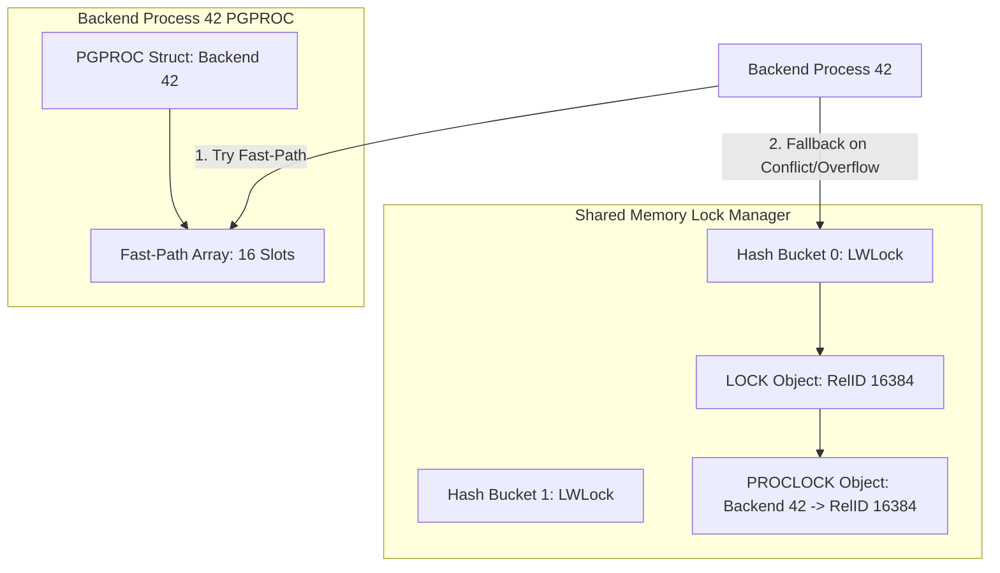

Postgres relies on a layered hierarchy of locking primitives to protect shared memory structures and ensure transaction isolation. At the lowest layer sit spinlocks, implemented via CPU atomic operations like test-and-set or compare-and-swap. Spinlocks protect microsecond-level updates to shared memory data structures. They do not support sleep or wait queues, so a thread spinning on a contested spinlock consumes CPU cycles while waiting for release.

Directly above spinlocks sit Lightweight Locks, commonly called LWLocks. LWLocks provide short-term mutual exclusion and shared-read access to shared memory buffers, hash tables, and page frames. When an LWLock is contested, the acquiring thread does not busy-spin indefinitely. Instead, it yields execution by sleeping on an OS semaphore or latch. LWLocks are acquired and released within milliseconds during physical page reads, buffer pool lookups, or index scans, and they are never held across user transaction boundaries.

Heavyweight locks occupy the highest layer in this stack. These are the user-visible SQL locks managed explicitly by PostgreSQL when queries execute. Heavyweight locks survive multi-statement transactions, support eight distinct lock modes with complex conflict matrices, handle lock acquisition timeouts, and integrate directly with the deadlock detection subsystem. Every time a transaction selects from a table, acquires an explicit row lock, or executes a DDL command, it interacts directly with the PostgreSQL Heavyweight Lock Manager.

## The Eight Lock Modes and Conflict Matrix

PostgreSQL defines eight heavyweight lock modes arranged in increasing order of restrictiveness. AccessShareLock is acquired by simple SELECT queries to prevent concurrent ALTER or DROP operations. RowShareLock is used by SELECT FOR UPDATE and SELECT FOR SHARE queries. RowExclusiveLock is grabbed by INSERT, UPDATE, and DELETE statements. ShareUpdateExclusiveLock protects concurrent maintenance tasks like VACUUM, ANALYZE, and CREATE INDEX CONCURRENTLY. ShareLock is requested by non-concurrent CREATE INDEX commands. ShareRowExclusiveLock protects explicit LOCK TABLE statements in SHARE ROW EXCLUSIVE mode. ExclusiveLock prevents concurrent writes while allowing concurrent reads. AccessExclusiveLock represents total isolation, blocking every other transaction from reading or writing to the target relation.

The Lock Manager enforces lock safety by checking lock requests against an 8x8 boolean matrix defined in src/backend/storage/lmgr/lock.c under the array variable LockConflicts. When a transaction requests a given lock mode on an object, the Lock Manager evaluates the array bitmask against all currently granted lock modes on that exact object. If any bitwise AND evaluation yields true, a lock conflict exists.



## Fast-Path Lock Optimization

Every SQL query targeting a table must acquire at least an AccessShareLock on that relation. In high-throughput workloads executing tens of thousands of SELECT queries per second across dozens of backend worker processes, looking up shared memory hash tables on every single execution creates severe LWLock contention on the global lock table partitions. PostgreSQL solves this bottleneck using a fast-path lock mechanism.

Fast-path locking bypasses shared memory hash table lookups for weak lock modes. Weak lock modes are defined as AccessShareLock, RowShareLock, and RowExclusiveLock. Each backend process maintains a private, fixed-size array of 16 fast-path slots inside its PGPROC structure allocated in shared memory. When a backend process needs a weak lock on a relation, it checks whether the relation is eligible for fast-path processing. A relation is eligible if it has no conflicting strong locks held by other transactions and if the local backend process has a free slot in its fast-path array.

To register a fast-path lock, the backend process writes the target relation OID into its local PGPROC fpRelId array and sets the corresponding lock mode bits in fpLockBits. This entire operation occurs without acquiring any LWLocks on shared memory hash buckets. Other backends scanning shared memory for conflicting locks can inspect all active PGPROC fast-path arrays directly, ensuring safety without forcing every reader to take global shared memory locks.

When all 16 fast-path slots in a backend PGPROC structure are filled, or when a query requests a strong lock mode like ShareLock or AccessExclusiveLock, fast-path locking cannot be used. The backend must clear or transfer fast-path entries into the global lock table in shared memory, a process referred to as fast-path lock transfer or unfastening.

## Shared Memory Hash Structures: LOCK and PROCLOCK

When fast-path locking is bypassed or exhausted, lock state management transitions to two primary dynamic hash tables residing in PostgreSQL shared memory. These hash tables are LockMethodLockHash and LockMethodProcLockHash.

LockMethodLockHash maps a unique lock key (represented by the LOCKTAG structure) to a LOCK object. A LOCKTAG uniquely identifies any lockable entity in PostgreSQL, including database OIDs, table OIDs, tuple IDs, transaction IDs, advisory lock IDs, and object locks. The LOCK object tracks aggregate statistics for that target entity, including total granted locks by mode type, total waiting backends, and a head pointer to a doubly-linked wait queue containing blocked backend processes.

LockMethodProcLockHash maps a combined key consisting of the target LOCK object address and the backend process address (PGPROC) to a PROCLOCK object. A PROCLOCK object tracks the specific relationship between a single backend transaction and a single lock target object. It holds bitmasks indicating which lock modes the specific backend currently holds on the object, along with bitmasks showing lock modes for which the backend is currently waiting.

```
+-----------------------------------------------------------------------+
|                             LOCK Object                               |
|  LOCKTAG: [DbOID: 16384, RelOID: 24590]                               |
|  grantMask: 0x0004 (RowExclusiveLock)                                 |
|  waitMask:  0x0080 (AccessExclusiveLock)                              |
|  waitProcs Queue: [ PGPROC Backend 89 ] -> [ PGPROC Backend 102 ]      |
+-----------------------------------------------------------------------+
                                  ^
                                  |
            +---------------------+---------------------+
            |                                           |
+-----------------------+                   +-----------------------+
|    PROCLOCK Object    |                   |    PROCLOCK Object    |
|  Backend: PGPROC 42   |                   |  Backend: PGPROC 89   |
|  holdMask: 0x0004     |                   |  holdMask: 0x0000     |
|  waitMask: 0x0000     |                   |  waitMask: 0x0080     |
+-----------------------+                   +-----------------------+
```

To maintain high concurrency across hundreds of CPU cores, LockMethodLockHash and LockMethodProcLockHash are partitioned into 16 separate hash buckets. Each bucket partition is protected by its own distinct LWLock. When a backend needs to insert or inspect a LOCK or PROCLOCK object, it computes the hash code of the lock tag, determines the hash bucket partition index, acquires that partition LWLock in shared or exclusive mode, mutates the object, and releases the LWLock.

## Wait Queue Scheduling and Sleep Mechanics

When a backend process attempts to acquire a heavyweight lock that conflicts with currently granted locks recorded in the target LOCK object, it cannot proceed immediately. The Lock Manager puts the requesting process into a wait state using a deterministic queuing protocol.

First, the backend initializes a PROCLOCK entry for itself if one does not already exist, marking its requested lock mode in the PROCLOCK waitMask field. Second, it appends its PGPROC structure to the tail of the LOCK object waitProcs queue. Third, the Lock Manager updates the lock aggregate waitMask and increments wait count fields. Fourth, the backend process sets its internal proc->waitStatus field to STATUS_WAITING.

Once the wait queue state is committed in shared memory, the backend process releases all partition LWLocks and enters a sleep loop. PostgreSQL uses OS-level synchronization primitives via its latch interface, built on top of Unix POSIX semaphores or futexes. The sleeping backend process relinquishes the CPU and remains suspended until a releasing transaction wakes it up.

When a holding transaction finishes work and releases its locks, it executes the LockRelease function. LockRelease updates the PROCLOCK holdMask, recalculates the target LOCK aggregate grantMask, and inspects the head of the wait queue. It iterates through queued PGPROC entries to evaluate if any waiting backend can now be granted its requested lock without conflicting with remaining granted locks or higher-priority queued requests. When an eligible waiter is found, LockRelease changes that waiter proc->waitStatus to STATUS_OK, removes the backend from waitProcs, and signals the backend latch, waking it up to resume execution.

## The Deadlock Detection Engine

Because transactions can acquire multiple locks in arbitrary sequence across different relations, circular wait conditions can occur. PostgreSQL solves this problem using an asynchronous deadlock detection engine triggered by a timer.

When a backend process enters a lock wait state, it arms an OS timer based on the deadlock_timeout configuration variable, which defaults to 1000 milliseconds. If the lock is granted before the timer expires, the timer is disarmed with zero overhead. However, if the timer expires while the backend process is still sleeping on the lock wait queue, a signal handler fires, placing a request for the deadlock checker to execute via CheckDeadlock.

The deadlock detection engine executes within the context of the waiting backend process. It acquires an exclusive LWLock on the LockManager partition locks to freeze lock state mutations, then constructs a directed Wait-For Graph (WFG). In this graph, nodes represent active backend processes (PGPROC structures) and directed edges represent lock dependencies where Process A waits for a lock currently held by Process B.

```
[ Backend 101 ] --(Waits for Rel 2000)--> [ Backend 102 ]
      ^                                          |
      |                                          |
  (Waits for Rel 1000)                      (Waits for Rel 3000)
      |                                          |
      v                                          v
[ Backend 104 ] <--(Waits for Rel 4000)-- [ Backend 103 ]
```

The engine traverses this graph using depth-first search cycle detection. If a closed cycle is found, a deadlock is present. To break the deadlock loop, PostgreSQL does not automatically abort the backend process that initiated the deadlock check. Instead, it inspects the wait-for graph cycle to determine if reordering wait queues could resolve the cycle without aborting any transactions. If wait queue reordering is impossible, PostgreSQL selects a victim transaction from the cycle, sets its waitStatus to STATUS_ERROR, signals its latch, and forces it to abort with a SQL state 40P01 deadlock_detected exception, allowing the remaining transactions in the cycle to proceed.
