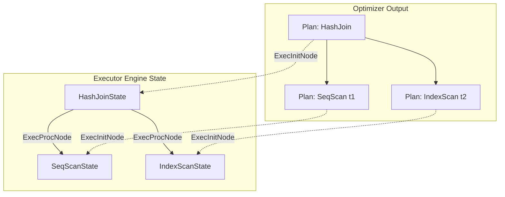
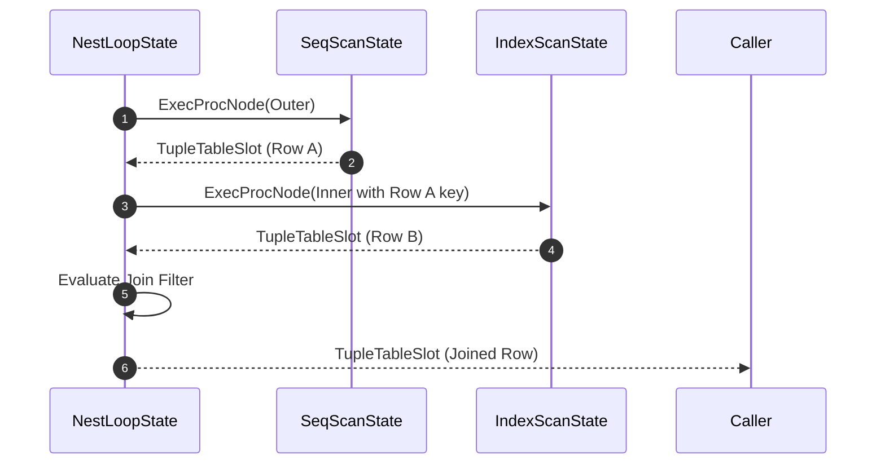
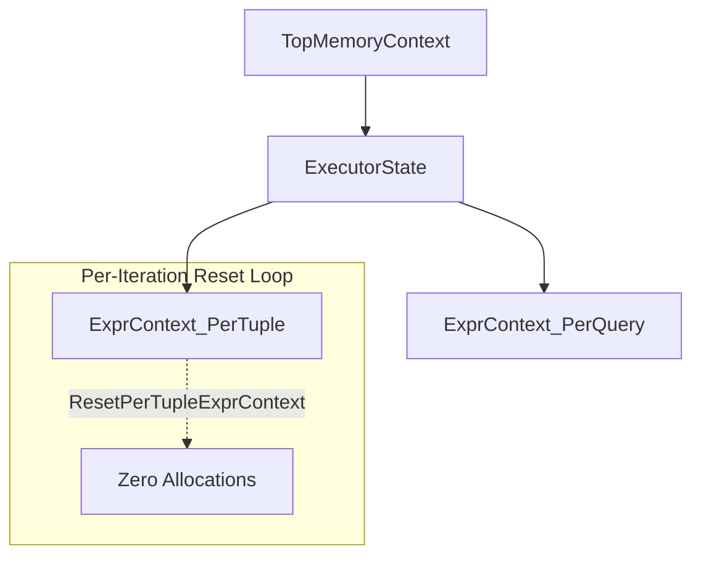

# Inside Postgres Query Execution: Tuple Table Slots, Volcano Iterators, and MemoryContext Mechanics

When a SQL query passes through the Postgres parser, analyzer, and cost-based planner, it exits as a tree of `PlannedStmt` nodes. This tree is a static blueprint outlining the theoretical strategy for retrieving and transforming data. Turning that blueprint into actual binary rows requires passing the tree into the Postgres query execution engine.

The executor operates on a classic Volcano demand-driven iterator framework. Every node in the execution plan acts as an iterator that yields one tuple at a time on demand. Beneath this standard iterator pattern sits a tight set of memory management abstractions designed to eliminate allocation overhead, prevent page-cache memory leaks, and isolate pointer representations from the physical storage layer.

## From Immutable Plans to Execution State Trees

Postgres strictly separates static planning representations from runtime state. A `Plan` node created by the optimizer is read-only and reusable. It contains physical metadata like cost estimates, targeted targetlists, and join strategies. It never holds execution state such as open file descriptors, allocated memory buffers, or current row offsets.

Execution begins inside `ExecutorStart`, which invokes `standard_ExecutorStart`. The runtime initializes a top-level `QueryDesc` object containing the query string, planned statement, and execution flags. The core initialization step occurs when `ExecInitNode` recursively processes the `Plan` tree and constructs a parallel `PlanState` tree.



Every `Plan` node type maps directly to a corresponding `PlanState` node struct. A `SeqScan` node yields a `SeqScanState`, holding a scan descriptor `TableScanDesc` that maintains physical heap page read state. A `HashJoin` node produces a `HashJoinState`, containing pointers to dynamically populated hashtables and batch files. During `ExecInitNode`, nodes allocate their required execution state inside a specialized memory context called `ExecutorState`.

## The Demand-Driven Volcano Execution Loop

Once initialization finishes, `ExecutorRun` calls `ExecProcNode` on the root node of the `PlanState` tree. Postgres implements the Volcano model through function pointers. Every `PlanState` struct contains an `ExecProcNode` field pointing to the specific execution function for that node type, such as `ExecSeqScan`, `ExecHashJoin`, or `ExecAggregate`.

Execution proceeds top-down, but data flows bottom-up. When the root node needs a row to evaluate its output, it calls `ExecProcNode` on its left or right child node. The child processes pages until it yields a single row, wraps it in a memory abstraction called a tuple slot, and returns control up the stack.



This demand-driven approach guarantees that memory footprint remains constant regardless of result set size for streaming operations like sequential scans or nested loops. Nodes that require full materialized input state, such as `Sort` or `Hash`, must consume all child tuples before returning their first output row, breaking the streaming flow into explicit pipelines.

## Abstracing Memory with TupleTableSlot

Passing raw physical data structures up and down a deep iterator call stack introduces severe performance penalties. Heap tuples stored in buffer pages use a physical storage layout (`HeapTupleHeader`) that requires alignment adjustments and variable-length attribute parsing. Forcing every execution node to decode physical disk representations would destroy performance.

To decouple query execution from storage format, Postgres uses the `TupleTableSlot` abstract data structure. A slot holds pointers to tuple attributes along with metadata indicating whether those attributes are current, materialized, or null.

Postgres defines several specialized virtual method implementations for `TupleTableSlot` to optimize for specific data access patterns.

`BufferHeapTupleTableSlot` manages physical tuples residing on a Postgres shared buffer page. It holds a pin on the buffer page containing the physical tuple, preventing the buffer eviction manager from removing the underlying disk page while the slot holds a reference.

`HeapTupleTableSlot` holds an palloc-allocated physical memory tuple that exists independently of any shared buffer pool page. It is used when a tuple must survive buffer page unpinning or cross node boundaries.

`MinimalTupleTableSlot` handles compact disk or memory representations that strip away header fields like transaction IDs (`xmin`/`xmax`) and system attribute columns. This format is heavily utilized by `Sort` and `Hash` operations to squeeze maximum rows into working memory (`work_mem`).

`VirtualTupleTableSlot` is the most critical performance optimization in the modern Postgres execution engine. A virtual slot holds no physical tuple header at all. Instead, it holds two parallel arrays: `Datum *tts_values` and `bool *tts_nulls`. These arrays store pointers or inline values directly referencing attributes.

```
VirtualTupleTableSlot Anatomy:
+-------------------------------------------------------------+
| tts_values: [ Datum 1 ] [ Datum 2 ] [ Datum 3 ] [ Datum 4 ] |
| tts_nulls:  [  false  ] [  false  ] [  true   ] [  false  ] |
| tts_nvalid: 4                                               |
| tts_flags:  TTS_FLAG_EMPTY = 0                              |
+-------------------------------------------------------------+
          |            |
          v            v
  [ Int64 Inline ]  [ Pointer to palloc chunk ]
```

When a scan projection evaluates targetlist expressions, it populates a `VirtualTupleTableSlot` without executing a `palloc` allocation or copying bytes into a contiguous memory chunk. Attributes are referenced directly from source buffers or static pointers. If a downstream node requires a physical memory representation, it invokes `ExecMaterializeSlot`, which converts the virtual slot into a `HeapTuple` or `MinimalTuple` on demand.

## Expression Evaluation and Opcode Interpreter

Evaluating SQL expressions like `WHERE age > 30 AND status = 'active'` inside every iteration step could easily bottleneck the execution engine. Postgres uses an array-based opcode interpreter to evaluate expressions without deep dynamic call stacks.

During `ExecInitNode`, every expression in the plan tree is compiled into an `ExprState` structure. The compilation process flattens the expression AST into a sequential array of `ExprEvalStep` instructions. Each step contains an opcode and a function pointer targeting a dedicated operational function.

```
Raw Expression Tree: (a + b) > 100

Compiled ExprEvalStep Sequence:
[1] EEOP_INNER_FETCHSOME (Extract attributes 'a' and 'b' from slot)
[2] EEOP_QUAL_FAST       (Read Datum 'a' and Datum 'b')
[3] EEOP_FUNCEXPR_STRICT (Invoke int4pl operator function: tmp_val = a + b)
[4] EEOP_QUAL_FAST       (Compare tmp_val > 100)
[5] EEOP_DONE            (Return boolean outcome)
```

When executing `ExecEvalExpr`, Postgres iterates through this pre-compiled opcode array inside a tight C loop. If JIT compilation (`jit = on`) is active and the plan cost exceeds `jit_above_cost`, LLVM dynamically compiles this `ExprEvalStep` array directly into native machine code, replacing intermediate instruction dispatch with direct CPU instructions.

## MemoryContext Scope Management

Query execution generates millions of intermediate values, string conversions, and temporary tuple references. If Postgres relied on standard standard C library allocations (`malloc` and `free`) for every intermediate value, execution speed would degrade and memory fragmentation would crash long-running queries.

Postgres solves this using a hierarchical memory allocator built on `MemoryContext` structures. Nodes allocate memory inside localized contexts. Rather than freeing individual allocations, entire contexts are reset or destroyed in a single operation.



During initialization, `ExecutorStart` creates the `ExecutorState` memory context under `TopTransactionContext`. This context holds long-lived query runtime state, including the `PlanState` node structures, hashtable headers, and transaction descriptors.

For short-lived operational data, the executor creates an `ExprContext`. Each `ExprContext` contains a pointer to a specialized context called `per_tuple_exprcontext`. 

When a node evaluates an expression, projects a result tuple, or executes a scan filter, all temporary memory allocations occur inside this `per_tuple_exprcontext`. Once the node processes the current tuple and passes the result to its parent, it invokes `ResetExprContext` or `ResetPerTupleExprContext`.

Resetting the context resets the internal pointer offsets of the context's underlying memory blocks to zero. No individual destructors or free lists are traversed. Millions of dynamic allocations performed during row processing are reclaimed instantly in a handful of memory writes. This architectural pattern keeps execution footprint tight and guarantees zero memory leakage across billion-row scans.

## Putting It All Together: A Sequential Scan Execution Loop

To see how these layers work together, trace a standard sequential scan processing a table row.

First, `ExecutorRun` invokes `ExecProcNode` on `SeqScanState`. The function calls `table_scan_getnextslot`, delegating to the storage manager interface.

The storage manager checks if the current buffer page still holds unread tuples. If exhausted, it unpins the old page, requests a new page from the page cache, and pins it in shared buffers.

It assigns the physical heap tuple address to the `BufferHeapTupleTableSlot` inside `SeqScanState` and marks the slot as valid. The engine evaluates the scan filter by passing the slot to `ExecQual`.

`ExecQual` executes the compiled `ExprState` array inside the `per_tuple_exprcontext`. The attributes required for the expression are extracted directly from the slot without copying tuple bytes.

If the filter returns false, the executor calls `ResetPerTupleExprContext` to clean up expression evaluation junk, advances the slot index, and moves to the next tuple.

If the filter returns true, the executor projects the result attributes into a target `VirtualTupleTableSlot` and returns that slot up the stack to the parent operator node.

Once the query finishes returning rows or hits its limit, `ExecutorEnd` runs. It recursively shuts down all runtime states, releases all buffer pins, flushes open execution files, and destroys the `ExecutorState` memory context, instantly freeing every byte allocated during query execution.
