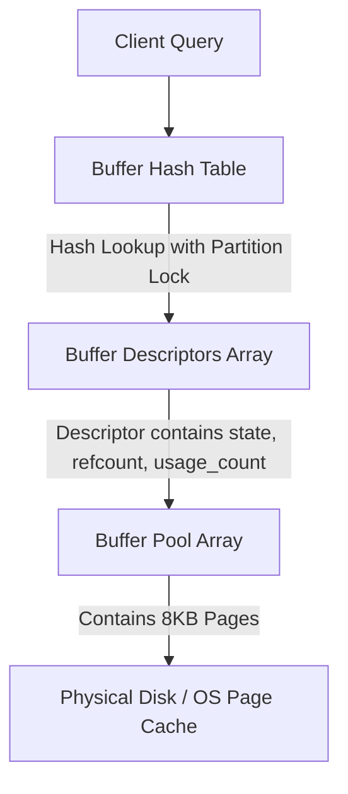

PostgreSQL does something unusual compared to other modern relational databases. It does not use direct physical I/O (O_DIRECT) by default on most operating systems, choosing instead to run its storage engine on top of the kernel's virtual memory subsystem. This means Postgres must maintain its own dedicated memory buffer pool, called shared buffers, in user space while cooperating with the operating system page cache. This architectural choice sets up a fascinating set of challenges around memory synchronization, lock contention, and page eviction.

To manage thousands of concurrent transactions reading and writing pages simultaneously, Postgres implements a highly optimized buffer manager. Under the hood, this system relies on a combination of lightweight partitioned locks, atomic state tracking, and a modified version of the second-chance clock sweep eviction algorithm. Understanding how these pieces fit together is essential for diagnosing high-concurrency bottlenecks and writing efficient database-backed systems.

### The Anatomy of Shared Buffers

During database startup, the postmaster process allocates a single contiguous block of shared memory. This block is partitioned into three distinct structures. First, the buffer lookup hash table maps disk block addresses to specific array offsets in the buffer pool. Second, an array of buffer descriptors, also called headers, tracks metadata, locks, and reference counts for every page in memory. Third, the buffer pool itself consists of an array of 8KB frames containing the actual table and index pages.



The mapping from a logical disk location to a physical buffer frame is determined by a 112-bit key known as the BufferTag. This tag uniquely identifies any block in the database using five fields: the OID of the database, the OID of the tablespace, the OID of the relation, the fork number, and the block number. The fork number is necessary because a Postgres table is not just a single file. It contains the main data fork, the free space map fork, and the visibility map fork, all of which must be cached in the same shared buffers pool.

### The Lookup and Pinning Pipeline

When a backend worker needs to read or write a tuple, it cannot touch the page on disk directly. It must first retrieve the target block from the shared buffer pool. This process begins with a lookup in the shared buffer hash table using the BufferTag as the key.

To prevent concurrent queries from corrupting the hash table, Postgres divides the hash space into distinct, independent partitions. Each partition is protected by a dedicated lightweight lock called a BufMappingLock. By default, Postgres establishes 128 of these partitions. When a backend searches for a buffer, it only needs to acquire the specific BufMappingLock corresponding to the hash bucket of its target BufferTag in shared mode. This partitioning allows hundreds of backends to search the hash table simultaneously without blocking each other, provided their target pages hash to different partitions.

Once the backend finds the hash table entry, it retrieves the index of the corresponding buffer descriptor. Each descriptor contains an atomic 32-bit state variable that manages the lifecycle of that specific buffer frame. The backend must immediately pin the buffer before releasing the BufMappingLock. Pinning a buffer is a critical step that tells the buffer manager that a backend is actively reading or modifying the page, making it completely ineligible for eviction. 

Pinning is executed by atomically incrementing the reference count field, called refcount, inside the buffer descriptor state. It is important to emphasize that pinning is not a lock. Pinning does not prevent other backends from reading, writing, or pinning the same page. It is simply a reservation system. The refcount can rise to thousands if many queries are accessing the same hot page simultaneously. Once the pin is successfully registered, the backend releases the shared BufMappingLock, allowing other processes to query that hash partition.

### Locking and Concurrency in Shared Buffers

To safely read or write the actual data inside an 8KB buffer frame, a backend must acquire an additional layer of protection beyond the pin. It needs a buffer content lock. Content locks are lightweight locks (LWLock) associated with each buffer descriptor, and they operate in two primary modes.

When a backend only needs to read tuples from a page, it acquires the buffer content lock in shared mode. Multiple readers can hold shared locks on the same buffer simultaneously. If a backend needs to insert a tuple, update a record, or modify a page header, it must acquire the buffer content lock in exclusive mode. Only one backend can hold an exclusive content lock at a time, blocking all other readers and writers.

This division of labor between pins and locks is essential. A pin ensures the page remains resident in physical RAM at a fixed memory address, while a content lock ensures the actual 8KB payload is not modified while a backend is actively parsing its binary structure. 

### The Clock Sweep Eviction Engine

If a requested page is not present in the shared buffers pool, the backend must load it from the operating system. This requires finding an empty or unused buffer frame to house the incoming 8KB page. If the database has been running for more than a few minutes, the shared buffers pool is likely fully occupied. The buffer manager must therefore select an existing page to evict.

Postgres achieves this using a generalized variant of the second-chance clock sweep eviction algorithm. The entire array of buffer descriptors is treated as a circular ring. A global pointer, known as the clock hand, points to the current descriptor being evaluated for eviction. This sweep process runs entirely on the backend process requesting the new page.

```mermaid
graph TD
    subgraph Clock Sweep Loop
        C1[Inspect Buffer Descriptor] --> C2{Is refcount > 0?}
        C2 -->|Yes| C3[Skip Buffer: Page is Pinned]
        C2 -->|No| C4{Is usage_count > 0?}
        C4 -->|Yes| C5[Decrement usage_count by 1]
        C4 -->|No| C6{Is page dirty?}
        C5 --> C7[Advance Clock Hand]
        C3 --> C7
        C6 -->|Yes| C8[Schedule Asynchronous Write / Skip if Busy]
        C6 -->|No| C9[Victim Chosen: Evict and Reuse Buffer]
        C8 --> C7
        C7 --> C1
    end
end
```

The clock hand moves sequentially through the buffer descriptors. For each descriptor, the engine evaluates the pin count and the usage count. The usage count is a value from zero to five that tracks how frequently the page has been accessed. Every time a backend pins a page, the engine increments its usage count up to a maximum of five.

When evaluating a descriptor, the clock sweep first checks if the buffer's refcount is greater than zero. If the buffer is pinned, the page is actively in use and cannot be evicted. The clock hand passes over it immediately and moves to the next descriptor. 

If the buffer is not pinned, the engine checks the usage count. If the usage count is greater than zero, the engine decrements the usage count by one and moves the clock hand forward. This decrement represents the second chance. A page that was highly popular will have a usage count of five, requiring the clock hand to sweep past it five full times without any access before it becomes eligible for eviction.

If the engine encounters a buffer descriptor with both a refcount of zero and a usage count of zero, this page is selected as the victim. The clock hand stops, and the backend prepares the buffer for reuse. 

### The Dirty Buffer Problem and the Checkpointer

Choosing a victim buffer with a zero refcount and a zero usage count is only half the battle. The engine must check if the chosen buffer is dirty. A dirty page contains modifications that have not yet been synchronized to the physical disk. If the page is clean, the backend can immediately overwrite the 8KB frame with the new page's data. If the page is dirty, the backend cannot overwrite it without destroying committed data.

If a backend executing a standard query is forced to evict a dirty page, it must write that page to the operating system using a synchronous write system call. This is a severe performance bottleneck because user queries should not be blocked by physical disk I/O during memory allocation. To keep user backends fast, Postgres delegates the writing of dirty pages to two background processes: the background writer and the checkpointer.

The background writer runs continuously in a loop. It scans the buffer descriptors slightly ahead of the expected clock hand position, searching for dirty pages with low usage counts. When it finds them, it writes them to the operating system and clears the dirty flag on the descriptor. This increases the probability that when a user backend executes a clock sweep, it will find clean, ready-to-evict buffers.

The checkpointer operates on a longer scheduled interval. Its job is to write all dirty buffers to disk, creating a known safe recovery point in the write-ahead log. When the checkpointer runs, it sorts all dirty buffers by their physical disk addresses to optimize sequential I/O performance before executing the writes. 

### Double-Buffering and the OS Integration

Because Postgres uses standard read and write system calls rather than direct memory-mapped files or raw disk partitions, a page can exist in memory twice. This is the double-buffering phenomenon. A block may reside in the 8KB Postgres shared buffers array and also in the operating system's kernel page cache as an identical 8KB page.

While this double-buffering uses more memory, it provides a safety net. The operating system kernel is exceptionally good at handling low-level physical disk drivers, write-back queuing, and hardware-level page readahead. When Postgres writes a page from its shared buffers, the write system call completes almost instantly because the kernel accepts the write into its own page cache and deferentially flushes it to physical disk. Postgres relies on fsync system calls issued by the checkpointer to guarantee that these pages are safely committed to non-volatile storage, preserving durability without sacrificing the responsiveness of the active shared buffer pool.
