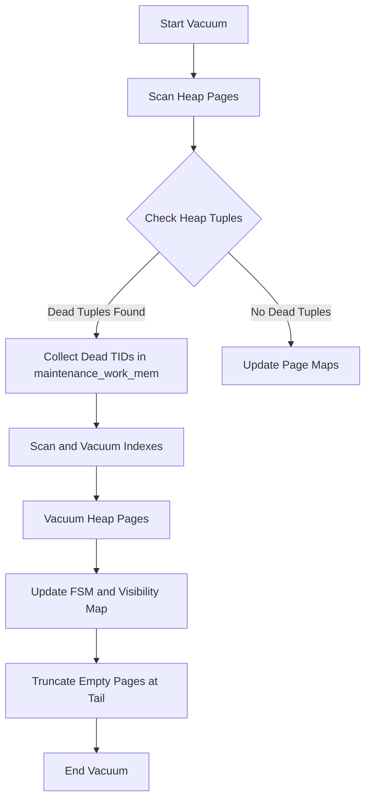

PostgreSQL is built on a design choice that prioritizes read performance and transactional isolation above almost everything else. Its Multi-Version Concurrency Control (MVCC) model guarantees that readers never block writers, and writers never block readers. This sounds like database magic, but it comes with a physical tax. When you update or delete a row, Postgres does not modify the data in place. Instead, it writes a new version of the row, known as a tuple, to the disk. The old version remains in the page, dead to current transactions but still occupying space.

Without a systematic way to sweep these dead tuples, table bloat will expand until your disks are full, index performance will collapse, and queries will crawl. The system component tasked with cleaning this up is the vacuum engine. If you operate a high-throughput Postgres database, understanding the vacuum subsystem is not just academic. It is the difference between a smooth-running production environment and a catastrophic middle-of-the-night database lockup.

### The Anatomy of an 8KB Data Page

To understand why cleanup is such an intensive process, we have to look at how Postgres organizes data on disk. Tables are split into physical blocks of 8 kilobytes, which are read and written as atomic units.

```
+--------------------------------------------------+
| PageHeaderData (Page LSN, Flags, Free Space Off)  |
+--------------------------------------------------+
| Line Pointer [1] | Line Pointer [2] | ...        |
+--------------------------------------------------+
|                  Free Space                      |
|                                                  |
|                  v  (Grows Down)                 |
|                                                  |
|                  ^  (Grows Up)                   |
+--------------------------------------------------+
| Tuple [2] (New Version)                          |
+--------------------------------------------------+
| Tuple [1] (Dead MVCC Tuple, xmax set)            |
+--------------------------------------------------+
```

At the absolute top of the page sits the page header, which holds metadata about the page, including its Write-Ahead Log sequence number and the offset of the free space boundary. Right below the header, an array of line pointers grows downward. Each line pointer is a tiny 4-byte structure containing the physical offset and length of a tuple.

The actual row data, the tuples, are written starting from the bottom of the page and grow upward. The empty space in the middle is where new data is inserted. When a tuple is updated, a new tuple is written to this free space, a new line pointer is added at the top, and the old tuple's header is updated. Specifically, the old tuple's transaction maximum ID, or xmax, is set to the transaction ID that performed the update.

Once the transaction that deleted or updated the row commits, and all other transactions that could possibly see the old version have completed, that old tuple becomes dead. The space it occupies cannot be immediately reused for arbitrary inserts because the line pointer still exists, and the physical slot is still allocated to that tuple.

### The Execution Pipeline of a Lazy Vacuum

A standard, non-blocking vacuum, often called a lazy vacuum, does not lock the table against concurrent reads or writes. It executes its work through a highly structured, phased pipeline.



The engine begins by scanning the heap pages. The vacuum worker reads the table block by block, inspecting every tuple. If it encounters a dead tuple that is older than the oldest active transaction, it records its physical address, known as a Tuple Identifier or TID, which is a combination of the block number and the line pointer index. These TIDs are accumulated in memory, specifically in the space allocated by the maintenance work memory setting.

Next, the worker transitions to the index vacuuming phase. Because indexes point directly to the physical TIDs of tuples in the heap, Postgres cannot simply wipe the dead tuples from the heap pages. If it did, any index scan trying to follow those pointers would read garbage data or crash the engine. The worker must scan every index on the table, locate the index leaf entries pointing to the dead TIDs, and remove those entries. If the maintenance work memory fills up with dead TIDs before the heap scan is complete, the vacuum worker must stop, perform this index sweep, empty its memory buffer, and resume the heap scan. This causes multiple expensive passes over the table's indexes.

Once all index pointers are safely removed, the worker returns to the heap pages for the second time. It sweeps the pages containing the dead tuples, frees the physical space they occupied, and marks their line pointers as unused.

Finally, the worker updates the Free Space Map and the Visibility Map. If the pages at the very end of the table file are now completely empty, the worker will attempt to lock the table briefly and truncate the file, returning the unused disk blocks to the host operating system.

### The Visibility Map and Index-Only Scans

Postgres maintains a separate file next to each table file, known as the Visibility Map, which plays a massive role in optimizing both reads and subsequent vacuum runs. The visibility map allocates only two bits for every 8KB data page.

The first bit is the all-visible flag. If this bit is set, it means that all tuples on that page are visible to all current and future transactions. This is the secret ingredient behind index-only scans. Normally, even if a query can find all its required columns inside an index, Postgres must still look up the physical heap page to verify if the tuple is visible to the current transaction. This heap access destroys the performance advantage of the index. But if the all-visible bit in the visibility map is set, the planner knows it can skip the heap fetch entirely and return the data directly from the index.

The second bit is the all-frozen flag. This tells the vacuum engine that every single tuple on the page has already been frozen. When a vacuum worker runs, it checks the visibility map. If a page has its all-frozen bit set, the worker skips reading and processing that page entirely during freeze operations. This prevents the vacuum process from wasting disk I/O on cold, historical data that has not changed in years.

### The Threat of Transaction ID Wraparound

To understand why freezing is necessary, we have to look at how Postgres tracks transactions. The engine uses a simple 32-bit unsigned integer to assign transaction IDs. A 32-bit counter can only represent 4.29 billion distinct states. If a highly active database generates tens of millions of transactions every day, it will eventually run out of numbers.

Postgres handles this by treating the transaction ID space as a circle. For any active transaction, the 2 billion IDs that came before it are in the past, and the 2 billion IDs after it are in the future.

```
                  [Active TxID]
                        |
       Past Window      |      Future Window
   <--------------------+-------------------->
  [Older than 2B]                         [Newer than 2B]
         |                                       |
         +------------- WRAPAROUND --------------+
                        (Danger Zone)
```

This circular logic works perfectly until you have static data that never changes. Imagine a table of product categories that was written when your database was first created, receiving a transaction ID of 500. As time goes on, the transaction counter climbs to 2.1 billion. Suddenly, the circular comparison logic flips. Because of the modulo math, transaction 500 now looks like it is in the future. To any query running on the database, those product categories will suddenly vanish, corrupting your application state.

To prevent this, Postgres uses a mechanism called freezing. When a tuple is frozen, its transaction ID is effectively marked with a special flag that tells the engine this row was committed in the deep past, making it older than any possible active transaction.

In modern versions of Postgres, this is done by setting flags in the tuple header's infomask, specifically the HEAP_XMIN_FROZEN bit. This avoids having to write a physical transaction ID value of 2 to the disk, reducing write volume.

If the oldest active transaction ID in your database gets too close to the 2 billion limit, Postgres triggers an emergency autovacuum to prevent wraparound. This run is completely different from a standard vacuum. It ignores the visibility map and forces a scan of every single page in every table to locate and freeze old tuples. If you block this process, perhaps by leaving an idle transaction open for days or leaving an unused replication slot active, and the oldest transaction age reaches 2.14 billion, Postgres will shut down completely to prevent data loss. It will refuse to restart in normal operation, forcing you to boot into single-user mode and run a manual vacuum.

### Tuning the Cost-Based Autovacuum Engine

Because managing vacuum runs manually is impractical, Postgres uses the autovacuum daemon to manage cleanup automatically. The daemon consists of a launcher process that wakes up periodically and spawns worker processes to clean specific tables.

A table is selected for vacuuming based on a simple mathematical formula. If the number of dead tuples exceeds a base threshold plus a percentage of the total table rows, the table is added to the work queue.

Because scanning and writing to large tables consumes massive amounts of disk bandwidth, a runaway vacuum process can easily starve your production queries of I/O. Postgres controls this using a cost-based throttling algorithm.

As a vacuum worker processes pages, it accumulates cost points. A page hit, where the page is already cached in shared buffers, is cheap and costs very little. A page miss, which forces a read from disk, costs more. A page dirty, where the worker has to modify the page to remove dead tuples or freeze a row, is the most expensive operation.

Once the worker's accumulated cost points reach the autovacuum vacuum cost limit, the worker halts and sleeps for the duration of the autovacuum vacuum cost delay. This throttling smooths out the disk usage, keeping the database responsive for your application.

On modern, high-performance solid-state drives, the default Postgres cost settings are often far too conservative. A default cost limit of 200 and a cost delay of 20 milliseconds will cause vacuum workers to sleep constantly, meaning they cannot clean tables faster than your application can write data. In a busy database, you must scale up the cost limit and reduce the cost delay to allow the vacuum daemon to utilize your storage array's true capabilities.
