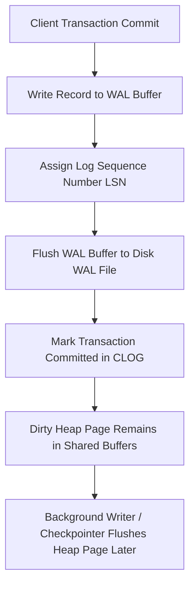
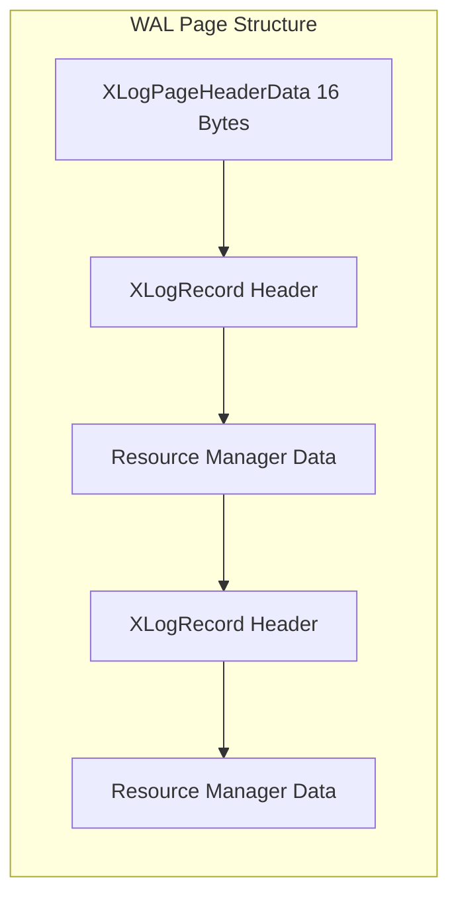
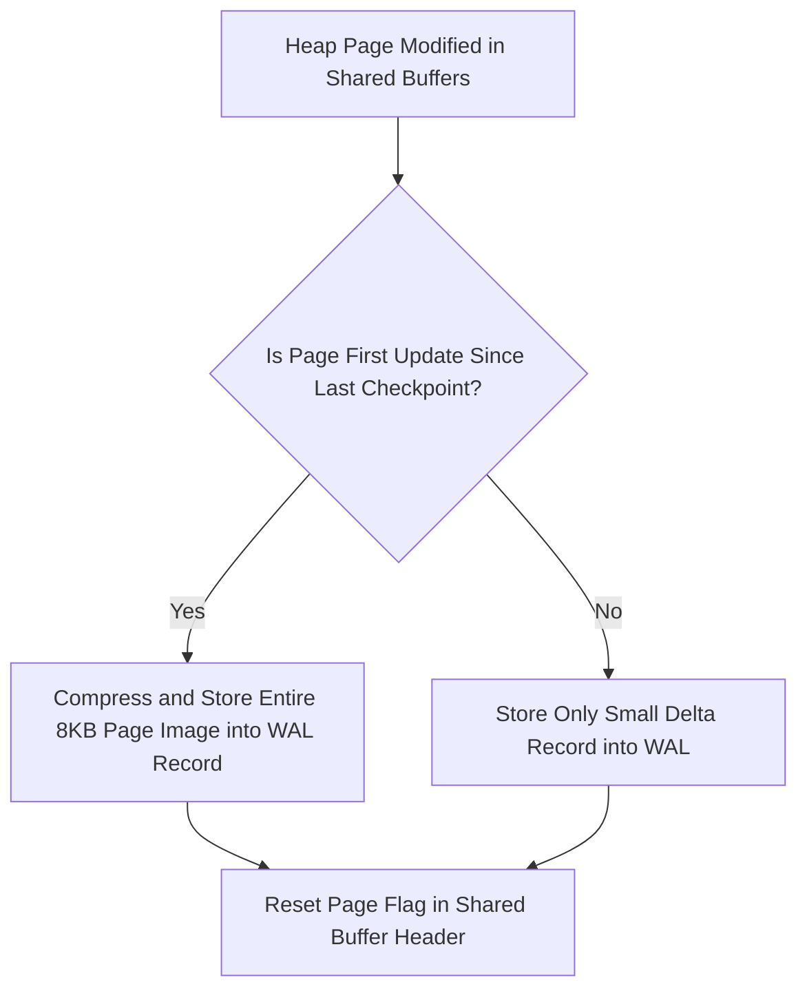
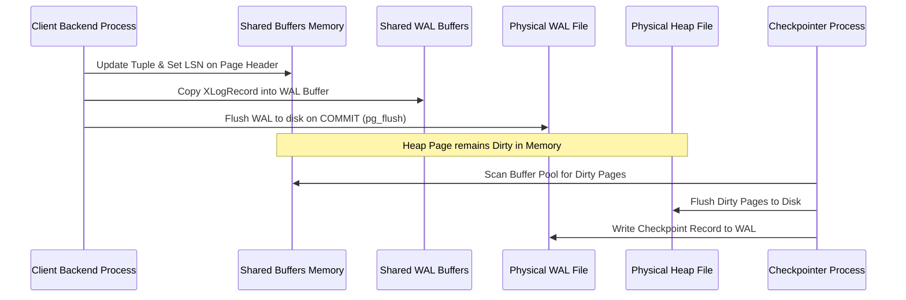
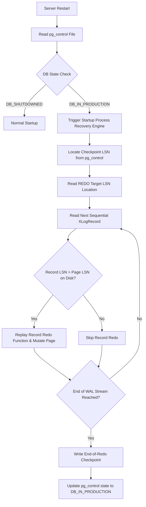

# Inside Postgres Write-Ahead Logging: LSN Architecture, Checkpoints, and Crash Recovery Engines

When a relational database updates a tuple on disk, writing that change directly to its home location in a 8KB heap file is extraordinarily expensive. Random I/O destroys throughput, and an operating system crash midway through writing an 8KB disk sector leaves the database with torn pages and corrupted state. Postgres solves this fundamental storage challenge through Write-Ahead Logging (WAL). Every state mutation is first formatted into a sequential log record and flushed to persistent storage before the actual heap page in memory is allowed to hit disk. 

This single invariant guarantees durability and atomicity while turning random disk writes into high-throughput append-only I/O. The actual mechanics of how log frames are structured, how Log Sequence Numbers track database time, how full-page writes prevent hardware page tearing, and how the startup engine executes crash recovery require a tight coordination between shared memory buffers, background kernel processes, and physical disk control structures.



## The Anatomy of Log Sequence Numbers and WAL Framing

Postgres tracks logical time and byte offsets across the entire log history using a 64-bit integer known as the Log Sequence Number, or LSN. An LSN is not a simple incremental counter. It represents the exact physical byte offset within the total append-only WAL stream generated by the cluster since initialization. In logs and diagnostic tools, an LSN is represented as two hexadecimal numbers separated by a slash, such as 0/1A3F8B0. The upper 32-bit integer represents the WAL log file sequence multiplier, while the lower 32-bit integer represents the byte offset inside that specific segment file.

WAL bytes are partitioned into 16 Megabyte segment files located in the pg_wal directory. Each file follows a 24-character hexadecimal naming scheme encoding the database timeline ID, the logical log number, and the segment file ID. Within these 16MB files, data is structured into strict 8KB WAL pages. The first page of every WAL segment begins with a page header structure defined as XLogLongPageHeaderData, whereas subsequent pages inside the same file use a shorter XLogPageHeaderData header.



Every individual transaction change inside a WAL page is wrapped in an XLogRecord. A WAL record consists of a fixed-size header followed by registered block references and resource manager specific payloads. The C structure layout in the Postgres source code defines the header layout cleanly.

```c
typedef struct XLogRecord
{
    uint32          xl_tot_len;     /* total length of record */
    TransactionId   xl_xact_id;     /* xact id or InvalidTransactionId */
    XLogRecPtr      xl_prev;        /* ptr to prev record in log */
    uint8           xl_info;        /* flag bits, see below */
    RmgrId          xl_rmid;        /* resource manager for this record */
    pg_crc32c       xl_crc;         /* CRC-32C checksum of record */
} XLogRecord;
```

The xl_rmid field maps to a specific Resource Manager responsible for interpreting the raw binary payload of the record. Postgres defines resource managers for distinct subsystems, including heap operations (RM_HEAP_ID), B-Tree indexes (RM_BTREE_ID), transaction state shifts (RM_XACT_ID), and sequence updates (RM_SEQ_ID). The xl_prev 64-bit pointer allows the recovery engine to traverse the record chain backwards if necessary during rollbacks or analysis.

## The Torn Page Problem and Full-Page Writes

An operating system flushes memory pages to physical disk storage in blocks that frequently do not align with the database 8KB page size. Modern hardware controllers write in 512-byte or 4096-byte sectors. If an unexpected power loss occurs while the operating system kernel is halfway through writing an 8KB Postgres heap page, four of the 512-byte sectors might hit disk while the remaining twelve sectors retain old data. The result is a torn page, a state where the page header on disk describes a state inconsistent with the tuples stored inside its tail.

Postgres cannot repair a torn page using standard WAL delta records because delta records only contain differential modification instructions, like inserting a single column value into a specific slot. Reapplying a delta to a corrupted, partially overwritten block produces an unrecoverable state.

To prevent this, Postgres uses Full-Page Writes (FPWs). Immediately following any checkpoint, the very first time a dirty heap page is modified in shared buffers, the transaction engine does not merely log the delta payload. Instead, it copies the entire 8KB page image into the WAL stream as an integrated backup block alongside the XLogRecord header. 



During recovery, if the engine encounters a record containing a full-page image, it completely overwrites the destination page on disk with that image, throwing away any torn page state. Once the base page is restored to a pristine condition, subsequent delta WAL records generated after that point can be applied safely.

## The Checkpointer, Background Writer, and Shared Memory Pipeline

Postgres manages table data in a large shared memory region called Shared Buffers. When an update query runs, the backend process locates the appropriate page in Shared Buffers, acquires an exclusive lock on the buffer header, modifies the page content in memory, sets the page LSN to the LSN returned by the WAL writer, and marks the buffer control structure as dirty.

Writing dirty buffers to disk immediately upon commit would ruin database throughput. Instead, transaction commits only enforce that WAL buffers up to the transaction commit LSN are written and sync'd to disk using fsync or fdatasync calls. The dirty heap pages remain in volatile Shared Buffers until one of two background engines writes them out to persistent block storage.



The Background Writer (bgwriter) runs continuously in a low-priority loop. It scans a small subset of the buffer pool using a clock-sweep algorithm, finds dirty pages that have not been accessed recently, writes them to disk, and frees up clean buffers. This ensures that client backend processes rarely have to wait for disk I/O when they need an empty buffer for new data.

The Checkpointer process operates on a macro cycle governed by time or log volume configuration parameters like checkpoint_timeout and max_wal_size. When a checkpoint triggers, the checkpointer takes a snapshot of all currently dirty buffer identifiers in the shared buffer pool. It sorts these buffer references by their physical file location to convert random disk seeks into smooth sequential storage writes.

The checkpointer slowly writes these dirty pages to disk, throttling its I/O using checkpoint_completion_target to avoid overwhelming the storage subsystem. Once all dirty pages logged at the start of the checkpoint are flushed and synchronized with fsync, the checkpointer writes a redo checkpoint record into the WAL stream and updates a master control document stored on disk: pg_control.

## The Architecture of pg_control

The pg_control file is a tiny 8KB binary file located in the global directory of the Postgres data cluster. It holds the ultimate source of truth regarding the state of the database engine. The file structure encapsulates essential state fields defined in C structures.

```c
typedef struct ControlFileData
{
    uint64          system_identifier;
    uint32          pg_control_version;
    DBState         state;              /* DB_STARTUP, DB_IN_PRODUCTION, DB_SHUTDOWNED */
    XLogRecPtr      checkPoint;         /* checkpoint record pointer */
    XLogRecPtr      prevCheckPoint;     /* previous checkpoint record pointer */
    CheckPoint      checkPointCopy;     /* checkpoint record data structure */
    XLogRecPtr      unloggedLSN;        /* LSN for unlogged relations */
    pg_time_t       time;
} ControlFileData;
```

When Postgres is running normally, the state field inside ControlFileData reads DB_IN_PRODUCTION. When the database shuts down cleanly via a fast or smart shutdown signal, the engine executes a final shutdown checkpoint, flushes all buffers, writes a shutdown checkpoint record, updates state to DB_SHUTDOWNED, and syncs pg_control to disk. 

If the host node loses power unexpectedly or the kernel kills the database process with SIGKILL, the shutdown sequence never runs. The state parameter inside pg_control remains flagged as DB_IN_PRODUCTION on disk. When the database server restarts, the startup process inspects pg_control, reads DB_IN_PRODUCTION, determines that an ungraceful crash occurred, and boots up the crash recovery engine.

## The Crash Recovery Engine: REDO Sequence

Crash recovery in Postgres follows a deterministic forward replay engine designed to bring every table, index, and system catalog back to a mathematically consistent state corresponding to the last committed transaction before the crash.



The startup process first extracts the checkpoint LSN pointer from the pg_control structure. It reads that specific checkpoint record from the historical WAL segment files. The checkpoint record contains a critical field: checkPointCopy.redo. This redo LSN marks the oldest byte offset in the log where a page dirty at the time of the checkpoint might have started being modified.

Recovery begins reading the log forward sequentially starting at checkPointCopy.redo. For every valid XLogRecord parsed along the path, the engine checks the block references embedded inside the record. For each affected relation block, the startup process reads the corresponding 8KB page from the table or index heap on disk into memory.

Inside every 8KB heap and index page header sits a 64-bit record pointer named pd_lsn. This value represents the exact LSN of the last modification that was physically flushed to disk for this specific page. The recovery engine performs a strict comparison logic.

If the LSN of the current WAL record being replayed is less than or equal to the page pd_lsn, the changes described in the log record are already present on disk. The recovery engine discards the record payload and moves to the next record.

If the record LSN is strictly greater than the page pd_lsn, the change in the record occurred after the page image on disk was last written. The recovery engine invokes the target Resource Manager redo function (such as heap_redo or btree_redo), modifies the page structure in memory, updates the page pd_lsn to match the current record LSN, and marks the page as dirty so it will be flushed to disk later.

If a page on disk was damaged due to a torn write, the engine encounters the full-page write block attached to the earliest WAL record touching that page after the checkpoint. The redo engine replaces the entire corrupt page with the full-page image stored in the WAL record, setting the base state, and then proceeds with normal forward delta application.

Recovery continues scanning through the log stream until it reaches the end of valid WAL records. Once the WAL stream is exhausted, the engine writes an end-of-recovery checkpoint record, updates pg_control to state DB_IN_PRODUCTION, opens up port sockets, and begins accepting incoming client database connections.
