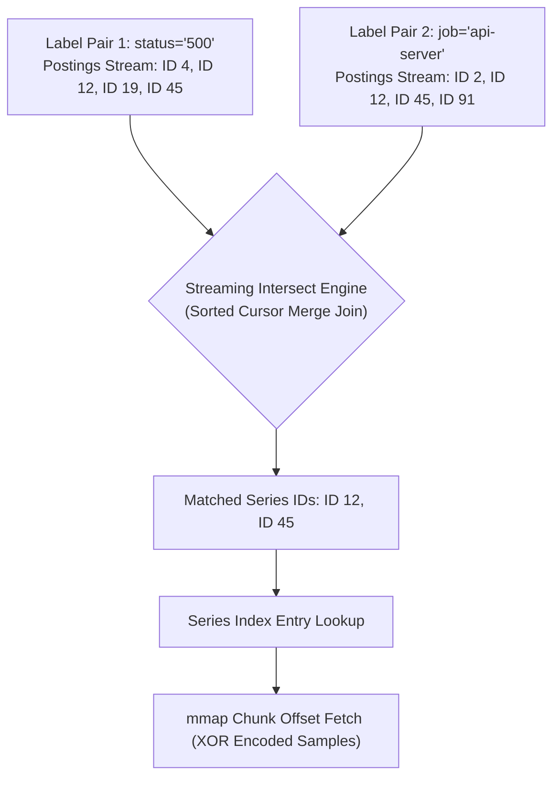

When you fire a query filtering across half a dozen key-value labels, the database cannot afford to scan gigabytes of raw metric samples. Metrics systems solve high-cardinality label lookups by decoupling label metadata from time-series sample arrays. In the Prometheus TSDB model, metrics are split into immutable multi-hour blocks. At the heart of each block sits an index file. This index file is a self-contained, memory-mapped inverted index designed to resolve label matchers into series identifiers, which then point directly to byte offsets in raw sample chunk files. Understanding how this index is laid out at the byte level reveals why query engines can intersect millions of metric streams in milliseconds without thrashing the system page cache.

The disk layout of a standard TSDB block relies on strict partitioning. Each block folder contains a chunk directory housing compressed time-series data, a tombstones file for soft deletes, a metadata JSON file, and the monolithic index file. The index file itself is structured into distinct contiguous sections ending with a trailing Table of Contents. When the TSDB opens a block on disk, it reads only the trailing Table of Contents byte array into memory. The rest of the index file is mapped into the virtual address space using the mmap system call. Because the index is read-only once written, the kernel can page index segments into memory on demand and discard clean pages under memory pressure without writing back to disk.

## Index File Binary Layout

The index file begins with a header containing a 4-byte magic number and a version byte, followed immediately by the symbol table. In modern infrastructure, label names and label values repeat constantly across millions of metrics. Storing raw string keys like environment or instance on every series would explode disk consumption. The symbol table solves this by deduplicating all string references into a single sorted dictionary. Each string in the symbol table is encoded with a varint length prefix followed by UTF-8 bytes. Every subsequent structure in the index file refers to strings by their zero-indexed position or byte offset within this symbol table rather than re-storing the literal characters.

Following the symbol table comes the series section. A series entry maps a single unique time-series identifier, represented as a 32-bit integer, to its full set of label pairs and its list of time-bounded sample chunks. The labels are encoded as references to the symbol table. Immediately following the label tuples is the chunk meta list. Each chunk entry specifies the minimum timestamp, maximum timestamp, file reference index, and exact byte offset of the compressed XOR sample chunk inside the chunk directory. This structure creates a direct pointer chain. Once a query engine isolates a series integer ID, it reads the series entry from the index, extracts the byte offset for the target time window, and hands off the pointer to the sample decoder.

## Postings Lists and Multi-Label Intersections

The mechanism that translates arbitrary queries into series IDs is the postings engine. A posting is simply a series integer ID. A postings list is an ordered array of series IDs that share a specific label pair, such as job equals api-server. When the TSDB builds an index, it compiles every unique label pair into an entry in the label index section, pointing to a dedicated postings offset.

Queries rarely request a single label pair. Most requests involve composite matchers combining multiple equality and regex selectors. To evaluate a query with multiple matchers, the engine retrieves the individual postings list for each label pair and executes set intersections. Because postings lists are stored in strictly ascending order of series IDs, the query engine does not perform hash joins. Instead, it uses a multi-way merge intersection algorithm.

The merge engine streams through the postings lists simultaneously using cursor pointers. If cursor A points to series ID 4 and cursor B points to series ID 2, cursor B advances because 2 is smaller than 4. When both cursors match on series ID 12, ID 12 is emitted to the output stream. This lock-step iterator design processes thousands of matching series with linear time complexity while consuming minimal working memory, since only small posting buffers are maintained in memory at any given time.

## Variable-Width Integer Encoding and Delta Compression

Storing raw 32-bit series IDs in postings streams would create immense storage overhead for high-cardinality environments. To shrink postings lists, TSDB applies variable-length quantity encoding combined with delta compression. Because postings lists are guaranteed to be sorted, the index engine records the absolute series ID for the first entry, and thereafter stores only the numeric delta between consecutive series IDs.

In a system with densely packed series IDs, consecutive metrics sharing a label often have deltas as small as 1 or 2. When encoded using unsigned varints, these small integers fit into a single byte instead of 4 bytes. A postings list containing tens of thousands of series IDs can shrink from tens of kilobytes down to a tiny fraction of that size. Decoding this stream during query execution requires sequential byte traversal, but the reduction in disk read volume and CPU cache misses drastically outweighs the bit-shifting cost of varint decoding.

## Execution Path of a Complex Label Query

Tracing the full lifecycle of a query illustrates how these binary layers harmonize. Consider a query searching for high-latency HTTP requests across a subset of clusters. The query engine begins by looking up the label names and values in the symbol table to verify their presence. Next, it reads the offset tables to locate the exact byte positions of the postings lists matching each label pair.

The postings streams are memory-mapped directly from disk into cursor iterators. The query engine streams the postings lists through the intersection operator, yielding a finalized list of target series IDs. For each matching series ID, the engine performs a lookup in the series section of the index file to extract the chunk metadata array. It filters the chunk metadata by the query time range, isolating only the chunks whose minimum and maximum timestamps overlap the requested window. Finally, the engine accesses the byte offsets within the chunk files, leveraging zero-copy memory mapping to stream compressed float64 sample arrays straight into the aggregator pipeline. By bypassing intermediate object allocations and operating directly over packed byte buffers, the index architecture ensures that throughput stays high even under heavy concurrent query load.
