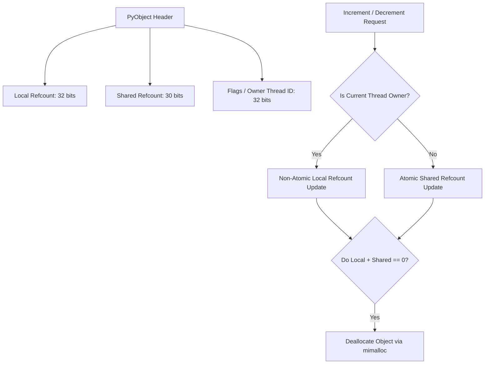
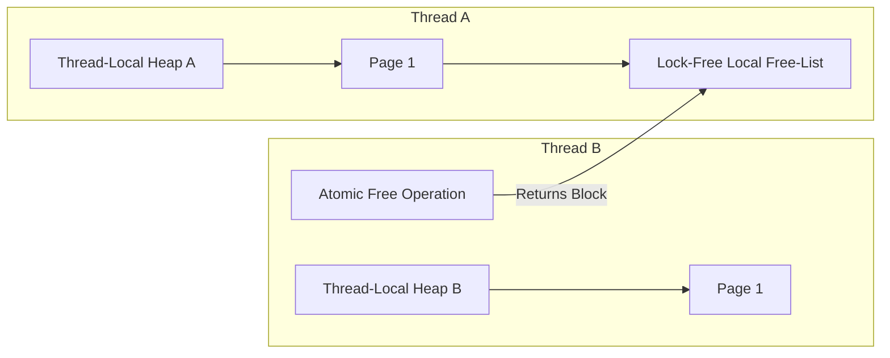

For over three decades, the Global Interpreter Lock, or the GIL, has been both the savior and the curse of CPython. It made memory management dead simple and ensured that single-threaded performance was blazing fast for its time. It also protected CPython's internal state from race conditions, making the execution of C extensions highly predictable. But as CPU architectures shifted from scaling clock speeds to packing more cores on a single die, the GIL became an architectural bottleneck. Developers were forced to use heavy-handed workarounds like the multiprocessing module, which incurs massive serialization overhead and wastes memory. 

Python 3.13 introduces an experimental free-threaded mode under PEP 703 that finally makes the GIL optional. Removing the GIL is not as simple as wrapping every internal CPython function in a mutex. Doing so would cripple single-threaded execution speed and cause massive thread contention. To make free-threading viable, the CPython core team had to redesign the runtime's memory allocator, completely reinvent reference counting, and rewrite the core collection types to support highly concurrent access without global locks.

### The Cache Line Bouncing Catastrophe

To understand why removing the GIL is such a monumental challenge, we have to look at how standard Python tracks object lifespans. Standard CPython uses basic reference counting. Every time a variable is assigned, passed to a function, or added to a list, the runtime increments the object's `ob_refcnt` field. When a reference goes out of scope, the runtime decrements it. If that count hits zero, the memory is immediately reclaimed. 

In a single-threaded environment, incrementing and decrementing a 64-bit integer is incredibly cheap. It is a simple write to memory. But in a multi-threaded environment without a GIL, these reference count operations must be thread-safe. If two threads concurrently execute `Py_INCREF` on the same object, a standard non-atomic addition will cause a data race, leading to reference leaks or premature deallocation. 

The naive fix is to make all reference count updates atomic using CPU-level instructions like `LOCK XADD` on x86-64. While this ensures correctness, it destroys performance. Atomic operations bypass CPU cache hierarchies and force synchronization across cores. Under the MESI cache coherence protocol, when a core performs an atomic write to a shared variable, it must send an invalidation message to all other cores holding that cache line. The cache line containing the object's header is forced to bounce constantly between different cores. This cache line bouncing saturates the interconnect bus, stalling the execution of otherwise independent threads.

### Biased Reference Counting to the Rescue

To bypass the cache line bouncing problem, CPython 3.13 implements a technique called Biased Reference Counting. The core insight is that in most applications, a Python object is primarily accessed and modified by the single thread that created it. Biased Reference Counting exploits this asymmetry by splitting the reference count into a local count and a shared count.

Every Python object header is expanded to include an owner thread identifier and a split reference count field. The local reference count is updated exclusively by the owning thread. Because only the owner writes to this field, the operation does not require atomic instructions and can utilize standard, high-speed L1 cache writes. 

When a foreign thread needs to increment or decrement the object's reference, it cannot write to the local count. Instead, it must issue an atomic update to the shared reference count field. This architectural split keeps the hot path for the owner thread extremely fast. When the owner thread wants to determine if an object can be safely destroyed, it combines the local and shared counts. If the aggregate sum drops to zero, the object is freed. If a non-owner thread notices that the shared count has reached a point indicating potential deallocation, it triggers a slow-path reconciliation loop that coordinates with the owner thread to safely reclaim the memory.

Besides biased reference counting, the runtime also utilizes deferred reference counting for highly shared, read-mostly objects. Code objects, modules, and interned strings are modified rarely but read constantly across many threads. For these objects, CPython flags them as immortal or deferred, instructing the runtime to bypass reference counting entirely during standard execution. The cyclic garbage collector takes over the job of tracking their lifespans, completely eliminating the reference counting overhead on these hot global structures.

### Scaling Memory Allocation with Mimalloc

CPython’s traditional memory allocator, `obmalloc`, was designed with the explicit assumption of single-threaded execution. It manages small object allocations by carving up larger memory blocks into pools and arenas. Because it was protected by the GIL, `obmalloc` did not contain any internal locking mechanisms. Removing the GIL and simply adding a mutex to `obmalloc` would turn the memory allocator into a massive global bottleneck.

To solve this, Python 3.13 replaces `obmalloc` with a highly customized integration of Microsoft's `mimalloc`. Mimalloc is a thread-safe, high-performance memory allocator designed around thread-local heaps. 

Under this architecture, each OS thread maintains its own private allocator heap. When Thread A requests memory for a new list, it allocates the block directly from its local heap without acquiring any locks. The real engineering magic happens during deallocation. It is common for Thread A to allocate an object, pass it to Thread B, and have Thread B destroy it when it is finished. If Thread B were to write directly to Thread A's local heap, it would introduce race conditions.

Mimalloc solves cross-thread deallocations using an elegant, lock-free design. Each memory page managed by a thread-local heap contains two distinct free lists. First, there is a private local free list that only the owning thread can access. Second, there is a lock-free, atomic non-local free list. When Thread B frees an object belonging to Thread A's heap, it performs an atomic push operation onto Thread A's non-local free list. When Thread A later attempts to allocate more memory and finds its private free list empty, it sweeps its non-local free list, transferring all those atomic entries back to its private list in a single, rapid operation. This separation ensures that allocation stays lock-free and thread-local in almost all scenarios.

### Thread-Safe Dicts and the Death of Global Locks

Dictionaries are the foundational building block of the Python runtime. Namespaces, module scopes, class definitions, and instance variables are all stored in dictionaries under the hood. In a free-threaded runtime, multiple threads must be able to read, write, and resize dictionaries simultaneously without blocking each other.

Historically, CPython dictionaries were structured as a compact array of indices pointing into an array of entries containing the actual keys, hashes, and values. In Python 3.13, this layout is retrofitted with fine-grained locking and transactional states. The runtime introduces a per-dictionary lock alongside a highly optimized read path.

To keep dictionary reads fast, the runtime implements a readers-writer lock mechanism that allows arbitrary concurrent read access. When Thread A is looking up a key in a shared dictionary, it does not acquire a heavy mutex. Instead, it performs a lock-free sequence that reads the keys and values using memory barriers. These barriers guarantee that Thread A always sees a consistent state of the internal pointers, even if another thread is currently modifying a different entry.

If Thread B attempts to write to the dictionary while Thread A is reading, the behavior depends on whether the write triggers a resize. For simple updates where a value is being overwritten or a new key is added without exceeding the current capacity, Thread B acquires a fine-grained, entry-specific lock. It modifies the memory block atomically. If Thread B must resize the entire hash table, it acquires the dictionary's global write lock. This lock blocks all other writers and coordinates with active readers by utilizing a hazard pointer mechanism, ensuring that readers do not access freed memory during the table swap.

### Garbage Collection in a Multi-Core World

CPython’s cyclic garbage collector is responsible for detecting and cleaning up reference cycles, such as Object A referencing Object B, which in turn references Object A. In the standard runtime, the cyclic garbage collector runs periodically during allocation checkpoints. Because the GIL guarantees that no other threads are mutating the object graph, the collector can safely traverse all tracked objects and isolate unreachable cycles.

Without the GIL, a stop-the-world mechanism is mandatory. If the garbage collector attempted to traverse the object graph while other worker threads were concurrently mutating reference counts and altering object pointers, the collector would read garbage data, potentially destroying live objects. 

Python 3.13 handles this by implementing a lightweight coordination protocol. When the garbage collector decides it is time to run, it issues a global pause request. All active worker threads check for this pause flag at safe execution boundaries, such as loop iterations, function entries, or system calls. Once all worker threads have parked themselves in a suspended state, the garbage collector runs its cycle on a single thread, sweeping the memory heap without fear of concurrent mutations. Once finished, it signals the worker threads to resume execution. While stop-the-world pauses are generally avoided in high-performance runtimes, CPython minimizes their impact by running the cyclic collector less frequently, relying heavily on biased reference counting to handle the vast majority of memory cleanup tasks in real-time.

### The Path Forward for Extensions

Removing the GIL from the core interpreter is only half the battle. The broader Python ecosystem relies on thousands of C extensions, from NumPy and Pandas to database drivers and cryptography libraries. Many of these extensions rely on the implicit thread safety provided by the GIL.

To prevent catastrophic crashes, CPython 3.13 introduces a dual-binary approach. When compiling extensions, developers must explicitly opt into the new multi-threaded ABI. If a user attempts to load an older C extension that has not been verified as thread-safe in a free-threaded Python environment, the runtime will automatically re-enable the GIL for that process. This design choice protects users from silent memory corruption while giving library maintainers the time they need to port their codebases to utilize fine-grained locking and thread-safe APIs.

This shift represents the most significant architectural change to Python since the 2-to-3 transition. By restructuring the lowest levels of the virtual machine, from biased reference counting and mimalloc allocation to lock-free dictionary states, CPython has laid a modern foundation that allows Python applications to scale directly with the number of CPU cores.
