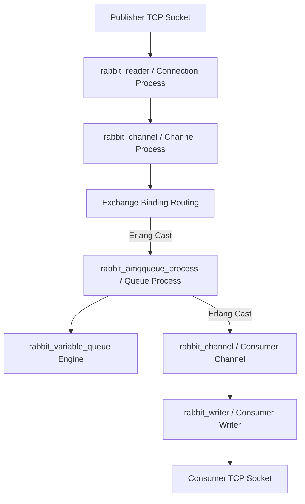
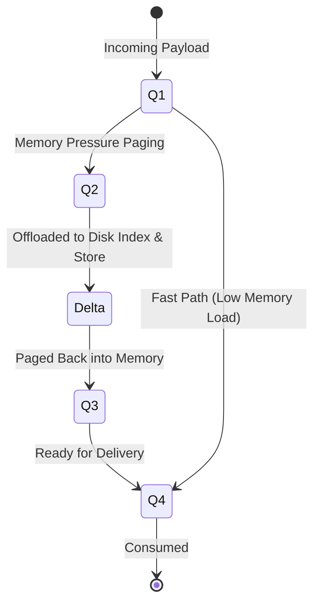
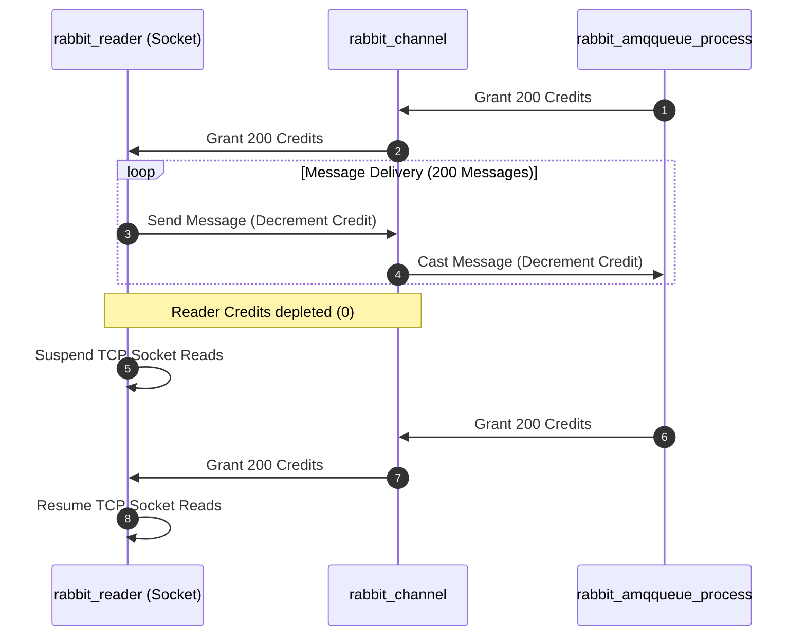

Most developers treat RabbitMQ as a reliable black box. You publish a message to an exchange, a routing key directs it into a queue, and a worker pulls it off the other side. This abstraction holds up fine under light load, but when consumers stall or traffic spikes by an order of magnitude, the abstraction leaks quickly. Queues swell, memory consumption climbs, and suddenly the broker stops accepting publishes altogether.

To understand why RabbitMQ behaves the way it does under load, you have to look past the AMQP protocol and examine the BEAM Virtual Machine infrastructure beneath it. RabbitMQ does not use a single monolithic lock-based queue or a global dispatch thread. Instead, it builds an entire distributed system inside a single BEAM node, using isolated Erlang processes, specialized disk-paging state machines, and an internal credit system that pushes back against fast producers.

## The BEAM Process Topology of a Single Queue

Every queue in RabbitMQ is not merely a data structure sitting in memory. It is a lightweight Erlang process running its own isolated event loop with its own private heap. When a publisher sends a message over a TCP connection, that message passes through a hierarchy of dedicated processes before ever touching the queue's internal state.



The networking layer begins with the connection process, represented by the `rabbit_reader` module. This process owns the underlying TCP socket, decodes incoming AMQP frames, and manages TLS decryption. Because multiple logical AMQP channels multiplex over a single TCP connection, `rabbit_reader` routes decoded frames to their respective channel processes (`rabbit_channel`).

The channel process performs exchange routing lookups. It queries internal Mnesia and ETS memory tables to evaluate binding keys against the exchange configuration. Once it identifies the target queues, the channel process does not invoke a thread-safe method or acquire a lock. It issues an asynchronous Erlang process message cast directly to the `rabbit_amqqueue_process` instance representing that queue.

Because Erlang processes share no mutable memory, messages pass between processes via copying or reference counts for large payloads. This isolation guarantees that a locked-up queue process processing a massive backlog cannot corrupt the execution frame or stall the scheduler of adjacent queues. However, it also means the queue process itself becomes a single-threaded bottleneck for that specific logical queue.

## The Five-Stage Backing Queue Engine

Inside `rabbit_amqqueue_process`, message storage and retrieval are managed by the backing queue implementation, usually `rabbit_variable_queue`. The fundamental problem `rabbit_variable_queue` solves is balancing high-throughput in-memory message delivery with memory safety when queues grow larger than available RAM.

Instead of treating memory and disk as binary state, `rabbit_variable_queue` moves messages through a five-stage assembly line depending on consumer rate and system memory pressure. These five internal queues are known as Q1, Q2, Delta, Q3, and Q4.



State Q1 holds fresh incoming messages that reside purely in memory. Under normal conditions, when consumers are keeping pace with publishers, messages bypass the deep paging pipeline entirely. They land in Q1, jump directly to Q4, and are immediately pushed down the consumer channel process to the client socket. This fast path operates entirely in RAM without touching disk.

When consumers slow down or stop, messages accumulate in memory. As the node approaches its memory high-watermark threshold, the queue engine transitions into a memory preservation mode. Messages in Q1 transition into Q2, where their payloads are staged for disk offloading. From Q2, the message body and index entries are written to disk, and the message enters the Delta queue state.

In the Delta state, the message payload resides entirely on disk, and its RAM footprint is reduced to a minimal pointer entry in the queue index. The Delta state can scale to millions of messages without crashing the BEAM node because it consumes almost zero heap overhead. 

When consumers finally resume processing, the queue engine moves messages out of Delta into Q3, loading message bodies back from disk into RAM. From Q3, messages progress to Q4, which acts as the terminal in-memory queue waiting for consumer acknowledgments. This unidirectional progression ensures that the queue process processes disk reads and writes in predictable, sequential bursts rather than erratic random I/O pattern spikes.

## Message Disk Allocation: Index versus Message Store

When `rabbit_variable_queue` pages data to disk, it makes a crucial distinction based on payload size. Writing thousands of tiny 200-byte telemetry events as individual file operations would cripple disk throughput due to filesystem metadata overhead. Conversely, writing massive 10MB payloads into sequential log files causes severe read amplification when random consumers acknowledge isolated messages out of order.

RabbitMQ splits disk persistence into two subsystems: the Queue Index (`rabbit_queue_index`) and the Message Store (`rabbit_msg_store`).

```
+--------------------------------------------------------------------+
|                        rabbit_variable_queue                       |
+--------------------------------------------------------------------+
                                  |
           +----------------------+----------------------+
           | Payload <= 4096 bytes| | Payload > 4096 bytes|
           v                      v                      v
+-----------------------+   +----------------------------------------+
|  rabbit_queue_index   |   |           rabbit_msg_store             |
| (.idx segment files)  |   |          (.rdq segment files)          |
| Embedded Msg + Status |   | Message Payload | Msg Ref Pointer      |
+-----------------------+   +-----------------+----------------------+
```

Messages smaller than a configurable threshold, which defaults to 4096 bytes, bypass the Message Store entirely. The backing queue embeds the entire message header and body directly inside the Queue Index segment files (`.idx`). This reduces write operations to a single append operation per small message.

For payloads larger than 4KB, the broker writes the message body into central, pre-allocated Message Store file segments (`.rdq`). The Queue Index receives only a lightweight reference containing the segment file ID, offset, and payload length. When a message is acknowledged and removed, the Queue Index marks the slot as deleted. The Message Store tracks garbage accumulation across segment files and runs background compaction threads when fragmented dead bytes exceed configured thresholds.

## Credit-Based Backpressure and Flow Control

Because process messaging in Erlang is asynchronous and non-blocking by default, a hyper-active publisher connection could easily flood an downstream process mailbox faster than the queue process can execute its internal state machine. If left unchecked, the mailbox size of `rabbit_amqqueue_process` would grow until memory exhausted, leading to OOM-killer termination.

RabbitMQ handles this without blocking threads using an internal credit-based flow control mechanism. Instead of relying purely on TCP windowing, processes issue explicit computational credits to upstream dependencies.



When a channel wants to send messages to a queue, it must hold positive queue credits. Similarly, the `rabbit_reader` connection process must hold channel credits before pushing decoded frames down to `rabbit_channel`. Default credit allocations usually start at 200 units.

Every message cast decrements the local credit counter by 1. Once a process exhausts its credits for a downstream target, it enters a suspended state for that specific path. It stops reading frames off the inbound socket, leaving data buffered in the kernel's native TCP receive buffer (`SO_RCVBUF`).

As the downstream queue process processes messages, updates disk state, or flushes buffers, it periodically sends credit top-up messages back upstream. Once `rabbit_channel` receives fresh credits, it grants credits back to `rabbit_reader`, which promptly resumes reading from the network socket. This flow control operates dynamically per channel, preventing a slow queue from blocking unrelated channels operating over the exact same physical TCP connection.

## Erlang Garbage Collection and Memory Alarms

Even with disk paging and credit limits, memory allocation spikes can happen when millions of transient references pass through the runtime. In the BEAM VM, binary payloads larger than 64 bytes are allocated on a shared global heap using reference-counted pointers called Refc Binaries. Processes hold tiny pointers in their local heaps that reference these shared byte arrays.

Under high throughput, a channel or queue process might release its local pointer to a message payload, but the shared binary allocation on the global heap remains allocated until both the process heap garbage collector runs and the reference count drops to zero. If the process is executing tightly optimized loop functions without triggering internal heap allocation thresholds, Erlang GC may delay running for several hundred milliseconds.

To prevent catastrophic host memory depletion, RabbitMQ runs a background memory monitor process. When host memory usage crosses the configured alarm limit, such as 40 percent of total available physical RAM, the broker fires a cluster-wide memory alarm.

Upon alarm triggering, the connection supervisor immediately forces all connection reader processes (`rabbit_reader`) into a blocked state. Socket reads cease entirely across all publishing clients. The broker holds incoming traffic strictly in the client kernel TCP buffers until active queue processes finish paging pending in-memory payloads to disk, run full process-level garbage collection sweeps, and drop total host memory below the alarm threshold.
