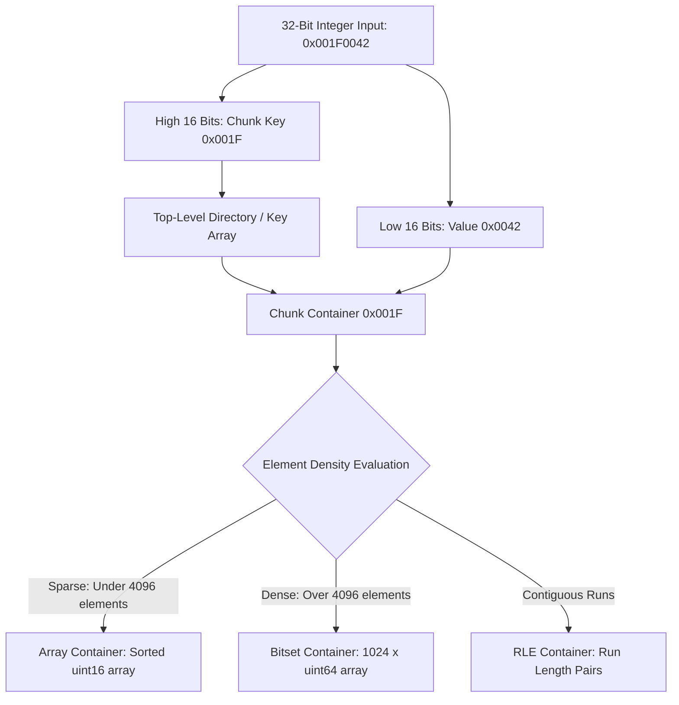

High-cardinality telemetry systems process millions of distributed trace identifiers, log attributes, and metric series per second. Evaluating multi-attribute filters across vast integer document IDs demands inverted indexes that execute set operations at hardware speeds. Traditional bitmap indexes allocate fixed bit arrays across the integer space, consuming excessive memory when data is sparse. Compressed bitmap formats like Word-Aligned Hybrid (WAH) or Byte-Aligned Bitmap Compression (BBC) reduce memory overhead but introduce computational bottlenecks during bitwise logic due to variable-length decoding overhead.

Roaring Bitmaps resolve this trade-off by partitioning a 32-bit integer space into fixed chunks of $2^{16}$ (65,536) values. Each chunk uses the upper 16 bits as a key in a top-level directory and stores the lower 16 bits inside specialized, dynamically transitioning container structures optimized for data density.



### The Anatomy of Roaring Containers

Every Roaring Bitmap instance contains a sorted array of 16-bit keys mapped to container pointers. When a 32-bit integer is inserted, the engine extracts the high 16 bits via a bit shift (`value >> 16`) to locate or allocate the corresponding container. The low 16 bits (`value & 0xFFFF`) are passed into the target container. Containers fall into three distinct internal layouts:

1. Array Container: Stores explicitly listed 16-bit integers in sorted order using contiguous `uint16_t` memory buffers. This layout is used when a chunk contains fewer than 4,000 elements. Searching inside an Array Container uses binary search or SIMD vector comparisons.

2. Bitset Container: Allocates a fixed 8 KB memory buffer represented as an array of 1,024 64-bit unsigned integers (`uint64_t`). It directly maps all 65,536 possible lower-16-bit values to individual bits. Setting value `N` turns on bit `N % 64` within word `N / 64`.

3. Run-Length Encoded (RLE) Container: Stores sequences of continuous integers as pairs of `[start_value, length]`. If a telemetry series generates monotonically increasing sequence IDs (such as trace timestamps spanning consecutive intervals), RLE containers collapse thousands of contiguous integers into a few bytes.

### The Mathematical Threshold for Container Conversion

The 4,096-element boundary between Array Containers and Bitset Containers is a precise memory equivalence point. An Array Container with $N$ elements consumes $2 \times N$ bytes of payload memory. A Bitset Container covering 65,536 bits always consumes exactly $65,536 / 8 = 8,192$ bytes (8 KB).

When an Array Container reaches 4,096 elements, its payload memory equals $2 \times 4096 = 8,192$ bytes. Beyond 4,096 elements, an Array Container uses more memory than a Bitset Container while offering slower $O(\log N)$ lookup performance compared to the Bitset's $O(1)$ bit-indexing time. The engine dynamically converts the Array Container into a Bitset Container at element 4,097.

```
Array Container Memory:  Size = N * 2 bytes
Bitset Container Memory: Size = 8,192 bytes (fixed)

Equivalence Point:
  2 * N = 8,192  =>  N = 4,096 elements

  If N < 4096: Array Container is more memory efficient.
  If N > 4096: Bitset Container is more memory efficient and faster.
```

### Dynamic Bitset Conversion and Mutation Mechanics

When a mutation occurs on a Roaring Bitmap, the target container evaluates whether its internal representation must change. The code below demonstrates how a low-level C++ runtime manages container growth and structural transitions when writing values into an inverted index.

```cpp
#include <cstdint>
#include <vector>
#include <cstring>
#include <algorithm>

struct ArrayContainer {
    std::vector<uint16_t> content;
};

struct BitsetContainer {
    uint64_t words[1024];
    int32_t cardinality;
    
    BitsetContainer() : cardinality(0) {
        std::memset(words, 0, sizeof(words));
    }
};

enum ContainerType { ARRAY, BITSET, RLE };

struct Container {
    ContainerType type;
    void* ptr;
};

Container add_to_array(ArrayContainer* arr, uint16_t val) {
    auto it = std::lower_bound(arr->content.begin(), arr->content.end(), val);
    if (it != arr->content.end() && *it == val) {
        return Container{ARRAY, arr}; // Value already exists
    }
    
    if (arr->content.size() < 4096) {
        arr->content.insert(it, val);
        return Container{ARRAY, arr};
    }
    
    // Conversion Threshold Exceeded: Upgrade Array to Bitset
    BitsetContainer* bitset = new BitsetContainer();
    for (uint16_t v : arr->content) {
        bitset->words[v >> 6] |= (1ULL << (v & 0x3F));
    }
    bitset->words[val >> 6] |= (1ULL << (val & 0x3F));
    bitset->cardinality = static_cast<int32_t>(arr->content.size() + 1);
    
    delete arr;
    return Container{BITSET, bitset};
}

void insert_integer(std::vector<uint16_t>& keys, std::vector<Container>& containers, uint32_t val) {
    uint16_t high = static_cast<uint16_t>(val >> 16);
    uint16_t low = static_cast<uint16_t>(val & 0xFFFF);
    
    auto it = std::lower_bound(keys.begin(), keys.end(), high);
    size_t index = std::distance(keys.begin(), it);
    
    if (it == keys.end() || *it != high) {
        // New chunk required: initialize as sparse Array Container
        ArrayContainer* arr = new ArrayContainer();
        arr->content.push_back(low);
        keys.insert(it, high);
        containers.insert(containers.begin() + index, Container{ARRAY, arr});
        return;
    }
    
    // Update existing container
    Container& c = containers[index];
    if (c.type == ARRAY) {
        c = add_to_array(static_cast<ArrayContainer*>(c.ptr), low);
    } else if (c.type == BITSET) {
        BitsetContainer* bs = static_cast<BitsetContainer*>(c.ptr);
        uint64_t word_idx = low >> 6;
        uint64_t bit_mask = 1ULL << (low & 0x3F);
        if ((bs->words[word_idx] & bit_mask) == 0) {
            bs->words[word_idx] |= bit_mask;
            bs->cardinality++;
        }
    }
}
```

### SIMD-Accelerated Operations across Heterogeneous Containers

Executing high-speed queries across millions of trace records requires intersecting (`AND`), unioning (`OR`), and subtracting (`XOR`) thousands of Roaring Bitmaps. Because containers are isolated per 16-bit key chunk, operations are evaluated pairwise between corresponding containers.

When two Bitset Containers are intersected, modern telemetry query engines leverage SIMD vector extensions like AVX2 or AVX-512 to process multiple 64-bit words per CPU cycle. An AVX-512 register (`zmm`) loads eight 64-bit words simultaneously, applying bitwise logic instructions and hardware population counts (`popcnt`) to compute set cardinality without branching.

```cpp
#include <immintrin.h>

void bitset_intersection_avx512(const uint64_t* __restrict src1, 
                                const uint64_t* __restrict src2, 
                                uint64_t* __restrict dest, 
                                uint32_t& out_cardinality) {
    uint32_t card = 0;
    for (size_t i = 0; i < 1024; i += 8) {
        // Load 512-bit vectors (8 x uint64_t)
        __m512i v1 = _mm512_loadu_si512((const __m512i*)&src1[i]);
        __m512i v2 = _mm512_loadu_si512((const __m512i*)&src2[i]);
        
        // Compute bitwise AND across 512 bits in a single cycle
        __m512i res = _mm512_and_si512(v1, v2);
        _mm512_storeu_si512((__m512i*)&dest[i], res);
        
        // Extract word bits and aggregate hardware popcount
        for (int k = 0; k < 8; ++k) {
            card += _mm_popcnt_u64(dest[i + k]);
        }
    }
    out_cardinality = card;
}
```

When intersecting heterogeneous container types (for instance, an Array Container with a Bitset Container), the engine avoids converting formats. Instead, it iterates through the sorted array elements of the Array Container, directly checking bit positions in the target Bitset Container using bit-shift shifts (`words[val >> 6] & (1ULL << (val & 0x3F))`). This hybrid path eliminates temporary memory allocations and maximizes CPU L1 cache hits.

### Vectorized Processing for Telemetry Query Pipelines

In inverted telemetry index engines, log attributes and span tags map to Roaring Bitmaps representing matching internal document IDs. Query execution engines evaluate incoming filter predicates by combining container pipelines using SIMD bitwise execution.

1. Index Lookup: The query parser resolves tag predicates (such as `http.status_code = 500` and `service.name = auth-service`) into two Roaring Bitmap pointers.

2. Key Alignment: The engine performs a two-pointer merge join over the sorted 16-bit key arrays of both bitmaps, pairing up identical chunk keys.

3. Container Dispatch: Paired containers are passed to vectorized kernel functions tuned to their combination type (Bitset-Bitset, Array-Bitset, or RLE-RLE).

4. Materialization: The resulting set of set bits yields compressed matching document IDs, which are passed directly to columnar block decoders for zero-copy field retrieval.

By matching storage layouts directly to data density and mapping set operations directly to vectorized host CPU instruction sets, Roaring Bitmaps achieve execution speeds orders of magnitude faster than uncompressed indexes while maintaining a negligible memory footprint.