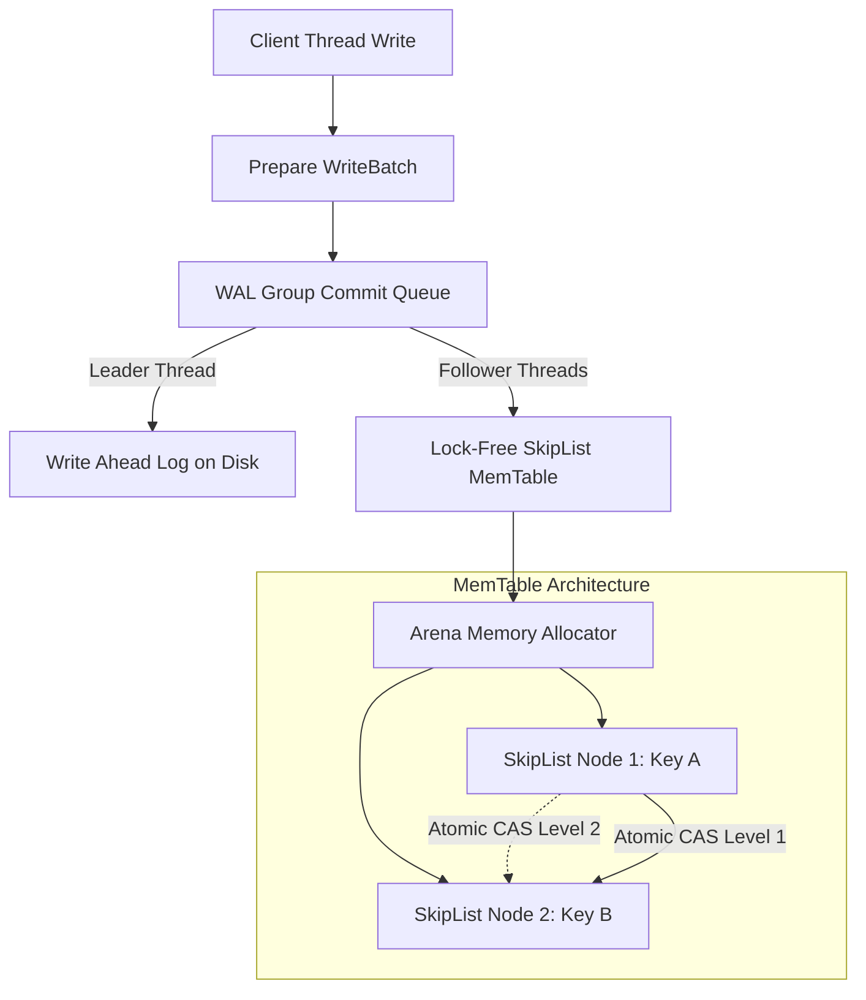
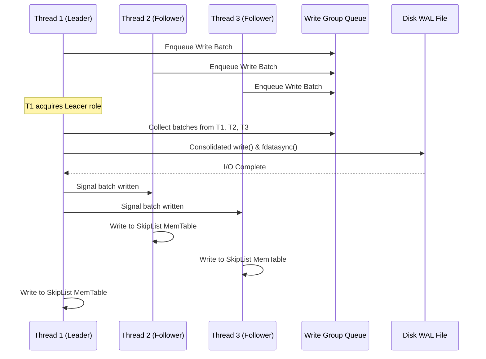
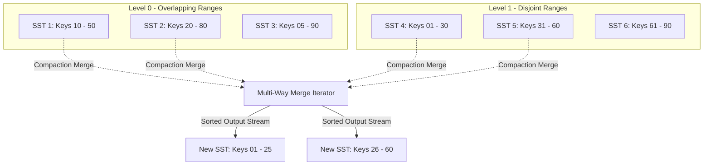

RocksDB sits at the foundation of modern high-throughput distributed systems. Infrastructure like CockroachDB, TiKV, Kafka Streams, and Apache Flink relies on its embedded key-value engine to handle persistent storage and state management. While high-level database abstraction layers handle SQL parsing, query planning, and distributed consensus, the raw storage engine must process millions of write operations per second while maintaining predictable tail latencies and crash resilience.

Understanding how RocksDB achieves this requires bypassing abstractions to examine the memory layouts, thread synchronization pipelines, and disk compaction algorithms that define its architecture. The core design centers around the Log-Structured Merge-tree (LSM-tree), which converts random write operations into sequential disk access. Executing this model efficiently at scale requires complex concurrency engineering across memory and disk.

### The Anatomy of a Write Operation

When an application calls `db->Put()`, RocksDB processes the write through a tightly controlled pipeline. The operation cannot modify existing data on disk in place because in-place random writes introduce severe storage medium latency and flash memory wear. Instead, the write must hit both the Write-Ahead Log (WAL) on disk for crash recovery durability and the active MemTable in memory for immediate visibility.



The internal pipeline begins by wrapping the key-value pair, sequence number, and operation type into a `WriteBatch`. Sequence numbers provide the foundation for MVCC isolation. Every write operation increments a global 64-bit sequence counter, attaching this metadata directly to the record key format. Once packaged, the batch enters a thread synchronization queue to write to the WAL and active MemTable.

### Lock-Free SkipList MemTable Architecture

To maximize ingestion speed, the active MemTable must accept writes from hundreds of concurrent application threads without suffering from lock contention. RocksDB uses a lock-free SkipList as its primary MemTable data structure. SkipLists provide log-time search, insertion, and deletion guarantees similar to balanced binary trees, but their linear node structures allow efficient lock-free concurrent updates via atomic compare-and-swap pointer operations.

A SkipList consists of ordered linked lists organized into probabilistic height levels. A new node insertion generates a random height based on a branching factor, usually set to four, meaning a node has a twenty-five percent probability of extending to each subsequent height level. To insert a key without blocking concurrent readers or writers, RocksDB allocates node memory out of an Arena allocator, minimizing heap fragmentation and malloc locks. The inserting thread calculates pointer offsets for each level of the new node and executes atomic Compare-And-Swap (CAS) instructions to re-link pointers starting from the bottom level upward.

If a concurrent thread updates a node pointer along the insertion path, the CAS operation fails, prompting the inserting thread to re-read the updated pointer and retry the CAS loop for that specific level. Readers traverse node pointers without acquiring any locks. RocksDB guarantees memory safety for lock-free readers through hazard pointers or epoch-based reclamation. Memory backing replaced or deleted key-value entries is not returned to the Arena pool until all active reader iterators pinned to that memory generation release their holds.

### The Concurrent WAL Group Commit Pipeline

Writing every single key mutation synchronously to the disk WAL with `fsync()` degrades write throughput, forcing application threads to block on physical disk I/O operations. RocksDB bypasses this limitation using a concurrent WAL group commit pipeline. Threads executing concurrent writes do not issue separate I/O operations. Instead, they register their `WriteBatch` payloads in a lock-free queue and enter a waiting state.



The first thread to enter the queue acquires leadership of the write group, becoming the Leader thread. Subsequent arrival threads become Followers. The Leader reads the enqueued write batches of all current Followers, combining them into a single contiguous memory buffer. The Leader then issues a single `write()` system call to persist the entire consolidated payload to the WAL file.

If the database configuration requires strict crash consistency through `sync=true`, the Leader invokes `fdatasync()` to force the storage controller to flush dirty page cache entries to physical media. Once disk I/O finishes, the Leader updates status flags across all Follower control structures. Followers wake up, skip the disk I/O phase entirely, and immediately execute their corresponding updates into the active SkipList MemTable in parallel. Once all Followers finish their MemTable updates, the Leader hands off leadership to the next waiting thread or exits the commit loop.

### Immutable MemTables and SSTable Flushing

When the active MemTable size reaches the configured `write_buffer_size` threshold, RocksDB marks it as immutable and instantiates a new active MemTable to receive incoming traffic without interruption. The immutable MemTable enters a queue awaiting background flush threads.

Flush threads extract key-value pairs from the immutable MemTable in sorted order and write them out to disk as a Level 0 (L0) Sorted String Table (SSTable) file. SSTables are immutable, highly compressed block-based file structures engineered for point queries and sequential range scans.

```
+-------------------------------------------------------+
| Data Block 0 (Prefix-Compressed Key/Value Pairs)      |
+-------------------------------------------------------+
| Data Block 1 (Prefix-Compressed Key/Value Pairs)      |
+-------------------------------------------------------+
| ...                                                   |
+-------------------------------------------------------+
| Filter Block (Full / Block-Based Bloom Filters)       |
+-------------------------------------------------------+
| Meta Index Block (Pointers to Filter & Stats Blocks)  |
+-------------------------------------------------------+
| Index Block (Data Block Offsets & Max Key Per Block)  |
+-------------------------------------------------------+
| Footer (Magic Number, Fixed Length Index Block Handle)|
+-------------------------------------------------------+
```

An SSTable file contains multiple discrete memory sections. At the beginning of the file sit contiguous Data Blocks holding sorted key-value pairs. Each Data Block defaults to four kilobytes in size and applies delta encoding to compress keys sharing common prefixes. Following the Data Blocks is the Filter Block, which stores Bloom filters. Before executing disk read operations for a target key, RocksDB evaluates the Bloom filter. If the filter returns false, the engine skips reading the Data Block entirely.

At the end of the SSTable file lies the Index Block and Footer. The Index Block stores the highest key of each Data Block alongside its corresponding byte offset and size within the file. The Footer occupies a fixed byte length at the end of the file, containing magic numbers and offset pointers to the Index Block. During database startup or file opening, RocksDB reads and caches the Footer and Index Block in memory, enabling single-seek access to any Data Block.

### Leveled Compaction Mechanics

Flushing immutable MemTables to disk creates multiple SSTable files in Level 0. Because each L0 file is a point-in-time snapshot of a MemTable, key ranges across different L0 files overlap. A read query seeking a non-existent key might be forced to scan every single L0 file, causing read amplification and latency spikes. RocksDB eliminates key overlapping across higher levels using Leveled Compaction.



Leveled Compaction arranges SSTable files into numerical levels, starting at L0 and descending through L1 to LMAX. Level 0 allows overlapping key ranges, but levels L1 through LMAX maintain a invariant: no two SSTable files within the same level share overlapping key boundaries. Each level has a configured target byte capacity, typically scaling by a factor of ten for each deeper level.

When a level exceeds its byte capacity target, background compaction threads calculate a score for that level by dividing its current size by its target capacity. The level with the highest score ratio exceeding 1.0 is selected for compaction. The compaction picker selects one or more SSTable files from level L_i based on heuristics like total file size or age, then identifies all SSTable files in destination level L_{i+1} whose key ranges overlap with the selected inputs.

The selected files from L_i and overlapping files from L_{i+1} enter a multi-way merge iterator. The compaction worker streams sorted key-value pairs from all input files simultaneously, discarding older duplicate versions based on record sequence numbers. It purges explicit tombstone deletion markers if their sequence numbers are older than the uncommitted snapshot reader threshold. The sorted key stream writes out into new, non-overlapping SSTable files in level L_{i+1}. Once written and synced to disk, an atomic manifest edit updates the database metadata to point to the new files and unlink the old input files.
