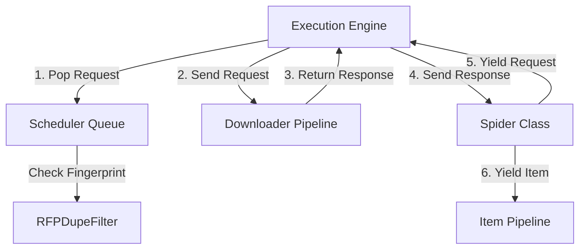
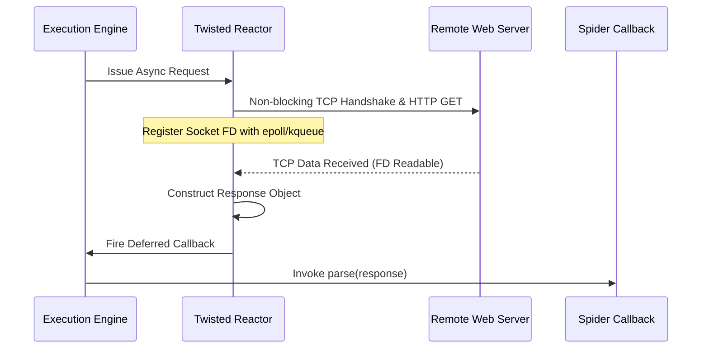
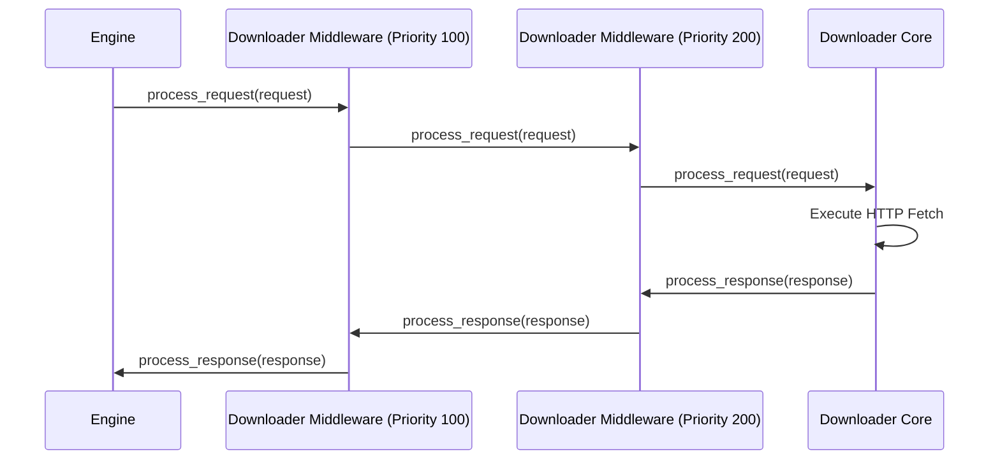
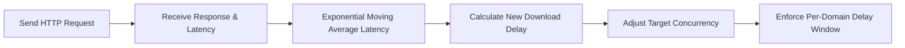

When web scraping scales beyond basic scripts processing a few dozen URLs, standard synchronous HTTP libraries fall apart. You quickly hit bottlenecks around network latency, thread overhead, and connection pool starvation. Scrapy solves this problem by using an asynchronous event loop driven architecture capable of pumping thousands of requests per second through a single Python process. Under the hood, it does not rely on Python standard asyncio library by default. Instead, it builds on Twisted, an event-driven networking framework that predates modern Python async primitives by more than a decade.

Understanding how Scrapy achieves high-throughput web crawling requires opening up its central execution engine. We need to inspect how Twisted deferreds manage request concurrency, how canonical request fingerprinting eliminates duplicate crawls, and how feedback-driven feedback loops dynamically adjust request delays to keep target servers alive.

### The Execution Engine Topology

At the core of Scrapy sits the ExecutionEngine object, which orchestrates the flow of data between several dedicated components. The engine does not perform network operations or parse HTML itself. It operates as a state machine controller, polling the Scheduler for pending requests, dispatching them to the Downloader, and pushing retrieved responses into Spider code.



When a crawl starts, the spider generates its initial request instances. The engine intercepts these requests and passes them to the Scheduler. The Scheduler acts as a priority queue system backed by disk or memory queues. Before enqueueing any request, the Scheduler consults the Request Fingerprint Duplicate Filter, known internally as RFPDupeFilter. If the fingerprint filter flags the request as previously seen, it gets dropped immediately.

Once a slot opens up in the concurrency execution pool, the engine pulls the highest priority request from the Scheduler and passes it into the Downloader pipeline. The Downloader processes the request through a chain of downloader middlewares, executes the HTTP transaction over an asynchronous socket, and converts the raw HTTP response headers and body into a Response object. This Response object travels back up through the engine and into the Spider, where user-defined callback methods extract structured data or yield new child Request instances back into the system.

### Twisted Reactor, Deferreds, and Non-Blocking I/O

Scrapy relies on twisted.internet.reactor to manage non-blocking socket operations. The Twisted reactor is an event loop that monitors network file descriptors using platform-native event demultiplexers like epoll on Linux, kqueue on macOS, or IOCP on Windows.

Instead of spawning native OS threads for every HTTP request, Scrapy registers non-blocking sockets with the reactor. When a request is dispatched, the socket initiates a non-blocking TCP handshake and attaches a Deferred object. A Deferred in Twisted is an abstraction for a promise that will eventually produce a value or an error. It manages two parallel chains of callbacks, success handlers and error handlers.



When network data arrives on a socket, the reactor catches the readable file descriptor event, reads the bytes off the kernel buffer, parses the HTTP wire protocol, and triggers the callbacks attached to the Deferred object. The deferred executes in the main event loop thread, running downstream processing logic without context-switching costs.

If a spider method uses standard Python async and await keywords, Scrapy wraps the underlying coroutines into Twisted Deferreds using deferred_from_coroutine. This allows seamless interoperability between modern Python async syntax and Twisted native event execution.

DNS resolution in traditional synchronous Python blocks the calling thread. Twisted bypasses this bottleneck by utilizing twisted.names for asynchronous DNS resolution or by delegating blocking host lookups to a thread pool managed by the reactor. As a result, domain name resolution never halts the event loop, even when scraping thousands of distinct domain names concurrently.

### Request Deduplication via RFPDupeFilter

A major failure mode in web crawlers is entering infinite loops caused by circular links, dynamic query parameters, or duplicate page references. Scrapy addresses this using the RFPDupeFilter class combined with request canonicalization.

When a Request passes into the Scheduler, Scrapy calls request_fingerprint to generate a 40-character hexadecimal SHA-1 string representing the semantic identity of the request. Simply hashing the raw URL string is insufficient because URL parameter order, trailing slashes, host case sensitivity, and request body structures vary wildly across web frameworks.

To compute a canonical fingerprint, Scrapy executes a multi-step normalization routine. First, the scheme and hostname are converted to lowercase. Port numbers are normalized so that standard HTTP port 80 and HTTPS port 443 are stripped if explicit. Second, query string parameters are parsed, decoded, sorted alphabetically by key, and re-encoded. This ensures that a URL ending in ?b=2&a=1 produces the exact same hash as one ending in ?a=1&b=2.

Third, the HTTP request method is uppercase normalized. Fourth, if the request contains a request body, such as POST payloads, the body bytes are incorporated into the hash. Finally, optional headers specified in the REQUEST_FINGERPRINTS_BASE_HEADERS setting are sorted by name, lowercased, and appended to the byte sequence before running the SHA-1 digest algorithm.

```
Raw Request: POST http://EXAMPLE.com:80/products/?sort=asc&page=2
  |
  +--> Scheme/Host Lowercase: http://example.com/products/?sort=asc&page=2
  +--> Query Params Sorted:   page=2&sort=asc
  +--> Method Normalized:     POST
  +--> Body Bytes Appended:   {"category": "tech"}
  |
  v
Canonical Byte Stream --> SHA-1 Digest --> 3f4a91c8... (40 hex chars)
```

The resulting digest is stored in an in-memory set or persisted to disk using a set-like storage interface when persistent crawling is enabled. When RFPDupeFilter sees a fingerprint that already exists in its set, request_seen returns true, causing the scheduler to log or silently drop the request before network resource allocation occurs.

### Downloader and Spider Middleware Pipelines

Data moving into and out of the execution engine passes through two separate middleware layers: Downloader Middlewares and Spider Middlewares. Both rely on an onion-style execution pattern where requests travel downward through ordered components and responses travel upward in reverse order.

Downloader Middlewares intercept HTTP requests right before they hit the network layer, and intercept HTTP responses right after they are built by the Downloader. Each middleware class defines up to three main methods, process_request, process_response, and process_exception.

When process_request executes, it can return one of three values to control control flow. If it returns None, Scrapy continues executing the process_request method of the next configured middleware in ascending order of numerical priority. If it returns a Response object, Scrapy stops executing subsequent process_request methods and immediately flips execution flow upward into the process_response pipeline, short-circuiting the actual network request entirely. This mechanism is frequently used by caching plugins to serve responses directly from Redis or disk storage. If it returns a new Request object, the current request processing is aborted, and the new request is dispatched to the Scheduler.



Responses traverse the middleware chain in descending numerical priority. The highest priority middleware inspects the response last, allowing early components like decompression modules to decompress gzipped HTML payloads before downstream user middlewares attempt to decode or clean the body text.

If an exception occurs during network transmission or inside a process_request method, Scrapy unwinds the middleware stack by invoking process_exception on each middleware layer in descending order. This allows retry middlewares to catch timeout errors, modify request metadata, and yield a fresh request back to the engine.

### Dynamic Concurrency and AutoThrottle Engine Mechanics

Crawling high volumes of pages without aggressive rate limiting risks overloading remote target servers or triggering automated IP bans. Scrapy provides fine-grained concurrency settings like CONCURRENT_REQUESTS, CONCURRENT_REQUESTS_PER_DOMAIN, and DOWNLOAD_DELAY. Fixed download delays are inefficient. A static delay of two seconds wastes massive bandwidth if a server can comfortably serve requests in 50 milliseconds, while causing server instability if the target server slows down under load.

The AutoThrottle extension dynamically tunes download delays based on real-time latency feedback measured directly from network transactions. It operates by observing response latencies and maintaining a target latency budget.



AutoThrottle tracks a latency estimate using an Exponential Moving Average calculated over recent HTTP response times for each individual domain. When a response is received, the extension measures the elapsed time between request dispatch and response reception. It then updates the domain smoothed latency estimate using a weighting factor.

Using this updated latency estimate, AutoThrottle calculates the optimal download delay required to keep average concurrency at a target threshold defined by the AUTOTHROTTLE_TARGET_CONCURRENCY configuration setting. If a remote server begins lagging due to heavy database load, response latencies spike. AutoThrottle detects this immediately, recalculates the moving average, and scales up the delay between subsequent requests issued to that domain. Conversely, if latencies drop, download delays decrease smoothly to maximize crawl throughput.

This adaptive feedback loop transforms Scrapy from a simple batch crawler into an intelligent stream processor capable of maximizing hardware throughput while respecting remote system boundaries.
