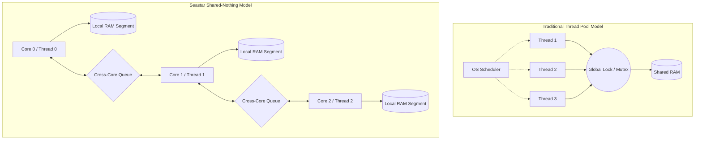
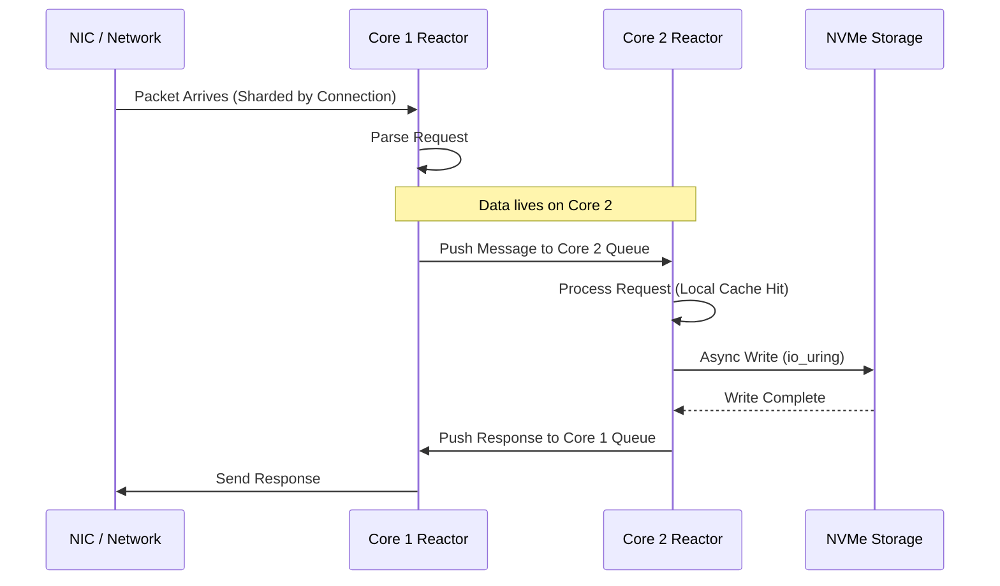

Modern server hardware is a lie. We're sold these massive 64 core machines with the promise of parallel execution. In reality, the traditional way we write software for these boxes is fundamentally broken. When you write a standard multi-threaded application in .NET or C++ or Java, you're usually tossing tasks into a global thread pool. You rely on the OS scheduler to pick up those tasks and move them around. That scheduler is a bottleneck. It doesn't care about your L1 cache. It doesn't care about memory locality. It just wants to be fair. In a high-throughput database like ScyllaDB, fairness is a performance killer. This is why the Seastar framework exists. It tosses the standard multi-threading model out the window and replaces it with a shared-nothing architecture that treats every CPU core as an isolated server.

The core problem is the tax we pay for synchronization. Every time two threads on different cores want to look at the same piece of data, we pay in cache line bounces. One core modifies a memory address, and the hardware must invalidate the cache line on every other core. This is the MESI protocol in action, and while it's efficient at the hardware level, it's a disaster when you're trying to do millions of operations per second. Standard applications hide this with locks or atomics, but these are just faster ways of waiting. Seastar takes a different path. It pins exactly one thread to each physical CPU core. There is no context switching. There is no OS migration. If you have 16 cores, you have 16 threads. Period.

In this shared-nothing model, the memory is also sharded. When the application starts, Seastar grabs a massive chunk of RAM and carves it up. Core 0 gets its own heap. Core 1 gets its own heap. They do not share. If a piece of data belongs to Core 0, and a request comes in that needs that data, Core 0 handles it. If the network card delivers a packet to Core 1 that actually needs to talk to Core 0, Core 1 doesn't just grab a lock. Instead, it places a message on a high-speed, lock-free ring buffer specifically dedicated to Core 0. This is explicit message passing. It sounds slower because of the overhead of moving messages, but in practice, it's vastly faster because the data stays in the CPU cache where it belongs. You avoid the catastrophic performance cliff of cross-core cache invalidation.

This architecture forces a different way of thinking about I/O. You can't use blocking system calls because if you block your one thread, that entire CPU core goes to sleep. Seastar relies heavily on io_uring or epoll to handle everything asynchronously. It uses a reactor loop that constantly polls for completion events. There are no interrupts in the traditional sense that steal cycles. The thread just spins, looking for work in the network queue, the disk queue, or the cross-core message queue. This is essentially a user-space scheduler that is optimized for exactly one thing: moving data through a pipeline without ever letting the CPU stall.

One of the most fascinating parts of this setup is how it handles the network stack. In a standard Linux environment, the kernel handles the TCP stack. This involves a lot of context switching between user space and kernel space, and the kernel often uses softirqs that can happen on any core. ScyllaDB often uses a DPDK-based user-space network stack with Seastar. This means the application owns the network card directly. The kernel never even sees the packets. The Seastar thread pulls raw frames directly from the NIC ring buffer. This removes the kernel's global locking and networking structures from the equation entirely. It's a complete bypass of the operating system's standard resource management.

Scheduling within the core is handled via a cooperative task system. Since we only have one thread, we don't have to worry about being interrupted by our own process. Tasks are just small functions that run and then return control to the reactor. If a task takes too long, it's supposed to yield. This is very similar to how async/await works in C# or JavaScript, but implemented in C++ with extreme care for memory alignment and instruction pipelining. The reactor maintains a set of task queues with different priorities, allowing it to balance background work like database compaction with foreground work like client queries. It's a closed-loop system where the application has total visibility into its own latency and throughput.

The trade-off for this power is complexity. You can't just use a standard library hash map because those aren't designed to be pinned to a single core or to yield during long operations. Every data structure has to be Seastar-aware. You also have to be incredibly careful about how you shard your data. If one core gets all the hot keys, you end up with a skewed system where one CPU is at 100 percent and the others are idling. This is the shard-per-core challenge. You're effectively building a distributed system inside a single physical chassis. But when you get it right, the results are terrifyingly efficient. You're no longer fighting the OS. You're using the hardware exactly as it was intended to be used.
