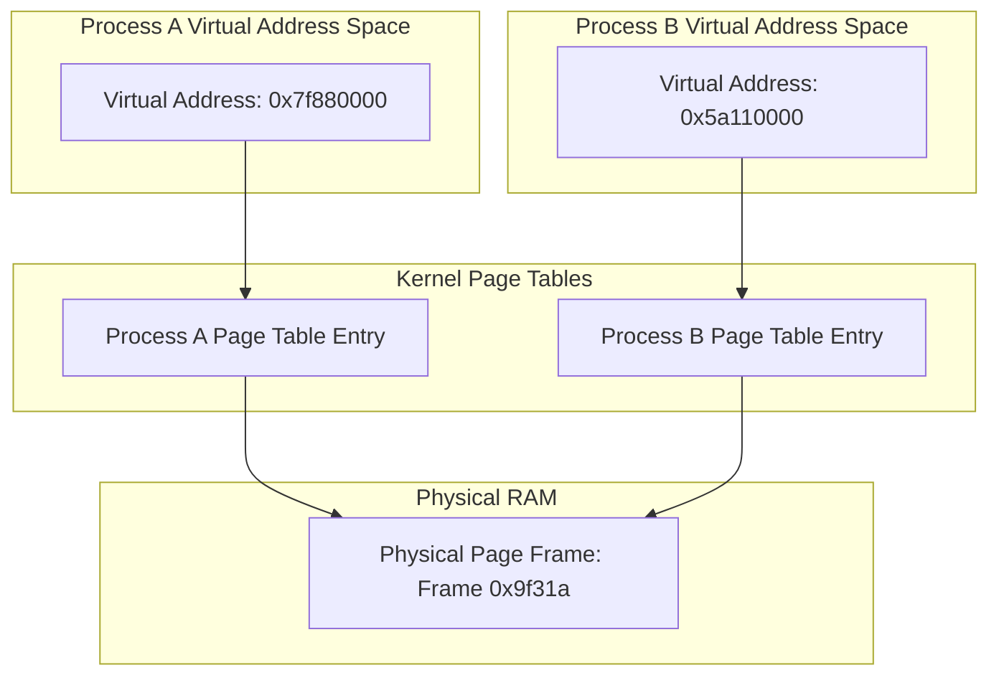

When you need to move bytes between two processes on the same machine, you usually reach for UNIX domain sockets, pipes, or local TCP loopbacks. All of these pathways share a fundamental performance bottleneck because they require copying data across the user-kernel boundary. The sending process writes to a buffer in user space, the kernel copies that buffer into kernel space, and then the kernel copies it again into the receiving process's user space memory. This double-copy architecture eats up CPU cycles, pollutes L1 and L2 caches, and triggers system call context switches.

Shared memory completely sidesteps this kernel tax. Instead of moving data back and forth through kernel memory pools, it configures the memory management unit of the CPU so that different processes map the exact same physical pages of RAM into their respective virtual address spaces. Once this mapping is established, writing a byte in process A instantly makes it visible to process B. There are no system calls, no kernel context switches, and no copies. It is the raw speed of direct RAM access.

### The Virtual Memory Mapping Mechanics

To understand how this magic works, we have to look at the Linux page fault mechanism and how the kernel tracks virtual memory. Every Linux process has a task struct that points to an mm struct, which describes the process's virtual memory layout. Inside this struct, a linked list and red-black tree of virtual memory area structures represent contiguous blocks of allocated virtual memory.

When you set up POSIX shared memory, you start by calling shm_open, which returns a file descriptor pointing to an inode in tmpfs. This is a virtual filesystem that lives entirely in the page cache. You then call mmap with this file descriptor. The kernel handles this by creating a new virtual memory area structure in your process's address space. At this stage, no physical memory has been allocated, and no page table entries point to physical frames. The allocation is lazy.

When process A attempts to write to the mapped memory region, the CPU looks up the virtual address in the process's page table. Finding no valid mapping, the memory management unit triggers a page fault exception. The CPU transitions into kernel mode, landing in the page fault handler. The kernel recognizes that the faulting address belongs to a virtual memory area backed by tmpfs. It checks if a physical page frame already exists for that offset in the shared object. If it does not, the kernel allocates a page frame from the buddy allocator, zeros it out, inserts it into the page cache for the shared object, and updates process A's page tables to map that virtual address to the new physical page frame.

When process B maps the same shared memory object and accesses its corresponding virtual address, it triggers its own page fault. This time, when the page fault handler checks the tmpfs shared object, it finds the physical page frame already allocated by process A's earlier write. Instead of allocating a new page, the kernel simply maps process B's page table entry to point to that same physical page frame. Both processes now share a physical piece of RAM, despite using potentially different virtual addresses in their own private address spaces.

### POSIX versus System V Shared Memory

The two primary shared memory APIs on Linux are POSIX and System V. The older System V API relies on keys generated by functions like ftok. It uses system calls such as shmget and shmat to manage allocations. It runs completely outside the unified file descriptor abstraction of UNIX. System V allocations are persistent at the kernel level. If a process crashes without cleaning up, the shared memory block remains allocated in physical RAM until you manually destroy it or reboot the machine. It is also limited by arbitrary kernel boundaries like SHMMAX.

POSIX shared memory solves these integration issues by treating memory segments as files. You use shm_open to obtain a file descriptor, control permissions with standard POSIX modes, and adjust its size via ftruncate. Cleaning up is handled cleanly with shm_unlink, which unlinks the segment from the file system while keeping it active until the last process closes its descriptor. Under the hood, POSIX shared memory is backed by a mount of tmpfs usually located at /dev/shm. You can inspect your active shared memory blocks with standard command-line tools like ls, and even delete them using rm.

### The Userspace Synchronization Problem

While bypassing the kernel gives shared memory its unrivaled speed, it also strips away all safety nets. If two processes write to the same byte simultaneously, you get silent corruption. With pipes or sockets, the kernel manages synchronization internally through internal lock-protected buffers. With shared memory, you must handle synchronization yourself in userspace.

Using a standard POSIX mutex is the cleanest way to do this. By default, a mutex works only within a single process because its state is stored in that process's private virtual memory. However, you can configure a mutex to be shared across processes. You do this by setting the mutex protocol attributes using pthread_mutexattr_setpshared with the PTHREAD_PROCESS_SHARED flag. You then initialize the mutex directly inside a struct located within the shared memory segment itself.

When a process attempts to acquire this shared mutex, it relies on atomic assembly instructions like compare-and-swap to check if the lock is free. If the lock is not contested, the process acquires it entirely in userspace without executing a single system call. If the lock is held by another process, the calling process transitions into the kernel using a futex system call to sleep until the lock is released. This hybrid userspace-kernel path gives you the absolute best performance under low contention.

### CPU Cache Coherency and Memory Barriers

There is a hardware trap waiting for anyone writing low-level shared memory code. Modern CPUs do not write directly to RAM. They write to internal store buffers and L1 and L2 caches. If process A writes to a shared memory variable, and then writes to a flag variable indicating the data is ready, a CPU on another core running process B might see these writes out of order. This can happen due to CPU out-of-order execution pipelines or store buffer flushing delays.

To prevent this, you must use memory barriers, often referred to as memory fences. In C or C++, you must enforce acquire and release semantics when modifying flags in shared memory. This prevents the compiler from reordering your instructions during optimization, and it generates the correct assembly instructions, such as dmb on ARM or lock-prefixed operations on x86, to force the CPU to flush its store buffers before signaling the other process. Without memory barriers, your shared memory system will suffer from sporadic, impossible-to-reproduce bugs that only manifest under heavy multi-core load.

Shared memory is an incredibly powerful tool when raw throughput and microsecond latencies are required. By understanding how the Linux page fault handler maps physical pages to separate process page tables, you can design blistering fast, zero-copy systems that run circles around traditional socket-based architectures while keeping memory utilization to an absolute minimum.
