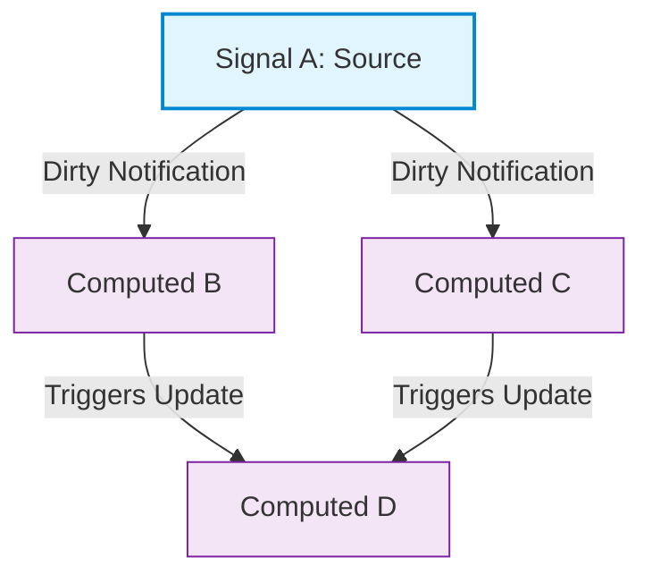
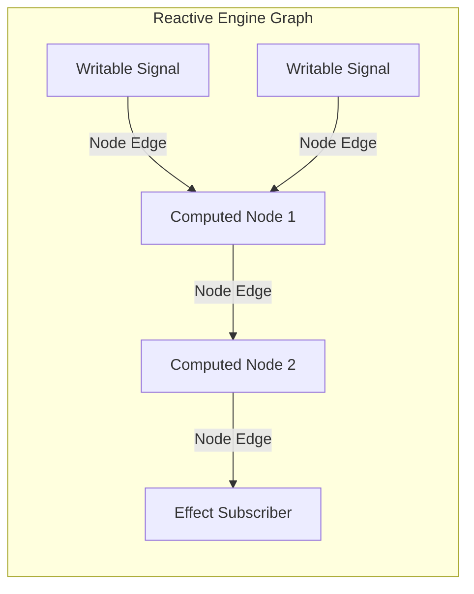
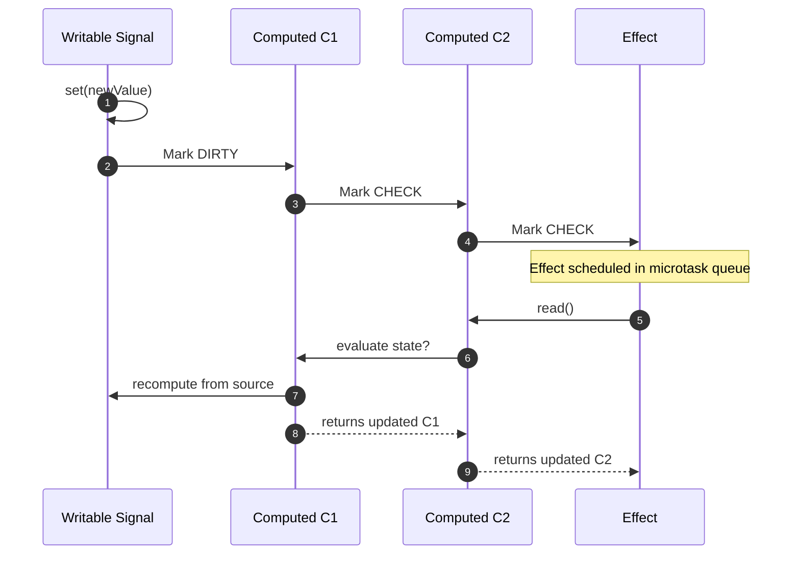

Frameworks across the web ecosystem have converged on signals as the core primitive for state management. Angular, Solid.js, Preact, Vue, and Svelte have all adopted signal engines to power fine-grained rendering. While the public APIs look trivial with simple getters and setters, the underlying mechanics required to run signals efficiently without memory leaks or race conditions require sophisticated graph algorithms.

To understand why signals exist, you have to look at the flaw of push-only reactive systems. Early event emitters and simple observable patterns operated purely on eager execution. When a piece of state changed, it pushed that change directly to every listener registered against it. In shallow graphs, this model works fine. In complex applications with derived states, it breaks down quickly through a classic issue known as the diamond dependency problem.

Imagine a graph where state node A flows into derived node B and derived node C. A fourth node D depends on both B and C. If node A mutates in an eager push system, node A immediately notifies node B, which recalculates and notifies D. At this exact moment, node D recalculates using the new value from B and the old, un-updated value from C. Node D briefly holds an inconsistent state, emitting an invalid intermediate value before node C finally gets notified, updates, and forces node D to compute a second time.

These temporary invalid states are called reactive glitches. In large web applications or data engines, glitches trigger duplicate HTTP calls, DOM layout trashing, and subtle bugs where components render contradictory state for single frame updates.

Signals prevent reactive glitches by combining push notifications with lazy pull updates. Instead of immediately computing new values when state changes, signals push a dirty notification through the graph to mark downstream nodes as stale. Calculation of derived values is deferred until code actually reads the signal. This push-pull architecture guarantees that derived values compute only when needed and always evaluate against up-to-date inputs.

Every signals engine centers around three structural primitives: source signals, computed signals, and effects. Source signals act as writable root nodes containing primitive values. Computed signals represent derived nodes that act as both consumers and producers. Effects are sink nodes that consume signals and execute side effects like DOM mutations or network requests.

To construct this graph automatically without requiring developers to manually write dependency vectors, the engine relies on dynamic runtime dependency tracking. The tracking system relies on an execution stack that monitors signal reads during computation.

When a computed signal or effect runs its target function, the engine instantiates a node context and pushes it onto a global stack of active contexts. As the target function executes and calls a signal getter, the signal inspects the top node on the execution stack. If an active context exists, the signal registers a reference to that subscriber in its own subscriber collection, while the active subscriber context simultaneously records a reference to the signal in its dependency array.

Dynamic tracking must handle conditional branches gracefully. Consider a computed signal that reads signal A when boolean signal X is true, but reads signal B when signal X is false. If signal X flips from true to false, signal A is no longer a dependency. If the engine retained signal A in the dependency list, subsequent updates to signal A would unnecessarily invalidate the computed signal.

To fix this, production signal engines use generational versioning or link-list clearing during evaluation. Before a consumer context re-runs its calculation function, it unlinks itself from all current dependencies or increments a computation generation counter. As the function executes, accessed signals are marked with the current generation. Once execution completes, any dependencies remaining from the previous generation that were not accessed during the current run are pruned from the reactive graph.

Managing dirty states efficiently requires finer granularity than a single boolean flag. When a root signal changes value, propagating a dirty status directly to every descendant in a deep tree can be expensive. Modern engines like Angular and Solid split dirtiness into three distinct flags: Clean, Check, and Dirty.

When a writable signal mutates via a setter, it checks if the new value equals the current value using an equality comparator. If the value has changed, the root signal transitions its direct downstream consumers into the Dirty state. Crucially, the engine does not stop there. It continues traversing downstream to the descendants of those consumers, marking indirect subscribers with the Check flag.

The Check flag signals to a node that one of its dependencies might be dirty, but it does not know for sure until it inspects its ancestor chain. This distinction allows the engine to skip expensive recalculations when a computed signal returns an unchanged value.

Suppose signal A changes from value 5 to 6. Computed B evaluates a formula on signal A and outputs a boolean specifying whether A is greater than zero. Both 5 and 6 return true, so computed B's output value does not change. When computed C, which depends on computed B, evaluates its state, it queries computed B. Computed B re-evaluates, realizes its output value is identical to its cached value, and returns cleanly. Computed C sees that B's output version did not change, clears its own Check flag, and skips running its own computation entirely.

To ensure complete glitch protection during complex state updates, signal engines use two-phase evaluation backed by topological ordering or state version counters.

When an effect is scheduled for execution, it enters a global batch cycle. The batch system defers effect execution until all synchronous code mutations finish. Once the synchronous state changes complete, the scheduler sorts candidate effects or uses pointer-based graph traversal to process updates in strict topological order, ensuring parent nodes always evaluate before child nodes.

Memory management in signal engines is a common point of memory leaks if managed improperly. Because source signals hold references to their subscribers, an effect that subscribes to a long-lived global signal will be retained in memory indefinitely unless explicit unsubscription occurs.

Modern signal engines solve memory leaks by using doubly-linked list nodes that support O(1) removal without array re-allocations, or by integrating explicit lifetime scopes linked to host framework primitives like component destruction hooks. When a context scope disposes, the scope iterates through its active dependencies and detaches all graph edge pointers, allowing garbage collection to reclaim the memory allocated for derived nodes and effect functions.

Understanding these internal mechanics changes how you design frontend applications. By leveraging fine-grained signals, push-pull evaluation loops, and dirty propagation passes, modern reactivity engines strip away overhead and deliver consistent, glitch-free execution across massive state graphs.
