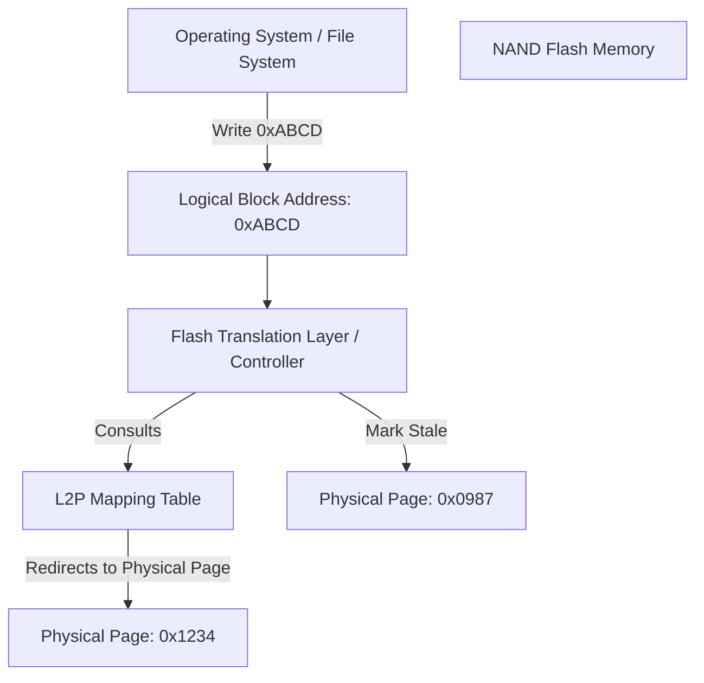
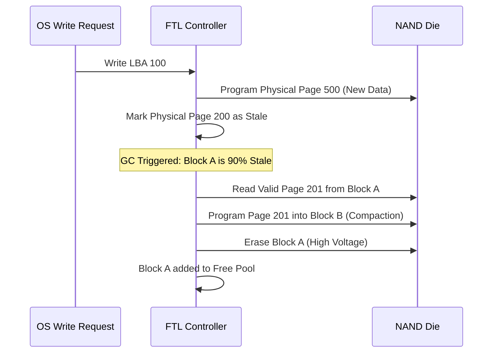

The operating system likes to pretend that a disk is a linear array of blocks. You write to sector 500, then you overwrite it later, and you assume the hardware just swaps the bits in place. This is a total lie. If you try that on raw NAND flash, you will destroy the drive or, at the very least, fail to write anything at all. NAND flash has a physical reality that contradicts the block device abstraction. You can read and program at the page level (usually 4KB to 16KB), but you can only erase at the block level (hundreds of pages). More importantly, you cannot overwrite a page. You have to erase the entire block it belongs to before you can write to that physical coordinate again. The Flash Translation Layer, or FTL, is the complex piece of firmware sitting inside your SSD controller that maintains this massive deception for the sake of the OS.

### The NAND Geometry Constraint

To understand the FTL, you have to understand the physical prison it operates in. NAND is organized into a hierarchy of dies, planes, blocks, and pages. Because erasing a block is a high-latency operation involving high voltage to clear the floating gates, it is impossible to perform a fine-grained overwrite. If the OS sends a command to update a file at a specific Logical Block Address (LBA), the FTL cannot simply modify that physical location. Instead, it must find a fresh, empty physical page elsewhere on the drive, write the new data there, and then mark the old physical page as invalid or stale. This is known as an out-of-place update. This creates a massive bookkeeping problem. The FTL must maintain a mapping between the logical addresses the OS sees and the actual physical addresses on the NAND. This is the L2P (Logical-to-Physical) mapping table.

### Mapping Strategies and Memory Pressure

The L2P table is not a small structure. If you have a 4TB drive and you map every 4KB logical block to a 4-byte physical address, your mapping table alone would take up gigabytes of RAM. Cheap SSDs try to save money by doing block-level mapping, where the logical-to-physical translation happens at the block level and offsets are calculated. This is efficient for memory but terrible for performance because a single small write can trigger a massive move of the entire block. Modern high-performance drives use page-level mapping and store the table in dedicated DRAM on the SSD controller. This allows for granular updates but introduces the risk of data loss. If power is cut, that DRAM table vanishes. This is why enterprise drives have massive tantalum capacitors to provide enough energy to flush the L2P table from DRAM to the NAND before the lights go out.

### Garbage Collection and Write Amplification

Since the FTL is constantly performing out-of-place updates, the NAND eventually fills up with stale pages that are no longer referenced by the L2P table. The drive will eventually run out of fresh pages. This triggers the Garbage Collection (GC) process. The FTL identifies a block that contains mostly stale pages, copies the few remaining valid pages to a new empty block, and then erases the old block to make it available for future writes. This background movement of data is the primary cause of Write Amplification (WA). If the OS writes 4KB of data, but the FTL has to move 12KB of existing data to clear a block, the Write Amplification Factor is 4.0. High WA kills both performance and the lifespan of the NAND because every program/erase cycle wears out the physical oxide layer of the flash cells.

### Wear Leveling and Over-Provisioning

NAND cells are not immortal. They can only survive a few thousand erase cycles before the insulation breaks down and they can no longer hold a charge. If a specific area of the disk is frequently updated, such as a file system journal or a database log, those physical blocks would die within weeks if the FTL always used the same physical locations. The FTL implements wear leveling to prevent this. It tracks the erase counts of every block and deliberately moves static data (files that never change) into blocks with high erase counts. This forces the frequently updated data to move to blocks with low erase counts, ensuring the entire drive wears out at the same rate. To give the GC and wear leveling algorithms room to breathe, SSDs use over-provisioning. This is why a drive marketed as 500GB might actually have 512GB or more of physical NAND. That extra space is invisible to the OS and acts as a buffer for the FTL to move data around without hitting a hard wall of capacity.

Most developers ignore the FTL because the abstraction is so good. But when you see a latency spike on a write heavy workload, it is rarely the software. It is usually the FTL desperately trying to move valid pages around so it can erase a block and give you a fresh page. Understanding that your disk is actually a high-speed log-structured database with a physical erase constraint changes how you think about I/O patterns. Sequential writes are king not because of spinning platters, but because they allow the FTL to fill blocks linearly, minimizing the work the garbage collector has to do later.
