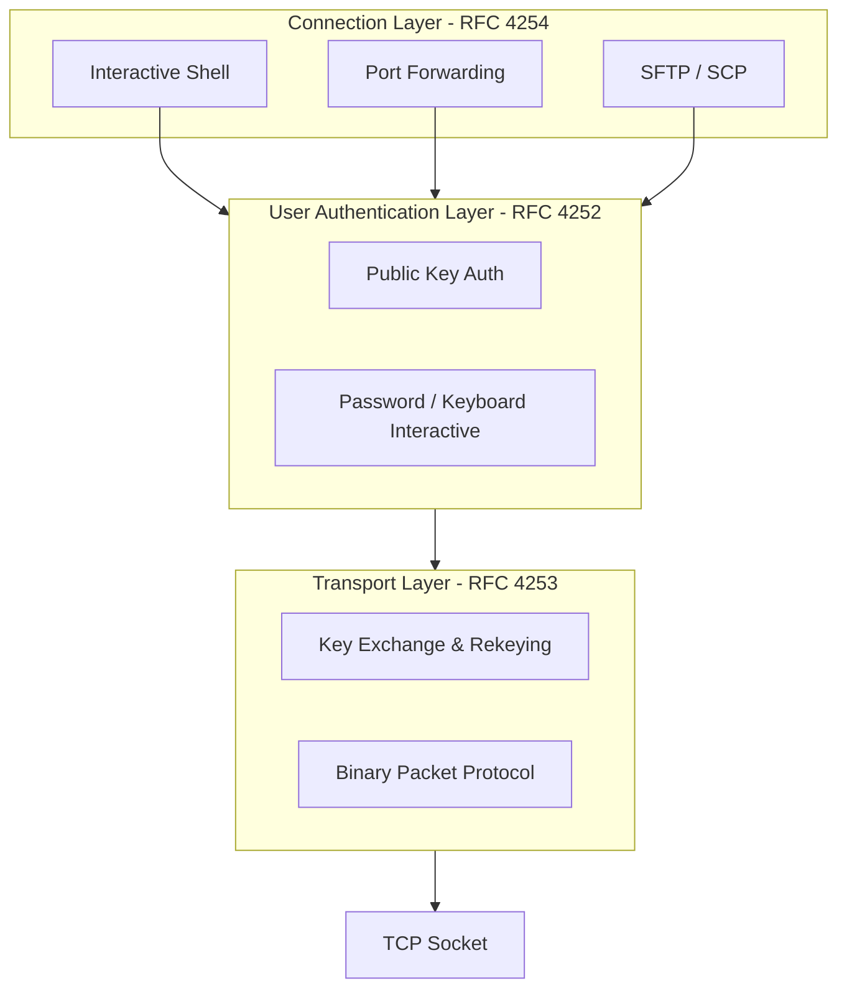
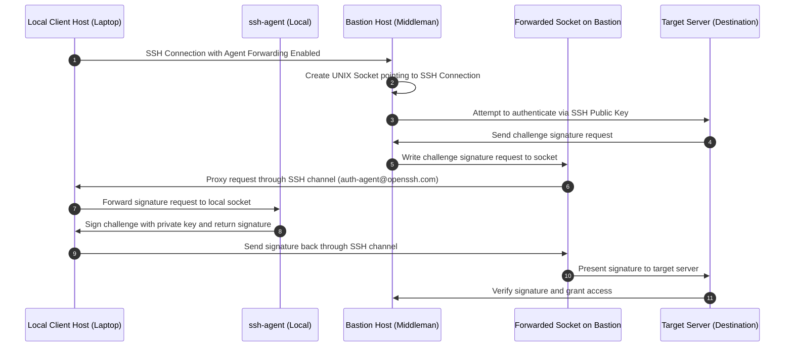

Most software engineers use SSH daily without thinking twice about what happens between executing a terminal command and receiving an active prompt. We treat it as a secure pipe, a black box that magic-mounts directories, forwards ports, and drops us into remote servers. But underneath that simple interface lies a highly opinionated, layered protocol suite designed to provide end-to-end security over untrusted networks. Unlike TLS which was built primarily for web scale client-server validation, SSH was architected for interactive, stateful session multiplexing. Understanding how these layers negotiate keys, split a single TCP socket into dozens of channels, and manage remote key signing via agent forwarding reveals a masterclass in systems design.

### The Layered Architecture

The SSH protocol is not a monolithic program. It is specified across several distinct RFC documents as a three tiered stack running on top of TCP. At the bottom sits the Transport Layer Protocol, defined in RFC 4253, which handles server authentication, key exchange, encryption, integrity, and optional compression. On top of the transport layer sits the User Authentication Protocol, defined in RFC 4252, which authenticates the client to the server. Finally, the Connection Layer Protocol, defined in RFC 4254, multiplexes the single encrypted tunnel into multiple logical channels, allowing simultaneous interactive shells, SFTP transfers, and port forwardings over one socket.



### The Binary Packet Protocol

Before any cryptographic negotiation can happen, both ends must communicate using the Binary Packet Protocol. Every message in SSH is framed into a structured sequence of bytes. In the classic implementation, a packet starts with a four byte packet length field that defines the size of the rest of the packet in bytes, not including the packet length field itself. This is followed by a single byte padding length field, which indicates how many bytes of arbitrary padding have been appended to the payload. The payload contains the actual message data, followed by the random padding itself, which is required to align the packet boundary to the cipher block size. Finally, an optional Message Authentication Code field is appended for integrity verification.

```
+-----------------------------------------------------------------+
| Packet Length (4 bytes)                                         |
+-----------------------------------------------------------------+
| Padding Length (1 byte)                                         |
+-----------------------------------------------------------------+
| Payload (Variable, e.g., SSH_MSG_KEXINIT)                       |
+-----------------------------------------------------------------+
| Padding (Variable, 4 to 255 bytes)                              |
+-----------------------------------------------------------------+
| Message Authentication Code (MAC) (Variable length, optional)   |
+-----------------------------------------------------------------+
```

While this traditional framing was standard for years, it suffered from a major vulnerability. Because the packet length field was transmitted in the clear or encrypted using a standard block cipher mode, attackers could perform traffic analysis or attempt to tamper with the length field to trigger decryption errors. 

Modern implementations like OpenSSH mitigate this by utilizing Authenticated Encryption with Associated Data, often abbreviated as AEAD, such as ChaCha20-Poly1305. When using ChaCha20-Poly1305, the packet framing changes. The packet length field is encrypted using a separate key derived during the handshake, preventing an attacker from even knowing how large the incoming packet payload is. The payload and padding are then encrypted, and a Poly1305 tag is generated over the entire sequence. This structural change guarantees that any tampering is detected before the CPU attempts to allocate memory for the packet size, protecting the daemon from memory exhaustion attacks.

### The Cryptographic Handshake and Key Exchange

The SSH connection starts with an explicit plain text string exchange over TCP. Each side sends its protocol version, library details, and operating system identifiers, such as `SSH-2.0-OpenSSH_9.6`. If both ends agree on supporting version 2.0, the state machine transitions to algorithm negotiation. 

Each peer sends an `SSH_MSG_KEXINIT` message containing a prioritized list of cryptographic algorithms they support. This list includes key exchange algorithms like Curve25519 or Diffie-Hellman Group 14, host key algorithms like Ed25519 or ECDSA, symmetric ciphers like AES-GCM or ChaCha20, and MAC algorithms if they are not using AEAD. The client and server select the first algorithm on the client list that is also supported by the server.

Once the algorithms are settled, the key exchange begins. Assuming a modern ECDH exchange using Curve25519, the goal is to generate a shared secret key without exposing it to an observer. The client generates an ephemeral private key and computes a public key, sending it to the server in an `SSH_MSG_KEX_ECDH_INIT` packet. The server does the same, generating its own ephemeral private key and public key. 

The server computes the shared secret $K$ using its ephemeral private key and the client's public key. It also constructs an exchange hash, denoted as $H$, which is a cryptographic digest of the entire handshake history. This history includes the client and server identification strings, the raw `SSH_MSG_KEXINIT` payloads, the server public host key, and both ephemeral public keys. The server signs this exchange hash $H$ using its persistent private host key. It then sends the host key, its ephemeral public key, and the signature back to the client in an `SSH_MSG_KEX_ECDH_REPLY` packet.

The client performs the same calculation to compute the shared secret $K$ and the exchange hash $H$. It then verifies the server's signature using the server's public host key. If the signature matches, the client knows it is talking to the legitimate host and not an imposter. The shared secret $K$ is never transmitted over the wire. Instead, both sides feed $K$ and $H$ into a Key Derivation Function to generate the symmetric keys used for encryption, integrity, and initialization vectors in both directions.

Once the keys are derived, both sides send an `SSH_MSG_NEWKEYS` message. This indicates that all subsequent packets will be encrypted. Up to this point, everything except the handshake parameters was unencrypted. The transition to encrypted communication is completed when both sides have sent and received the new keys packet.

### Multiplexing and the Connection Layer

One of SSH's most elegant features is its connection layer. Rather than establishing a new TCP connection for every session, shell, or file transfer, everything is multiplexed over a single TCP socket. The protocol achieves this through logical constructs called channels.

Either end can open a channel. When a peer wants to start a new channel, it sends an `SSH_MSG_CHANNEL_OPEN` packet. This packet contains a channel type, such as `session`, `direct-tcpip` for port forwarding, or `forwarded-tcpip`. It also contains a sender channel ID, which is a local integer used to refer to this channel, an initial window size, and a maximum packet size. The receiving end confirms the channel with an `SSH_MSG_CHANNEL_OPEN_CONFIRMATION` packet, assigning its own local channel ID to the connection. From this point forward, any data sent regarding this channel includes the recipient's channel ID, allowing the peers to route data to the correct virtual stream.

To prevent a single fast stream from hogging the entire TCP socket or exhausting the remote buffer, SSH implements its own window based flow control at the channel level. This is entirely separate from TCP's window scaling. Each side specifies how many bytes of channel data it is prepared to receive. When a peer transmits data, it decrements its local copy of the remote channel's window size. If the window reaches zero, the peer must stop sending data on that channel. Periodically, as the receiver processes data and clears its buffers, it sends an `SSH_MSG_CHANNEL_WINDOW_ADJUST` packet to restore the sender's window.

Interactive shells, command execution, and subsystem activations like SFTP are all initiated inside a general `session` channel. Once a session channel is open, the client sends specific request packets, like `SSH_MSG_CHANNEL_REQUEST` with a request type of `pty` to allocate a pseudo-terminal, followed by a request type of `shell` to spawn the remote shell process.

### User Authentication Mechanics

Once the transport layer is secure and the client has opened a communication channel, the user authentication layer takes over. The client sends an `SSH_MSG_SERVICE_REQUEST` for the `ssh-userauth` service. The server responds with an acceptance packet, and the authentication loop begins.

While passwords and keyboard-interactive methods are widely supported, public key authentication is the industry standard for secure infrastructure. The client begins this flow by sending a query packet of type `SSH_MSG_USERAUTH_REQUEST` specifying the `publickey` method. This initial query is designed to check if the server even recognizes the public key. It contains the username, the public key algorithm, and the raw public key bytes, but does not include a cryptographic signature.

The server checks its configuration, usually searching the target user's `authorized_keys` file. If the key is not authorized, the server responds with `SSH_MSG_USERAUTH_FAILURE`. If the key is valid, the server replies with `SSH_MSG_USERAUTH_PK_OK`. This tells the client that the key is accepted, but it must now prove possession of the corresponding private key.

The client responds by sending another `SSH_MSG_USERAUTH_REQUEST` packet, but this time it includes a flag indicating that a signature is attached. The client constructs a precise byte buffer containing the session ID, which is the exchange hash $H$ from the handshake, the username, the service name, the authentication method name, the public key algorithm, and the public key itself. The client signs this entire byte buffer using its local private key. It appends this signature to the end of the packet and transmits it to the server.

Because the session ID is unique to this specific TCP connection, this signature cannot be intercepted and replayed on a different connection. The server re-creates the exact same byte buffer using the known session ID and connection details, and then verifies the signature against the client's public key. If the signature is valid, authentication succeeds, and the server transitions the state machine to allow connection layer multiplexing.

### The Mechanics of SSH-Agent Forwarding

When working with nested servers, engineers often need to hop from a intermediate bastion host to a target destination server. Storing your private key on the intermediate bastion host is a massive security anti-pattern because any compromise of the bastion exposes your credentials. To solve this, the SSH protocol supports agent forwarding. This allows the remote destination server to request cryptographic signatures from the local `ssh-agent` running on your laptop, without ever exposing your private key to the intermediary.

This process relies on Unix domain sockets and SSH connection layer channels. When you run `ssh -A user@bastion`, the local client informs the bastion daemon that it is willing to forward its agent. Under the hood, the sshd daemon on the bastion host creates a temporary Unix domain socket inside `/tmp/ssh-XXXXXX/agent.XXXX` and sets the `SSH_AUTH_SOCK` environment variable in your session to point to this file.



When you initiate a connection from the bastion to the target server, the remote SSH client on the bastion notices the `SSH_AUTH_SOCK` environment variable. It attempts to connect to that socket to obtain list of keys and request signatures. 

When a signature request is written to the Unix socket on the bastion, the local sshd daemon intercepting that socket does not process it locally. Instead, it packages the request into a special SSH channel message of type `auth-agent@openssh.com` and sends it back down the existing SSH tunnel to your laptop. Your local SSH client receives this channel message, reads the signature request, and forwards it to your local running `ssh-agent` over your local Unix domain socket.

Your local agent, which holds your unlocked private keys in its memory space, signs the challenge and returns the signature to your local SSH client. The client packages this signature into a response packet and sends it back up the channel to the bastion. The bastion's daemon writes the signature back to the forwarded Unix socket, and the outbound SSH client on the bastion reads it, successfully presenting the valid signature to the target server.

While highly convenient, agent forwarding introduces a severe security trade-off. Anyone who gains root access on the bastion host can access your forwarded Unix domain socket in `/tmp`. Even though they cannot read your private keys, they can write arbitrary signature requests to that socket. As long as your agent forwarding connection is active, a malicious administrator on the bastion can silently use your socket to authenticate as you on any other server in your infrastructure that trusts your public key. This risk is why modern environments often bypass agent forwarding entirely, preferring options like SSH proxying using `ProxyJump` or `ProxyCommand`, which route raw TCP streams through the bastion to the target, allowing the cryptographic handshake to happen directly between your laptop and the destination host without exposing any authentication channels to the middleman.
