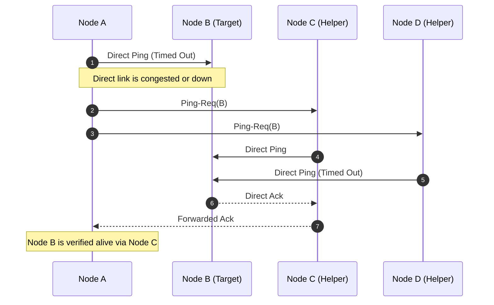
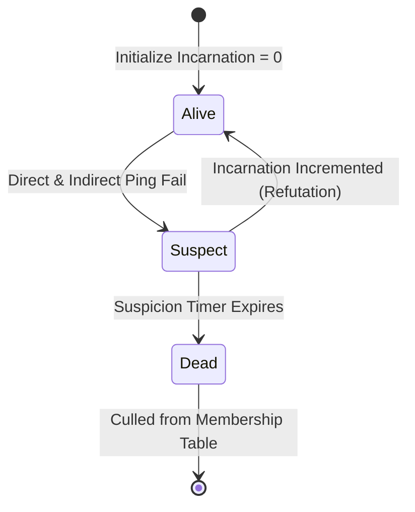

In distributed systems, knowing who is alive and who is dead is a fundamental requirement. Traditional cluster membership approaches rely on centralized coordinators like ZooKeeper or naive peer-to-peer heartbeating. Centralized coordinators introduce single points of failure and scale bottlenecks, while naive heartbeating schemes require every node to ping every other node periodically. This creates an O(N) messaging overhead per node, leading to an O(N^2) total cluster network load. As your cluster grows to hundreds or thousands of nodes, heartbeating consumes the very network bandwidth your application needs to serve user traffic.

The Structured Weakness-isolation Infection-style Process Group Membership Protocol, or SWIM, solves this bottleneck. It guarantees a constant, O(1) expected message load per node for failure detection, and scales its membership update propagation at O(log N) speed. It achieves this by decoupling failure detection from membership dissemination, using randomized target selection combined with indirect pinging to isolate network transient errors from real machine failures.

### The Scaling Wall of Heartbeating

To understand why SWIM is necessary, you have to look at the math of traditional heartbeating. If you run a cluster of N nodes, and each node must maintain an active view of all other nodes, the simplest path is to have each node send a periodic ping to all N-1 peers. 

If the ping period is T seconds, the total number of packets flowing through the network is N * (N - 1) per interval T. When your cluster grows from ten nodes to a thousand nodes, the network must handle nearly a million packets per interval. A single node must process a thousand incoming pings and send a thousand outgoing pings. If one network switch experiences temporary packet drop, multiple nodes will simultaneously mark healthy targets as dead. This creates a cascade of false-positive failure detections, triggering massive, unnecessary state rebalancing routines across your storage engines or service meshes.

SWIM breaks this O(N) scaling ceiling by changing the communication topology. Instead of all-to-all communication, it relies on randomized, periodic peer probing. 

### The Failure Detection Subsystem

The heart of the SWIM protocol is its failure detection pipeline, which runs at a regular protocol interval on every node. The node executing the loop does not attempt to talk to everyone. Instead, it selects a single peer from its membership table completely at random and sends a direct ping over UDP.

If the target node is healthy and the network path is clear, the target returns an acknowledgment packet. This represents the fast path, requiring only two network packets total. If the originating node receives the acknowledgment within a set timeout window, the protocol interval ends, and the node waits for the next cycle.

If the direct ping times out, the originating node does not immediately assume the target is dead. Doing so would make the protocol highly vulnerable to localized network congestion, routing issues, or transient packet loss. Instead, the node initiates an indirect probing sequence. It randomly selects a small, configurable number of helper nodes, denoted as k, and sends a ping-request packet to each of them.

These k helper nodes immediately attempt to ping the target node directly on behalf of the originating node. If any of the helpers successfully receive an acknowledgment from the target, they forward that acknowledgment back to the originating node. If the originating node receives an acknowledgment from at least one helper before the interval timer expires, the target is kept in the healthy pool. This indirect query mechanism effectively routes around localized network partitions and transient link failures, shielding the cluster from false-positive churn.

Only if both the direct ping and all k indirect ping requests fail to return an acknowledgment does the originating node transition the target's state. In the original, basic SWIM specification, the target would be declared dead immediately. However, practical implementations, such as Hashicorp's memberlist, introduce a transitionary suspicion state to further reduce false positives.

### The Suspicion Protocol State Machine

Declaring a node dead immediately when a ping-request fails can still lead to mistakes if a node is experiencing a long garbage collection pause or a momentary CPU spike. To handle this, modern implementations use a Suspect state. 

When the ping-request query fails, Node A changes the state of Node B to Suspect in its local membership list. It then starts a local suspicion timer. The value of this timer is typically a logarithmic function of the cluster size, giving the suspected node a reasonable window to defend itself.

While Node B is in the Suspect state, it continues to function as part of the cluster, but its suspect status is disseminated to other nodes. If Node B is actually alive and merely suffered a transient slowdown, it will eventually receive a gossip message stating that other nodes suspect it of being dead. 

Upon receiving this suspect message, Node B can refute the suspicion. It does this by incrementing its local incarnation number. The incarnation number is a monotonic counter initialized to zero when a node boots. When Node B detects that its own address is marked suspect with an incarnation number of X, it increments its incarnation number to X + 1 and broadcasts an Alive message containing this new incarnation counter. 

When other nodes receive this Alive message, they compare the incarnation numbers. A message with a higher incarnation number always overrides older states. Since X + 1 is greater than X, all nodes transition Node B back to the Alive state in their local tables, and the suspicion is cleared. If the suspicion timer on Node A expires before any refutation is received, Node A transitions Node B to the Dead state and begins broadcasting the failure.

This state machine relies on a strict precedence logic for state resolution. A Dead state overrides Suspect and Alive states of equal or lower incarnation numbers. A Suspect state overrides an Alive state of equal or lower incarnation numbers. An Alive state with a higher incarnation number overrides any Suspect or Dead state with a lower incarnation number. This monotonic clock design prevents old, delayed network packets from corrupting the current membership state.

### Dissemination via Piggybacked Gossip

Once a node detects a change in membership state, whether a node has joined, left, or been suspected of failing, that change must be broadcast to the entire cluster. Running a dedicated broadcast step for every update would defeat the constant-time message overhead goal of the protocol.

SWIM solves this by piggybacking membership updates onto the periodic failure detection messages. Each node maintains a FIFO buffer of recent membership updates that need to be broadcast. When Node A prepares to send its periodic direct ping to Node B, it pulls a batch of updates from this buffer and appends them to the payload of the ping packet.

When Node B receives the ping, it parses the appended updates, applies them to its local membership table according to the precedence rules, and adds the new updates to its own local broadcast buffer. When Node B responds with an acknowledgment packet, it can also append its own list of recent updates, which Node A will then ingest. 

This is an infection-style epidemic protocol, often referred to as a gossip protocol. The update behaves like a virus, spreading through the cluster during normal failure detection cycles. Because every ping and acknowledgment carries a set of updates, the network overhead is bound directly to the failure detection traffic. There are no separate, high-frequency broadcast packets flooding the network adapters.

To ensure that an update spreads to the entire cluster with high probability, each update in the buffer is assigned a transmission counter. Every time the update is appended to an outgoing packet, its counter is incremented. Once the counter reaches a limit determined by the cluster size, typically a multiplier of log N, the update is removed from the active dissemination buffer. This bounding prevents old updates from circulating indefinitely, keeping the payload size of individual ping packets small.

### Analyzing Network Overhead and Convergence

To see why this design scales, we can measure the bandwidth usage. Since each node only initiates a single ping sequence per protocol interval, the outgoing message rate per node is constant. In the average case where nodes are healthy, this is exactly one UDP packet sent and one received per node, per interval T. The local bandwidth consumption per node remains entirely flat, regardless of whether the cluster contains ten nodes or ten thousand nodes.

In terms of membership propagation speed, the epidemic gossip model guarantees that an update will propagate to all nodes in O(log N) protocol periods on average. If a node joins or fails, the time it takes for the entire cluster to converge on this new reality grows logarithmically, not linearly. This provides a clean trade-off: constant network load per node in exchange for a tiny, predictable delay in global state synchronization.

Using UDP as the transport layer keeps the resource footprint minimal. There are no TCP handshake delays, no connection state tables to maintain in the kernel, and no head-of-line blocking issues. If a UDP packet is dropped, the protocol naturally recovers in the next cycle, either through the indirect ping-request path or during the next randomized target selection.

### Real-World Engineering Adjustments

Implementing SWIM in production systems requires a few modifications to the pure theoretical model to handle real-world network quirks.

One common problem is the pure randomness of the target selection. In a basic implementation, a node might randomly select the same peer twice in a row, while another peer goes unpinged for a long time. To prevent this, actual engines implement a randomized round-robin sequence. The node shuffles its membership list and iterates through it sequentially, pinging one node per interval. Once the entire list is traversed, the node reshuffles the list and repeats the process. This guarantees a tight bound on the maximum time a node can remain unexamined, while maintaining the random distribution that makes gossip protocols resilient.

Another issue is IP routing asymmetry, where Node A can send packets to Node B, but Node B cannot send packets back to Node A. The indirect ping-request mechanism inherently mitigates this. If Node A pings Node B directly and receives no response due to the broken reverse path, it sends ping-requests to Node C. Node C pings Node B, receives the response, and forwards it to Node A. This path diversity is a critical defense against the grey-failure modes that frequently plague modern cloud environments.

Ultimately, SWIM trades strict consistency for exceptional availability and partition tolerance. By keeping the communication local, randomized, and low-frequency, it allows massive distributed systems to maintain a coherent view of their own boundaries without melting the underlying network fabric.
