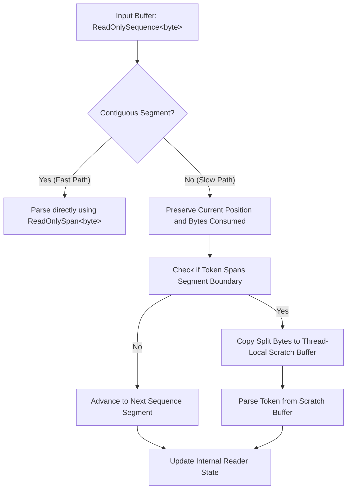
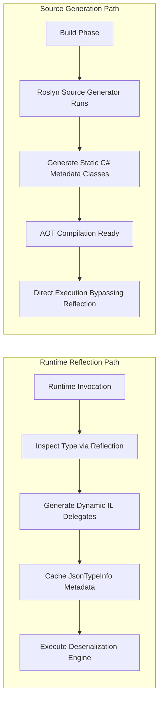

Newtonsoft.Json ruled the .NET ecosystem for more than a decade. It was versatile, resilient, and highly customizable. It was also designed in an era when memory allocations were treated as a minor cost. Every token parsed by Newtonsoft.Json typically generated an intermediate string, a boxing allocation, or a helper class instance. In high-throughput ASP.NET Core applications, this allocation pattern triggered relentless Garbage Collection (GC) pressure, forcing developers to over-provision CPU and memory resources.

To solve this, Microsoft built System.Text.Json from the ground up. This engine was designed around a new core principle: process JSON directly as a UTF-8 byte stream, completely bypassing the need to transcode to UTF-16 strings. Achieving this required the design of a stackless state machine, exploitation of modern C# features like ref structs, and a complete re-engineering of runtime type metadata resolution. 

### The UTF-8 Native Pipeline

Most web servers receive payloads as UTF-8 byte arrays over TCP sockets. Traditional parsers like Newtonsoft.Json operate on UTF-16 characters. This mismatch introduces a hidden, expensive transcoding phase. The incoming bytes must be decoded into a UTF-16 string, which allocates memory on the heap. Only then can the parser process the characters.

System.Text.Json eliminates this intermediate translation. The core parsing APIs ingest raw UTF-8 bytes via ReadOnlySpan<byte> or ReadOnlySequence<byte>. By analyzing the incoming byte stream directly, the engine performs byte-level pattern matching on characters like curly braces, brackets, and double quotes.

Decoding to UTF-16 is deferred until the application requests a string representation of a specific property. If the target property is a primitive type, such as an integer, float, or GUID, the engine parses the raw UTF-8 bytes directly into the target data type. No string is ever allocated for the property name or the value during this translation. This is achieved using specialized helper methods within System.Buffers.Text.Utf8Parser, which parse ASCII-formatted integers, floating-point numbers, and dates directly from raw byte segments.

### The Stackless State Machine of Utf8JsonReader

At the heart of this zero-allocation strategy is Utf8JsonReader. It is declared as a ref struct, which forces the compiler to allocate it strictly on the execution stack. This prevents the reader instance itself from ever leaking to the managed heap.



Parsing a contiguous block of memory is relatively simple. The reader advances a pointer through a ReadOnlySpan<byte>, identifying tokens sequentially. High-throughput network scenarios rarely provide data in a single contiguous block. Instead, data arrives in fragmented memory blocks managed by System.IO.Pipelines, represented as a ReadOnlySequence<byte>.

When a JSON token is split across a boundary between two memory segments, a simple pointer cannot span the gap. To handle this without heap allocations, Utf8JsonReader implements a stackless state machine. It tracks several fields internally, including the current sequence position, the bytes consumed, the current depth, and the last token type. 

When the reader hits a segment boundary mid-token, it falls back to a slow-path routine. It preserves its execution progress within its stack-bound state variables. If a string or number is sliced across two segments, the engine leverages a small, stack-allocated or thread-local scratch buffer to stitch the fragments together. The reader parses the token from this temporary buffer, updates its tracking state, and resumes normal streaming processing on the next contiguous segment. This mechanism avoids the common fallback of allocating a temporary string to hold the combined halves of a split token.

### Bypassing Runtime Reflection

Traditional serializers inspect objects at runtime using reflection. They query type properties, find attributes, and dynamically invoke getters and setters. This dynamic lookup is slow and generates substantial metadata overhead. To bypass this, Newtonsoft.Json emitted DynamicMethod instances at runtime, compiling IL stubs to perform fast property access. While this mitigated execution latency, compiling IL at runtime consumes CPU cycles and generates heap allocations during warm-up. This approach also prevents compilation to Native AOT, because runtime IL generation is impossible without a Just-In-Time (JIT) compiler.

System.Text.Json addresses this problem using two distinct strategies, which are selected based on your project configuration.

The first strategy is runtime reflection combined with metadata caching. When the serializer first encounters a type, it constructs a JsonTypeInfo object. This object holds a dependency tree of metadata properties, converters, and parameter bindings. Instead of emitting raw IL, System.Text.Json uses delegates created via Expression.Compile or Reflection.Emit to construct fast-path object instantiations and property assignments. This metadata is cached globally. Subsequent serialization actions bypass reflection entirely, querying this pre-compiled graph directly.

The second, more modern strategy is Source Generation, introduced to support Native AOT. The Roslyn compiler analyzes your types during the build process and generates C# code containing the serialization and deserialization metadata.



This source generator creates a specialized JsonSerializerContext subclass. This context contains pre-allocated metadata arrays and static properties mapping property names directly to target offsets or setters. When your application compiles, the metadata resolution path is baked into the executable. At runtime, the deserializer bypasses both reflection and dynamic IL generation, executing a statically compiled traversal loop.

### Zero-Allocation String Pooling and Naming Policies

JSON properties are represented as text strings, but C# property matching uses binary key comparison. In a standard deserialization pass, matching JSON properties to class members requires extracting the property name as a string and comparing it against the class schema. If a JSON payload contains ten thousand records with the property name "firstName", a naive parser will allocate ten thousand identical string instances of "firstName" on the heap.

System.Text.Json mitigates this using a string-pooling concept known as the Property Name Cache. This cache is localized within the JsonTypeInfo metadata block for each parsed type. The cache stores the raw UTF-8 byte representation of each property name alongside its pre-allocated C# string equivalent. When Utf8JsonReader encounters a property key, it extracts the raw slice of bytes from the incoming buffer. The deserializer then compares these raw bytes directly against the byte signatures cached in the JsonTypeInfo block. If a match is found, the engine retrieves the pre-allocated C# string instance or directly invokes the property setter associated with that byte key. This approach reduces property-name heap allocations to absolute zero after the initial type caching phase.

```
Incoming Raw JSON Buffer:
+-------------------------------------------------------------+
| ... "firstName": "John", "firstName": "Jane" ...            |
+-------------------------------------------------------------+
       |                           |
       v                           v
Raw Byte Match: [66 69 72 73 74 4E 61 6D 65]
       |
       +---> Query JsonTypeInfo Cached Properties
             |
             v
             Match Found: Member "FirstName" 
             Directly invoke cached setter delegate (no intermediate string generated)
```

This optimization works even when custom naming policies, like camelCase or snake_case, are configured. The naming policy is executed once during metadata initialization. The generated key transformations are converted to UTF-8 byte arrays and cached. At runtime, the incoming JSON is matched directly against these pre-transformed byte arrays, ensuring that custom naming rules do not introduce runtime execution penalties.

### Deep-Dive: Handling Polymorphism Statically

Polymorphic deserialization is notoriously difficult to implement without dynamic overhead. If an API accepts an abstract `BillingDetails` class that could resolve to `CreditCard` or `BankTransfer`, the parser must inspect a metadata tag, such as a `$type` property, to determine the correct target schema. This requires looking ahead in the payload, which breaks the single-pass streaming parser model.

System.Text.Json handles polymorphic deserialization using a custom state-tracking engine that coordinates with the Utf8JsonReader. When a polymorphic type is detected, the engine begins reading the JSON properties in a streaming manner. If the type discriminator property is encountered first, the reader selects the correct schema and continues parsing directly into the destination concrete instance.

If the type discriminator is positioned at the end of the JSON object, the engine cannot allocate the destination type immediately. In this scenario, it buffers the unparsed properties into a specialized, low-allocation structure called JsonElement. This structure represents a lightweight, read-only view over the raw UTF-8 payload. It acts as an index map, pointing to byte offsets within the original memory buffer instead of extracting and allocating child strings. Once the discriminator is resolved, the engine instantiates the concrete type and parses the buffered property offsets directly into the new object, keeping allocations minimal despite the out-of-order schema configuration.
