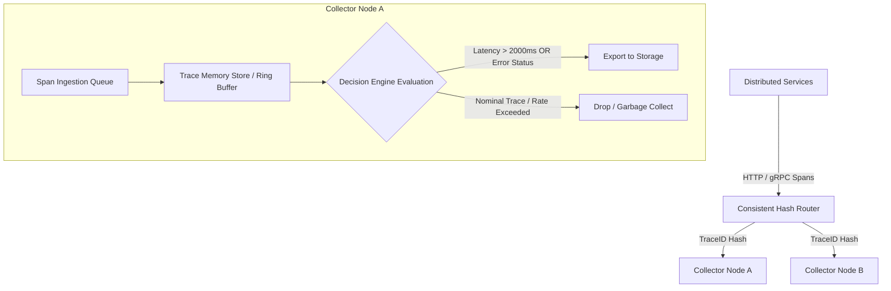
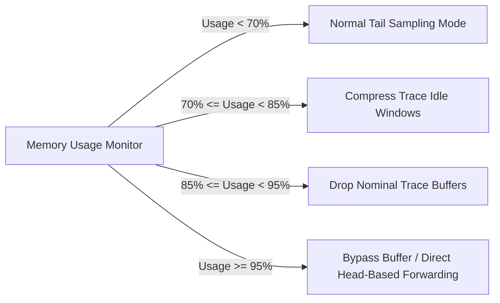

Head-based sampling forces a telemetry SDK to decide whether to sample a trace at its root span. When an incoming HTTP request hits an API gateway, the context generator selects a sample flag based on a fixed ratio. Downstream microservices observe this trace context flag and forward or discard their spans accordingly.

While head-based sampling keeps memory footprint negligible at the agent level, it suffers from a fundamental structural flaw: the sampling decision is made before the outcome of the trace is known. An unhandled exception or an abnormal database query latency occurring 15 hops deep into a distributed trace will be discarded if the root span randomly decided not to sample.

Tail-based sampling shifts this decision down the pipeline to a centralized ingestion collector cluster. The collector buffers incoming spans from all services in memory, reconstructs the context of the trace, and defers the sampling decision until either the trace completes or a configurable wait timeout expires. This guarantees that traces containing HTTP 5xx errors, unhandled exceptions, or latency anomalies are preserved at a 100% sampling rate, while high-volume baseline traffic can be downsampled aggressively.



### Architectural Deep Dive: Memory Buffers and Trace Aggregation

To execute tail-based sampling efficiently, the ingest pipeline must aggregate isolated span payloads emitted asynchronously across thousands of distributed processes into unified trace contexts.

Incoming span batches are decoded and routed to dedicated trace memory stores. To ensure all spans for a specific TraceID land on the same collector instance in a multi-node cluster, edge load balancers or telemetry routers implement consistent hashing on the 128-bit TraceID header.

Inside the collector process, memory is managed via fixed-size ring buffers or segmented hash maps. Each trace bucket tracks key metadata:

* The arrival timestamp of the initial span.
* The timestamp of the most recently ingested span.
* A slice or vector of buffered span payloads.
* An inverted index of state flags (for instance, whether any span in the batch contains an error flag).

Two critical time parameters govern memory occupancy inside the engine:

1. `trace_idle_time`: The duration the collector waits after receiving the latest span for a trace before declaring it inactive and executing rule evaluation.
2. `trace_expansion_time`: The hard maximum duration a trace can remain in memory from the moment its first span arrived, guarding against leaked or long-running unclosed traces.

```
Trace Arrival Timeline
-----------------------------------------------------------------------> Time
| Span 1 (Root)  | Span 2 (DB)               | Span 3 (Redis)  | Decision Triggered
^                ^                           ^                 ^
First Span       Active Window               Idle Timeout      Evaluation
(Expansion T0)   (Resets Idle Timer)         Expires           Phase
```

### Rule Evaluation Mechanics

When a trace buffer hits an evaluation trigger, either through the explicit receipt of a terminating root span or the expiration of the `trace_idle_time` window, the entire trace context is passed to a chain of evaluator functions.

Evaluators process rules in a strict execution hierarchy to minimize computational overhead:

* **Error Status Evaluator:** Scans span attributes for error flags (`otel.status_code == ERROR` or `http.status_code >= 500`). If a match occurs, the trace is immediately marked for retention.
* **Latency Evaluator:** Computes trace duration by finding `Max(end_time) - Min(start_time)` across all buffered spans. If total duration exceeds defined SLA boundaries, the trace is retained.
* **Attribute Matcher:** Evaluates key-value pairs against regular expressions or exact string matches (such as retaining all traces originating from an enterprise tenant or a specific staging canary).
* **Probabilistic Evaluator:** Acts as a baseline fallback for nominal traces that passed all prior filter rules without matching. It retains a fixed percentage of healthy traces to provide statistically accurate baseline metrics.

If any rule evaluates to a retention decision, the collector flushes the buffered spans directly to the downstream exporter queue. If no rules trigger retention, the trace bucket memory is returned to an internal allocation pool.

### Memory Safety Under Telemetry Traffic Spikes

Because tail-based sampling requires holding uncommitted trace state in memory, system resource usage scales with total system request throughput multiplied by average trace retention time. During an outage, both error rates and trace durations spike simultaneously, threatening to exhaust collector heap space.



High-performance collector implementations protect process stability using circuit breakers governed by system memory thresholds:

* **Stage 1 (Nominal):** All spans are held in ring buffers for the full `trace_idle_time` duration.
* **Stage 2 (Elevated Memory Pressure):** The engine dynamically compresses `trace_idle_time` from 30 seconds to 5 seconds, forcing faster decision cycles and lower average memory occupancy per trace.
* **Stage 3 (High Memory Pressure):** Probabilistic rules for healthy baseline traffic are disabled. Nominal traces are dropped immediately upon ingestion, reserving buffer capacity strictly for traces that already contain explicit error flags.
* **Stage 4 (Critical Heap Allocation):** The buffer pipeline opens its circuit breaker. Incoming spans bypass trace aggregation entirely and default to head-based sampling rules, preserving collector uptime at the expense of temporary tail-sampling fidelity.

### Concurrent State Management Strategies

At high scale (exceeding 100,000 spans per second per node), thread contention over trace allocation locks becomes a significant bottleneck. Modern engines avoid global lock contention by sharding the internal trace memory store across CPU core boundaries.

Ingestion threads route incoming spans directly to a specific partition based on the modulo of the TraceID bitwise representation. Each partition runs an isolated thread loop managing its own memory pool, sliding ring buffers, and evaluator execution loops. This lock-free sharding approach minimizes cross-core cache invalidation, enabling linear scaling with available CPU cores.