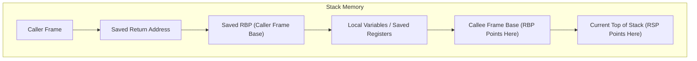
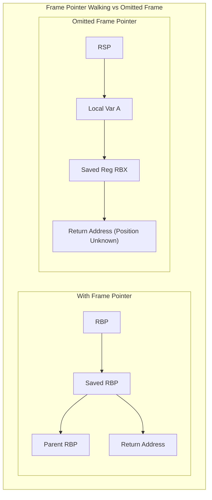
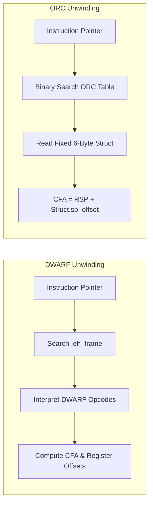
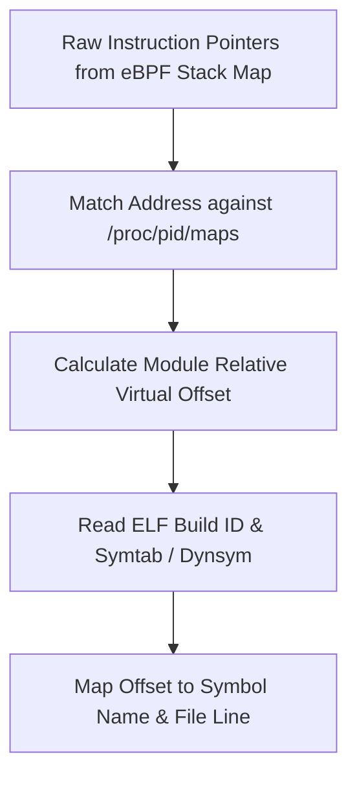

When a continuous thread profiler interrupts a running CPU at 99 Hz, it faces a tough problem. The profiler receives a raw memory dump of execution state, a stack pointer register, an instruction pointer register, and several megabytes of stack memory. Within a few microseconds, it must reconstruct the exact sequence of nested function calls that led to that moment, without causing page faults, locking kernel mutexes, or inflating CPU utilization. 

Stack unwinding is the foundational engine behind production profiling, eBPF tracing, and exception handling. Modern profilers rely on three distinct mechanisms to walk the stack: frame pointer chaining, DWARF Call Frame Information, and the Linux kernel's ORC table engine. Each approach strikes a different balance between CPU overhead, binary size, and stack reconstruction reliability.

### Memory Anatomy of the Execution Stack

To understand unwinding, we have to look at how functions execute on x86_64 architectures. When code calls a function, the CPU pushes the instruction address immediately following the call site onto the stack as the return address. The stack grows downward toward lower memory addresses. 

In standard frame-pointer-based execution, the stack frame for a function is delimited by two CPU registers: RSP, which points to the top of the stack, and RBP, which points to the base of the current stack frame. Upon entering a function, the compiler generates a prologue that pushes the caller's frame pointer onto the stack and updates the frame pointer to point to this newly saved location. 

When frame pointers are active, unwinding a stack is a trivial linked-list traversal. The current frame pointer register points to a memory location holding the previous frame pointer. Immediately adjacent to that saved pointer sits the return address. The profiler reads the value stored at the address in RBP to find the parent frame pointer, reads the adjacent return address into its instruction pointer array, and repeats the process until RBP becomes zero or points outside valid stack memory bounds.

### The Death of Frame Pointers and Compiler Optimizations

Frame pointer walking is fast and requires virtually no extra metadata. However, compiler optimization flags like -fomit-frame-pointer break this chain completely. Registers are scarce resources on modern CPUs. Disabling frame pointers frees up the RBP register so compilers can use it for general-purpose variable storage. 

When frame pointers are omitted, functions no longer save RBP on entry, nor do they update RBP to reference the current stack frame. The stack frame consists of a fluid block of memory where local variables, caller-saved registers, and temporary values sit without explicit boundary markers. 

Without RBP pointing to the previous frame, a thread profiler looking at raw stack bytes cannot tell where local variables end and return addresses begin. The stack becomes an unlabeled array of 64-bit integers. If a profiler tries to guess which integers are code addresses by scanning for executable memory ranges, it risks false positives from data pointers and hits severe performance penalties.

### DWARF Call Frame Information and State Machine Execution

To allow exceptions and debugging without frame pointers, toolchains embed DWARF metadata inside binary executables, stored within ELF sections named .debug_frame or .eh_frame. DWARF models stack unwinding by defining a virtual execution state machine.

DWARF abstracts the stack memory state into a table where every row corresponds to a single machine code instruction address, and columns describe how to locate the Canonical Frame Address, which represents the stack address of the caller before the function call occurred. 

Instead of emitting millions of table rows for every binary byte, DWARF encodes transitions using bytecode instructions. These bytecodes are grouped into Common Information Entries and Frame Description Entries. When an unwinder processes an instruction pointer, it locates the matching Frame Description Entry using binary search, initializes an unwind evaluation engine, and executes bytecode instructions to build the frame recovery rules.

Typical DWARF rules state that the Canonical Frame Address equals the value of RSP plus a specific integer offset, and the return address sits at a fixed distance from that calculated frame address. If a function saved caller registers to stack locations during execution, DWARF bytecode dynamically updates the offset equations based on the current program counter.

While DWARF provides high fidelity, evaluating DWARF bytecode on every sample introduces significant performance costs. Evaluating bytecode requires parsing variable-length instructions, managing evaluation stacks, and reading unwind tables that can easily double the size of binary executables on disk. Kernel-level profilers like eBPF struggle with DWARF because running an unpredictable bytecode interpreter inside a high-frequency kernel sampling interrupt violates safety guarantees and memory budgets.

### The Linux ORC Unwinder Mechanics

To solve the latency and complexity problems of DWARF inside the kernel, Linux developers introduced the Oops Rewind Capability unwinder. ORC strips away the full general-purpose DWARF virtual machine in favor of a pre-calculated, fixed-size lookup array.

ORC replaces variable-length DWARF opcodes with a standardized 6-byte structure. During kernel compilation, an offline tooling step processes the DWARF annotations generated by GCC or Clang and converts them into simple ORC entries. 

An ORC entry directly records the method for finding the Canonical Frame Address and the frame pointer value using simple enum codes rather than opcodes. One code indicates that the frame address is calculated as RSP plus a fixed offset, another indicates it is calculated from RBP plus an offset, and a third handles signal context frames.

Because every ORC table entry has a uniform memory footprint, the kernel unwinder avoids bytecode evaluation entirely. When a sampling event occurs, the unwinder performs a binary search over the sorted ORC instruction pointer array to pick the active struct, calculates the frame address using basic integer addition, and retrieves the return address directly from stack memory. This reduces stack frame recovery to a fast array lookup.

### eBPF Stack Trace Harvesting and Symbolication

Modern production profilers run inside the kernel using eBPF programs attached to high-frequency hardware performance counters or timer interrupts. When an eBPF profiling script runs inside the kernel context, it invokes helpers like bpf_get_stackid to record backtraces into kernel-managed map buffers.

If the target executable retains frame pointers, the eBPF kernel helper walks RBP chains directly inside the interrupt handler, populating an array of instruction pointers. If frame pointers are omitted, modern eBPF profilers must either rely on kernel ORC tables for kernel-space frames, or rely on user-space helper agents that stream raw stack memory bytes out to a daemon that processes DWARF tables asynchronously.

Once the instruction pointers are collected, the continuous profiler converts raw memory addresses into human-readable function names and source locations. This symbolication phase requires reading the ELF binary files running on the host system.

Symbolication engines map raw virtual addresses back to file offsets using memory maps published in proc filesystems. The engine calculates the relative virtual offset of an instruction pointer within its host shared object or executable module, searches the executable's symbol tables, and extracts function names. 

By combining lightweight kernel stack harvesting with out-of-band symbol processing, continuous thread profilers maintain accurate operational visibility across complex production workloads without impacting runtime performance.
