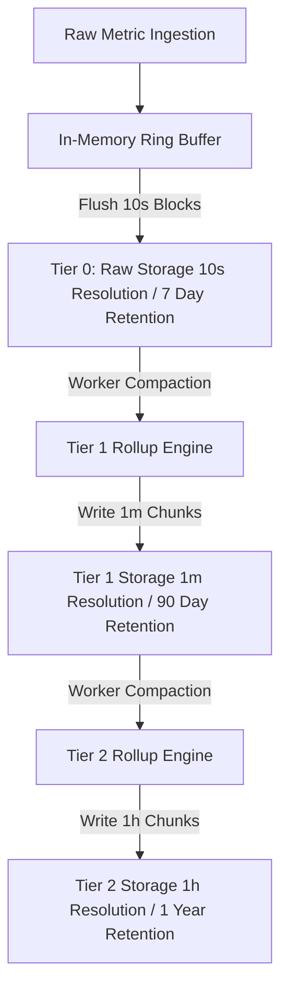

When operating an Application Performance Monitoring platform handling millions of active metrics, raw telemetry points arrive at 1-second or 10-second intervals. Storing raw points indefinitely causes unsustainable storage costs and intolerable query latencies when scanning multi-month time ranges. To solve this, time-series storage engines employ background downsampling pipelines that compact high-resolution telemetry into lower-resolution rollup tiers. Implementing this requires managing trade-offs between storage compression, write amplification, and statistical distortion.

### Storage Tier Architecture

A production time-series engine organizes incoming data into discrete time-based storage tiers. Raw data resides in Tier 0, offering high temporal precision for real-time alerting and immediate incident debugging. As data ages past a retention threshold, compaction workers read raw blocks, aggregate sample values over defined temporal windows, and write compressed rollup chunks into longer-term tiers.



Tier 0 retains raw 10-second samples for 7 days. Tier 1 consolidates those samples into 1-minute resolution chunks spanning 90 days. Tier 2 collapses 1-minute chunks into 1-hour resolution blocks retained for a year or longer. Query engines automatically route incoming range requests to the coarsest tier capable of satisfying the requested step interval, keeping scanned chunk volumes low.

### Aggregation Types and Mathematical Correctness

Downsampling cannot treat all telemetry data types identically. Naive downsampling strategies often introduce mathematical bugs that distort long-term trends. Metrics must be aggregated according to their semantic type.

Counters represent monotonically increasing values, such as total HTTP requests served. Downsampling a counter over a rollup interval requires computing the delta between the first and last sample inside the window, or storing the max raw counter value alongside reset adjustments.

Gauges represent instantaneous state measurements, such as system memory usage or thread pool execution depth. A single point cannot represent a gauge over a 1-minute or 1-hour window. The downsampling engine must compute four distinct values for every rollup interval: the minimum, maximum, sum, and sample count. Storing both sum and count enables downstream query engines to calculate the weighted average across arbitrary time ranges without losing the context of missing samples.

Histograms and percentiles present the most complex aggregation challenge. Simple arithmetic averages of 99th percentile measurements across multiple windows yield mathematically invalid results. To preserve quantile accuracy during rollups, the ingestion engine must convert distribution data into mergeable sketches like T-Digests or HdrHistograms before storage.

```
10-Second Raw Windows:   [ Sketch A ]  [ Sketch B ]  [ Sketch C ]  [ Sketch D ]  [ Sketch E ]  [ Sketch F ]
                               \             |             |             |             /            
                                \            |             |             |            /             
1-Minute Rollup Merge:           ================== [ Merged T-Digest Sketch ] ==================
```

During compaction, the worker merges six 10-second T-Digest sketches into a single 1-minute T-Digest sketch by aggregating centroid weights and recalculating buffer boundaries. This retains tail-latency precision within predictable error bounds.

### In-Memory Sliding Window Aggregator

Below is an implementation of a thread-safe, lock-free sliding window downsampling aggregator written in C#. It accepts high-frequency gauge readings and collapses them into 1-minute rollup records.

```csharp
using System;
using System.Threading;

public struct GaugeRollup
{
    public double Min;
    public double Max;
    public double Sum;
    public long Count;
}

public class GaugeWindowAggregator
{
    private class Bucket
    {
        public long TimestampSec;
        public double Min = double.MaxValue;
        public double Max = double.MinValue;
        public double Sum;
        public long Count;
    }

    private readonly Bucket[] _buckets;
    private readonly int _bucketCount;
    private readonly long _bucketSizeSec;

    public GaugeWindowAggregator(int bucketCount = 60, long bucketSizeSec = 1)
    {
        _bucketCount = bucketCount;
        _bucketSizeSec = bucketSizeSec;
        _buckets = new Bucket[bucketCount];
        for (int i = 0; i < bucketCount; i++)
        {
            _buckets[i] = new Bucket();
        }
    }

    public void AddSample(long unixTimestampSec, double value)
    {
        int index = (int)((unixTimestampSec / _bucketSizeSec) % _bucketCount);
        Bucket bucket = _buckets[index];

        lock (bucket)
        {
            if (bucket.TimestampSec != unixTimestampSec)
            {
                bucket.TimestampSec = unixTimestampSec;
                bucket.Min = value;
                bucket.Max = value;
                bucket.Sum = value;
                bucket.Count = 1;
            }
            else
            {
                if (value < bucket.Min) bucket.Min = value;
                if (value > bucket.Max) bucket.Max = value;
                bucket.Sum += value;
                bucket.Count++;
            }
        }
    }

    public GaugeRollup FlushAndAggregate(long windowStartSec, long windowEndSec)
    {
        GaugeRollup result = new GaugeRollup
        { 
            Min = double.MaxValue, 
            Max = double.MinValue, 
            Sum = 0, 
            Count = 0 
        };

        for (int i = 0; i < _bucketCount; i++)
        {
            Bucket bucket = _buckets[i];
            lock (bucket)
            {
                if (bucket.TimestampSec >= windowStartSec && bucket.TimestampSec < windowEndSec && bucket.Count > 0)
                {
                    if (bucket.Min < result.Min) result.Min = bucket.Min;
                    if (bucket.Max > result.Max) result.Max = bucket.Max;
                    result.Sum += bucket.Sum;
                    result.Count += bucket.Count;
                }
            }
        }

        if (result.Count == 0)
        {
            result.Min = 0;
            result.Max = 0;
        }

        return result;
    }
}
```

The ring buffer pre-allocates bucket structures to avoid runtime allocations during metric ingestion. A state machine flushes expired buckets directly to columnar disk blocks when a full minute elapses.

### Chunk Format and On-Disk Layout

Rollup chunks are written in fixed-size, byte-aligned block formats optimised for SIMD vector instructions. A typical 1-hour gauge chunk contains header metadata followed by compressed bit-packed arrays.

```
+---------------------------------------------------------------------------------+
| Chunk Header: Series ID (8B) | Start Timestamp (8B) | Target Resolution (4B)    |
+---------------------------------------------------------------------------------+
| Compressed Min Values Array (Gorilla / XOR Bit-Packed Float64)                  |
+---------------------------------------------------------------------------------+
| Compressed Max Values Array (Gorilla / XOR Bit-Packed Float64)                  |
+---------------------------------------------------------------------------------+
| Compressed Sum Values Array (Gorilla / XOR Bit-Packed Float64)                  |
+---------------------------------------------------------------------------------+
| Compressed Count Values Array (Varint Encoded Integers)                         |
+---------------------------------------------------------------------------------+
```

By segregating min, max, sum, and count into distinct contiguous arrays within the chunk file, query execution engines perform vectorized SIMD scans over specific attributes. If a user queries only the maximum CPU usage across a region, the engine loads and decodes only the Max Array, bypassing the rest of the payload.

### Handling High-Cardinality Stream Explosions

High-cardinality label churn creates massive challenges during downsampling. When short-lived tags like container IDs or ephemeral socket ports are appended to time-series metrics, millions of unique series are generated, only to die off minutes later.

If the downsampling engine attempts to allocate long-term rollup state for dead series, memory usage grows indefinitely. Production engines address this through dynamic cardinality budgeting and active time-series dropping during Tier 1 and Tier 2 transitions. During downsampling, series that have not emitted samples for two consecutive rollup intervals are evicted from memory state tables and marked as closed in index blocks, preventing cardinality leaks from degrading query routing speed.