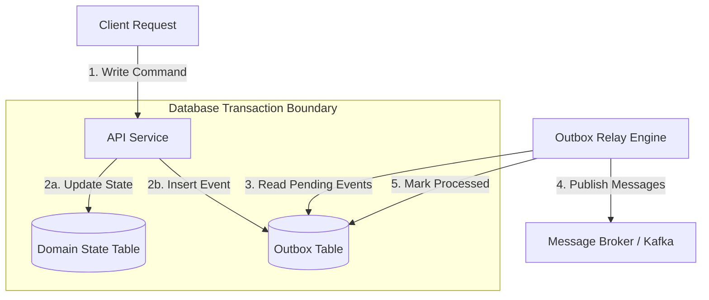

Every distributed system built around microservices eventually encounters the dual-write problem. An application receives an inbound request, updates its local relational database, and must inform the rest of the ecosystem by publishing an event to a message broker like Apache Kafka or RabbitMQ. Developers often write code that executes the local database transaction first and then immediately calls the message producer client to send the event. If the database commit succeeds but the network connection to the message broker drops, the rest of the platform misses the state change entirely. Conversely, if the developer publishes the event first and the subsequent database commit fails due to a foreign key constraint or deadlocking, downstream services react to an event representing state that never actually existed on disk.

Attempting to coordinate these two distinct storage engines using traditional Distributed Transactions or Two-Phase Commit protocols creates massive operational instability. Two-Phase Commit requires an external transaction coordinator to hold row locks across all participating systems while executing a prepare and commit phase over the network. In modern cloud environments, holding database locks open while awaiting remote consensus introduces intolerable latency spikes. A transient network partition between the coordinator and the message broker freezes the application thread, degrades database pool availability, and routinely degrades entire service meshes into complete availability collapses.



The transactional outbox pattern solves the dual-write problem by collapsing both operations into a single local database transaction. Instead of attempting to publish directly to the message broker within the HTTP handler, the service writes the outgoing message payload directly into a dedicated database table inside the exact same atomic transaction that updates the core aggregate state. Because relational databases guarantee ACID properties across multiple table writes within a single session, the application guarantees that either both the state change and outbox row are committed to disk, or neither is.

A completely decoupled worker process, known as the outbox relay, continuously polls or streams events from the outbox table and pushes them into the broker. Once the broker acknowledges receipt of a batch of messages, the relay marks those rows as processed or deletes them from the outbox table entirely. This shifts the message publication lifecycle from a synchronous distributed transaction to an asynchronous, eventually consistent pipeline.

Designing an outbox table requires careful consideration of access patterns, write amplification, and indexing efficiency. The schema must store enough context for the downstream consumer to deserialize and process the payload without requiring secondary synchronous queries back to the origin database. A production-grade outbox table schema relies on explicit data types:

```sql
CREATE TABLE outbox_messages (
    id UUID PRIMARY KEY,
    aggregate_type VARCHAR(255) NOT NULL,
    aggregate_id VARCHAR(255) NOT NULL,
    type VARCHAR(255) NOT NULL,
    payload JSONB NOT NULL,
    created_at TIMESTAMPTZ NOT NULL DEFAULT CURRENT_TIMESTAMP,
    processed_at TIMESTAMPTZ NULL,
    retry_count INT NOT NULL DEFAULT 0,
    error_log TEXT NULL
);

CREATE INDEX idx_outbox_unprocessed 
ON outbox_messages (created_at) 
WHERE processed_at IS NULL;
```

Using a partial index that specifically filters for unprocessed rows keeps index size minimal even if the main table grows to millions of historical audit records. In high-throughput applications, keeping processed messages in the primary database causes massive storage inflation and vacuum pressure in PostgreSQL. Operational setups typically enforce a strict purge policy where records are deleted immediately upon successful broker confirmation, or moved off to cold partition archives via automated background processes.

There are two primary paradigms for implementing the outbox relay worker engine: Polling Relays and Change Data Capture via Write-Ahead Log tailing.

Polling relays execute periodic SQL queries against the database to fetch unconsumed outbox records. While straightforward to build, naive polling logic introduces lock contention and database performance degradation if multiple relay worker instances run concurrently. When two relay processes execute a query simultaneously, they compete for the same unprocessed rows, leading to duplicate processing or lock blocking.

To run concurrent polling engines safely, SQL engines support row-level skipping mechanics. In PostgreSQL or MySQL, using the SELECT FOR UPDATE SKIP LOCKED clause allows worker instances to claim distinct subsets of pending records without blocking each other.

```sql
WITH pending_events AS (
    SELECT id 
    FROM outbox_messages
    WHERE processed_at IS NULL
    ORDER BY created_at ASC
    LIMIT 500
    FOR UPDATE SKIP LOCKED
)
UPDATE outbox_messages
SET processed_at = CURRENT_TIMESTAMP
FROM pending_events
WHERE outbox_messages.id = pending_events.id
RETURNING outbox_messages.id, outbox_messages.type, outbox_messages.payload;
```

This query atomically finds up to 500 unallocated records, locks them for the current worker transaction, updates their timestamps, and returns the payload to the application memory space in a single roundtrip. If another worker thread executes the exact same query concurrently, the database engine skips the locked rows and instantly returns the next available chunk of unprocessed messages.

Polling relays introduce non-trivial query execution overhead. When no new domain events are being generated, polling workers continuously bombard the database with read requests, consuming CPU cycles, query planning memory, and connection pool slots. Increasing the sleep interval reduces idle database load, but directly inflates end-to-end event propagation latency.

Write-Ahead Log tailing bypasses the query processing layer entirely by reading directly from the database transaction log. Systems like PostgreSQL append every committed state change to a write-ahead log on disk before confirming transaction success to the client. Modern databases expose logical decoding interfaces, such as PostgreSQL pgoutput or MySQL binlog readers, which transform raw binary transaction streams into structured event records.

```mermaid
graph LR
    App[Application Code] -->|1. Commit DB Transaction| Postgres Primary[(Postgres WAL Engine)]
    Postgres Primary -->|2. Write Binary Log| WAL[(Write-Ahead Log)]
    WAL -->|3. Streaming Logical Replication| Debezium[Debezium / Kafka Connect]
    Debezium -->|4. Unpack JSON / Avro Payload| Kafka[Kafka Event Bus]
```

Tools like Debezium attach to the database as a logical replication subscriber. When a transaction inserts a record into the outbox table, the change is written to the database WAL. Debezium reads the WAL stream asynchronously, extracts the inserted payload, transforms it into an event, and publishes it directly into Apache Kafka without executing a single SELECT query against the underlying tables.

WAL tailing offers near-zero latency, eliminates polling query load, and removes the write amplification associated with updating timestamps on the outbox table. However, WAL tailing introduces significant infrastructure complexity. Managing replication slots, handling WAL disk space growth if downstream replication lags, and handling schema migrations across binary log formats require specialized data engineering support and precise monitoring.

Distributed networks render exact-once delivery fundamentally impossible. Network timeouts, relay instance crashes, or transient broker errors mean the outbox engine will occasionally publish the same record more than once. The outbox pattern guarantees at-least-once delivery, shifting the responsibility of idempotency to downstream consumers.

To protect against duplicate processing, event payloads must include deterministically generated message identifiers, typically sourced from the aggregate state or a UUID generated during the initial outbox insertion. Receiver applications implement an idempotent consumer pattern by persisting incoming message identifiers into a local deduplication table before executing business logic.

```sql
BEGIN;

INSERT INTO processed_events (message_id, processed_at)
VALUES ('9b1deb4d-3b7d-4bad-9bdd-2b0d7b3dcb6d', CURRENT_TIMESTAMP)
ON CONFLICT (message_id) DO NOTHING;

-- If row was inserted, execute domain logic...

COMMIT;
```

If the unique key constraint fails on the processed_events table insert, the consumer instantly identifies the inbound message as a duplicate payload, short-circuits execution, and acknowledges the message to the broker without applying duplicate side-effects to its domain model.

Building an outbox worker inside a high-throughput .NET service requires streaming batch primitives to eliminate memory allocations and pipeline bottlenecks. Coupling System.Threading.Channels with IAsyncEnumerable allows us to build a thread-safe, memory-efficient background relay engine capable of pushing thousands of events per second with minimal garbage collection pressure.

```csharp
public sealed class OutboxBatchProcessor
{
    private readonly IDbConnectionFactory _dbFactory;
    private readonly IProducerClient _kafkaProducer;
    private readonly Channel<OutboxMessage> _channel;

    public OutboxBatchProcessor(IDbConnectionFactory dbFactory, IProducerClient kafkaProducer)
    {
        _dbFactory = dbFactory;
        _kafkaProducer = kafkaProducer;
        _channel = Channel.CreateBounded<OutboxMessage>(new BoundedChannelOptions(10000)
        {
            SingleWriter = true,
            SingleReader = true,
            FullMode = BoundedChannelFullMode.Wait
        });
    }

    public async Task ProcessOutboxAsync(CancellationToken cancellationToken)
    {
        while (!cancellationToken.IsCancellationRequested)
        {
            var batch = await FetchBatchAsync(cancellationToken);
            if (batch.Count == 0)
            {
                await Task.Delay(100, cancellationToken);
                continue;
            }

            try
            {
                await _kafkaProducer.ProduceBatchAsync(batch, cancellationToken);
                await AcknowledgeBatchAsync(batch, cancellationToken);
            }
            catch (Exception ex)
            {
                await FlagBatchFailureAsync(batch, ex.Message, cancellationToken);
            }
        }
    }

    private async Task<List<OutboxMessage>> FetchBatchAsync(CancellationToken ct)
    {
        using var connection = await _dbFactory.CreateConnectionAsync(ct);
        using var command = connection.CreateCommand();
        command.CommandText = @"
            WITH pending AS (
                SELECT id, aggregate_type, aggregate_id, type, payload 
                FROM outbox_messages
                WHERE processed_at IS NULL
                ORDER BY created_at ASC
                LIMIT 500
                FOR UPDATE SKIP LOCKED
            )
            UPDATE outbox_messages SET processed_at = NOW()
            FROM pending WHERE outbox_messages.id = pending.id
            RETURNING pending.id, pending.aggregate_type, pending.aggregate_id, pending.type, pending.payload;";

        var list = new List<OutboxMessage>(500);
        using var reader = await command.ExecuteReaderAsync(ct);
        while (await reader.ReadAsync(ct))
        {
            list.Add(new OutboxMessage(
                reader.GetGuid(0),
                reader.GetString(1),
                reader.GetString(2),
                reader.GetString(3),
                reader.GetString(4)
            ));
        }
        return list;
    }

    private async Task AcknowledgeBatchAsync(List<OutboxMessage> batch, CancellationToken ct)
    {
        using var connection = await _dbFactory.CreateConnectionAsync(ct);
        using var command = connection.CreateCommand();
        command.CommandText = "DELETE FROM outbox_messages WHERE id = ANY(@Ids)";
        var param = command.CreateParameter();
        param.ParameterName = "@Ids";
        param.Value = batch.Select(m => m.Id).ToArray();
        command.Parameters.Add(param);
        await command.ExecuteNonQueryAsync(ct);
    }

    private async Task FlagBatchFailureAsync(List<OutboxMessage> batch, string error, CancellationToken ct)
    {
        using var connection = await _dbFactory.CreateConnectionAsync(ct);
        using var command = connection.CreateCommand();
        command.CommandText = @"
            UPDATE outbox_messages 
            SET retry_count = retry_count + 1, 
                processed_at = NULL, 
                error_log = @Error 
            WHERE id = ANY(@Ids)";
        
        var errParam = command.CreateParameter();
        errParam.ParameterName = "@Error";
        errParam.Value = error;
        command.Parameters.Add(errParam);

        var idParam = command.CreateParameter();
        idParam.ParameterName = "@Ids";
        idParam.Value = batch.Select(m => m.Id).ToArray();
        command.Parameters.Add(idParam);

        await command.ExecuteNonQueryAsync(ct);
    }
}
```

The transactional outbox pattern transforms unpredictable network dependencies into predictable local disk operations. Polling setups with row locks suit low to medium volume microservices, while WAL-based CDC configurations power ultra-high-throughput enterprise event buses without overburdening primary relational databases.
