When we build modern local microservices, sidecars, or high-throughput local pipelines, we frequently default to using HTTP or gRPC over a local port. Running local inter-process communication over TCP loopback is a lazy, expensive abstraction. It subjects packets to the full rigors of the network stack, forcing the kernel to run routing logic, construct IP headers, compute checksums, and manage complex TCP state machines all to move bytes across a shared memory barrier. 

Unix Domain Sockets (AF_UNIX) completely bypass this network emulation. Instead of treating the local host as a miniature network, AF_UNIX establishes a direct, memory-to-memory conduit between processes. Beyond the raw performance benefits, Unix Domain Sockets offer a unique capability that is impossible over TCP: they allow processes to pass actual file descriptors, credentials, and open kernel resources across process boundaries using SCM_RIGHTS ancillary data. To understand why this is so powerful, we have to look directly at how the Linux kernel manages socket buffers and process file tables.

### The Overhead of TCP Loopback

When two processes communicate on the same machine via TCP loopback (127.0.0.1), they invoke the full machinery of the Linux network stack. The kernel does not know the destination is local until it performs a routing table lookup. 

```mermaid
graph TD
    subgraph TCP_Loopback_Data_Path
        A[Process A] -->|1. write| SK1[TCP Send Socket Buffer]
        SK1 -->|2. TCP Segment Construction| IP[IP Routing Logic]
        IP -->|3. Virtual Device Queue| LO[Loopback Interface lo]
        LO -->|4. SoftIRQ Scheduling| NET[Netfilter / iptables]
        NET -->|5. IP/TCP Parsing| SK2[TCP Recv Socket Buffer]
        SK2 -->|6. read| B[Process B]
    end
    subgraph AF_UNIX_Data_Path
        X[Process A] -->|1. write| SKB[Shared Kernel Socket Buffer]
        SKB -->|2. Direct Copy / Wakeup| Y[Process B]
    end
```



During a TCP loopback write, Process A copies data from user space to a socket buffer in kernel space. The TCP layer segments this data, calculates checksums, and appends TCP headers. The packet then flows down to the IP layer, which appends IP headers and routes the packet to the virtual loopback network interface, lo. The loopback driver loopback_xmit accepts the packet and immediately schedules a software interrupt (SoftIRQ) to process it on the receiving side. The packet then travels back up through netfilter firewall rules, IP parsing, and TCP stream reassembly. Finally, the kernel copies the data from the receiver socket buffer back to the user space of Process B. 

This entire trip requires multiple lock acquisitions, memory allocations, and context switches. It triggers firewalls and consumes valuable CPU cache lines. 

### The AF_UNIX Shortcut

In contrast, a Unix Domain Socket is a pure system VFS abstraction. When Process A calls write on an AF_UNIX socket, the kernel checks if the peer socket is connected. If the connection is active, the kernel allocates a socket buffer structure, known as an sk_buff, and copies the data directly from the address space of Process A into the socket buffer allocated in kernel memory. 

Immediately after the copy completes, the kernel queues this buffer onto the receiving socket's queue and wakes up Process B if it is blocked on a read. When Process B reads from the socket, the kernel copies the data directly from the sk_buff to Process B's user-space memory and frees the buffer. There is no protocol header construction, no checksum calculation, no packet fragmentation, and no virtual network device queueing. The entire pathway is a single, direct, synchronous memory-to-memory transaction.

### The Magic of SCM_RIGHTS and File Descriptor Passing

Beyond basic byte-stream transport, Unix Domain Sockets can transmit control messages, which are also known as ancillary data. The most powerful of these control messages is SCM_RIGHTS, which allows a process to transmit an open file descriptor to an entirely unrelated process. 

To appreciate how this works under the hood, we must first tear down the illusion of the file descriptor. To a user-space application, a file descriptor is just an integer, like 3 or 12. This integer is actually a private index into a process-specific array called the file descriptor table, which lives within the kernel's task_struct for that process.

```
 Process A (Sender)                       Kernel Space                         Process B (Receiver)
 +------------------+                                                          +------------------+
 | task_struct      |                                                          | task_struct      |
 |  -> files_struct |                                                          |  -> files_struct |
 |     [fd_array]   |                                                          |     [fd_array]   |
 |     [0] -> stdin |                                                          |     [0] -> stdin |
 |     [1] -> stdout|                                                          |     [1] -> stdout|
 |---> [4] -----------> [struct file (Active)] <------------------------------ |     [7] <--------|
 +------------------+    | ref count: 1       | (Incremented to 2 on sendmsg)  +------------------+
                         |  - path: /data.db  | (Allocated fd 7 on recvmsg)
                         |  - offset: 1024    | 
                         +--------------------+ 
```

Inside the kernel, the task_struct points to a files_struct. This structure contains an fd_array, where each index points to a shared struct file object. This struct file represents the actual open file description. It tracks the underlying inode, the file access mode, and the current read/write offset. 

If Process A attempts to send the integer "4" to Process B over a standard network connection, Process B receives the literal number 4. If Process B tries to read from descriptor 4, it will either get an error because descriptor 4 is not open in its own table, or it will read from whatever random file or socket it already had open at index 4. The raw integer carries zero context across process boundaries.

When Process A uses a Unix Domain Socket with SCM_RIGHTS, the kernel intercepts the transmission. Instead of passing a raw integer, the kernel accesses Process A's private fd_array at index 4. It extracts the pointer to the underlying struct file object and increments its internal reference count. 

This reference count increment is a critical safety guarantee. Even if Process A immediately closes its descriptor 4 after calling sendmsg, the underlying struct file remains alive in the kernel. The kernel places this file pointer into the Unix socket's queue, associating it with the pending socket buffer.

When Process B invokes recvmsg, the kernel detects the SCM_RIGHTS payload. The kernel searches Process B's private files_struct for the lowest unused file descriptor index. If it finds that index 7 is vacant, the kernel assigns index 7 in Process B's fd_array to point directly to the shared struct file object. The kernel then writes the integer value "7" into the control buffer returned to Process B's user space. 

Process B can now immediately call read, write, or lseek on descriptor 7. Both processes are now sharing the exact same kernel-level file session. If Process A moves the file cursor to byte offset 1024, Process B's next read will begin at byte 1024 because they share the exact same struct file state.

### Constructing SCM_RIGHTS Messages in C

Because file descriptors are transmitted as auxiliary control messages, we cannot use the standard send or write system calls. We must use sendmsg and recvmsg, which accept a complex msghdr structure containing both normal data buffers and control data buffers.

Here is how Process A packages an open file descriptor and sends it over an established Unix Domain Socket:

```c
#include <sys/socket.h>
#include <sys/un.h>
#include <string.h>
#include <unistd.h>
#include <stdlib.h>

int send_fd(int socket_fd, int fd_to_send) {
    struct msghdr msg = {0};
    struct cmsghdr *cmsg;
    
    /* We must send at least one byte of regular data to trigger a successful transfer */
    char iobuf[1] = { 'F' };
    struct iovec io = {
        .iov_base = iobuf,
        .iov_len = sizeof(iobuf)
    };
    
    msg.msg_iov = &io;
    msg.msg_iovlen = 1;

    /* Allocate space for the control message payload */
    union {
        char buf[CMSG_SPACE(sizeof(int))];
        struct cmsghdr align;
    } ctrl_un;
    
    msg.msg_control = ctrl_un.buf;
    msg.msg_controllen = sizeof(ctrl_un.buf);

    /* Initialize the control message header */
    cmsg = CMSG_FIRSTHDR(&msg);
    cmsg->cmsg_level = SOL_SOCKET;
    cmsg->cmsg_type = SCM_RIGHTS;
    cmsg->cmsg_len = CMSG_LEN(sizeof(int));

    /* Write the actual file descriptor integer into the control payload */
    int *fdptr = (int *)CMSG_DATA(cmsg);
    *fdptr = fd_to_send;

    if (sendmsg(socket_fd, &msg, 0) < 0) {
        return -1;
    }
    return 0;
}
```

The receiving end mirrors this structure. Process B allocates a control buffer of equal size and parses the incoming control messages to extract the newly minted descriptor index.

```c
#include <sys/socket.h>
#include <sys/un.h>
#include <string.h>
#include <unistd.h>

int recv_fd(int socket_fd) {
    struct msghdr msg = {0};
    struct cmsghdr *cmsg;
    char iobuf[1];
    struct iovec io = {
        .iov_base = iobuf,
        .iov_len = sizeof(iobuf)
    };
    
    msg.msg_iov = &io;
    msg.msg_iovlen = 1;

    union {
        char buf[CMSG_SPACE(sizeof(int))];
        struct cmsghdr align;
    } ctrl_un;
    
    msg.msg_control = ctrl_un.buf;
    msg.msg_controllen = sizeof(ctrl_un.buf);

    if (recvmsg(socket_fd, &msg, 0) < 0) {
        return -1;
    }

    cmsg = CMSG_FIRSTHDR(&msg);
    if (cmsg == NULL || cmsg->cmsg_len != CMSG_LEN(sizeof(int))) {
        return -1;
    }
    if (cmsg->cmsg_level != SOL_SOCKET || cmsg->cmsg_type != SCM_RIGHTS) {
        return -1;
    }

    /* The kernel has populated our private file table. 
       We read the new descriptor index allocated for us. */
    int received_fd = *((int *)CMSG_DATA(cmsg));
    return received_fd;
}
```

### The Garbage Collection Challenge of Shared Descriptors

Introducing SCM_RIGHTS complicates kernel state tracking. Unix Domain Sockets are files themselves. This means you can open a pair of Unix Domain Sockets, package socket A inside an SCM_RIGHTS message, and send it to socket B. If you then package socket B and send it to socket A, you have created a cyclic dependency.

```
  +------------------+           +------------------+
  | Unix Socket A    |           | Unix Socket B    |
  | [Pending Queue]  |           | [Pending Queue]  |
  |  └─ Contains B ──┼──────────>|  └─ Contains A ──┼────┐
  +------------------+           +------------------+    │
           ▲                                             │
           └─────────────────────────────────────────────┘
```

If the user-space processes close their remaining handles to both socket A and socket B, the reference count of both underlying struct file structures remains at one because each is entombed inside the pending queue of the other. The applications can no longer access them, but the kernel cannot release them because their reference counts are not zero.

To prevent this scenario from leaking kernel memory forever, Linux implements a specialized garbage collector specifically for AF_UNIX sockets. Whenever a Unix Domain Socket is closed, the kernel runs a mark-and-sweep algorithm. It builds a directed graph of all AF_UNIX sockets, analyzes the file descriptors pending in their internal queues, and searches for unreferenced strongly connected components. If it detects a cycle of sockets that are unreachable from any active user-space file descriptor, the garbage collector breaks the loop, purges the pending queues, and reclaims the socket buffers.

### Secure Identity Verification using SO_PEERCRED

Another major architectural advantage of Unix Domain Sockets is secure local authentication. When connecting via TCP, a service can only verify the caller's IP address and source port. If multiple local processes are running on the same host under different system accounts, a TCP-based service cannot easily verify which local user is initiating the connection without relying on a shared secret or complex cryptographic certificates.

Unix Domain Sockets solve this through the SO_PEERCRED socket option. At the moment a connection is established, the kernel queries the task_struct of the connecting process and records its process identifier (PID), real user identifier (UID), and real group identifier (GID). This metadata is stored directly in the kernel's internal socket representation.

The receiving process can retrieve these credentials securely using getsockopt:

```c
#include <sys/socket.h>
#include <sys/un.h>
#include <sys/types.h>
#include <unistd.h>

int verify_peer_identity(int client_fd) {
    struct ucred credentials;
    socklen_t len = sizeof(struct ucred);

    if (getsockopt(client_fd, SOL_SOCKET, SO_PEERCRED, &credentials, &len) < 0) {
        return -1;
    }

    /* The kernel guarantees that these values cannot be spoofed by the client */
    uid_t client_uid = credentials.uid;
    pid_t client_pid = credentials.pid;
    
    if (client_uid == 0) {
        // Connection originates from root
    }
    return 0;
}
```

Because the kernel populates this structure directly from its own process scheduling tables, the connecting process has no way to spoof or alter these values. This mechanism enables zero-trust local authentication schemes. A local system daemon can automatically grant administrative access to root connections or restrict specific operations based on the calling user's UID, completely eliminating the need for local passwords, tokens, or certificate management.

### When to Choose AF_UNIX over TCP

While TCP loopback is suitable for cross-machine transitions, Unix Domain Sockets should be the default choice for any high-performance, single-host design. By abandoning loopback adapters and embracing AF_UNIX, services avoid the performance taxes of firewalls, checksum calculations, and routing latency. When combined with SCM_RIGHTS, Unix Domain Sockets transform from a simple communication line into an active coordination bus, allowing services to pass open database logs, shared memory blocks, and network sockets between distinct processes cleanly and securely.
