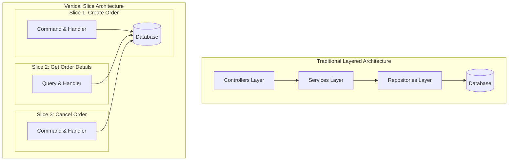
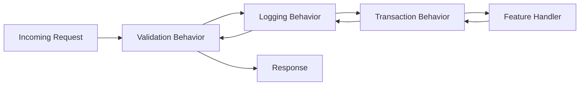

Traditional enterprise software architecture spent the last decade obsessed with layers. We built N-tier systems, then Onion Architecture, and then Clean Architecture. We isolated domain entities from database models, created generic repositories, added application service interfaces, and wrapped controllers around service calls. The promise was maintainability and testability. The reality for most engineering teams is friction.

Adding a simple feature, like updating an employee address, requires modifying code across four or five distinct project directories. You touch the Controller, the AppService interface, the AppService implementation, the Domain Service, the Repository interface, the Repository implementation, and three layers of mapping profiles. Every layer exists to protect the layer beneath it from change, but every change cuts horizontally through every single layer.

Vertical Slice Architecture throws out horizontal abstraction layers in favor of high feature cohesion. Instead of organizing code by technical concerns like controllers, services, and repositories, code is organized around business features. Each feature becomes a self-contained vertical slice containing its request contract, response payload, business logic, persistence logic, and validation.



### The Cohesion Problem with Layered Abstractions

Layered architectures rely on the reusability myth. We assume that putting database queries inside a repository interface allows us to swap database engines or reuse queries across multiple services. In practice, database migrations are rare, while business requirements shift constantly.

When every feature uses shared service classes, those services accumulate unrelated methods until they become bloated god objects. An OrderService ends up handling payment processing, inventory reservation, order cancellation, and pdf generation. Editing a method for order cancellation risks breaking inventory reservation because both methods share state and dependencies within the same service class.

Vertical Slice Architecture treats each feature as an independent entry point with its own request pipeline. High cohesion means things that change together stay together. Coupling between features is minimized, while cohesion within a feature is maximized.

### Building the Mediator Execution Pipeline

At the core of Vertical Slice Architecture in .NET is the Mediator pattern. Rather than invoking services directly, controllers or API endpoints dispatch a request object to an in-memory bus, which routes it to its corresponding handler.

```csharp
public record CreateUserCommand(string Email, string Name) : IRequest<Result<Guid>>;

public class CreateUserHandler : IRequestHandler<CreateUserCommand, Result<Guid>>
{
    private readonly AppDbContext _db;

    public CreateUserHandler(AppDbContext db)
    {
        _db = db;
    }

    public async Task<Result<Guid>> Handle(CreateUserCommand request, CancellationToken cancellationToken)
    {
        var existing = await _db.Users.AnyAsync(u => u.Email == request.Email, cancellationToken);
        if (existing)
        {
            return Result.Failure<Guid>("Email already registered");
        }

        var user = User.Create(request.Email, request.Name);
        _db.Users.Add(user);
        await _db.SaveChangesAsync(cancellationToken);

        return Result.Success(user.Id);
    }
}
```

Notice how the handler injects Entity Framework's DbContext directly. Generic repository interfaces are intentionally absent. For a specific command, direct database access provides maximum flexibility without wrestling with abstraction leaks like IQueryable exposure or missing include paths.

### Cross-Cutting Concerns via Pipeline Behaviors

Removing service layers does not mean duplicating logic for validation, logging, performance tracking, or database transaction management. Mediator pipeline behaviors solve cross-cutting concerns by acting as a composable middleware stack around request handlers.



Pipeline behaviors implement IPipelineBehavior<TRequest, TResponse>. They execute prior to the handler receiving control, invoke next(), and then execute cleanup or commit logic after the handler completes.

```csharp
public class TransactionBehavior<TRequest, TResponse> : IPipelineBehavior<TRequest, TResponse>
    where TRequest : ICommand
{
    private readonly AppDbContext _db;

    public TransactionBehavior(AppDbContext db)
    {
        _db = db;
    }

    public async Task<TResponse> Handle(
        TRequest request, 
        RequestHandlerDelegate<TResponse> next, 
        CancellationToken cancellationToken)
    {
        if (_db.Database.CurrentTransaction != null)
        {
            return await next();
        }

        var strategy = _db.Database.CreateExecutionStrategy();
        return await strategy.ExecuteAsync(async ()
        => {
            await using var transaction = await _db.Database.BeginTransactionAsync(cancellationToken);
            var response = await next();
            await _db.SaveChangesAsync(cancellationToken);
            await transaction.CommitAsync(cancellationToken);
            return response;
        });
    }
}
```

This behavior wraps the handler inside a relational database transaction. If the handler executes successfully without throwing an exception, SaveChangesAsync flushes pending entity modifications and commits the transaction atomically. If an unhandled exception occurs anywhere in the slice execution, the transaction rolls back cleanly.

### In-Memory Domain Event Dispatching Mechanics

While vertical slices separate features, business actions often trigger side effects in other parts of the application. For instance, creating an account requires sending a welcome email, creating an audit record, and initializing user preferences.

Writing all side-effect logic directly inside CreateUserHandler breaks the single responsibility of that slice. Calling other slice handlers directly introduces tight coupling between features. The solution is in-memory domain events.

Domain entities raise domain events during state transitions. These events are collected inside the aggregate root entity.

```csharp
public abstract class Entity
{
    private readonly List<IDomainEvent> _domainEvents = new();
    public IReadOnlyCollection<IDomainEvent> DomainEvents => _domainEvents.AsReadOnly();

    protected void RaiseDomainEvent(IDomainEvent domainEvent)
    {
        _domainEvents.Add(domainEvent);
    }

    public void ClearDomainEvents() => _domainEvents.Clear();
}

public class User : Entity
{
    public Guid Id { get; private set; }
    public string Email { get; private set; }

    public static User Create(string email, string name)
    {
        var user = new User { Id = Guid.NewGuid(), Email = email };
        user.RaiseDomainEvent(new UserCreatedEvent(user.Id, user.Email));
        return user;
    }
}
```

Dispatching events requires intercepting EF Core's unit of work execution. You can dispatch events immediately before SaveChangesAsync or immediately after the database transaction commits.

Dispatching before commit allows event handlers to participate in the exact same database transaction as the primary command. If an audit log handler runs in response to UserCreatedEvent, its changes are committed in the same database write operation.

```csharp
public class DomainEventDispatcher
{
    private readonly IMediator _mediator;

    public DomainEventDispatcher(IMediator mediator)
    {
        _mediator = mediator;
    }

    public async Task DispatchEventsAsync(AppDbContext db, CancellationToken cancellationToken)
    {
        var domainEntities = db.ChangeTracker
            .Entries<Entity>()
            .Where(x => x.Entity.DomainEvents.Any())
            .ToList();

        var domainEvents = domainEntities
            .SelectMany(x => x.Entity.DomainEvents)
            .ToList();

        domainEntities.ForEach(entity => entity.Entity.ClearDomainEvents());

        foreach (var domainEvent in domainEvents)
        {
            await _mediator.Publish(domainEvent, cancellationToken);
        }
    }
}
```

### Optimizing Read Performance with Direct Queries

In layered systems, read operations are forced through the same aggregate models and repositories as write operations. Hydrating domain aggregates, running change tracking, and converting domain models to response DTOs imposes substantial CPU and memory overhead on read-heavy workloads.

Vertical Slice Architecture allows queries to break away from domain models entirely. Command paths use domain entities and transactional integrity. Query paths read directly from the database to DTOs using Dapper or EF Core projected queries with Select and AsNoTracking.

```csharp
public record GetUserProfileQuery(Guid UserId) : IRequest<Result<UserProfileResponse>>;

public class GetUserProfileHandler : IRequestHandler<GetUserProfileQuery, Result<UserProfileResponse>>
{
    private readonly AppDbContext _db;

    public GetUserProfileHandler(AppDbContext db)
    {
        _db = db;
    }

    public async Task<Result<UserProfileResponse>> Handle(
        GetUserProfileQuery request, 
        CancellationToken cancellationToken)
    {
        var profile = await _db.Users
            .AsNoTracking()
            .Where(u => u.Id == request.UserId)
            .Select(u => new UserProfileResponse(u.Id, u.Email, u.Name))
            .FirstOrDefaultAsync(cancellationToken);

        if (profile == null)
        {
            return Result.Failure<UserProfileResponse>("User not found");
        }

        return Result.Success(profile);
    }
}
```

By skipping aggregate instantiation, EF Core change tracker tracking overhead drops to zero. Memory allocation drops significantly because raw database columns map straight into target response records without intermediate object allocations.

### Organizing Code by Feature Slices

Folder structures in Vertical Slice applications flip traditional directory layouts on their head. Instead of grouped folders like /Controllers, /Services, /Repositories, and /Models, project directories reflect functional domain boundaries.

A typical structure organizes code under feature directories, such as /Features/Users/CreateUser and /Features/Users/GetUserProfile. Inside each feature directory lives the endpoint definition, request contract, command or query handler, validator, and response model.

Keeping feature elements together means developers spend less time context-switching between distant project folders. Deleting a feature requires removing a single folder rather than auditing half a dozen project layers to clean up orphaned classes and unused interface contracts.

### Handling Shared Domain Logic

A common concern with Vertical Slice Architecture is code duplication across slices. If two features need to calculate order discounts, duplicating discount logic in both handlers violates fundamental maintenance principles.

The solution is recognizing the difference between domain logic and application orchestration logic. Domain logic belongs inside domain entities and value objects within a shared domain core. Application orchestration logic belongs inside individual vertical slices.

If a calculation depends on business rules, encapsulate it within a rich domain model or domain service shared across slices. Vertical slices call into these shared domain constructs while keeping their request processing, mapping, validation, and persistence wiring isolated. This balances DRY domain rules with low coupling between API operations.
