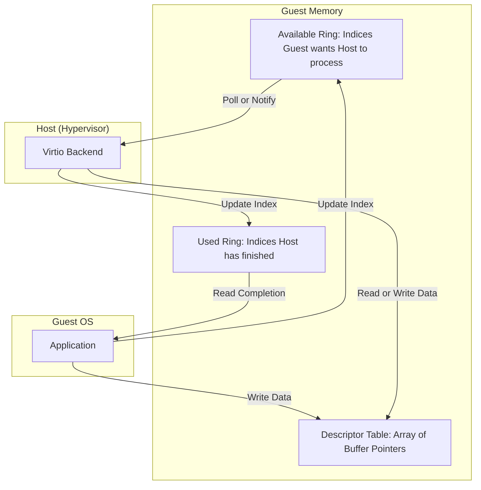

Virtualization is often viewed as a slow layer of abstraction where every instruction has to be trapped and emulated. If you look at early virtualization, that was largely true. We moved past that bottleneck with paravirtualization, and the heart of that transition is Virtio. This is the standardized interface that allows a guest operating system to talk to a hypervisor with minimal overhead. It avoids the heavy tax of emulating real hardware like an IDE controller or a specific Realtek NIC. It instead uses a shared memory transport called a Virtqueue.

A Virtqueue is a queueing mechanism implemented using a data structure called a Vring. These rings live in the guest's memory. The guest and the host both have access to this memory, which is where the data exchange happens. You do not want to be copying data back and forth between the guest and host context. You want to pass a pointer and say, here is the data, deal with it. This zero-copy approach is what allows virtualized I/O to approach native performance.

The structure of a Vring is broken into three distinct parts. First is the Descriptor Table. This is an array of entries that point to the actual buffers containing the data. Each descriptor tells the host where the buffer is and how long it is. It also contains flags, such as whether this buffer is read-only or write-only, and whether there are more descriptors linked to this one. Linking is important because it allows you to scatter-gather data across multiple memory locations while treating them as a single request. This is particularly useful for network packets where the header and the payload might be in different memory pages.

Next comes the Available Ring. This is a ring of indices into the Descriptor Table. The guest is the one that writes to this ring. When the guest has a new request, it fills out some descriptors and then adds the index of the first descriptor to the Available Ring. It then updates a producer index to tell the host that there is work to be done. It is a simple ring buffer that avoids expensive locking by using atomic operations on the head and tail indices.

Finally, we have the Used Ring. This is where the host writes back once it has finished processing a request. It puts the index of the descriptor it just handled into this ring so the guest knows it can reuse that memory. The host also reports how many bytes were written, which is vital for read operations. It is a classic producer-consumer model, but it is built to be extremely fast and lock-free where possible.

The communication flow isn't just about memory. We need a way to tell the other side that the state has changed. This is where notifications come in. When the guest updates the Available Ring, it performs a kick. In the world of KVM or Firecracker, this usually involves a write to a specific I/O port or a memory-mapped register. This write causes a VM exit, which hands control back to the host. The host then looks at the Vring and starts processing. This transition is expensive, so you want to do as little of it as possible.

On the flip side, when the host is done, it needs to tell the guest. It does this by injecting a virtual interrupt into the guest. Interrupts are expensive because they force the guest to stop what it is doing and jump to an interrupt service routine. To mitigate this, Virtio uses a feature called event suppression. The guest can tell the host not to send interrupts if it is already polling the Used Ring. Similarly, the host can tell the guest not to send kicks if it is already busy processing the Available Ring. This batching is why Virtio can reach millions of IOPS for networking and disk access.

Modern implementations like vhost-user take this even further. Instead of the host kernel handling the Virtio backend, a userspace process handles it. This allows for even faster processing because you avoid the context switch between the guest and the host kernel. You can have a DPDK-based application in userspace directly reading the Vring from the guest memory. This bypasses the host's networking stack entirely. 

Understanding Virtio is crucial if you want to understand how modern cloud infrastructure functions. Every time you send a packet from an EC2 instance or write to a cloud-native block volume, you are likely interacting with a Virtio interface. It is the invisible glue that makes the cloud feel like real hardware while running on a shared slice of a massive server. It is a masterclass in how to build a high-performance interface between two isolated systems using nothing but shared memory and clever ring buffer management.
