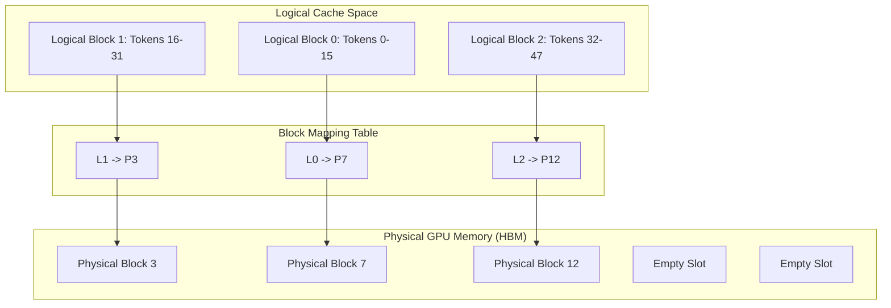
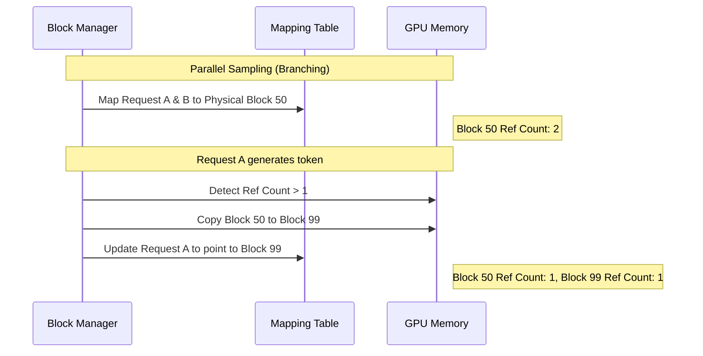

Large Language Model inference isn't a compute problem. It is a memory management crisis. When you are serving a model like Llama 3 or GPT 4, the primary bottleneck isn't the FLOPS of your H100. It is the KV cache. This cache stores the Key and Value vectors for every token in a sequence to avoid recomputing them during the autoregressive generation loop. Because these sequences vary in length and requests come in at random times, managing this memory feels like trying to pack a suitcase while the clothes are still growing. Traditional systems allocated contiguous memory chunks for these caches, leading to catastrophic internal and external fragmentation. If you allocate space for a 2048 token context but the user only generates 50 tokens, you've wasted 97 percent of that reserved block. If you don't reserve enough, the request fails. vLLM solved this by looking backward at how operating systems handled the exact same problem with physical RAM in the 1960s. They implemented Paging.

The core of the PagedAttention engine is the realization that KV cache tensors don't need to be contiguous in physical GPU memory. In a standard transformer implementation, the cache for a single request is a giant, pre-allocated tensor. In vLLM, the cache is broken into fixed size blocks. Each block contains the KV vectors for a small number of tokens, typically 16. These blocks are mapped through a table, just like virtual memory addresses are mapped to physical page frames by an OS kernel. This allows the system to store a single sequence's memory across non-adjacent slots in the GPU's High Bandwidth Memory.

By decoupling the logical sequence from physical storage, vLLM eliminates external fragmentation entirely. You only allocate a new block when the current one is full. The only waste is the unused space in the very last block of a sequence. This internal fragmentation is capped at the size of one block, which is negligible when you're dealing with thousands of tokens. This architectural shift allows vLLM to reach near-zero memory waste, which translates directly into higher batch sizes. When you aren't wasting 60 percent of your HBM on empty reserved buffers, you can fit three times as many concurrent requests on the same hardware.

The complexity moves into the Block Manager. This component tracks which physical blocks are free and which are mapped to active requests. When a request generates a new token, the engine checks if the current physical block has room. If it is full, the Block Manager pulls a fresh index from the free list and updates the mapping table. This looks exactly like a page fault handler in a Linux kernel. The engine doesn't just stop at simple allocation though. It uses these mapping tables to handle complex decoding patterns like parallel sampling or beam search through a mechanism called Copy-on-Write.

In parallel sampling, one prompt generates multiple different outputs. Usually, you would have to duplicate the KV cache for the prompt for every single output branch. That is a massive waste of memory because the prompt tokens are identical across all branches. vLLM handles this by having multiple logical blocks point to the same physical block. The system increments a reference count for that physical block. As long as the branches are reading from the shared prompt, no memory is duplicated. The moment a branch needs to write its own unique token, the Block Manager sees the reference count is greater than one, clones the block into a new physical slot, and updates only that branch's mapping. It is the same trick the fork syscall uses to manage process memory.

The attention kernel itself had to be rewritten to support this fragmented memory layout. Standard kernels expect a single contiguous pointer. PagedAttention kernels take the mapping table as an input. During the query phase, the kernel fetches the mapping for each logical block and performs the dot product against the physical memory at those disparate locations. This adds a level of indirection, but the overhead is dwarfed by the gains in throughput. You are trading a tiny bit of compute latency for a massive increase in the number of sequences you can process at once.

Eviction and swapping are the final pieces of the puzzle. When the GPU runs out of physical blocks, the Block Manager doesn't just crash. It can preempt requests by evicting their blocks to CPU RAM. It chooses which blocks to evict using a Least Recently Used policy. When the GPU has space again, the blocks are swapped back in. Because the mapping table abstracts the location, the model doesn't even know its history was temporarily sitting in system memory. This tiered memory approach ensures the system stays robust under heavy load without dropping requests. The marriage of classic OS theory and modern deep learning systems is why vLLM currently dominates the inference landscape. It turns out that the hardest part of AI isn't the neural network itself, but the plumbing that keeps the data flowing through the GPU's memory controllers.
