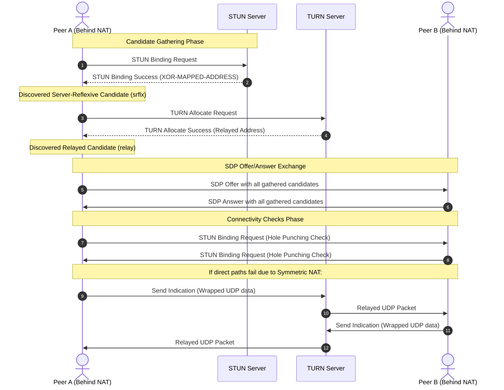

Peer-to-peer communication over the open internet is a deceptively difficult networking problem. While IP was originally designed for end-to-end connectivity, the exhaustion of IPv4 addresses and the security postures of modern network administrators forced the widespread adoption of Network Address Translation, or NAT, and stateful firewalls. When two web browsers attempt to establish a direct, low-latency media stream using WebRTC, they almost never have public IP addresses that can directly accept inbound UDP packets. 

To bypass this barrier, WebRTC utilizes the Interactive Connectivity Establishment framework, known as ICE. ICE is not a single protocol but an orchestrator that coordinates Session Traversal Utilities for NAT (STUN) and Traversal Using Relays around NAT (TURN). Understanding how these components cooperate at the packet and state machine level reveals how browsers negotiate paths through nested, hostile network configurations without exposing insecure open ports.

### The NAT Typology and Firewalls

To understand why ICE has to do so much work, we have to look at how NAT devices behave at the network boundary. A typical NAT device sits between a private local area network and the public internet, mapping private IP addresses and ports to a single or small pool of public IP addresses. When an internal host sends a UDP packet to an external server, the NAT rewrites the source IP and source port in the IP and UDP headers, records this mapping in an internal translation table, and forwards the packet.

Firewalls and NATs handle inbound traffic based on different filtering rules. With Endpoint-Independent Mapping, the NAT assigns a single public mapping for all outbound packets sent from a specific internal port, regardless of the destination. Any external host can send packets back to this public mapping, and they will be routed to the internal host. This is the easiest scenario for peer-to-peer connectivity.

With Address-Dependent or Address-and-Port-Dependent Mapping, the NAT behaves much more conservatively. A port-restricted cone NAT will only pass inbound packets from an external host if the internal host has previously sent a packet to that exact external IP and port. Symmetric NAT goes even further by assigning a completely unique public mapping for every single unique destination IP and port. If Peer A sends a packet to Peer B, the NAT assigns mapping X. If Peer A then sends a packet to Peer C, the NAT assigns mapping Y. This endpoint-dependent mapping completely breaks simple UDP hole punching, because Peer B cannot guess the mapped port assigned for Peer C.

Stateful firewalls also monitor the flow of TCP and UDP traffic. For UDP, which is connectionless, the firewall creates a temporary session entry when it observes an outbound packet. This entry typically expires after thirty seconds of inactivity. If an inbound packet arrives from an unexpected IP address or after the session has timed out, the firewall drops it immediately. ICE must therefore keep the path active using periodic keepalive packets.

### The Lifecycle of ICE Candidate Gathering

Before any media can flow, the ICE agent inside the WebRTC runtime must discover how it can be reached. These potential reachability endpoints are called ICE candidates. The agent runs a gathering process to collect candidates from different network interfaces and servers.



The gathering process yields three distinct candidate types. Host candidates represent the physical or virtual network interfaces of the local machine, such as a local Wi-Fi or Ethernet IP address. Server-reflexive candidates, or srflx, represent the public IP and port mapped by the NAT sitting directly in front of the client. The agent discovers these by querying a STUN server. Relayed candidates, or relay, represent a public address allocated on a TURN server. This is the fallback candidate of last resort if direct communication is completely blocked by symmetric NATs or restrictive firewalls. Peer-reflexive candidates, or prflx, are discovered dynamically during the connectivity check phase when a peer receives a STUN packet from an IP and port that was not previously communicated in the signaling phase.

Every gathered candidate is assigned a priority value computed by a specific formula defined in RFC 5245. The priority is calculated based on type preference, local preference, and a component ID. The type preference allocates the highest score to host candidates, followed by peer-reflexive, server-reflexive, and finally relayed candidates. This ensures that the ICE agent will always prioritize local network paths or direct peer connections over relayed paths, reducing latency and saving relay bandwidth.

Once gathered, these candidates are encoded into the Session Description Protocol (SDP) payload and exchanged out-of-band via a signaling server. This signaling mechanism is completely decoupled from WebRTC, allowing applications to use WebSockets, HTTP POST, or any other messaging protocol to exchange the candidate lists.

### STUN Packet Mechanics and Demultiplexing

STUN is a simple binary protocol designed to discover NAT mappings. A STUN header is exactly twenty bytes long, starting with a two-bit prefix that must always be zero, ensuring it can be easily distinguished from other protocols sharing the same port. 

Following the two-bit prefix, the next fourteen bits define the STUN message type, such as a Binding Request, Binding Success Response, or Binding Error Response. The next two bytes specify the message length, excluding the twenty-byte header. Then comes a four-byte magic cookie, which always contains the fixed value 0x2112A442. This magic cookie allows the receiving application to instantly differentiate STUN packets from DTLS or SRTP packets when multiplexing all these protocols over a single UDP socket. The final twelve bytes of the header hold a transaction ID used to associate requests with responses.

When a client sends a STUN Binding Request to a public STUN server, the server inspects the source IP and source port of the incoming UDP packet. It then constructs a STUN Binding Success Response. Inside this response, the server includes a payload attribute called XOR-MAPPED-ADDRESS.

Legacy STUN used the MAPPED-ADDRESS attribute, which simply contained the raw public IP and port. However, this caused issues with application layer gateways (ALGs) on home routers. Many consumer routers try to be helpful by parsing packets and rewriting internal IP addresses to match NAT changes. When they found a raw IP address in the STUN payload, they would rewrite it, breaking the STUN protocol logic. The XOR-MAPPED-ADDRESS attribute solves this by performing a bitwise XOR operation on the public IP and port with the fixed magic cookie and transaction ID. This obfuscates the address, hiding it from naive ALG parsers while allowing the WebRTC client to easily reconstruct its public IP and port by running the same XOR operation in reverse.

### TURN Relaying and Allocation State Machines

When both peers are behind symmetric NATs, direct packet flow is impossible because neither side can open a port that the other can predict. In this case, media must flow through a TURN server. The client establishes a virtual session on the TURN server, known as an allocation. 

To create an allocation, the client sends a TURN Allocate Request to the server. The TURN server verifies the client's credentials using a long-term credential mechanism based on HMAC-SHA1. If authenticated, the server opens a new UDP port on its public interface and assigns this address to the client as its relayed candidate. The server sends back an Allocate Success Response containing the relay address and an allocation lifetime, which defaults to twenty minutes.

Because TURN is a relay protocol, sending standard IP traffic through it would require the server to parse raw packet headers, which is slow and insecure. Instead, TURN uses two forwarding mechanisms: Send and Data Indications, and Channel Bindings.

The Send Indication is an asymmetrical wrapper. When Peer A wants to send media to Peer B via the TURN server, it wraps the raw payload inside a TURN Send Indication packet. This packet contains a destination attribute specifying Peer B's public IP and port. The TURN server extracts the raw payload, strips the TURN header, and forwards the payload as a standard UDP packet to Peer B. When Peer B replies, the TURN server wraps Peer B's packet in a TURN Data Indication and forwards it back to Peer A.

To avoid the thirty-six byte overhead of Send and Data Indications on every single packet, the ICE agent switches to Channel Bindings for active media streams. The client sends a Channel Bind Request to the TURN server, pairing a temporary channel number (in the range 0x4000 to 0x7FFF) with Peer B's address. 

Once bound, the client can send packets prefixed with a tiny four-byte channel header instead of the full STUN header. The first two bytes indicate the channel number, and the next two bytes specify the length. This dramatically reduces processing overhead on the TURN server and conserves network bandwidth.

```
+---------------------------+---------------------------+
|  Channel Number (2 bytes) |      Length (2 bytes)     |
+---------------------------+---------------------------+
|                                                       |
|                Application Data (Media)               |
|                                                       |
+-------------------------------------------------------+
```

To prevent unauthorized hosts from using the TURN server as an open relay, the server maintains an active permission list. The client must explicitly request permissions for Peer B's IP address by sending a CreatePermission request. Permissions expire after five minutes and must be refreshed continually by the client.

### The ICE Connectivity Check State Machine

Once both peers have gathered and exchanged their candidates, the ICE agent pairs them up. If Peer A has three candidates and Peer B has three candidates, the agent forms nine unique candidate pairs. Each pair contains a local candidate and a remote candidate.

These pairs are sorted by priority and placed into a Check List. The ICE agent then moves each pair through a strict connectivity check state machine. Initially, all pairs start in the Frozen state. The agent unfreezes the highest-priority pair, transitioning it to the Waiting state. The agent then schedules a STUN Binding Request to be sent from the local candidate to the remote candidate, moving the pair into the In-Progress state.

When Peer B receives this binding request, it responds with a STUN Binding Response. If Peer A receives this response successfully, the candidate pair transitions to the Succeeded state. If the request times out or receives an unrecoverable error, the pair transitions to the Failed state.

During this check phase, a crucial mechanism called peer-reflexive candidate discovery occurs. If Peer B receives a STUN Binding Request from an IP and port that does not match any candidate Peer A originally sent in its SDP, Peer B immediately recognizes this as a peer-reflexive candidate. This typically happens when an symmetric NAT allocates a new port for this specific peer-to-peer binding. Peer B adds this candidate to its list and initiates a check back toward this discovered address.

To select the final pair for media transmission, the ICE agent uses one of two nomination modes. Under regular nomination, the agent runs connectivity checks across all pairs. It can observe multiple succeeded pairs, but it will only choose the best one after the checks complete, initiating a final handshake. 

Under aggressive nomination, which is common in older implementations, the agent includes a USE-CANDIDATE attribute in its very first successful STUN check request. The first pair to succeed with this attribute flag is immediately chosen for media flow, bypassing further checks to speed up call setup times. Modern browsers default to regular nomination to ensure the absolute best path is selected rather than the fastest path to reply.

### Keeping the Firewalls Awake

Once the active candidate pair is nominated, WebRTC transitions to sending encrypted DTLS and SRTP traffic. However, the ICE agent cannot stop sending STUN packets. Because UDP is stateless, any intermediate NAT or firewall will tear down its translation table entry if traffic stops for even a short period.

To keep these bindings alive, the ICE agent performs consent freshness checks as defined in RFC 7675. Every few seconds, the agent must send an explicit STUN Binding Request over the active path. The peer must reply within a strict window. If the agent does not receive a response within several seconds, it considers consent expired and immediately tears down the media stream. This prevents a hijacked session from continuing to receive data after a user has closed their browser or disconnected from the call. 

This continuous loop of candidate prioritization, fast packet demultiplexing, and stateful tracking is what allows WebRTC to bypass decades of rigid network architecture, establishing secure, real-time channels across the globe.
